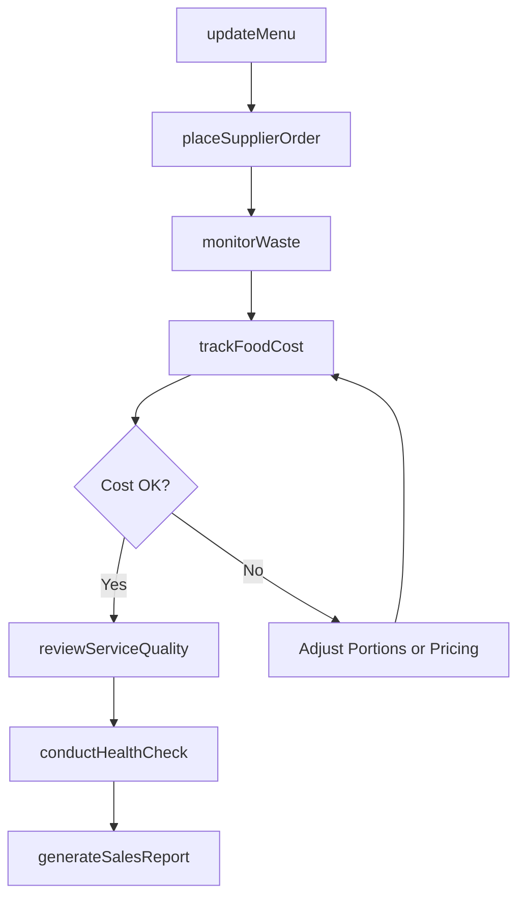
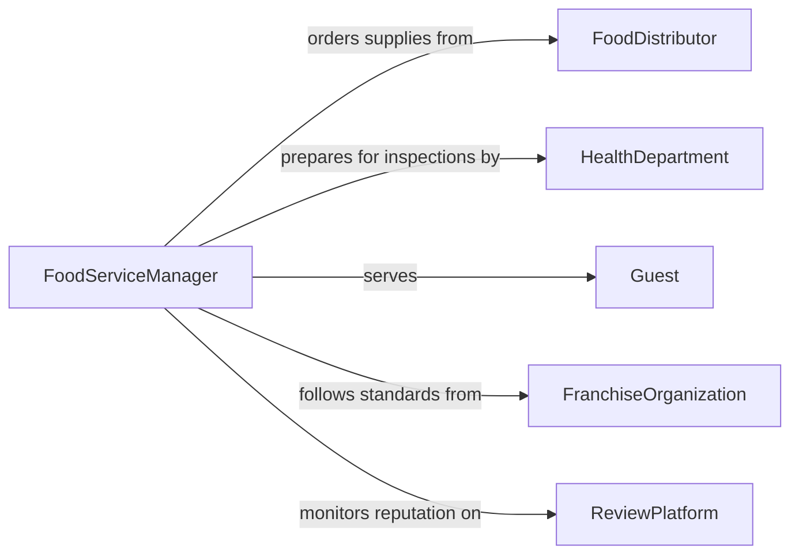

# Manage Food Service Operations or Parts of Operations

> Business-as-Code definition for managing food service operations. Models the oversight of restaurant, cafeteria, and catering operations from menu planning through service delivery and cost control.

## Overview

Managing food service operations involves overseeing the daily functions of restaurants, cafeterias, catering services, and other food establishments. This definition provides actions for menu management, cost control, supplier coordination, health compliance, and service quality monitoring. It enables automation of food cost tracking, inventory reordering, and health inspection preparation workflows.

## Actors

| Actor | Description |
|-------|-------------|
| FoodDistributor | Delivers ingredients and food products on schedule |
| HealthDepartment | Conducts food safety inspections and issues permits |
| Guest | Patron ordering and consuming food service offerings |
| FranchiseOrganization | Sets standards and menus for franchise-operated locations |
| ReviewPlatform | Hosts public customer ratings and reviews |

## Roles

| Role | Description |
|------|-------------|
| FoodServiceManager | Oversees daily food service operations and staff |
| ExecutiveChef | Designs menus and sets culinary standards |
| CostController | Monitors food costs, waste, and profitability |
| QualityAssuranceLead | Ensures food safety and service quality compliance |

## Entities

| Entity | Description |
|--------|-------------|
| Menu | Current offering of food and beverage items with pricing |
| FoodCostReport | Analysis of ingredient costs relative to revenue |
| SupplierOrder | Purchase order for food supplies and ingredients |
| HealthInspection | Record of food safety and sanitation inspection results |
| WasteLog | Tracked food waste by category and cause |
| ServiceStandard | Defined quality benchmarks for food and service delivery |
| DailySalesReport | Summary of revenue, covers, and average check by period |
| RecipeCard | Standardized preparation instructions with portioning details |

## Actions

| Action | Description |
|--------|-------------|
| updateMenu | Modify menu items, pricing, or seasonal offerings |
| trackFoodCost | Calculate ingredient cost percentages against revenue |
| placeSupplierOrder | Submit purchase orders to food distributors |
| conductHealthCheck | Perform internal food safety compliance assessment |
| monitorWaste | Track and categorize food waste volumes |
| reviewServiceQuality | Evaluate food preparation and service delivery standards |
| generateSalesReport | Produce daily or weekly revenue and covers summary |

## Events

| Event | Description |
|-------|-------------|
| menuUpdated | Menu items or pricing have been modified |
| foodCostTracked | Ingredient cost analysis has been completed |
| supplierOrderPlaced | A food supply purchase order has been submitted |
| healthCheckCompleted | An internal food safety assessment has been performed |
| wasteThresholdExceeded | Food waste has surpassed acceptable levels |
| serviceQualityReviewed | Food and service quality evaluation is complete |
| salesReportGenerated | Revenue and covers summary has been produced |

## Searches

| Search | Description |
|--------|-------------|
| getMenuItems | Retrieve current menu offerings by category or season |
| getFoodCostData | Check ingredient cost percentages by item or period |
| getWasteReport | Retrieve food waste data by category or cause |
| getHealthInspections | List inspection results by date or status |
| getSalesData | Retrieve revenue and covers by period or location |

## Workflow



## Actor Relationships



## Usage

### Calling Actions

```typescript
import { manageFoodServiceOperationsParts } from '@headlessly/manage-food-service-operations-parts'

const foodService = manageFoodServiceOperationsParts()

// Update seasonal menu
await foodService.updateMenu({
  season: 'summer-2026',
  additions: [
    { name: 'Grilled Peach Salad', price: 14.50, category: 'appetizers' },
    { name: 'Watermelon Gazpacho', price: 12.00, category: 'soups' }
  ],
  removals: ['winter-squash-soup']
})

// Track food costs
const costs = await foodService.trackFoodCost({
  period: '2026-03',
  targetPercentage: 30
})

// Generate daily sales report
const report = await foodService.generateSalesReport({
  date: '2026-03-20',
  location: 'main-dining'
})
```

### Event-Driven Automation

```typescript
// Alert on food waste threshold
foodService.wasteThresholdExceeded(async ({ category, amount, threshold }) => {
  await notify({
    to: 'executive-chef',
    message: `${category} waste at ${amount}lb, exceeds ${threshold}lb threshold`
  })
})

// Auto-reorder when supplier order is depleted
foodService.supplierOrderPlaced(async ({ items }) => {
  for (const item of items) {
    if (item.currentStock < item.parLevel) {
      await foodService.placeSupplierOrder({ items: [{ id: item.id, quantity: item.parLevel * 2 }] })
    }
  }
})
```
