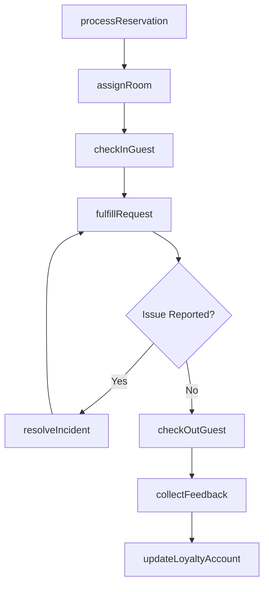
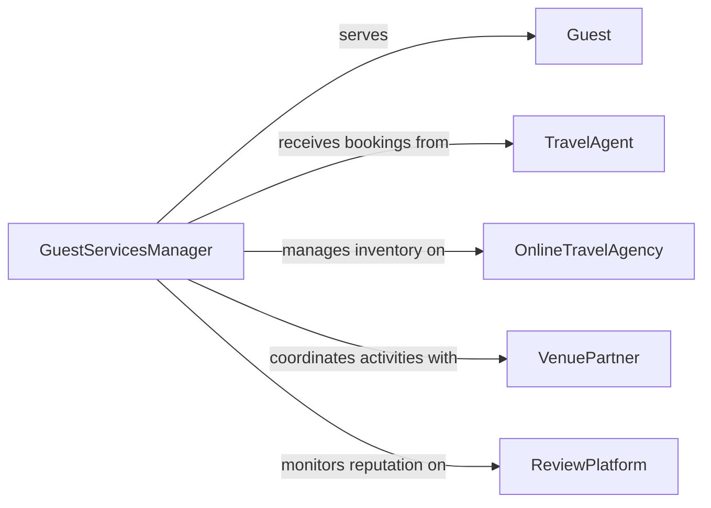

# Manage Guest Services

> Business-as-Code definition for managing guest services. Models the coordination of hospitality operations from reservation and check-in through guest satisfaction and loyalty management.

## Overview

Managing guest services involves overseeing the complete hospitality experience for visitors, patrons, and guests at hotels, resorts, event venues, and similar establishments. This definition provides actions for managing reservations, coordinating front desk operations, handling guest requests, and tracking satisfaction metrics. It enables automation of booking confirmations, room assignments, service dispatch, and loyalty program workflows.

## Actors

| Actor | Description |
|-------|-------------|
| Guest | Individual receiving hospitality services |
| TravelAgent | Books reservations on behalf of travelers |
| OnlineTravelAgency | Digital platform distributing room inventory |
| VenuePartner | External facility providing event or activity services |
| ReviewPlatform | Online service where guests publish experience ratings |

## Roles

| Role | Description |
|------|-------------|
| GuestServicesManager | Oversees all guest-facing operations and service quality |
| FrontDeskAgent | Handles check-in, check-out, and guest inquiries |
| Concierge | Arranges special requests, activities, and local services |
| HousekeepingSupervisor | Coordinates room cleaning and preparation schedules |

## Entities

| Entity | Description |
|--------|-------------|
| Reservation | A confirmed booking for accommodation or services |
| GuestProfile | Record of guest preferences, history, and loyalty status |
| RoomAssignment | Allocation of a specific room to a reservation |
| ServiceRequest | A guest-initiated request for amenities or assistance |
| SatisfactionScore | Measured guest experience rating |
| LoyaltyAccount | Guest membership in the property loyalty program |
| Incident | A logged guest complaint or service failure |
| HousekeepingTask | Scheduled room cleaning or turnover assignment |

## Actions

| Action | Description |
|--------|-------------|
| processReservation | Confirm and record a new guest booking |
| assignRoom | Allocate a room based on guest preferences and availability |
| checkInGuest | Complete the arrival registration process |
| fulfillRequest | Process and deliver a guest service request |
| resolveIncident | Address and close a guest complaint or issue |
| checkOutGuest | Complete the departure and billing process |
| collectFeedback | Gather guest satisfaction ratings and comments |
| updateLoyaltyAccount | Award points or tier status to a guest loyalty account |

## Events

| Event | Description |
|-------|-------------|
| reservationConfirmed | A guest booking has been confirmed |
| roomAssigned | A room has been allocated to a reservation |
| guestCheckedIn | A guest has completed the arrival process |
| requestFulfilled | A guest service request has been delivered |
| incidentResolved | A guest complaint has been addressed |
| guestCheckedOut | A guest has completed departure |
| feedbackCollected | Guest satisfaction data has been received |
| loyaltyUpdated | A guest loyalty account has been modified |

## Searches

| Search | Description |
|--------|-------------|
| findReservations | List reservations by date, guest, or status |
| getGuestProfile | Retrieve guest preferences and stay history |
| getOpenRequests | Find pending guest service requests by priority |
| getOccupancy | Check current and projected room occupancy rates |
| getSatisfactionTrends | Retrieve guest satisfaction scores over time |

## Workflow



## Actor Relationships



## Usage

### Calling Actions

```typescript
import { manageGuestServices } from '@headlessly/manage-guest-services'

const guestServices = manageGuestServices()

// Process a new reservation
const reservation = await guestServices.processReservation({
  guestName: 'Sarah Johnson',
  checkIn: '2026-06-15',
  checkOut: '2026-06-18',
  roomType: 'deluxe-king',
  specialRequests: ['late-checkout', 'high-floor']
})

// Check in the guest
await guestServices.checkInGuest({
  reservationId: reservation.id,
  idVerified: true
})

// Fulfill a service request
await guestServices.fulfillRequest({
  reservationId: reservation.id,
  type: 'extra-pillows',
  priority: 'standard'
})
```

### Event-Driven Automation

```typescript
// Auto-assign rooms on reservation confirmation
guestServices.reservationConfirmed(async ({ reservationId, preferences }) => {
  await guestServices.assignRoom({ reservationId, preferences })
})

// Update loyalty on checkout
guestServices.guestCheckedOut(async ({ guestId, stayValue }) => {
  await guestServices.updateLoyaltyAccount({
    guestId,
    pointsEarned: Math.floor(stayValue * 10)
  })
})
```
