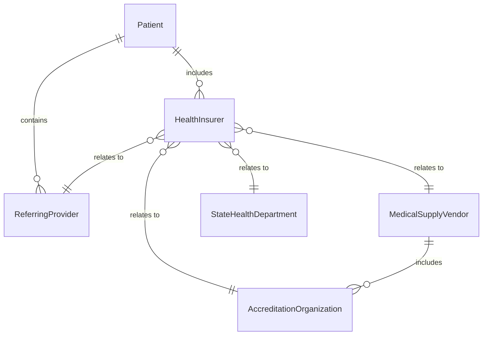
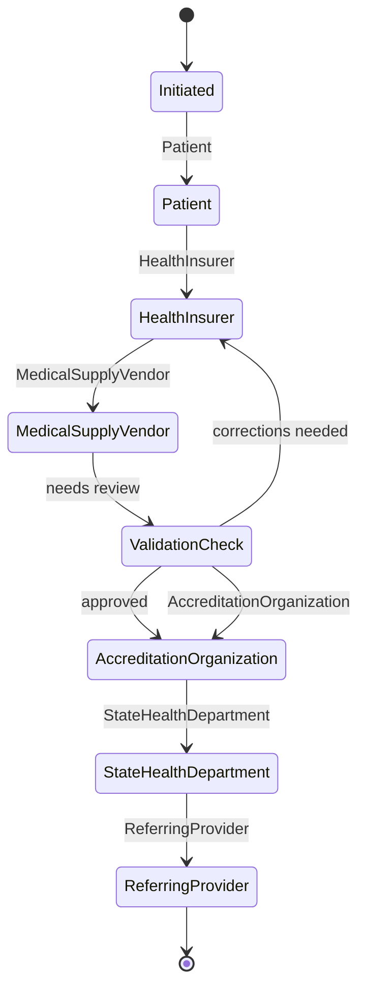
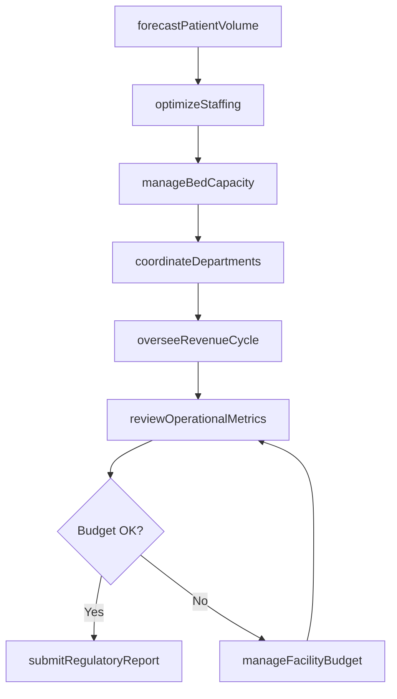
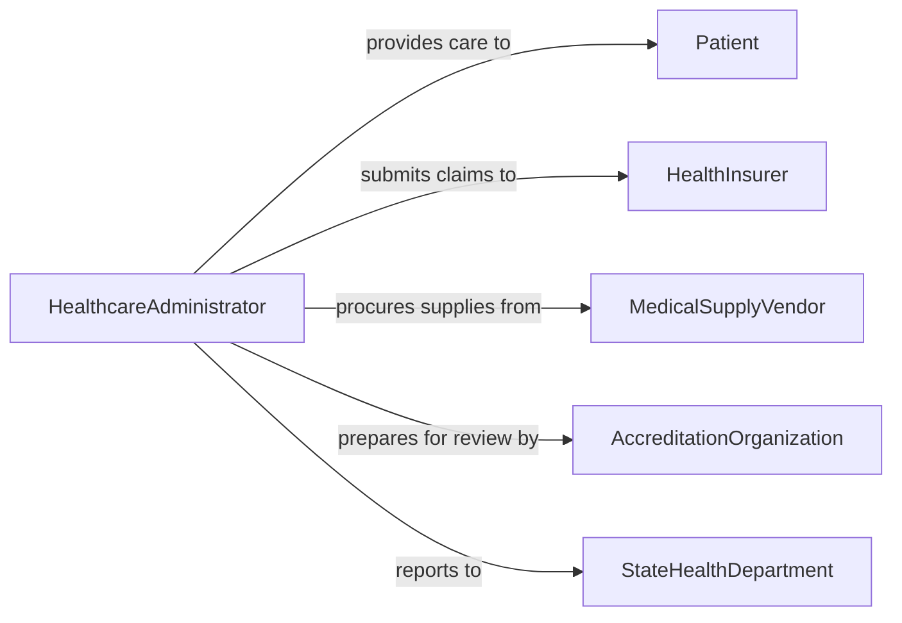

# Manage Healthcare Operations

> Business-as-Code definition for managing healthcare operations. Models the administration of clinical and non-clinical functions within healthcare facilities from staffing through revenue cycle management.

## Overview

Managing healthcare operations involves overseeing the administrative, clinical, and financial functions of hospitals, clinics, and healthcare systems. This definition provides actions for managing patient flow, coordinating clinical departments, controlling operational budgets, and ensuring regulatory compliance. It enables automation of capacity planning, staffing optimization, and revenue cycle workflows.

## Actors

| Actor | Description |
|-------|-------------|
| Patient | Individual receiving healthcare services at the facility |
| HealthInsurer | Provides reimbursement for clinical services rendered |
| MedicalSupplyVendor | Supplies equipment, devices, and consumables |
| AccreditationOrganization | Evaluates facility quality and awards accreditation |
| StateHealthDepartment | Licenses and regulates healthcare facility operations |
| ReferringProvider | External physician or facility sending patients for care |

## Roles

| Role | Description |
|------|-------------|
| HealthcareAdministrator | Oversees all operational aspects of the healthcare facility |
| DepartmentChief | Manages clinical or administrative department operations |
| RevenueCycleManager | Oversees billing, coding, and reimbursement processes |
| PatientAccessDirector | Manages patient registration, scheduling, and access |
| ComplianceOfficer | Ensures regulatory and accreditation standard adherence |

## Entities

| Entity | Description |
|--------|-------------|
| FacilityBudget | Financial plan for healthcare facility operations |
| BedCapacity | Available inpatient beds and current occupancy levels |
| DepartmentSchedule | Clinical and support department operating hours and staffing |
| RevenueCycleRecord | Tracked financial lifecycle from service to payment |
| PatientVolume | Measured patient encounters by type, department, or period |
| RegulatoryReport | Required filing to state or federal health authorities |
| OperationalDashboard | Real-time display of key operational metrics |
| StaffingModel | Framework for determining personnel requirements |

## Actions

| Action | Description |
|--------|-------------|
| manageBedCapacity | Monitor and optimize inpatient bed utilization |
| coordinateDepartments | Align clinical and support department operations |
| overseeRevenueCycle | Monitor billing, coding, and collection processes |
| forecastPatientVolume | Predict upcoming patient encounter volumes |
| optimizeStaffing | Align workforce levels with operational demand |
| submitRegulatoryReport | File required reports with health authorities |
| reviewOperationalMetrics | Analyze facility performance against benchmarks |
| manageFacilityBudget | Track spending and revenue against financial plans |

## Events

| Event | Description |
|-------|-------------|
| bedCapacityUpdated | Inpatient bed utilization data has been refreshed |
| departmentsCoordinated | Clinical department operations have been aligned |
| revenueCycleReviewed | Billing and collection performance has been assessed |
| patientVolumeForecasted | Future encounter predictions have been generated |
| staffingOptimized | Workforce levels have been adjusted to demand |
| regulatoryReportSubmitted | Required filing has been sent to authorities |
| operationalMetricsReviewed | Facility performance analysis is complete |
| budgetVarianceDetected | Spending has deviated from the financial plan |

## Searches

| Search | Description |
|--------|-------------|
| getBedUtilization | Check current and projected bed occupancy rates |
| getRevenueCycleMetrics | Retrieve billing and collection performance data |
| getPatientVolume | Check encounter volumes by department or period |
| getStaffingLevels | Retrieve current staffing relative to requirements |
| getBudgetStatus | Check financial performance against budget plan |


## Entity Relationships



## State Diagram



## Workflow



## Actor Relationships



## Usage

### Calling Actions

```typescript
import { manageHealthcareOperations } from '@headlessly/manage-healthcare-operations'

const ops = manageHealthcareOperations()

// Forecast patient volume for next month
const forecast = await ops.forecastPatientVolume({
  facility: 'Memorial Hospital',
  period: '2026-04',
  departments: ['emergency', 'surgical', 'medical']
})

// Optimize staffing based on forecast
await ops.optimizeStaffing({
  facility: 'Memorial Hospital',
  period: '2026-04',
  forecast: forecast.id,
  constraints: ['union-rules', 'licensure-requirements']
})

// Review operational metrics
const metrics = await ops.reviewOperationalMetrics({
  facility: 'Memorial Hospital',
  period: '2026-Q1',
  benchmarks: ['cms-star-rating', 'internal-targets']
})
```

### Event-Driven Automation

```typescript
// Alert on bed capacity constraints
ops.bedCapacityUpdated(async ({ facility, occupancyRate }) => {
  if (occupancyRate > 0.9) {
    await notify({
      to: 'patient-access-director',
      message: `${facility} at ${Math.round(occupancyRate * 100)}% bed capacity`
    })
  }
})

// Auto-submit regulatory reports on schedule
ops.operationalMetricsReviewed(async ({ facility, period }) => {
  await ops.submitRegulatoryReport({ facility, period, type: 'quarterly-quality' })
})
```
