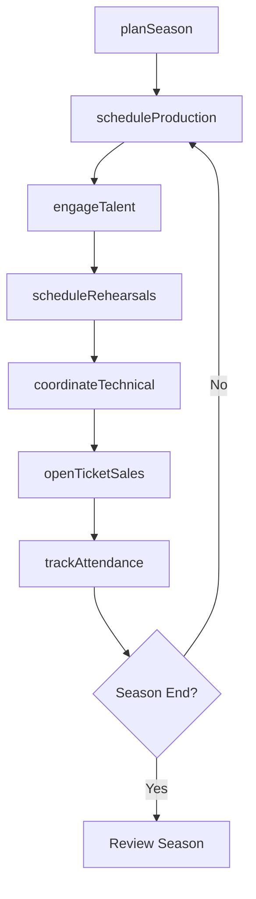
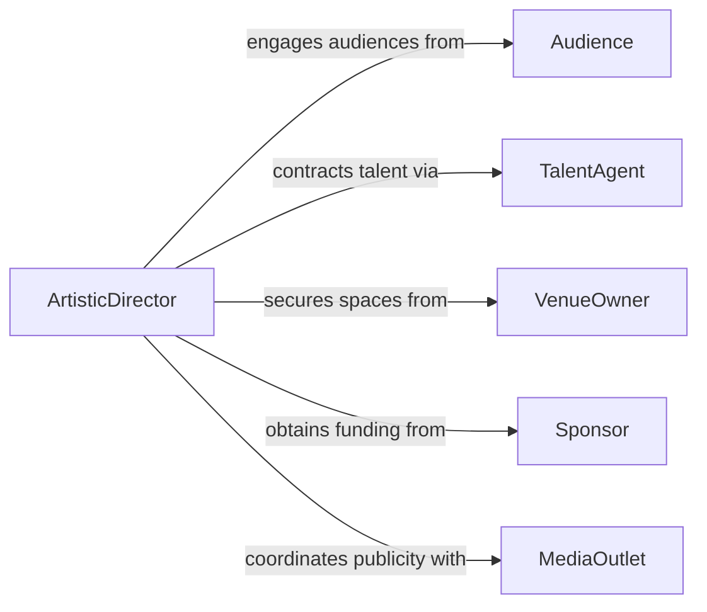

# Manage Operations of Artistic or Entertainment Departments

> Business-as-Code definition for managing artistic and entertainment department operations. Models the coordination of creative productions, talent scheduling, venue management, and audience engagement.

## Overview

Managing operations of artistic or entertainment departments involves overseeing the planning, production, and delivery of creative and performing arts programming. This definition provides actions for scheduling productions, managing talent rosters, coordinating technical requirements, and tracking audience engagement. It enables automation of season planning, rehearsal scheduling, and box office management workflows.

## Actors

| Actor | Description |
|-------|-------------|
| Audience | Patrons attending performances or viewing artistic works |
| TalentAgent | Represents performers and negotiates engagement terms |
| VenueOwner | Provides performance or exhibition spaces |
| Sponsor | Provides financial support for productions or exhibitions |
| MediaOutlet | Covers and publicizes artistic events and productions |
| LicensingAuthority | Grants rights for copyrighted material performance |

## Roles

| Role | Description |
|------|-------------|
| ArtisticDirector | Sets creative vision and oversees production programming |
| ProductionManager | Manages technical and logistical aspects of productions |
| TalentCoordinator | Schedules performers and manages engagement contracts |
| BoxOfficeManager | Oversees ticket sales and audience services |

## Entities

| Entity | Description |
|--------|-------------|
| Production | A scheduled artistic performance or exhibition |
| SeasonSchedule | Calendar of productions for a defined period |
| TalentContract | Agreement with a performer or creative professional |
| RehearsalSchedule | Timeline of practice sessions leading to production |
| TicketInventory | Available seating or admission capacity for a production |
| TechnicalRider | Equipment and staging requirements for a production |
| SponsorshipAgreement | Financial support arrangement for a production or season |

## Actions

| Action | Description |
|--------|-------------|
| planSeason | Design the programming calendar for an upcoming period |
| scheduleProduction | Set dates, venue, and resources for a specific production |
| engageTalent | Contract performers and creative professionals |
| scheduleRehearsals | Plan practice sessions leading to production dates |
| openTicketSales | Release ticket inventory for public purchase |
| coordinateTechnical | Arrange staging, lighting, sound, and equipment needs |
| trackAttendance | Monitor ticket sales and audience participation |

## Events

| Event | Description |
|-------|-------------|
| seasonPlanned | The production calendar has been established |
| productionScheduled | A specific production has been set for dates and venue |
| talentEngaged | A performer contract has been finalized |
| rehearsalsScheduled | Practice sessions have been planned |
| ticketSalesOpened | Tickets have been made available for purchase |
| technicalCoordinated | Staging and equipment requirements have been arranged |
| attendanceTracked | Audience participation data has been recorded |

## Searches

| Search | Description |
|--------|-------------|
| findProductions | List productions by date, genre, or status |
| getTalentRoster | Retrieve engaged performers for a production or season |
| getTicketSales | Check ticket sales and revenue by production |
| getRehearsalSchedule | Retrieve practice session timeline for a production |
| getSeasonPerformance | Review attendance and revenue across the season |

## Workflow



## Actor Relationships



## Usage

### Calling Actions

```typescript
import { manageOperationsArtisticEntertainmentDepartments } from '@headlessly/manage-operations-artistic-entertainment-departments'

const arts = manageOperationsArtisticEntertainmentDepartments()

// Plan the upcoming season
const season = await arts.planSeason({
  name: 'Fall 2026 Season',
  period: { start: '2026-09-01', end: '2026-12-15' },
  productionSlots: 6
})

// Schedule a specific production
const production = await arts.scheduleProduction({
  seasonId: season.id,
  title: 'A Midsummer Night\'s Dream',
  venue: 'Main Stage',
  dates: ['2026-10-10', '2026-10-11', '2026-10-12']
})

// Open ticket sales
await arts.openTicketSales({
  productionId: production.id,
  priceCategories: [
    { name: 'Orchestra', price: 75 },
    { name: 'Balcony', price: 45 }
  ]
})
```

### Event-Driven Automation

```typescript
// Auto-schedule rehearsals when talent is engaged
arts.talentEngaged(async ({ productionId, performerId }) => {
  await arts.scheduleRehearsals({
    productionId,
    startWeeksBefore: 4,
    sessionsPerWeek: 3
  })
})

// Notify on low ticket sales
arts.attendanceTracked(async ({ productionId, soldPercentage }) => {
  if (soldPercentage < 0.3) {
    await notify({
      to: 'marketing-team',
      message: `Production ${productionId} at ${Math.round(soldPercentage * 100)}% capacity`
    })
  }
})
```
