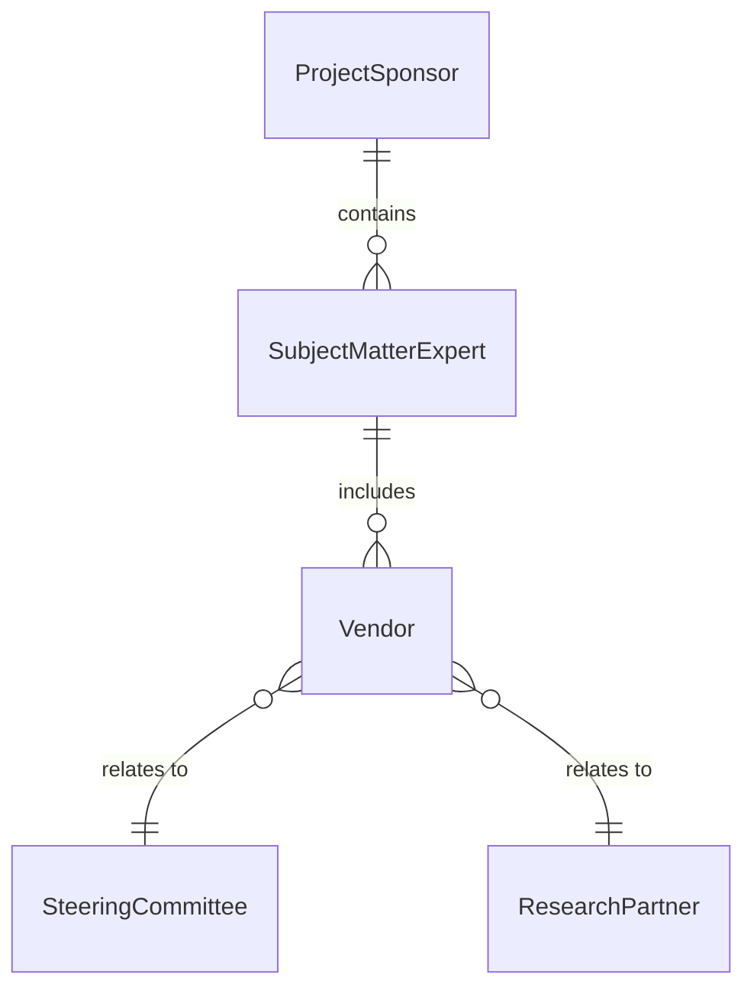
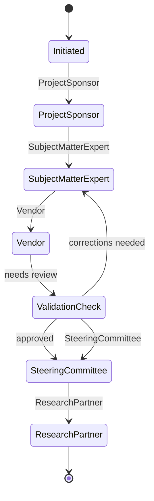
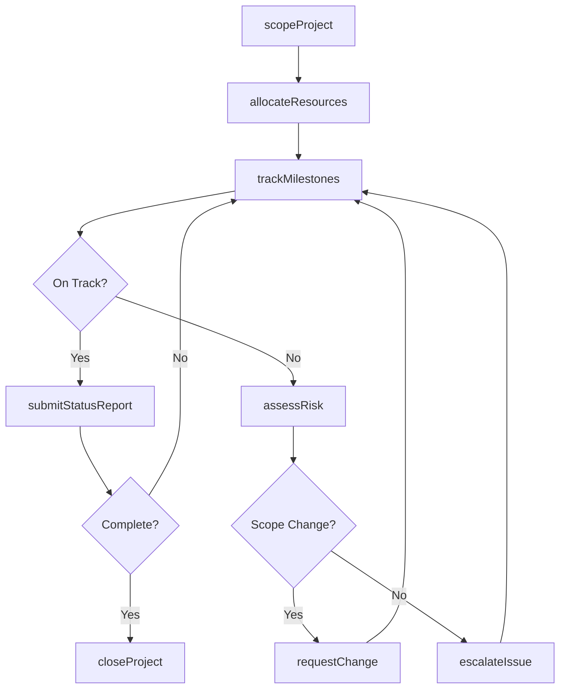
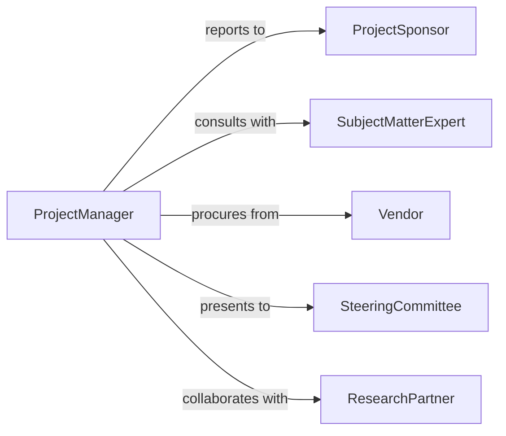

# Manage Operations, Research, or Logistics Projects

> Business-as-Code definition for managing operations, research, and logistics projects. Models the planning, execution, and delivery of cross-functional projects spanning operational improvement, research initiatives, and supply chain optimization.

## Overview

Managing operations, research, and logistics projects involves overseeing complex initiatives that span multiple functional areas including process improvement, applied research, and supply chain optimization. This definition provides actions for scoping projects, allocating resources, tracking milestones, and managing deliverables across teams. It enables automation of project status reporting, risk escalation, and resource rebalancing workflows.

## Actors

| Actor | Description |
|-------|-------------|
| ProjectSponsor | Executive funding and championing the project |
| SubjectMatterExpert | External specialist providing domain expertise |
| Vendor | Supplies tools, materials, or services for the project |
| SteeringCommittee | Cross-functional body governing project direction |
| ResearchPartner | Academic or institutional collaborator on research initiatives |

## Roles

| Role | Description |
|------|-------------|
| ProjectManager | Plans, executes, and delivers project outcomes on schedule |
| OperationsLead | Manages operational workstreams within the project |
| ResearchAnalyst | Conducts analysis and investigation for research components |
| LogisticsCoordinator | Oversees supply chain and distribution project elements |

## Entities

| Entity | Description |
|--------|-------------|
| Project | A defined initiative with scope, timeline, and deliverables |
| Milestone | A significant checkpoint in the project timeline |
| Deliverable | A tangible output produced by the project |
| ResourceAllocation | Assignment of personnel, budget, or equipment to tasks |
| RiskRegister | Documented project risks with mitigation strategies |
| StatusReport | Periodic update on project progress and health |
| ChangeRequest | Formal proposal to modify project scope or timeline |
| LessonsLearned | Documented insights from project execution |

## Actions

| Action | Description |
|--------|-------------|
| scopeProject | Define project objectives, boundaries, and success criteria |
| allocateResources | Assign personnel, budget, and equipment to project tasks |
| trackMilestones | Monitor progress against key project checkpoints |
| assessRisk | Evaluate and document potential project risks |
| submitStatusReport | Generate and distribute project progress updates |
| requestChange | Propose a modification to project scope or timeline |
| closeProject | Finalize deliverables and document lessons learned |
| escalateIssue | Raise a blocking issue to the steering committee |

## Events

| Event | Description |
|-------|-------------|
| projectScoped | Project objectives and boundaries have been defined |
| resourcesAllocated | Personnel and budget have been assigned |
| milestoneReached | A project checkpoint has been completed |
| riskIdentified | A new project risk has been documented |
| statusReportSubmitted | A project progress update has been distributed |
| changeRequested | A scope or timeline modification has been proposed |
| projectClosed | Project deliverables have been finalized |
| issueEscalated | A blocking issue has been raised to governance |

## Searches

| Search | Description |
|--------|-------------|
| findProjects | List projects by status, type, or sponsor |
| getMilestoneStatus | Check progress against project milestones |
| getResourceUtilization | Retrieve resource allocation across active projects |
| findRisks | List identified project risks by severity or status |
| getStatusReports | Retrieve project status updates by date or project |


## Entity Relationships



## State Diagram



## Workflow



## Actor Relationships



## Usage

### Calling Actions

```typescript
import { manageOperationsResearchLogisticsProjects } from '@headlessly/manage-operations-research-logistics-projects'

const projects = manageOperationsResearchLogisticsProjects()

// Scope a new logistics optimization project
const project = await projects.scopeProject({
  name: 'Last-Mile Delivery Optimization',
  type: 'logistics',
  objectives: ['reduce-delivery-time', 'lower-transport-costs'],
  budget: 500000,
  timeline: { start: '2026-04-01', end: '2026-09-30' }
})

// Allocate team resources
await projects.allocateResources({
  projectId: project.id,
  resources: [
    { role: 'logistics-analyst', allocation: 1.0 },
    { role: 'data-scientist', allocation: 0.5 },
    { role: 'operations-lead', allocation: 0.75 }
  ]
})

// Track milestones
const status = await projects.trackMilestones({ projectId: project.id })
```

### Event-Driven Automation

```typescript
// Auto-assess risk when milestone is delayed
projects.milestoneReached(async ({ projectId, milestoneId, daysLate }) => {
  if (daysLate > 5) {
    await projects.assessRisk({
      projectId,
      description: `Milestone ${milestoneId} delayed by ${daysLate} days`
    })
  }
})

// Auto-generate status report on milestone completion
projects.milestoneReached(async ({ projectId }) => {
  await projects.submitStatusReport({ projectId })
})
```
