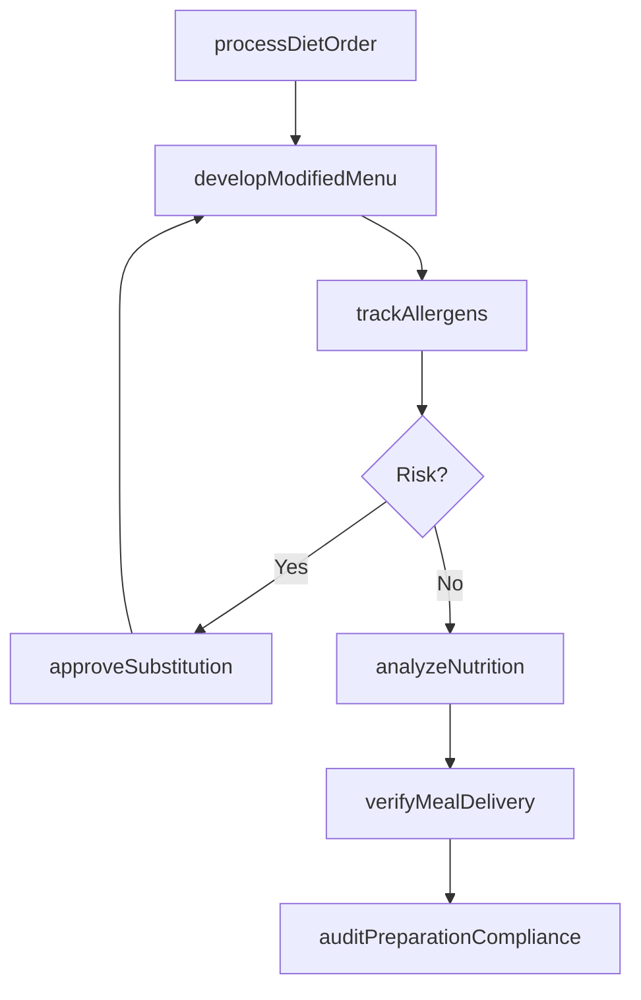
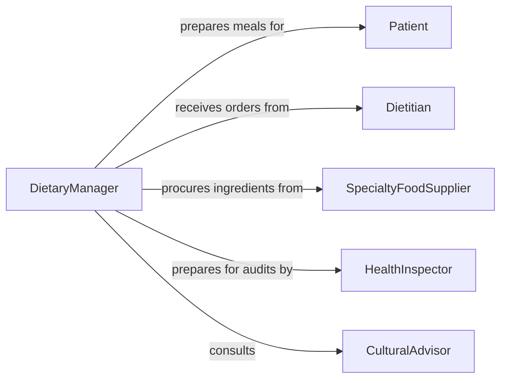

# Manage Preparation Special Meals Diets

> Business-as-Code definition for managing the preparation of special meals or diets. Models the oversight of dietary meal planning, allergen management, and specialized food preparation in healthcare, hospitality, and institutional food service settings.

## Overview

Managing the preparation of special meals or diets involves overseeing the planning, preparation, and delivery of food that meets specific dietary, medical, cultural, or religious requirements. This definition provides actions for developing modified menus, tracking allergen protocols, coordinating with dietitians, and ensuring compliance with nutritional standards. It enables automation of diet order processing, allergen alert routing, and nutritional analysis workflows.

## Actors

| Actor | Description |
|-------|-------------|
| Patient | Individual with medically prescribed dietary requirements |
| Dietitian | Licensed professional who prescribes and monitors dietary plans |
| SpecialtyFoodSupplier | Provides allergen-free, organic, or specialty ingredients |
| HealthInspector | Audits food safety and allergen handling compliance |
| CulturalAdvisor | Provides guidance on religious or cultural dietary requirements |

## Roles

| Role | Description |
|------|-------------|
| DietaryManager | Oversees all special meal preparation operations |
| ModifiedDietChef | Prepares meals meeting specific dietary restrictions |
| NutritionAnalyst | Calculates and verifies nutritional content of modified menus |
| AllergenCoordinator | Manages allergen tracking and cross-contamination prevention |

## Entities

| Entity | Description |
|--------|-------------|
| DietOrder | A prescribed dietary plan for an individual with specific requirements |
| ModifiedMenu | Menu adapted for allergies, medical conditions, or cultural needs |
| AllergenProfile | Documented food sensitivities and allergens for an individual |
| NutritionalAnalysis | Calculated macro and micronutrient content of a meal |
| PreparationProtocol | Procedures for preventing cross-contamination during cooking |
| IngredientSubstitution | An approved replacement for a restricted ingredient |
| MealDeliveryRecord | Documentation of special meal delivery to the correct recipient |

## Actions

| Action | Description |
|--------|-------------|
| processDietOrder | Receive and interpret dietary prescriptions for meal preparation |
| developModifiedMenu | Create menus adapted to specific dietary restrictions |
| trackAllergens | Monitor ingredient allergen content and cross-contamination risks |
| analyzeNutrition | Calculate nutritional values for modified meal plans |
| approveSubstitution | Validate ingredient replacements for restricted items |
| verifyMealDelivery | Confirm the correct special meal reaches the intended recipient |
| auditPreparationCompliance | Review adherence to allergen handling and preparation protocols |

## Events

| Event | Description |
|-------|-------------|
| dietOrderProcessed | A dietary prescription has been received and interpreted |
| modifiedMenuDeveloped | A menu adapted to dietary restrictions has been created |
| allergenAlertTriggered | A potential allergen exposure risk has been identified |
| nutritionAnalysisCompleted | Nutritional values for a meal plan have been calculated |
| substitutionApproved | An ingredient replacement has been validated |
| mealDeliveryVerified | A special meal has been confirmed delivered to the correct recipient |
| preparationComplianceAudited | Allergen handling procedures have been reviewed |

## Searches

| Search | Description |
|--------|-------------|
| getDietOrders | Retrieve active dietary prescriptions by patient or restriction type |
| getModifiedMenus | List available modified menus by diet type or meal period |
| findAllergenRisks | Identify menu items containing specific allergens |
| getNutritionalData | Retrieve caloric and nutrient data for modified meals |
| getDeliveryLog | Check special meal delivery records by date or recipient |

## Workflow



## Actor Relationships



## Usage

### Calling Actions

```typescript
import { managePreparationSpecialMealsDiets } from '@headlessly/manage-preparation-special-meals-diets'

const dietary = managePreparationSpecialMealsDiets()

// Process a new diet order
await dietary.processDietOrder({
  patientId: 'patient-3302',
  dietType: 'renal-low-sodium',
  restrictions: ['sodium-under-1500mg', 'potassium-limited', 'phosphorus-limited'],
  prescribedBy: 'dietitian-rwilson',
  effectiveDate: '2026-04-08'
})

// Develop a modified menu
await dietary.developModifiedMenu({
  dietType: 'renal-low-sodium',
  mealPeriod: 'lunch',
  date: '2026-04-08',
  items: [
    { name: 'Herb-Grilled Chicken Breast', calories: 320 },
    { name: 'Steamed Green Beans', calories: 45 },
    { name: 'White Rice', calories: 200 }
  ]
})

// Check allergen risks
const risks = await dietary.findAllergenRisks({
  menuDate: '2026-04-08',
  allergens: ['gluten', 'dairy', 'tree-nuts']
})
```

### Event-Driven Automation

```typescript
// Alert on allergen exposure risk
dietary.allergenAlertTriggered(async ({ patientId, allergen, menuItem }) => {
  await notify({
    to: 'allergen-coordinator',
    message: `Allergen risk for patient ${patientId}: ${allergen} in ${menuItem}`,
    priority: 'urgent'
  })
})

// Auto-verify meal delivery
dietary.mealDeliveryVerified(async ({ patientId, mealPeriod, dietType, deliveredCorrectly }) => {
  if (!deliveredCorrectly) {
    await notify({
      to: 'dietary-manager',
      message: `Incorrect meal delivered to patient ${patientId} for ${mealPeriod} (expected ${dietType})`
    })
  }
})
```
