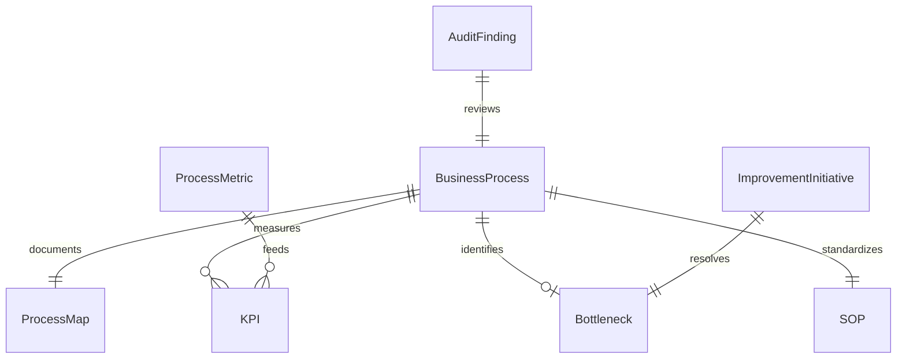
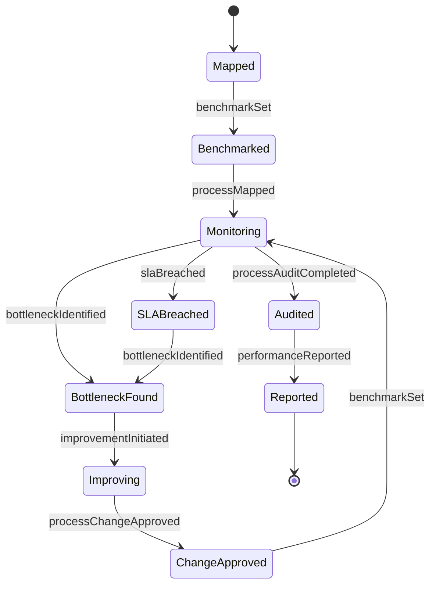
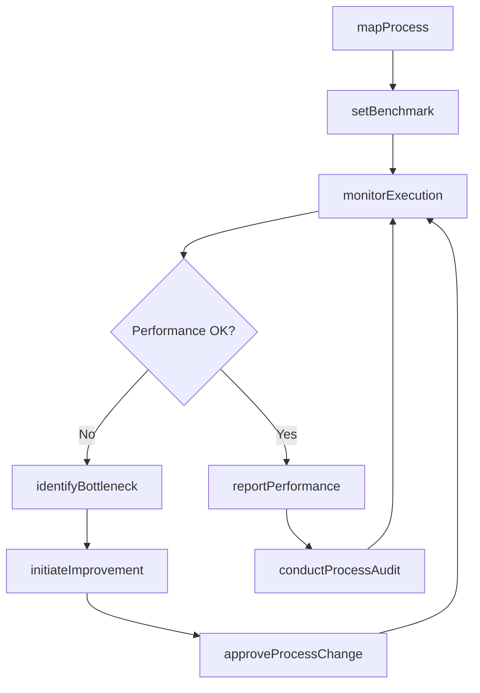
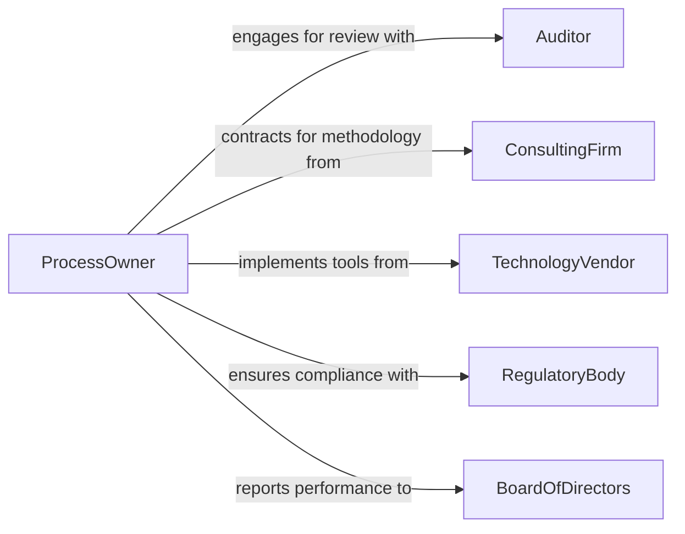

# Oversee Business Processes

> Business-as-Code definition for overseeing business processes. Models the monitoring, evaluation, and optimization of cross-functional organizational workflows from design through continuous improvement.

## Overview

Overseeing business processes encompasses the governance and continuous improvement of organizational workflows, standard operating procedures, and cross-functional operations. This definition provides actions for mapping processes, setting performance benchmarks, monitoring execution, and implementing improvements. It enables automation of process compliance checks, bottleneck detection, and efficiency reporting across departments.

## Actors

| Actor | Description |
|-------|-------------|
| Auditor | External party verifying process compliance and controls |
| ConsultingFirm | Provides process improvement methodologies and expertise |
| TechnologyVendor | Supplies workflow automation and BPM tools |
| RegulatoryBody | Establishes compliance requirements affecting processes |
| Customer | End recipient whose experience drives process design |
| BoardOfDirectors | Governance body requiring process performance reporting |

## Roles

| Role | Description |
|------|-------------|
| ProcessOwner | Accountable for the design and performance of a business process |
| OperationsManager | Manages day-to-day process execution across teams |
| BusinessAnalyst | Maps processes, identifies inefficiencies, and proposes improvements |
| QualityAssuranceLead | Monitors process outputs against quality standards |
| ComplianceOfficer | Ensures processes meet regulatory and policy requirements |

## Entities

| Entity | Description |
|--------|-------------|
| BusinessProcess | A defined sequence of activities producing a business outcome |
| ProcessMap | Visual documentation of process steps, inputs, and outputs |
| KPI | Key performance indicator measuring process effectiveness |
| Bottleneck | Identified constraint limiting process throughput |
| SOP | Standard operating procedure document for a process |
| AuditFinding | Observation from a process compliance review |
| ImprovementInitiative | A planned change to enhance process performance |
| ProcessMetric | Quantitative measurement of process execution |

## Actions

| Action | Description |
|--------|-------------|
| mapProcess | Document the steps, inputs, and outputs of a business process |
| setBenchmark | Define target performance levels for a process |
| monitorExecution | Track real-time process performance against benchmarks |
| identifyBottleneck | Detect constraints limiting process throughput |
| initiateImprovement | Launch a process optimization initiative |
| conductProcessAudit | Review a process for compliance and efficiency |
| approveProcessChange | Authorize a modification to a standard operating procedure |
| reportPerformance | Generate process performance summaries for stakeholders |

## Events

| Event | Description |
|-------|-------------|
| processMapped | A business process has been documented |
| benchmarkSet | Performance targets have been defined for a process |
| bottleneckIdentified | A process constraint has been detected |
| improvementInitiated | A process optimization initiative has been launched |
| processAuditCompleted | A compliance or efficiency review has been finished |
| processChangeApproved | A modification to a standard procedure has been authorized |
| performanceReported | Process performance summaries have been generated |
| slaBreached | A process has failed to meet its service-level agreement |

## Searches

| Search | Description |
|--------|-------------|
| findProcesses | List business processes by department, status, or owner |
| getKPIs | Retrieve performance indicators for a process or period |
| findBottlenecks | List identified process constraints by severity |
| getAuditFindings | Retrieve process audit observations by date or process |
| getImprovements | List active process improvement initiatives |


## Entity Relationships



## State Diagram



## Workflow



## Actor Relationships



## Usage

### Calling Actions

```typescript
import { overseeBusinessProcesses } from '@headlessly/oversee-business-processes'

const processes = overseeBusinessProcesses()

// Map a new business process
const processMap = await processes.mapProcess({
  name: 'Order-to-Cash',
  department: 'Finance',
  steps: ['order-received', 'invoice-generated', 'payment-collected', 'revenue-recognized']
})

// Set performance benchmarks
await processes.setBenchmark({
  processId: processMap.id,
  kpi: 'cycle-time',
  target: 48,
  unit: 'hours'
})

// Monitor ongoing execution
const status = await processes.monitorExecution({
  processId: processMap.id,
  period: '2026-Q1'
})
```

### Event-Driven Automation

```typescript
// Auto-detect bottlenecks on SLA breach
processes.slaBreached(async ({ processId, kpi, actualValue, targetValue }) => {
  await processes.identifyBottleneck({ processId })
  await notify({
    to: 'operations-manager',
    message: `SLA breach on ${kpi}: ${actualValue} vs target ${targetValue}`
  })
})

// Auto-schedule audit after process change
processes.processChangeApproved(async ({ processId, changeId }) => {
  await processes.conductProcessAudit({
    processId,
    type: 'post-change',
    scheduledDate: addDays(new Date(), 30)
  })
})
```
