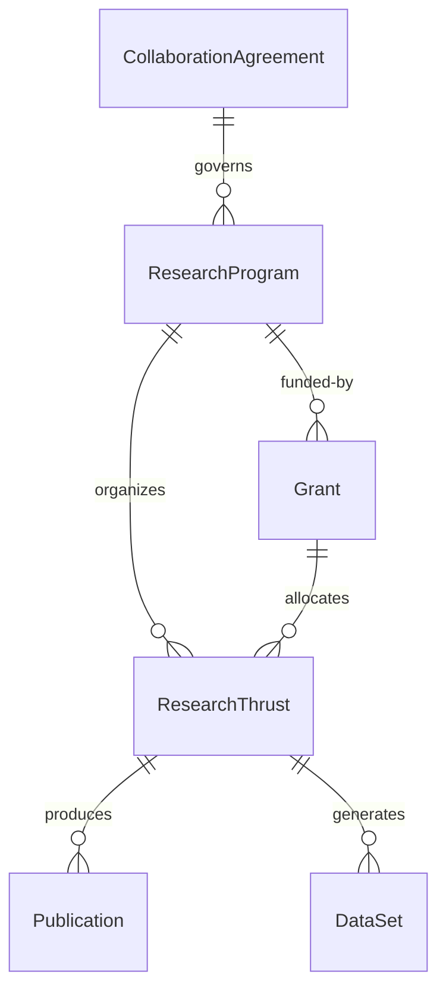
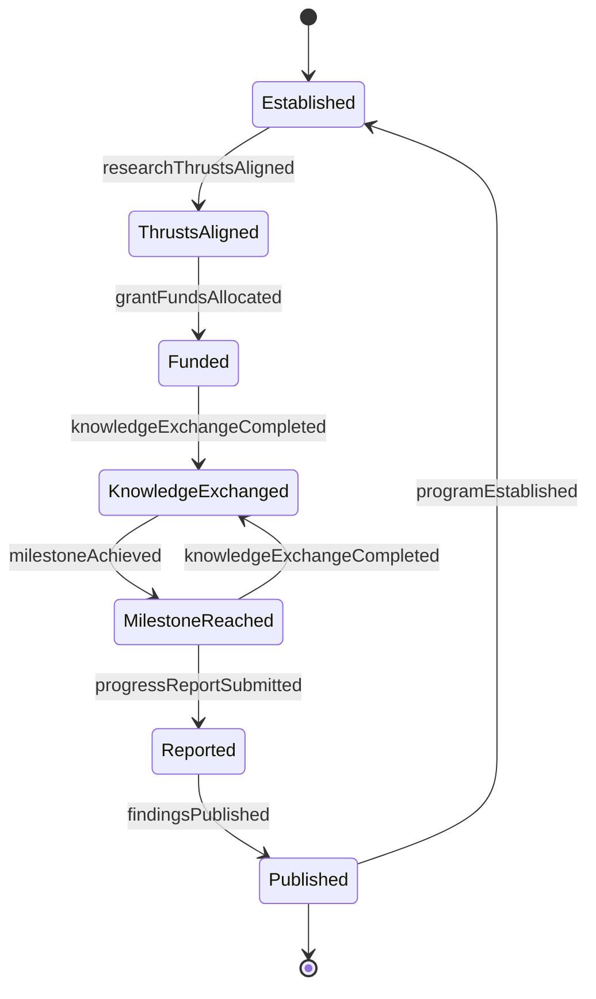
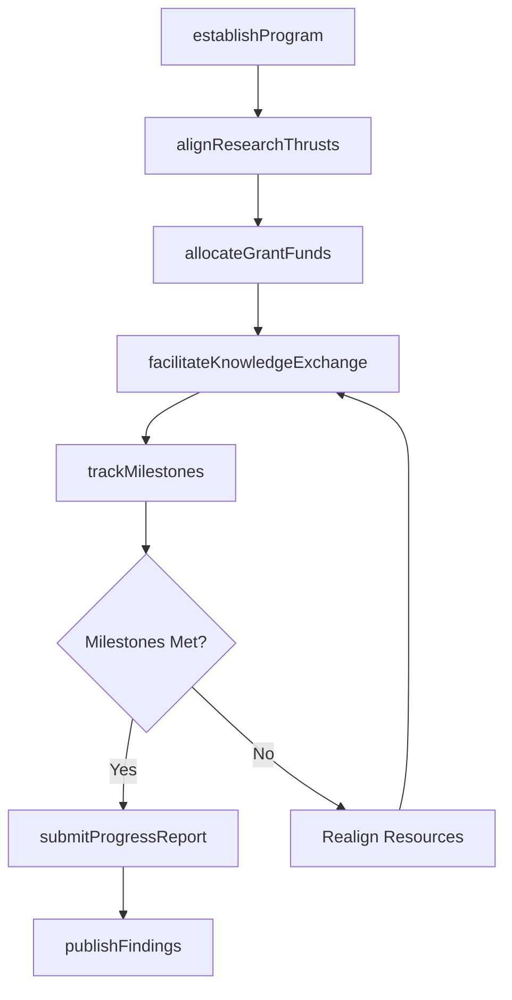
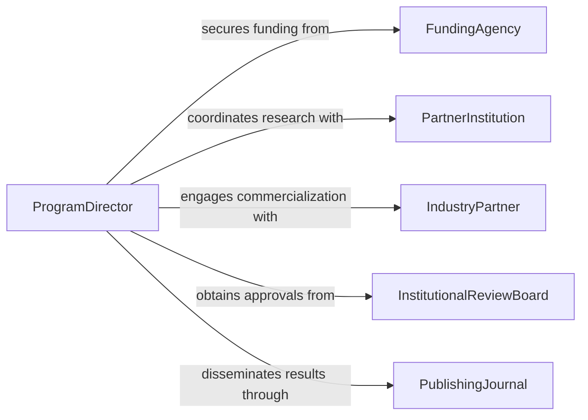

# Coordinate Cross-disciplinary Research Programs

> Business-as-Code definition for coordinating cross-disciplinary research programs. Models the orchestration of multi-department, multi-institution research initiatives spanning diverse scientific and technical domains.

## Overview

Coordinating cross-disciplinary research programs involves aligning researchers, laboratories, and institutions from different scientific fields to collaborate on shared research objectives. This includes establishing governance structures, managing shared budgets and grants, synchronizing research timelines, facilitating knowledge transfer between disciplines, and ensuring compliance with funding agency requirements. The definition supports research directors, program managers, and principal investigators in managing complex multi-disciplinary initiatives in academia, government labs, and corporate R&D settings.

## Actors

| Actor | Description |
|-------|-------------|
| FundingAgency | Government bodies or foundations providing research grants and oversight (e.g., NSF, NIH, DOE) |
| PartnerInstitution | Collaborating universities, labs, or companies contributing researchers and facilities |
| IndustryPartner | Private-sector organizations sponsoring research or seeking technology transfer |
| InstitutionalReviewBoard | Ethics and compliance bodies reviewing research protocols involving human subjects |
| PublishingJournal | Academic journals and conferences where research findings are disseminated |

## Roles

| Role | Description |
|------|-------------|
| ProgramDirector | Oversees the overall research program strategy, funding, and cross-team alignment |
| PrincipalInvestigator | Leads a specific research thrust and is accountable for scientific deliverables |
| GrantAdministrator | Manages budgets, compliance, and reporting requirements for funding agencies |
| ResearchCoordinator | Facilitates day-to-day communication, scheduling, and resource sharing across teams |

## Entities

| Entity | Description |
|--------|-------------|
| ResearchProgram | The overarching multi-disciplinary initiative with scope and objectives |
| ResearchThrust | A focused area of investigation within the broader program |
| Grant | A funding award with budget, reporting requirements, and performance milestones |
| Publication | A research output such as a journal article, conference paper, or technical report |
| DataSet | Shared experimental or computational data produced across disciplines |
| CollaborationAgreement | A formal arrangement between institutions defining IP, data sharing, and responsibilities |

## Actions

| Action | Description |
|--------|-------------|
| establishProgram | Define the research program scope, objectives, and governance structure |
| alignResearchThrusts | Map research activities across disciplines to shared program goals |
| allocateGrantFunds | Distribute funding across research thrusts and partner institutions |
| facilitateKnowledgeExchange | Organize cross-disciplinary workshops, seminars, and data sharing sessions |
| trackMilestones | Monitor progress against scientific and programmatic milestones |
| submitProgressReport | Compile and deliver periodic reports to funding agencies |
| publishFindings | Coordinate publication of joint research outputs |

## Events

| Event | Description |
|-------|-------------|
| programEstablished | A new cross-disciplinary research program has been formally launched |
| researchThrustsAligned | Disciplinary research areas have been mapped to program objectives |
| grantFundsAllocated | Funding has been distributed to research teams and institutions |
| knowledgeExchangeCompleted | A cross-disciplinary workshop or data sharing session has concluded |
| milestoneAchieved | A scientific or programmatic milestone has been reached |
| progressReportSubmitted | A periodic report has been delivered to the funding agency |
| findingsPublished | Joint research results have been published or presented |

## Searches

| Search | Description |
|--------|-------------|
| findPrograms | List research programs by discipline, funding source, or status |
| getResearchThrusts | Retrieve research areas by program, investigator, or institution |
| getMilestoneProgress | Check milestone achievement status across research thrusts |
| getPublications | Find publications and outputs by program, author, or discipline |


## Entity Relationships



## State Diagram



## Workflow



## Actor Relationships



## Usage

### Calling Actions

```typescript
import { coordinateCrossDisciplinaryResearchPrograms } from '@headlessly/coordinate-cross-disciplinary-research-programs'

const research = coordinateCrossDisciplinaryResearchPrograms()

// Launch a new interdisciplinary climate research program
const program = await research.establishProgram({
  name: 'Climate Resilience and Urban Systems Initiative',
  disciplines: ['atmospheric-science', 'civil-engineering', 'public-health', 'data-science'],
  fundingSource: 'NSF-CRISP',
  totalBudget: 12000000,
  duration: '5 years'
})

// Align research thrusts to program objectives
await research.alignResearchThrusts({
  programId: program.id,
  thrusts: [
    { name: 'Urban Heat Island Modeling', lead: 'pi-chen', institution: 'State University' },
    { name: 'Infrastructure Resilience Analytics', lead: 'pi-kumar', institution: 'Tech Institute' },
    { name: 'Public Health Impact Assessment', lead: 'pi-williams', institution: 'Medical Center' }
  ]
})

// Facilitate a cross-disciplinary data sharing workshop
await research.facilitateKnowledgeExchange({
  programId: program.id,
  type: 'workshop',
  topic: 'Integrating climate models with infrastructure vulnerability data',
  participants: ['atmospheric-science', 'civil-engineering'],
  date: '2026-09-15'
})
```

### Event-Driven Automation

```typescript
// Notify funding agency when key milestones are reached
research.milestoneAchieved(async ({ programId, milestone, thrust }) => {
  await research.submitProgressReport({
    programId,
    type: 'milestone-notification',
    milestone: milestone.name,
    thrust: thrust.name
  })
})

// Trigger publication coordination when findings are ready
research.knowledgeExchangeCompleted(async ({ programId, outcomes }) => {
  if (outcomes.publishableFindings) {
    await notify({
      to: 'program-director',
      message: `Cross-disciplinary findings ready for joint publication from program ${programId}`
    })
  }
})
```
