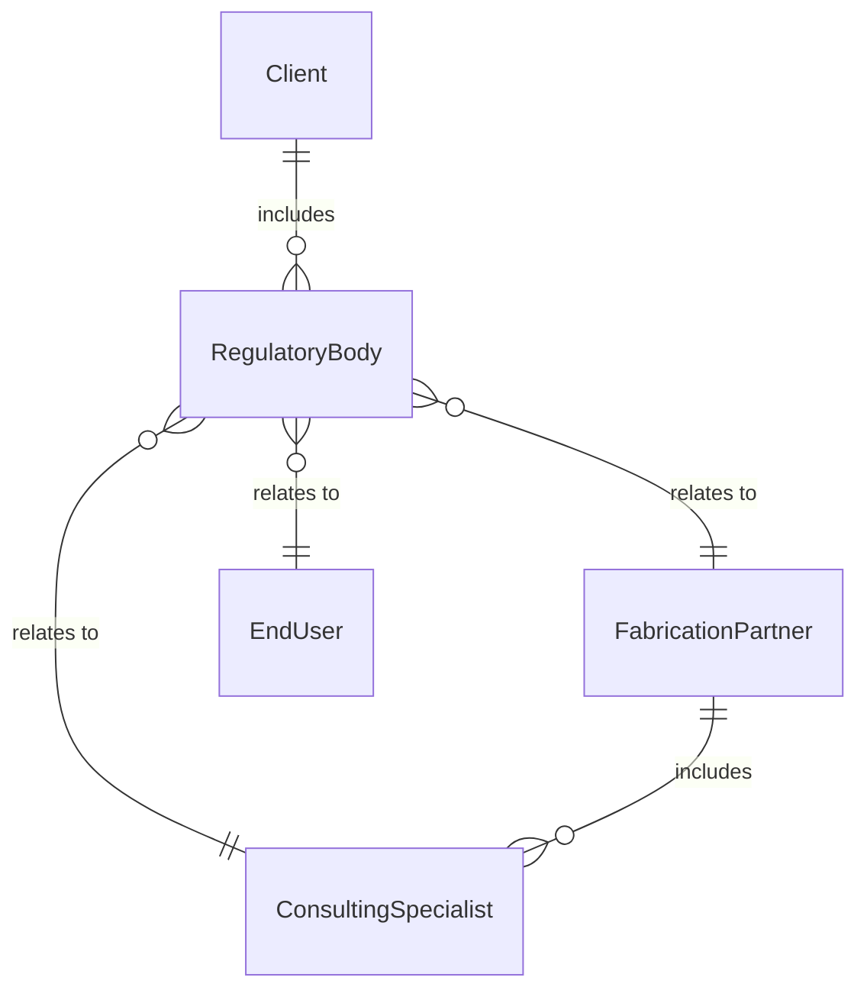
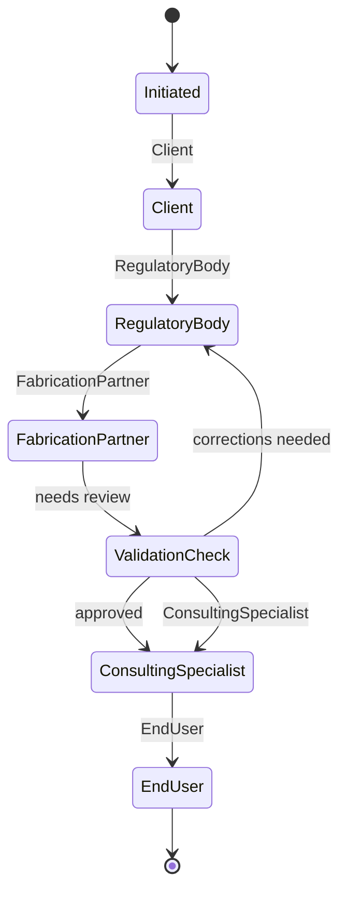
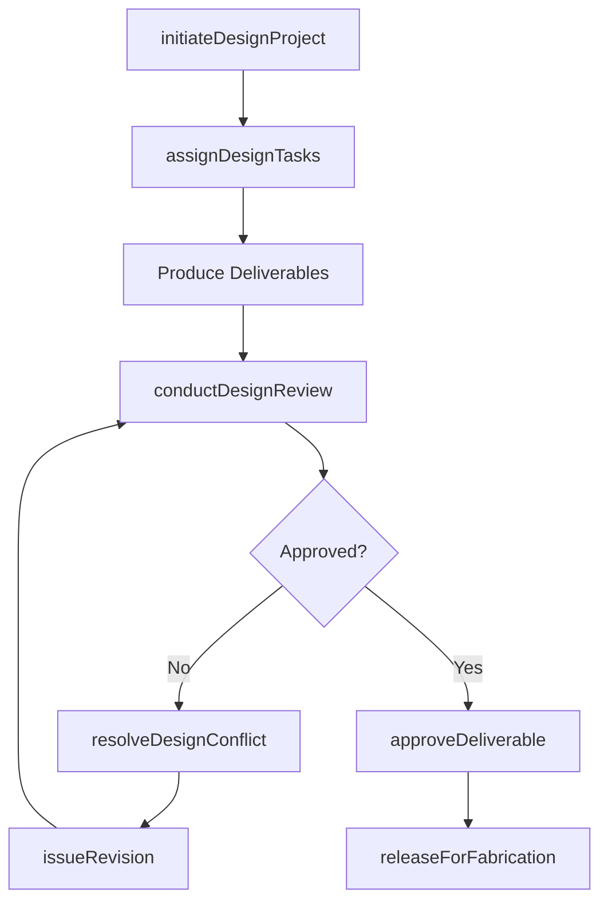
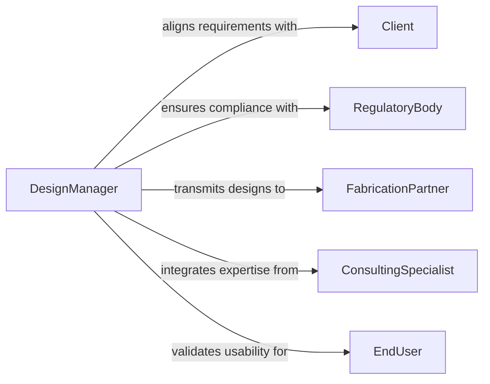

# Coordinate Design Activities

> Business-as-Code definition for coordinating design activities. Models the orchestration of multidisciplinary design teams, review cycles, and deliverable management across product, engineering, and architectural design processes.

## Overview

Coordinating design activities involves managing the collaboration between designers, engineers, and stakeholders to produce cohesive designs that meet functional, aesthetic, and regulatory requirements. This includes scheduling design reviews, managing revision cycles, resolving conflicts between disciplines, and ensuring deliverables are produced on time and within scope. The definition supports design managers, lead architects, and engineering directors in overseeing complex design programs across architecture, product development, industrial design, and software engineering.

## Actors

| Actor | Description |
|-------|-------------|
| Client | The individual or organization commissioning the design work and approving deliverables |
| RegulatoryBody | Agencies or standards organizations enforcing design codes and compliance |
| FabricationPartner | Manufacturers, printers, or fabricators who will produce the designed artifact |
| ConsultingSpecialist | Domain experts such as structural engineers, acousticians, or UX researchers |
| EndUser | The target user or occupant whose needs drive design decisions |

## Roles

| Role | Description |
|------|-------------|
| DesignManager | Coordinates all design disciplines, manages timelines, and resolves cross-team conflicts |
| LeadDesigner | Directs the creative and technical direction for a specific design discipline |
| DesignReviewer | Evaluates design deliverables for compliance, quality, and alignment with requirements |
| DocumentController | Manages version control, distribution, and archival of design documents |

## Entities

| Entity | Description |
|--------|-------------|
| DesignProject | A coordinated design effort with defined scope, schedule, and deliverables |
| Deliverable | A design output such as drawings, specifications, models, or prototypes |
| ReviewCycle | A formal evaluation period where stakeholders assess design deliverables |
| DesignStandard | A code, guideline, or specification that designs must conform to |
| Revision | A versioned update to a design deliverable incorporating feedback or changes |
| ConflictLog | A record of clashes or inconsistencies between design disciplines |

## Actions

| Action | Description |
|--------|-------------|
| initiateDesignProject | Establish a new design effort with scope, team, and milestones |
| assignDesignTasks | Allocate specific design activities to team members or disciplines |
| conductDesignReview | Schedule and execute a formal review of design deliverables |
| resolveDesignConflict | Address clashes between disciplines and reconcile competing requirements |
| issueRevision | Produce an updated version of a deliverable based on review feedback |
| approveDeliverable | Formally accept a design deliverable as meeting requirements |
| releaseForFabrication | Transmit approved designs to manufacturing or construction partners |

## Events

| Event | Description |
|-------|-------------|
| designProjectInitiated | A new design effort has been formally established |
| designTasksAssigned | Specific design activities have been allocated to team members |
| designReviewCompleted | A formal review cycle has concluded with feedback documented |
| designConflictResolved | A cross-discipline clash has been reconciled |
| revisionIssued | An updated version of a deliverable has been produced |
| deliverableApproved | A design deliverable has been formally accepted |
| designReleasedForFabrication | Approved designs have been transmitted for production |

## Searches

| Search | Description |
|--------|-------------|
| findDesignProjects | List design projects by status, discipline, client, or date range |
| getDeliverables | Retrieve design deliverables by project, discipline, or approval status |
| getOpenConflicts | Find unresolved design clashes by project or discipline pair |
| getReviewHistory | Look up past review cycles and feedback for a deliverable |


## Entity Relationships



## State Diagram



## Workflow



## Actor Relationships



## Usage

### Calling Actions

```typescript
import { coordinateDesignActivities } from '@headlessly/coordinate-design-activities'

const design = coordinateDesignActivities()

// Initiate a product design project
const project = await design.initiateDesignProject({
  name: 'Next-Gen Wearable Sensor Platform',
  disciplines: ['industrial-design', 'electrical-engineering', 'firmware', 'UX'],
  client: 'HealthTech Innovations',
  deadline: '2026-08-30'
})

// Assign design tasks across disciplines
await design.assignDesignTasks({
  projectId: project.id,
  tasks: [
    { discipline: 'industrial-design', description: 'Enclosure form factor and ergonomics', lead: 'designer-lin' },
    { discipline: 'electrical-engineering', description: 'Sensor PCB layout and power management', lead: 'engineer-park' },
    { discipline: 'UX', description: 'Companion app interface and data visualization', lead: 'designer-ray' }
  ]
})

// Conduct a cross-discipline design review
const review = await design.conductDesignReview({
  projectId: project.id,
  phase: 'preliminary-design',
  reviewers: ['client-rep', 'regulatory-consultant', 'manufacturing-engineer'],
  deliverables: ['enclosure-3d-model', 'pcb-schematic', 'app-wireframes']
})
```

### Event-Driven Automation

```typescript
// Notify fabrication partner when designs are released
design.designReleasedForFabrication(async ({ projectId, deliverables }) => {
  await notify({
    to: 'fabrication-partner',
    message: `${deliverables.length} deliverables released for project ${projectId}. Ready for tooling review.`
  })
})

// Auto-escalate unresolved design conflicts
design.designReviewCompleted(async ({ projectId, conflicts }) => {
  if (conflicts.length > 0) {
    await escalate({
      to: 'design-manager',
      subject: `${conflicts.length} unresolved conflicts from design review`,
      projectId
    })
  }
})
```
