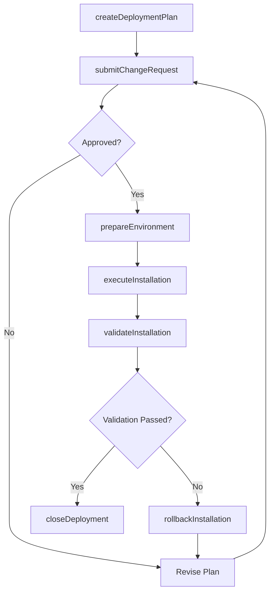
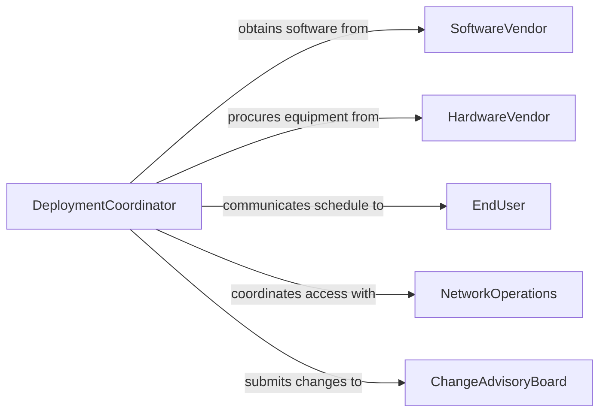

# Coordinate Software Hardware Installation

> Business-as-Code definition for coordinating software or hardware installation. Models the planning, scheduling, execution, and verification of IT system deployments across enterprise environments.

## Overview

Coordinating software or hardware installation involves planning deployment schedules, managing dependencies between systems, overseeing the physical or virtual setup of IT infrastructure, and verifying post-installation functionality. This includes managing change windows, coordinating with vendors and internal teams, ensuring compatibility with existing environments, and handling rollback procedures when installations fail. The definition supports IT managers, deployment coordinators, and systems administrators in executing reliable, well-orchestrated technology rollouts.

## Actors

| Actor | Description |
|-------|-------------|
| SoftwareVendor | Publishers and providers of application software, licenses, and updates |
| HardwareVendor | Manufacturers and resellers supplying servers, networking gear, and endpoints |
| EndUser | Employees or customers who will use the installed software or hardware |
| NetworkOperations | The team managing network infrastructure, firewalls, and connectivity |
| ChangeAdvisoryBoard | The governance body reviewing and approving proposed changes to production systems |

## Roles

| Role | Description |
|------|-------------|
| DeploymentCoordinator | Plans and schedules installations, manages dependencies, and coordinates teams |
| SystemsAdministrator | Performs the technical installation, configuration, and testing of systems |
| QAEngineer | Validates that installed systems function correctly in the target environment |
| ServiceDeskLead | Manages end-user communication, training, and post-installation support tickets |

## Entities

| Entity | Description |
|--------|-------------|
| DeploymentPlan | A documented schedule and procedure for installing software or hardware |
| ChangeRequest | A formal proposal submitted to the change advisory board for approval |
| InstallationPackage | The bundled software, firmware, drivers, or configuration files to be deployed |
| EnvironmentProfile | A description of the target system's OS, dependencies, and configuration state |
| RollbackPlan | A procedure for reverting to the previous state if installation fails |
| TestResult | The outcome of post-installation verification testing |

## Actions

| Action | Description |
|--------|-------------|
| createDeploymentPlan | Define the installation scope, schedule, dependencies, and rollback procedures |
| submitChangeRequest | Route a change proposal through the advisory board for approval |
| prepareEnvironment | Verify and configure the target system for compatibility with the installation |
| executeInstallation | Perform the actual software or hardware deployment according to plan |
| validateInstallation | Run post-deployment tests to confirm the system operates as expected |
| rollbackInstallation | Revert the environment to its previous state after a failed deployment |
| closeDeployment | Finalize documentation, notify stakeholders, and transition to operations |

## Events

| Event | Description |
|-------|-------------|
| deploymentPlanCreated | A new installation plan has been documented and distributed |
| changeRequestApproved | The change advisory board has authorized the deployment to proceed |
| environmentPrepared | The target system has been verified and configured for installation |
| installationExecuted | The software or hardware deployment has been performed |
| installationValidated | Post-deployment testing has confirmed successful operation |
| installationRolledBack | A failed deployment has been reverted to the previous system state |
| deploymentClosed | The installation has been finalized and transitioned to operations |

## Searches

| Search | Description |
|--------|-------------|
| findDeployments | List deployment plans by status, system, date range, or environment |
| getChangeRequests | Retrieve change requests by approval status, system, or requestor |
| getTestResults | Find post-installation validation outcomes by deployment or system |
| getPendingInstallations | List scheduled installations not yet executed |

## Workflow



## Actor Relationships



## Usage

### Calling Actions

```typescript
import { coordinateSoftwareHardwareInstallation } from '@headlessly/coordinate-software-hardware-installation'

const deployment = coordinateSoftwareHardwareInstallation()

// Create a deployment plan for an ERP upgrade
const plan = await deployment.createDeploymentPlan({
  name: 'SAP S/4HANA 2026 Upgrade',
  systems: ['erp-production', 'erp-reporting'],
  scheduledWindow: { start: '2026-06-14T22:00', end: '2026-06-15T06:00' },
  rollbackDeadline: '2026-06-15T03:00',
  dependencies: ['database-backup-complete', 'network-maintenance-cleared']
})

// Submit for change approval
await deployment.submitChangeRequest({
  planId: plan.id,
  impact: 'high',
  affectedUsers: 2400,
  justification: 'Security patches and performance improvements for fiscal close'
})

// Execute the installation during the approved window
await deployment.executeInstallation({
  planId: plan.id,
  installer: 'sysadmin-team-lead',
  mode: 'rolling-update'
})
```

### Event-Driven Automation

```typescript
// Auto-validate after installation completes
deployment.installationExecuted(async ({ planId, systems }) => {
  for (const system of systems) {
    await deployment.validateInstallation({
      planId,
      system,
      testSuite: 'post-deploy-smoke-tests'
    })
  }
})

// Notify stakeholders on rollback
deployment.installationRolledBack(async ({ planId, reason }) => {
  await notify({
    to: ['change-advisory-board', 'service-desk', 'deployment-coordinator'],
    message: `Deployment ${planId} rolled back: ${reason}. Post-mortem scheduled.`
  })
})
```
