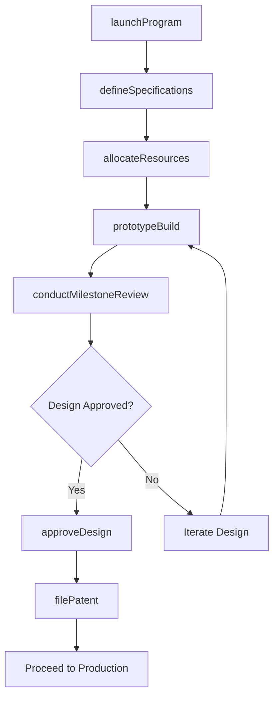
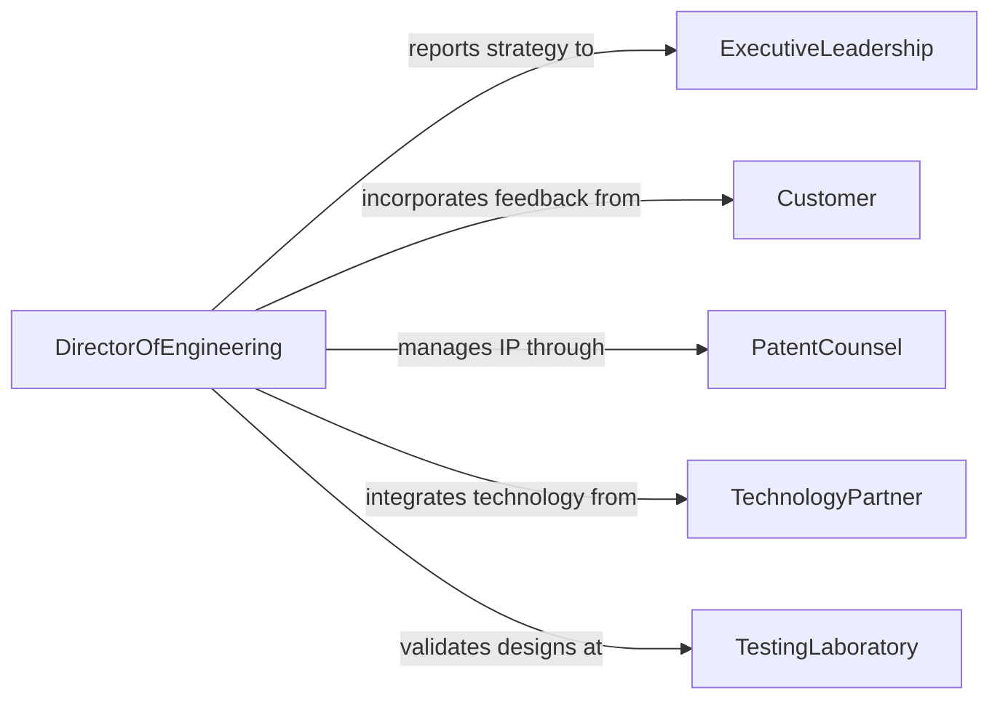

# Direct Design Development Activities

> Business-as-Code definition for directing design or development activities. Models the strategic oversight, resource allocation, and decision-making involved in leading product design and development programs.

## Overview

Directing design or development activities involves setting the strategic vision, making go/no-go decisions, allocating resources, and providing technical leadership across product design and development teams. This spans software development, hardware engineering, industrial design, and R&D programs. The process includes establishing development methodologies, approving design milestones, managing intellectual property, and ensuring alignment between innovation efforts and business objectives.

## Actors

| Actor | Description |
|-------|-------------|
| ExecutiveLeadership | Senior management setting strategic priorities and approving investment decisions |
| Customer | End customers or client organizations whose needs drive design requirements |
| PatentCounsel | Legal advisors managing intellectual property filings and freedom-to-operate analyses |
| TechnologyPartner | External firms contributing specialized technology, components, or platforms |
| TestingLaboratory | Independent or internal labs performing validation and certification testing |

## Roles

| Role | Description |
|------|-------------|
| DirectorOfEngineering | Sets technical direction, manages development teams, and reports to executive leadership |
| ProductArchitect | Defines the overall system architecture and ensures design coherence across subsystems |
| DevelopmentLead | Manages day-to-day development execution within a specific team or discipline |
| TechnicalProgramManager | Coordinates cross-functional dependencies, timelines, and resource allocation |

## Entities

| Entity | Description |
|--------|-------------|
| DevelopmentProgram | A structured initiative to design and build a product or system |
| DesignMilestone | A gate review checkpoint such as concept, preliminary, or critical design review |
| TechnicalSpecification | Detailed requirements defining what the system must do and how it must perform |
| Prototype | A functional or representational model used to validate design decisions |
| IntellectualProperty | Patents, trade secrets, and proprietary designs generated during development |
| ResourcePlan | An allocation of engineers, budget, tools, and facilities to the program |

## Actions

| Action | Description |
|--------|-------------|
| launchProgram | Initiate a new design or development program with objectives and resource commitments |
| defineSpecifications | Establish the technical requirements and performance targets for the design |
| conductMilestoneReview | Execute a formal gate review to assess design maturity and readiness |
| approveDesign | Formally accept a design at a given milestone and authorize progression |
| allocateResources | Assign engineering staff, budget, and tooling to development activities |
| prototypeBuild | Commission the fabrication of a prototype for testing and validation |
| filePatent | Initiate the intellectual property protection process for novel designs |

## Events

| Event | Description |
|-------|-------------|
| programLaunched | A new design or development program has been formally initiated |
| specificationsDefinied | Technical requirements and performance targets have been established |
| milestoneReviewCompleted | A formal gate review has concluded with a disposition decision |
| designApproved | A design has passed milestone review and is authorized to proceed |
| resourcesAllocated | Engineering staff, budget, and tools have been assigned to the program |
| prototypeCompleted | A physical or functional prototype has been built and is ready for testing |
| patentFiled | An intellectual property application has been submitted |

## Searches

| Search | Description |
|--------|-------------|
| findPrograms | List development programs by status, product line, or technology domain |
| getMilestoneStatus | Check the current milestone state and upcoming reviews for a program |
| getResourceAllocation | Retrieve staffing, budget, and tool assignments by program or team |
| getPrototypes | Find prototypes by program, build iteration, or test status |

## Workflow



## Actor Relationships



## Usage

### Calling Actions

```typescript
import { directDesignDevelopmentActivities } from '@headlessly/direct-design-development-activities'

const development = directDesignDevelopmentActivities()

// Launch a new autonomous vehicle sensor program
const program = await development.launchProgram({
  name: 'LiDAR Sensor Module Gen 4',
  productLine: 'autonomous-vehicles',
  objective: 'Develop next-generation solid-state LiDAR with 300m range',
  budget: 8500000,
  teamSize: 24,
  targetDate: '2027-03-01'
})

// Define technical specifications
await development.defineSpecifications({
  programId: program.id,
  specs: [
    { parameter: 'range', target: '300m', minimum: '250m' },
    { parameter: 'resolution', target: '0.05-degrees', minimum: '0.1-degrees' },
    { parameter: 'power-consumption', target: '15W', maximum: '20W' },
    { parameter: 'MTBF', target: '50000-hours', minimum: '30000-hours' }
  ]
})

// Conduct a preliminary design review
const review = await development.conductMilestoneReview({
  programId: program.id,
  milestone: 'preliminary-design-review',
  reviewBoard: ['vp-engineering', 'product-architect', 'customer-engineering-lead'],
  deliverables: ['system-architecture', 'optical-design', 'thermal-analysis']
})
```

### Event-Driven Automation

```typescript
// Notify leadership when key milestones pass
development.designApproved(async ({ programId, milestone }) => {
  await notify({
    to: 'executive-leadership',
    message: `Program ${programId} passed ${milestone}. Authorized to proceed to next phase.`
  })
})

// Trigger patent review when prototype reveals novel features
development.prototypeCompleted(async ({ programId, novelFeatures }) => {
  if (novelFeatures.length > 0) {
    await development.filePatent({
      programId,
      inventions: novelFeatures,
      priority: 'provisional'
    })
  }
})
```
