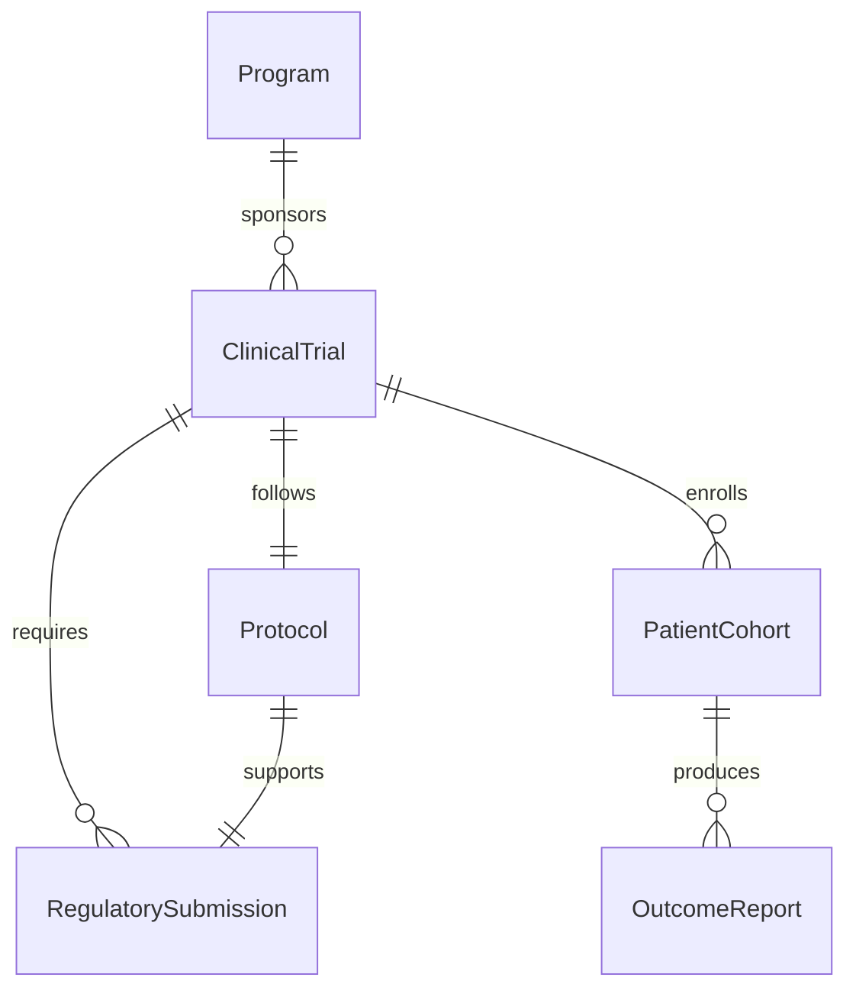
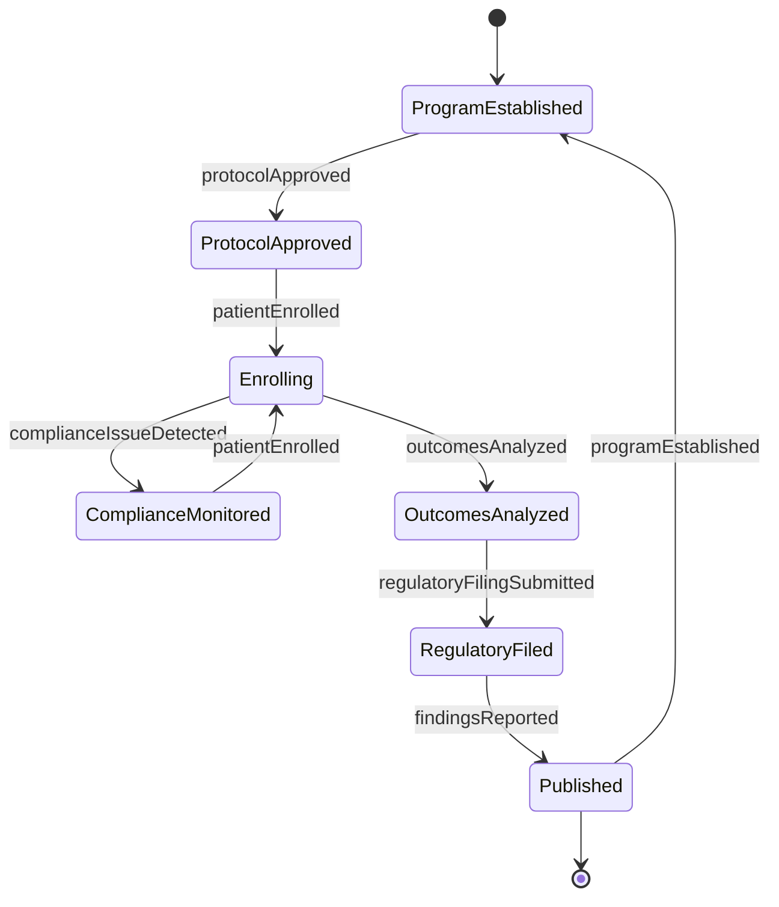
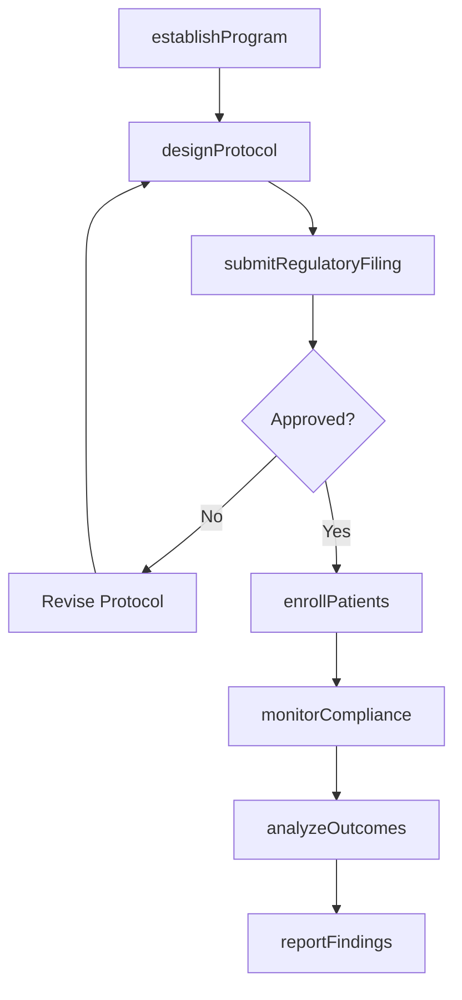
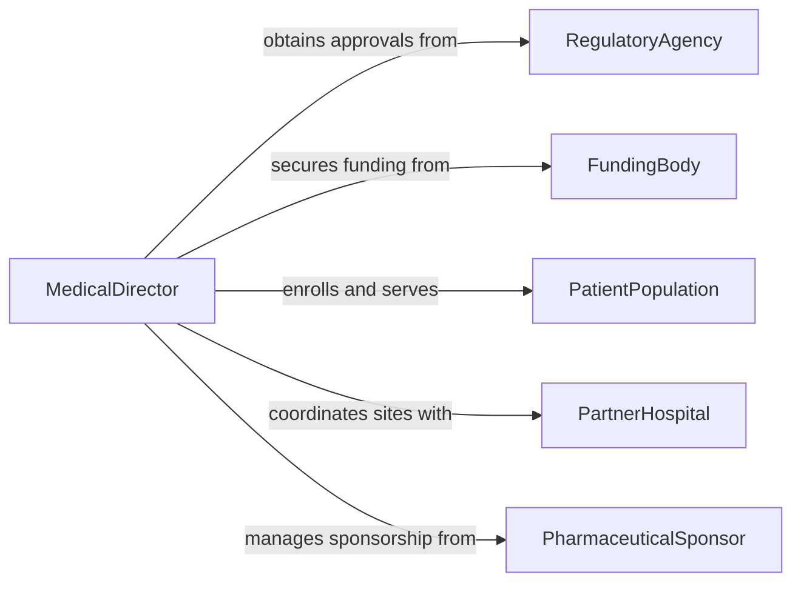

# Direct Medical Science Healthcare Programs

> Business-as-Code definition for directing medical science or healthcare programs. Models the leadership, governance, and operational management of clinical research, public health initiatives, and healthcare delivery programs.

## Overview

Directing medical science or healthcare programs involves providing strategic leadership over clinical trials, public health campaigns, healthcare quality improvement initiatives, and biomedical research efforts. This includes setting program objectives, securing funding, managing regulatory compliance, overseeing research protocols, and ensuring patient safety and ethical standards. The definition supports medical directors, principal investigators, and program administrators in managing complex healthcare and life sciences programs across hospitals, research institutions, pharmaceutical companies, and government health agencies.

## Actors

| Actor | Description |
|-------|-------------|
| RegulatoryAgency | Bodies such as the FDA, EMA, or IRB overseeing clinical research and drug approvals |
| FundingBody | NIH, private foundations, or pharmaceutical sponsors providing research grants |
| PatientPopulation | Individuals enrolled in clinical trials or served by healthcare programs |
| PartnerHospital | Clinical sites and healthcare facilities participating in research or program delivery |
| PharmaceuticalSponsor | Companies funding clinical trials and seeking regulatory approval for therapies |

## Roles

| Role | Description |
|------|-------------|
| MedicalDirector | Provides overall clinical and scientific leadership for the program |
| PrincipalInvestigator | Leads specific research studies and is responsible for protocol adherence |
| ClinicalTrialManager | Oversees trial operations, site management, and data collection processes |
| ComplianceOfficer | Ensures adherence to regulatory requirements, ethical standards, and reporting obligations |

## Entities

| Entity | Description |
|--------|-------------|
| Program | A medical science or healthcare initiative with defined scope and objectives |
| ClinicalTrial | A structured research study evaluating the safety and efficacy of an intervention |
| Protocol | The detailed plan governing how a clinical study is conducted |
| PatientCohort | A defined group of patients enrolled in a study or program |
| RegulatorySubmission | A formal filing to a regulatory agency such as an IND or NDA |
| OutcomeReport | A summary of clinical or program results used for decision-making and publication |

## Actions

| Action | Description |
|--------|-------------|
| establishProgram | Define the healthcare or research program scope, objectives, and governance |
| designProtocol | Develop the clinical study protocol with endpoints, criteria, and procedures |
| enrollPatients | Recruit and register eligible patients into the clinical trial or program |
| monitorCompliance | Verify adherence to regulatory requirements, protocols, and ethical standards |
| analyzeOutcomes | Evaluate clinical data and program results against defined objectives |
| submitRegulatoryFiling | Prepare and file required documents with regulatory agencies |
| reportFindings | Compile and publish program outcomes to stakeholders and the scientific community |

## Events

| Event | Description |
|-------|-------------|
| programEstablished | A new medical science or healthcare program has been formally launched |
| protocolApproved | A clinical study protocol has been reviewed and authorized by the IRB |
| patientEnrolled | A patient has been successfully registered in a trial or program |
| complianceIssueDetected | A deviation from protocol or regulatory requirements has been identified |
| outcomesAnalyzed | Clinical data analysis has been completed with results summarized |
| regulatoryFilingSubmitted | A required submission has been delivered to the regulatory agency |
| findingsReported | Program outcomes have been published or presented to stakeholders |

## Searches

| Search | Description |
|--------|-------------|
| findPrograms | List medical or healthcare programs by therapeutic area, status, or sponsor |
| getTrialEnrollment | Retrieve patient enrollment data by trial, site, or cohort |
| getComplianceStatus | Check regulatory compliance and audit readiness by program or site |
| getOutcomes | Find clinical outcome reports by trial, endpoint, or publication status |


## Entity Relationships



## State Diagram



## Workflow



## Actor Relationships



## Usage

### Calling Actions

```typescript
import { directMedicalScienceHealthcarePrograms } from '@headlessly/direct-medical-science-healthcare-programs'

const programs = directMedicalScienceHealthcarePrograms()

// Establish a new oncology clinical research program
const program = await programs.establishProgram({
  name: 'Phase III Immunotherapy Trial - Advanced Melanoma',
  therapeuticArea: 'oncology',
  sponsor: 'BioGenesis Pharmaceuticals',
  sites: ['Memorial Cancer Center', 'University Medical Center', 'Regional Oncology Clinic'],
  targetEnrollment: 450,
  duration: '36 months'
})

// Design the clinical protocol
await programs.designProtocol({
  programId: program.id,
  primaryEndpoint: 'progression-free-survival',
  secondaryEndpoints: ['overall-survival', 'objective-response-rate'],
  inclusionCriteria: ['stage-iiic-or-iv-melanoma', 'ecog-0-or-1', 'prior-checkpoint-inhibitor'],
  phases: ['screening', 'treatment', 'follow-up']
})

// Submit IND to regulatory agency
await programs.submitRegulatoryFiling({
  programId: program.id,
  type: 'IND',
  agency: 'FDA',
  documents: ['protocol', 'investigator-brochure', 'informed-consent-form']
})
```

### Event-Driven Automation

```typescript
// Alert compliance team on protocol deviations
programs.complianceIssueDetected(async ({ programId, site, deviation }) => {
  await notify({
    to: 'compliance-officer',
    message: `Protocol deviation at ${site}: ${deviation.description}. Corrective action required.`
  })
  await createCorrectiveAction({
    programId,
    site,
    deviation
  })
})

// Trigger reporting when outcomes are ready
programs.outcomesAnalyzed(async ({ programId, endpoint, results }) => {
  if (results.statistically_significant) {
    await programs.reportFindings({
      programId,
      type: 'interim-analysis',
      endpoint,
      results
    })
  }
})
```
