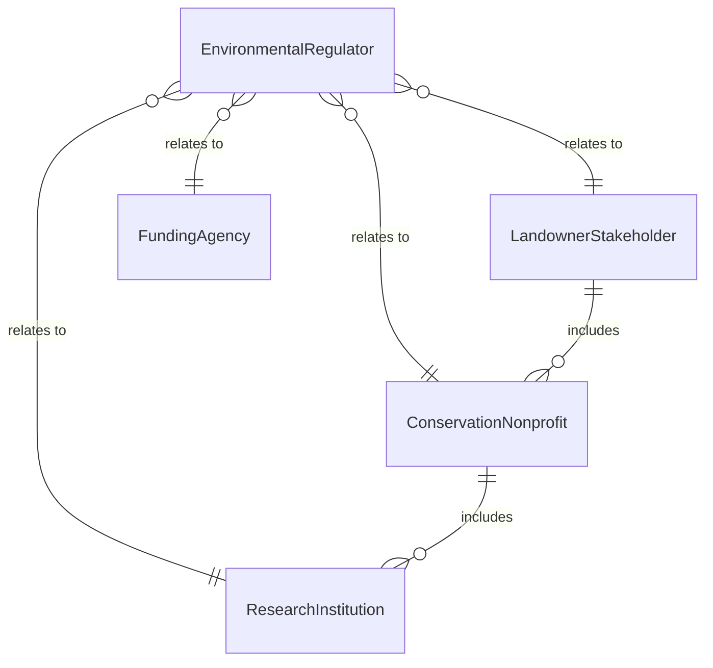
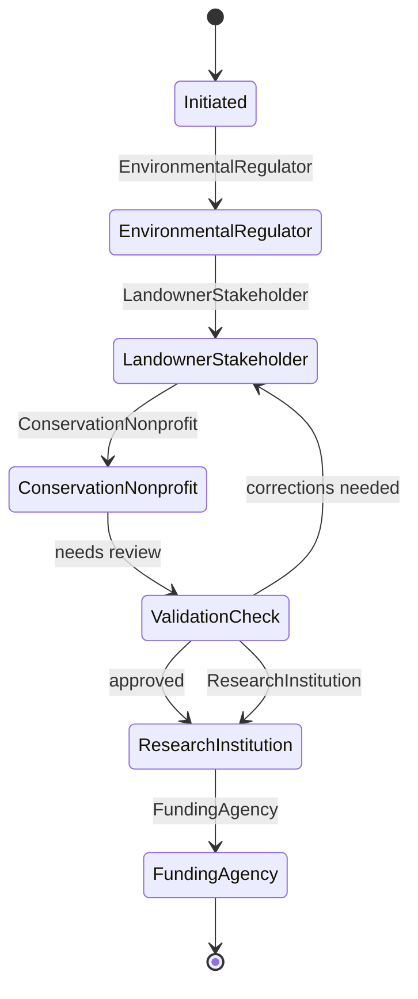
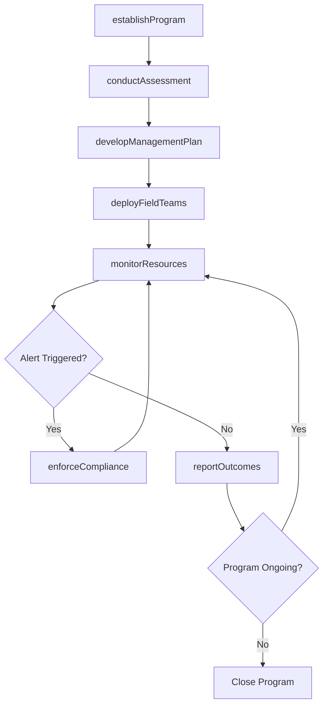
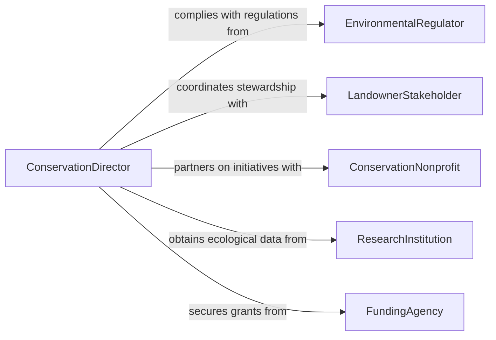

# Direct Natural Resources Management Conservation

> Business-as-Code definition for directing natural resources management or conservation programs. Models the strategic planning, field operations, regulatory compliance, and stakeholder engagement involved in managing and protecting natural resources.

## Overview

Directing natural resources management or conservation programs involves overseeing the protection, sustainable use, and restoration of forests, waterways, wildlife habitats, minerals, and other natural assets. This includes developing conservation plans, managing field teams, coordinating with regulatory agencies, conducting environmental assessments, and engaging communities in stewardship activities. The definition supports resource managers, conservation directors, and environmental program leaders in government agencies, nonprofits, and private land management organizations.

## Actors

| Actor | Description |
|-------|-------------|
| EnvironmentalRegulator | Federal and state agencies such as EPA, USFWS, or state DNR enforcing environmental law |
| LandownerStakeholder | Private landowners, tribal nations, or communities with resource interests |
| ConservationNonprofit | Organizations such as land trusts, wildlife federations, and watershed councils |
| ResearchInstitution | Universities and labs providing ecological data, species surveys, and impact studies |
| FundingAgency | Government programs or foundations providing grants for conservation work |

## Roles

| Role | Description |
|------|-------------|
| ConservationDirector | Provides strategic leadership and oversees all conservation programs |
| ResourceManager | Plans and executes specific natural resource management activities in the field |
| EnvironmentalScientist | Conducts ecological assessments, monitors biodiversity, and analyzes environmental data |
| CommunityEngagementLead | Coordinates outreach, education, and stakeholder participation in conservation efforts |

## Entities

| Entity | Description |
|--------|-------------|
| ConservationProgram | A structured initiative to protect or restore a natural resource or ecosystem |
| ManagementPlan | A documented strategy for sustainable use and protection of a resource area |
| EnvironmentalAssessment | A scientific evaluation of ecological conditions, threats, and restoration needs |
| ProtectedArea | A designated land or water area managed for conservation purposes |
| Species | A plant or animal population being monitored, protected, or managed |
| Permit | A regulatory authorization for resource extraction, land use, or habitat modification |

## Actions

| Action | Description |
|--------|-------------|
| establishProgram | Define a new conservation or resource management program with goals and scope |
| developManagementPlan | Create a comprehensive plan for sustainable resource use and protection |
| conductAssessment | Perform an environmental or ecological assessment of a resource area |
| deployFieldTeams | Assign conservation staff and researchers to field operations |
| monitorResources | Track resource conditions, species populations, and environmental indicators |
| enforceCompliance | Ensure activities within managed areas comply with regulations and permit conditions |
| reportOutcomes | Compile and share program results with regulators, funders, and stakeholders |

## Events

| Event | Description |
|-------|-------------|
| programEstablished | A new conservation or resource management program has been formally launched |
| managementPlanApproved | A resource management plan has been reviewed and authorized |
| assessmentCompleted | An environmental or ecological assessment has been finalized |
| fieldTeamsDeployed | Conservation staff have been assigned and dispatched to field locations |
| resourceAlertTriggered | Monitoring has detected a significant change in resource conditions or species populations |
| complianceViolationFound | An activity has been identified as non-compliant with regulations or permits |
| outcomesReported | Program results have been published to regulators, funders, and the public |

## Searches

| Search | Description |
|--------|-------------|
| findPrograms | List conservation programs by resource type, region, status, or funding source |
| getProtectedAreas | Retrieve managed areas by designation, ecosystem type, or threat level |
| getSpeciesStatus | Check population trends and conservation status for monitored species |
| getAssessments | Find environmental assessments by area, date, or ecological indicator |


## Entity Relationships



## State Diagram



## Workflow



## Actor Relationships



## Usage

### Calling Actions

```typescript
import { directNaturalResourcesManagementConservation } from '@headlessly/direct-natural-resources-management-conservation'

const conservation = directNaturalResourcesManagementConservation()

// Establish a watershed restoration program
const program = await conservation.establishProgram({
  name: 'Upper Salmon River Watershed Restoration',
  resourceType: 'watershed',
  region: 'Central Idaho',
  objectives: ['restore-riparian-habitat', 'reduce-sediment-loading', 'improve-salmon-passage'],
  fundingSource: 'NOAA Restoration Center',
  duration: '5 years'
})

// Conduct a baseline environmental assessment
const assessment = await conservation.conductAssessment({
  programId: program.id,
  type: 'baseline-ecological',
  indicators: ['water-quality', 'fish-population', 'riparian-vegetation', 'stream-morphology'],
  area: 'Upper Salmon River - RM 180 to RM 220'
})

// Deploy field teams for restoration work
await conservation.deployFieldTeams({
  programId: program.id,
  teams: [
    { name: 'Riparian Crew', task: 'plant-native-vegetation', location: 'Redfish Creek' },
    { name: 'Fish Passage Team', task: 'remove-barrier-structures', location: 'Stanley Basin' }
  ],
  startDate: '2026-05-15'
})
```

### Event-Driven Automation

```typescript
// Alert on significant resource changes
conservation.resourceAlertTriggered(async ({ programId, indicator, change }) => {
  await notify({
    to: ['conservation-director', 'environmental-scientist'],
    message: `Resource alert: ${indicator} changed by ${change.percentage}% in program ${programId}`
  })
})

// Auto-report compliance violations to regulators
conservation.complianceViolationFound(async ({ programId, violation, area }) => {
  await conservation.reportOutcomes({
    programId,
    type: 'compliance-incident',
    details: violation,
    reportTo: ['environmental-regulator', 'funding-agency']
  })
})
```
