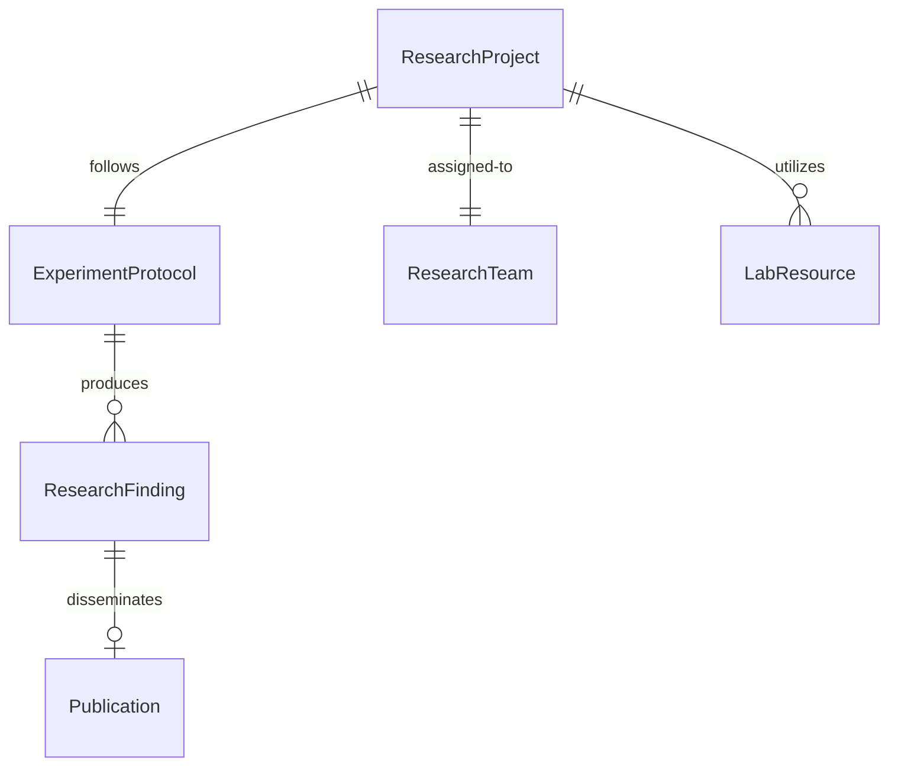
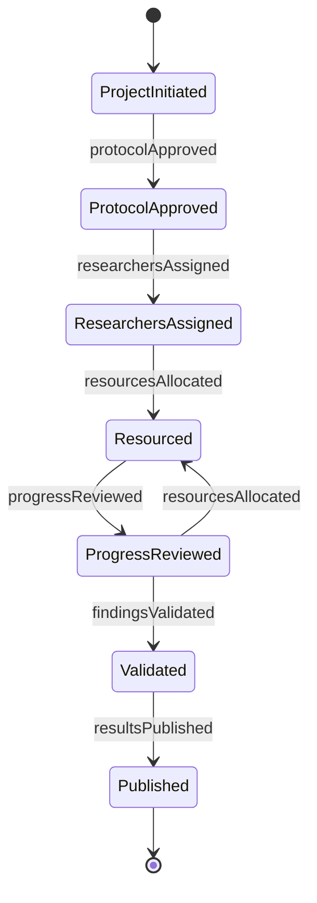
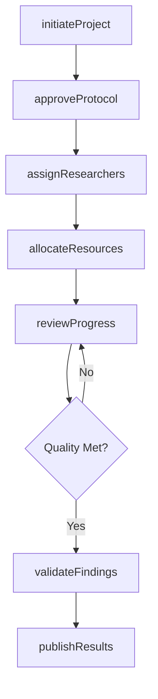
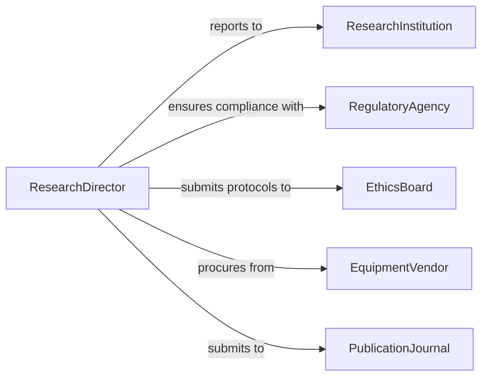

# Direct Scientific Activities

> Business-as-Code definition for scientific research direction and oversight. Models the leadership of research teams, experimental protocols, and scientific discovery processes.

## Overview

Scientific activity direction involves overseeing research teams, approving experimental designs, ensuring regulatory compliance, and guiding scientific investigations toward meaningful outcomes. This definition exposes actions for research planning, team coordination, protocol approval, and result validation.

## Actors

| Actor | Description |
|-------|-------------|
| ResearchInstitution | Academic or corporate organization funding research |
| RegulatoryAgency | Government body ensuring compliance with research standards |
| EthicsBoard | Committee reviewing research protocols for ethical compliance |
| EquipmentVendor | Supplier of scientific instruments and consumables |
| PublicationJournal | Academic publishers reviewing research findings |
| FundingAgency | Organization providing grants or research funding |

## Roles

| Role | Description |
|------|-------------|
| ResearchDirector | Senior scientist overseeing research strategy and outcomes |
| PrincipalInvestigator | Lead scientist responsible for specific research projects |
| LabManager | Manages day-to-day laboratory operations and resources |
| Researcher | Scientists conducting experiments and collecting data |

## Entities

| Entity | Description |
|--------|-------------|
| ResearchProject | A funded investigation with defined objectives and timeline |
| ExperimentProtocol | Detailed procedure for conducting scientific experiments |
| ResearchTeam | Group of scientists assigned to a project |
| LabResource | Equipment, materials, or facilities required for research |
| ResearchFinding | Validated results from scientific experiments |
| Publication | Formal dissemination of research outcomes |

## Actions

| Action | Description |
|--------|-------------|
| initiateProject | Launch a new research project with objectives and team |
| approveProtocol | Review and authorize experimental procedures |
| assignResearchers | Allocate scientists to specific research tasks |
| allocateResources | Distribute equipment, funding, and lab space to projects |
| reviewProgress | Assess research milestones and data quality |
| validateFindings | Verify scientific results meet quality standards |
| publishResults | Submit research outcomes for peer review and publication |

## Events

| Event | Description |
|-------|-------------|
| projectInitiated | A new research project has been launched |
| protocolApproved | Experimental protocol has passed review |
| researchersAssigned | Scientists have been allocated to project roles |
| resourcesAllocated | Lab resources have been distributed to research teams |
| progressReviewed | Research milestone assessment completed |
| findingsValidated | Scientific results have been verified |
| resultsPublished | Research outcomes have been formally published |

## Searches

| Search | Description |
|--------|-------------|
| findProjects | List research projects by status, funding source, or lead |
| getProtocols | Retrieve experimental protocols by project or approval status |
| getResearchers | Find scientists by expertise, availability, or project |
| getFindings | Retrieve validated research results by project or date |


## Entity Relationships



## State Diagram



## Workflow



## Actor Relationships



## Usage

### Calling Actions

```typescript
import { directScientificActivities } from '@headlessly/direct-scientific-activities'

const research = directScientificActivities()

// Initiate a new research project
const project = await research.initiateProject({
  title: 'Novel Cancer Treatment Mechanisms',
  principalInvestigator: 'Dr. Sarah Chen',
  funding: { amount: 500000, source: 'NIH Grant R01' },
  duration: { start: '2026-01-01', end: '2028-12-31' }
})

// Approve experimental protocol
await research.approveProtocol({
  projectId: project.id,
  protocolName: 'Phase I Clinical Trial Protocol',
  reviewedBy: 'Ethics Board',
  approvalDate: '2026-02-15'
})

// Assign researchers to the project
await research.assignResearchers({
  projectId: project.id,
  team: [
    { name: 'Dr. James Liu', role: 'Lead Researcher' },
    { name: 'Dr. Maria Rodriguez', role: 'Data Analyst' },
    { name: 'Dr. Kevin Patel', role: 'Lab Technician' }
  ]
})
```

### Event-Driven Automation

```typescript
// Notify regulatory agency when protocol is approved
research.protocolApproved(async ({ projectId, protocol }) => {
  await notifyRegulatory({
    agency: 'FDA',
    project: projectId,
    protocol: protocol.name
  })
})

// Auto-trigger publication workflow when findings validated
research.findingsValidated(async ({ projectId, findings }) => {
  if (findings.significance > 0.05) {
    await research.publishResults({
      projectId,
      targetJournal: 'Nature Medicine'
    })
  }
})
```
