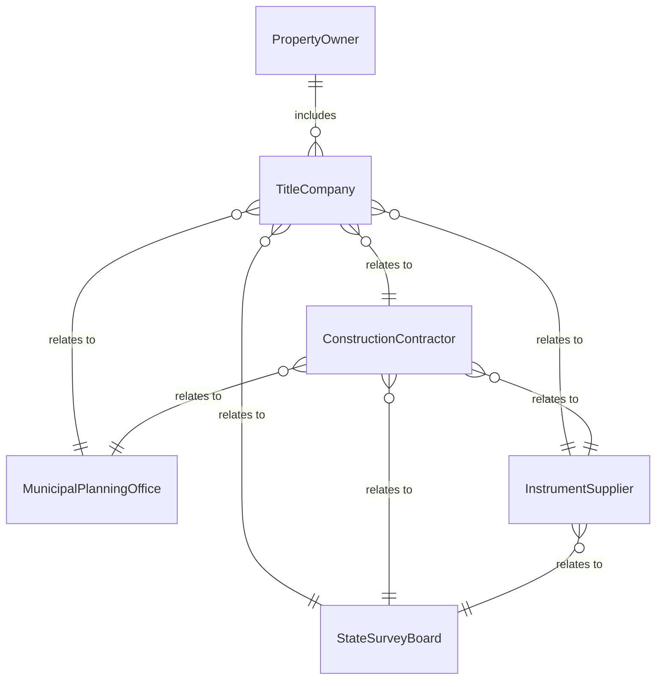
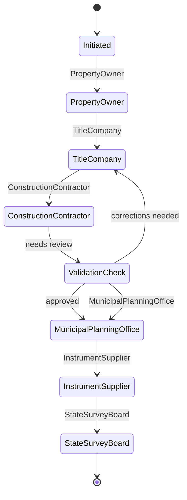
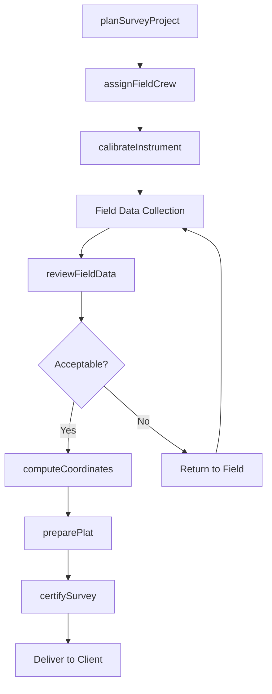
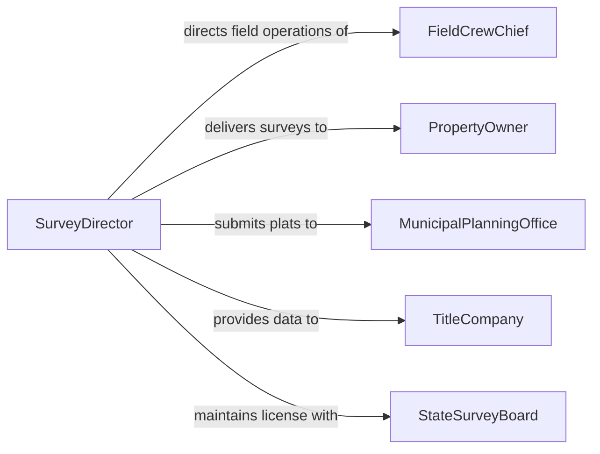

# Direct Surveying Activities

> Business-as-Code definition for directing surveying activities. Models the oversight of land surveyors, survey technicians, and field crews performing boundary surveys, topographic mapping, construction staking, and geodetic control work.

## Overview

Directing surveying activities involves planning and overseeing field surveys, coordinate computations, boundary determinations, topographic mapping, and construction layout performed by licensed surveyors, survey technicians, and field crews. This definition covers survey project planning, crew assignment, field data collection oversight, quality review of measurements, plat preparation, and compliance with state surveying laws and professional standards.

## Actors

| Actor | Description |
|-------|-------------|
| PropertyOwner | Individual or entity commissioning a boundary or site survey |
| TitleCompany | Organization requiring survey data for property transactions |
| ConstructionContractor | Builder relying on survey staking for construction layout |
| MunicipalPlanningOffice | Local government reviewing subdivision plats and site plans |
| InstrumentSupplier | Vendor providing survey instruments, GNSS receivers, and software |
| StateSurveyBoard | Licensing authority for professional land surveyors |

## Roles

| Role | Description |
|------|-------------|
| SurveyDirector | Senior licensed surveyor overseeing all survey operations |
| ProjectSurveyor | Licensed professional surveyor managing specific survey projects |
| SurveyTechnician | Technical staff performing computations and drafting |
| FieldCrewChief | Leads the field crew in data collection and instrument operation |

## Entities

| Entity | Description |
|--------|-------------|
| SurveyProject | A contracted scope of survey work with deliverables and deadlines |
| FieldObservation | Raw measurement data collected in the field |
| ControlPoint | A precisely established geodetic reference point |
| BoundaryPlat | Legal drawing depicting property lines and monuments |
| TopographicMap | Map showing terrain features, elevations, and improvements |
| InstrumentCalibration | Record of survey instrument calibration and accuracy verification |

## Actions

| Action | Description |
|--------|-------------|
| planSurveyProject | Define scope, methodology, and crew assignments for a survey |
| assignFieldCrew | Allocate surveying personnel and equipment to field work |
| reviewFieldData | Evaluate raw observations for accuracy and completeness |
| computeCoordinates | Process field measurements into final coordinate values |
| preparePlat | Draft and certify a boundary plat or topographic map |
| certifySurvey | Apply professional seal and signature to survey documents |
| calibrateInstrument | Verify and document accuracy of survey instruments |

## Events

| Event | Description |
|-------|-------------|
| surveyProjectPlanned | A survey project scope and methodology have been defined |
| fieldCrewAssigned | Personnel and instruments have been allocated to fieldwork |
| fieldDataCollected | Raw field observations have been gathered and submitted |
| fieldDataReviewed | Collected measurements have been checked for accuracy |
| coordinatesComputed | Final coordinate values have been calculated |
| platPrepared | A boundary plat or map has been drafted for review |
| surveyCertified | Survey documents have been sealed by a licensed surveyor |

## Searches

| Search | Description |
|--------|-------------|
| findActiveSurveys | List survey projects by status, client, or geographic area |
| getControlPoints | Retrieve established control points by project or location |
| findPendingReviews | Identify field data sets awaiting quality review |
| getInstrumentCalibrationStatus | Check calibration currency for survey instruments |


## Entity Relationships



## State Diagram



## Workflow



## Actor Relationships



## Usage

### Calling Actions

```typescript
import { directSurveyingActivities } from '@headlessly/direct-surveying-activities'

const surveying = directSurveyingActivities()

// Plan a survey project
const project = await surveying.planSurveyProject({
  client: 'Greenfield Development LLC',
  type: 'boundary-and-topographic',
  parcelId: 'APN-1234-567-890',
  methodology: 'GNSS-RTK-with-total-station',
  deliverables: ['boundary-plat', 'topographic-map', 'digital-terrain-model']
})

// Assign field crew
await surveying.assignFieldCrew({
  projectId: project.id,
  crewChief: 'FC-011',
  technicians: ['ST-022', 'ST-029'],
  instruments: ['GNSS-RX-04', 'TS-ROBO-07'],
  fieldDate: '2026-03-20'
})

// Review field data
const review = await surveying.reviewFieldData({
  projectId: project.id,
  dataSet: 'FD-2026-0320',
  checks: ['closure-ratio', 'redundant-observations', 'control-ties']
})
```

### Event-Driven Automation

```typescript
// Notify project surveyor when field data is ready for review
surveying.fieldDataCollected(async ({ projectId, crewChief, observationCount }) => {
  await notify({
    to: 'project-surveyor',
    message: `Field data for project ${projectId} submitted: ${observationCount} observations by ${crewChief}`
  })
})

// Alert when instrument calibration is due
surveying.getInstrumentCalibrationStatus(async ({ instrumentId, daysUntilDue }) => {
  if (daysUntilDue <= 7) {
    await notify({
      to: 'survey-director',
      message: `Instrument ${instrumentId} calibration due in ${daysUntilDue} days`
    })
    await surveying.calibrateInstrument({ instrumentId })
  }
})
```
