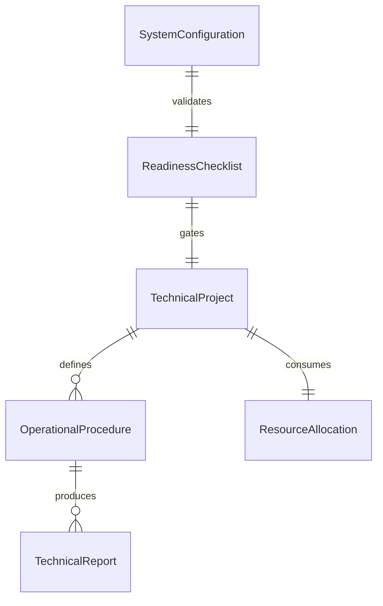
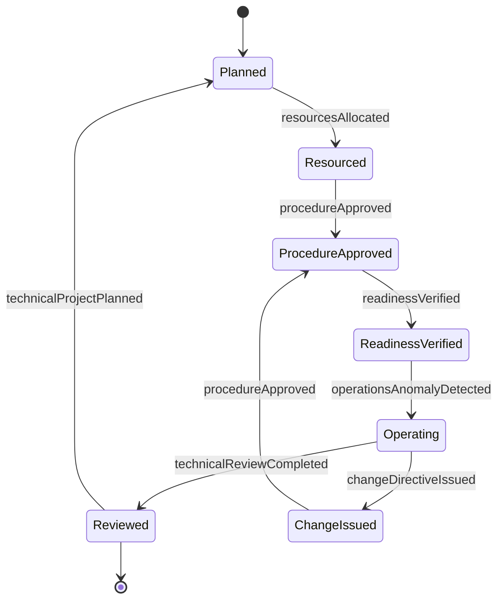
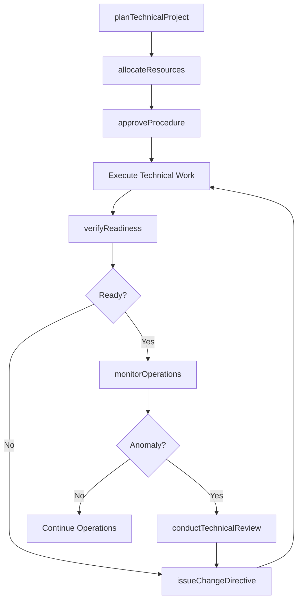
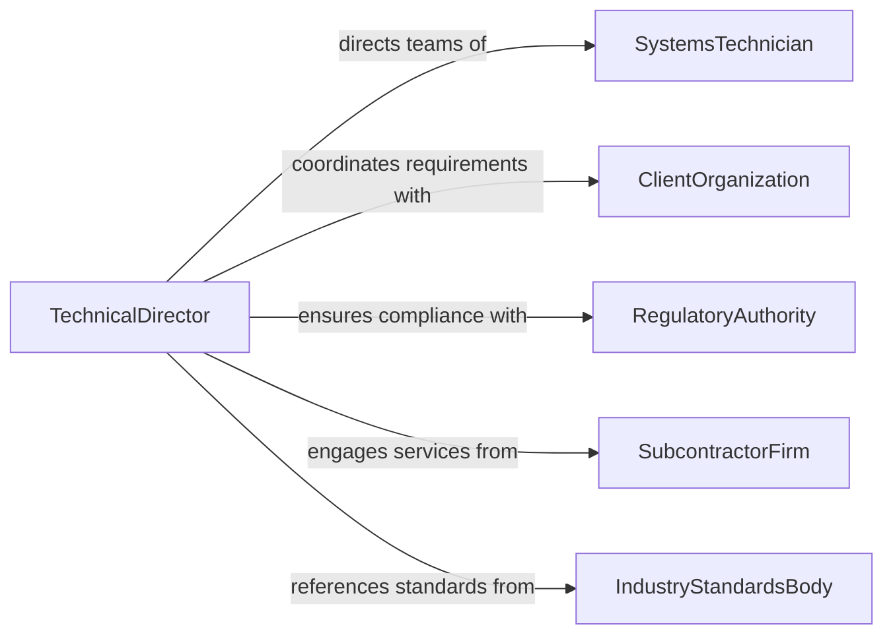

# Direct Technical Activities Operations

> Business-as-Code definition for directing technical activities and operations. Models the leadership of technical teams performing installation, configuration, testing, and operational support across complex systems and infrastructure.

## Overview

Directing technical activities and operations involves leading teams of technicians, specialists, and operators who install, configure, test, maintain, and operate complex technical systems. This definition covers technical project planning, resource allocation, procedure management, operational readiness verification, and performance monitoring to ensure technical operations meet safety, reliability, and efficiency requirements across industrial, communications, and infrastructure environments.

## Actors

| Actor | Description |
|-------|-------------|
| ClientOrganization | Entity contracting or receiving technical operation services |
| EquipmentManufacturer | OEM providing systems, components, and technical documentation |
| RegulatoryAuthority | Government agency enforcing technical standards and safety codes |
| SubcontractorFirm | External firm providing specialized technical labor |
| UtilityProvider | Energy, communications, or water utility interfacing with operations |
| IndustryStandardsBody | Organization publishing technical standards such as IEEE or ASME |

## Roles

| Role | Description |
|------|-------------|
| TechnicalDirector | Senior leader overseeing all technical activities and operations |
| OperationsLead | Day-to-day manager of technical operations and field teams |
| SystemsTechnician | Skilled worker performing installation, configuration, and testing |
| TechnicalDocumentSpecialist | Maintains procedures, manuals, and as-built documentation |

## Entities

| Entity | Description |
|--------|-------------|
| TechnicalProject | A defined scope of technical work with schedule and deliverables |
| OperationalProcedure | Step-by-step instructions for performing a technical operation |
| SystemConfiguration | Documented settings and parameters for a technical system |
| ReadinessChecklist | Verification items confirming a system is ready for operation |
| TechnicalReport | Documented findings from testing, commissioning, or operations |
| ResourceAllocation | Assignment of personnel, tools, and equipment to technical tasks |

## Actions

| Action | Description |
|--------|-------------|
| planTechnicalProject | Define scope, schedule, and resources for technical work |
| allocateResources | Assign personnel and equipment to technical tasks |
| approveProcedure | Review and authorize a technical operating procedure |
| verifyReadiness | Confirm a system meets all operational readiness criteria |
| monitorOperations | Track ongoing technical operations for performance and safety |
| conductTechnicalReview | Evaluate technical work products and operational data |
| issueChangeDirective | Authorize a modification to system configuration or procedures |

## Events

| Event | Description |
|-------|-------------|
| technicalProjectPlanned | A technical project scope and schedule have been established |
| resourcesAllocated | Personnel and equipment have been assigned to a project |
| procedureApproved | A technical procedure has been authorized for use |
| readinessVerified | A system has passed operational readiness verification |
| operationsAnomalyDetected | An unexpected condition has been identified during operations |
| technicalReviewCompleted | A review of technical work or data has been finalized |
| changeDirectiveIssued | A system modification has been formally authorized |

## Searches

| Search | Description |
|--------|-------------|
| findActiveProjects | List technical projects by status, type, or assigned team |
| getSystemConfigurations | Retrieve current configuration data for a specific system |
| findPendingReadinessChecks | Identify systems awaiting operational readiness verification |
| getOperationsLog | Look up operational events and anomalies by system or date |


## Entity Relationships



## State Diagram



## Workflow



## Actor Relationships



## Usage

### Calling Actions

```typescript
import { directTechnicalActivitiesOperations } from '@headlessly/direct-technical-activities-operations'

const techOps = directTechnicalActivitiesOperations()

// Plan a technical project
const project = await techOps.planTechnicalProject({
  name: 'Substation Control System Upgrade',
  scope: 'Replace legacy SCADA controllers with modern IEC 61850 equipment',
  startDate: '2026-04-01',
  endDate: '2026-06-30',
  teamSize: 8
})

// Allocate resources
await techOps.allocateResources({
  projectId: project.id,
  personnel: [
    { technicianId: 'ST-041', specialization: 'controls-engineering' },
    { technicianId: 'ST-055', specialization: 'network-infrastructure' }
  ],
  equipment: ['fiber-optic-toolkit', 'protocol-analyzer']
})

// Verify system readiness
const readiness = await techOps.verifyReadiness({
  systemId: 'SYS-SCADA-012',
  checklist: ['network-connectivity', 'signal-mapping', 'failover-test', 'cybersecurity-scan']
})
```

### Event-Driven Automation

```typescript
// Respond to operational anomalies
techOps.operationsAnomalyDetected(async ({ systemId, anomalyType, severity }) => {
  await notify({
    to: 'operations-lead',
    message: `Anomaly detected on ${systemId}: ${anomalyType} (severity: ${severity})`
  })
  if (severity === 'critical') {
    await techOps.conductTechnicalReview({
      systemId,
      scope: 'root-cause-analysis',
      priority: 'immediate'
    })
  }
})

// Track project milestones
techOps.readinessVerified(async ({ systemId, projectId }) => {
  await notify({
    to: 'technical-director',
    message: `System ${systemId} has passed readiness verification for project ${projectId}`
  })
})
```
