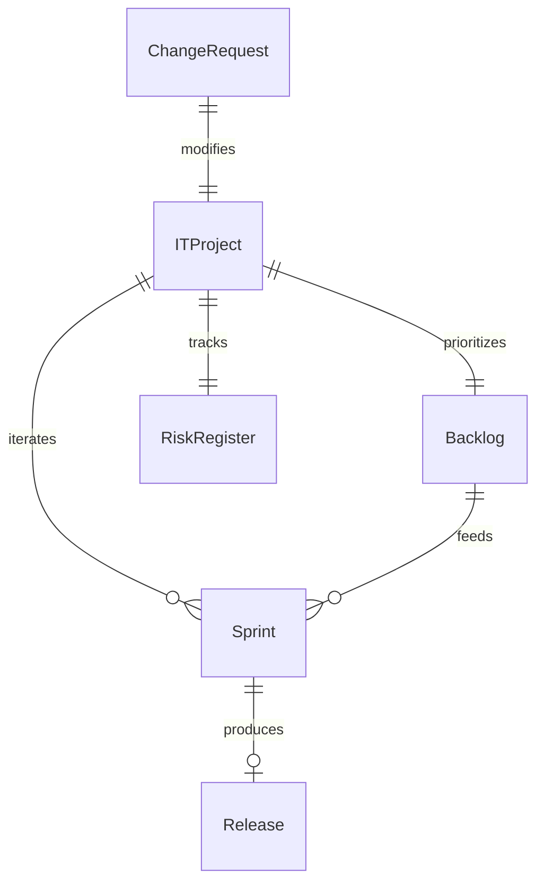
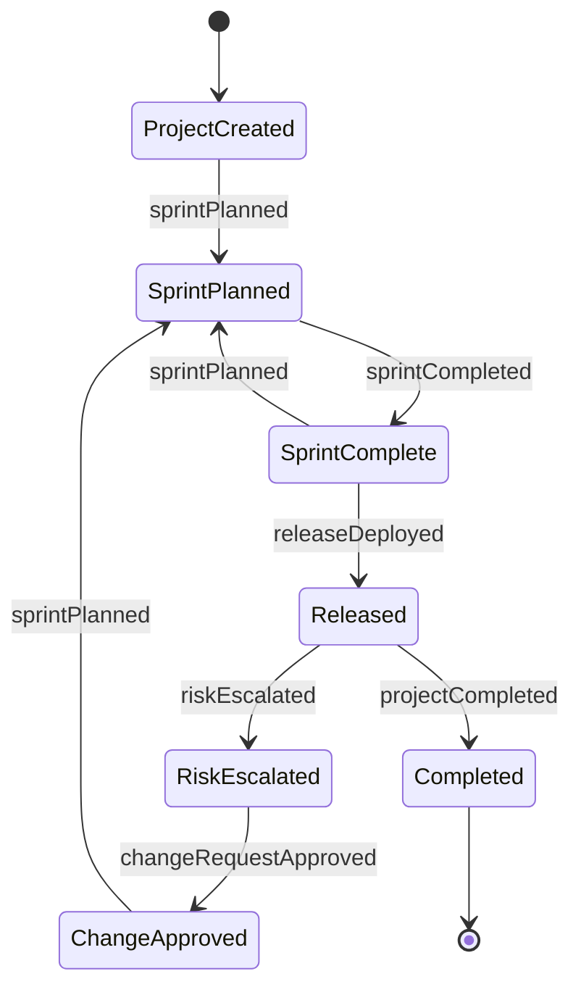
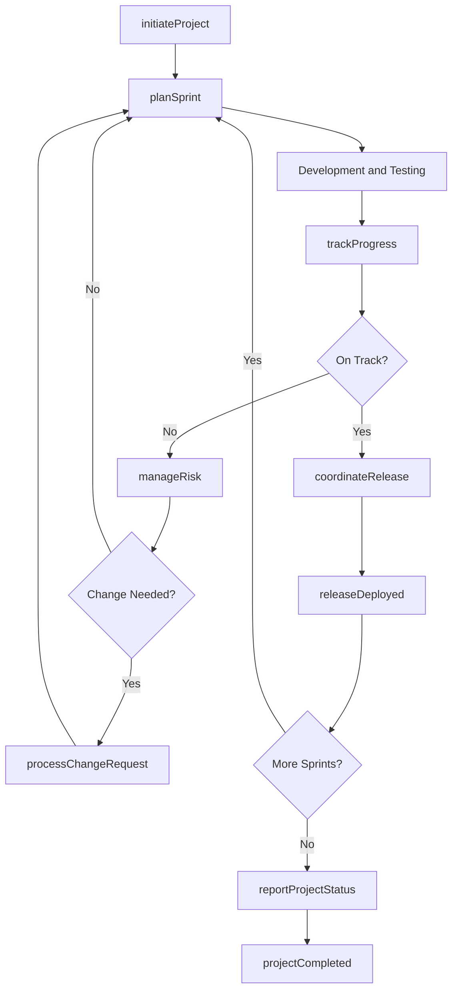
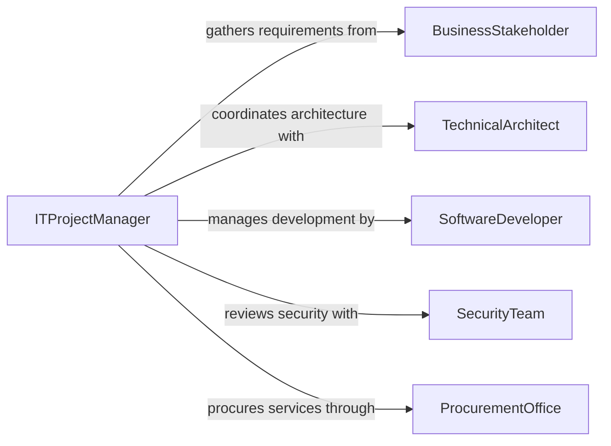

# Manage Information Technology Projects System

> Business-as-Code definition for managing IT projects and system activities. Models the governance of technology initiatives from planning through delivery, including resource management, risk tracking, release coordination, and stakeholder communication.

## Overview

Managing information technology projects and system activities involves planning, executing, and controlling technology initiatives such as software development, infrastructure deployments, system integrations, and platform migrations. This definition covers project intake, resource planning, sprint management, risk and issue tracking, release coordination, and stakeholder reporting to deliver IT solutions on time, within budget, and aligned with business objectives.

## Actors

| Actor | Description |
|-------|-------------|
| BusinessStakeholder | Internal sponsor or user defining requirements and priorities |
| SoftwareVendor | External provider of licensed software or SaaS platforms |
| CloudProvider | Infrastructure provider hosting applications and services |
| SecurityTeam | Information security group reviewing projects for compliance |
| EndUser | Employee or customer who will use the delivered system |
| ProcurementOffice | Department handling vendor contracts and purchasing |

## Roles

| Role | Description |
|------|-------------|
| ITProjectManager | Plans and manages IT project execution end-to-end |
| TechnicalArchitect | Designs solution architecture and guides technical decisions |
| SoftwareDeveloper | Builds, tests, and deploys application code |
| SystemAdministrator | Configures, maintains, and monitors production systems |

## Entities

| Entity | Description |
|--------|-------------|
| ITProject | A technology initiative with defined scope, budget, and timeline |
| Sprint | A time-boxed iteration of work within an agile project |
| Backlog | Prioritized list of features, stories, and tasks for a project |
| Release | A packaged deployment of software or system changes |
| RiskRegister | Log of identified project risks with likelihood and impact ratings |
| ChangeRequest | A formal request to modify project scope, schedule, or budget |

## Actions

| Action | Description |
|--------|-------------|
| initiateProject | Create a new IT project with charter, scope, and resources |
| planSprint | Define sprint goals, select backlog items, and assign work |
| trackProgress | Monitor project metrics including velocity, burn-down, and milestones |
| manageRisk | Identify, assess, and mitigate project risks |
| coordinateRelease | Plan and execute deployment of changes to production |
| processChangeRequest | Evaluate and approve or reject a scope or schedule change |
| reportProjectStatus | Generate and distribute status updates to stakeholders |

## Events

| Event | Description |
|-------|-------------|
| projectInitiated | A new IT project has been formally created and resourced |
| sprintPlanned | Sprint goals and work assignments have been finalized |
| sprintCompleted | A sprint has concluded and deliverables demonstrated |
| releaseDeployed | A software or system release has been pushed to production |
| riskEscalated | A project risk has exceeded acceptable thresholds |
| changeRequestApproved | A scope or schedule modification has been authorized |
| projectCompleted | All project deliverables have been accepted and closed |

## Searches

| Search | Description |
|--------|-------------|
| findActiveProjects | List IT projects by status, team, or business unit |
| getSprintMetrics | Retrieve velocity, burn-down, and completion data for sprints |
| findOpenRisks | Identify unresolved risks by project, severity, or owner |
| getChangeRequestHistory | Look up change requests by project, status, or date |


## Entity Relationships



## State Diagram



## Workflow



## Actor Relationships



## Usage

### Calling Actions

```typescript
import { manageInformationTechnologyProjectsSystem } from '@headlessly/manage-information-technology-projects-system'

const itProjects = manageInformationTechnologyProjectsSystem()

// Initiate a new IT project
const project = await itProjects.initiateProject({
  name: 'CRM Platform Migration',
  sponsor: 'VP-Sales',
  budget: 850000,
  startDate: '2026-04-01',
  targetDate: '2026-09-30',
  team: ['PM-012', 'ARCH-003', 'DEV-041', 'DEV-042', 'SA-008']
})

// Plan a sprint
await itProjects.planSprint({
  projectId: project.id,
  sprintNumber: 1,
  startDate: '2026-04-01',
  endDate: '2026-04-14',
  stories: [
    { id: 'US-001', title: 'User authentication module', points: 8 },
    { id: 'US-002', title: 'Contact import pipeline', points: 5 },
    { id: 'US-003', title: 'Dashboard wireframes', points: 3 }
  ]
})

// Coordinate a release
await itProjects.coordinateRelease({
  projectId: project.id,
  version: '1.0.0-beta',
  environment: 'staging',
  deploymentWindow: '2026-05-15T02:00:00Z',
  rollbackPlan: 'revert-to-previous-container-image'
})
```

### Event-Driven Automation

```typescript
// Alert stakeholders when risks escalate
itProjects.riskEscalated(async ({ projectId, riskDescription, severity }) => {
  await notify({
    to: 'project-steering-committee',
    message: `Risk escalated on project ${projectId}: ${riskDescription} (severity: ${severity})`
  })
})

// Auto-generate status report after sprint completion
itProjects.sprintCompleted(async ({ projectId, sprintNumber, velocity, completedStories }) => {
  await itProjects.reportProjectStatus({
    projectId,
    reportType: 'sprint-summary',
    data: { sprintNumber, velocity, storiesCompleted: completedStories.length }
  })
})
```
