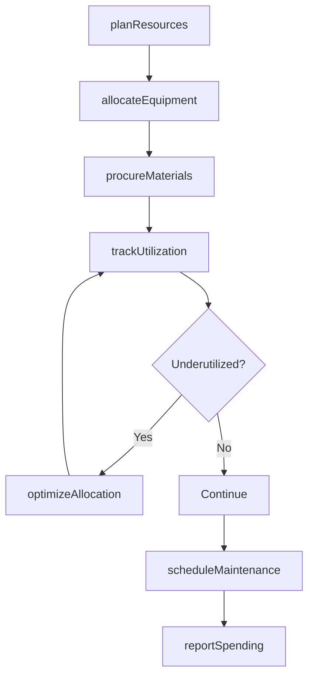
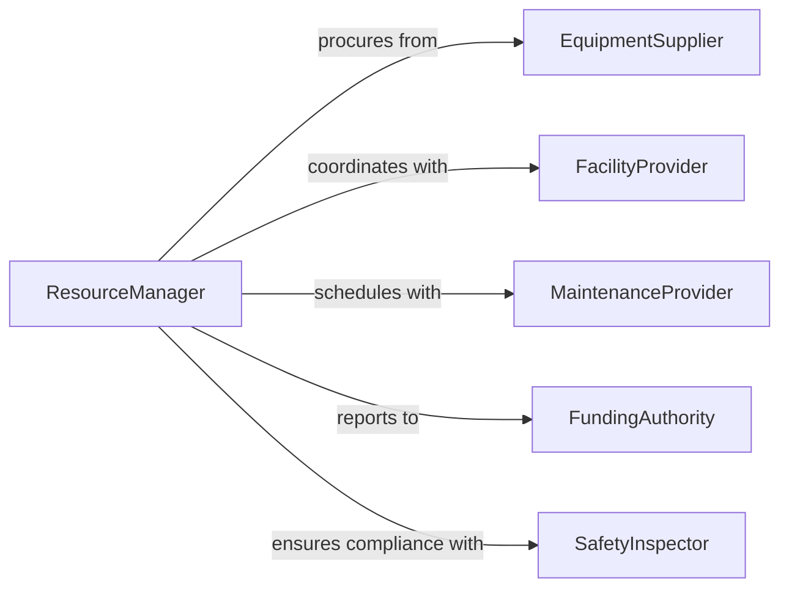

# Manage Scientific Technical Project Resources

> Business-as-Code definition for scientific and technical resource management. Models allocation, tracking, and optimization of equipment, facilities, and materials for research projects.

## Overview

Scientific and technical resource management involves planning, allocating, and monitoring the equipment, materials, facilities, and funding required for research and development projects. This definition provides actions for resource planning, inventory management, utilization tracking, and budget oversight.

## Actors

| Actor | Description |
|-------|-------------|
| EquipmentSupplier | Vendor providing scientific instruments and apparatus |
| FacilityProvider | Organization managing laboratory or research spaces |
| MaintenanceProvider | Service company maintaining specialized equipment |
| FundingAuthority | Agency or institution controlling research budgets |
| SafetyInspector | Regulatory official ensuring compliance with safety standards |
| WasteManagementService | Company handling hazardous material disposal |

## Roles

| Role | Description |
|------|-------------|
| ResourceManager | Oversees allocation and optimization of all project resources |
| ProcurementSpecialist | Acquires equipment, materials, and services |
| InventoryCoordinator | Tracks and maintains resource inventory levels |
| BudgetAnalyst | Monitors financial resource utilization |

## Entities

| Entity | Description |
|--------|-------------|
| ResourceAllocation | Assignment of resources to specific projects or teams |
| Equipment | Scientific instruments, tools, or machinery |
| Material | Consumables, reagents, or supplies for experiments |
| Facility | Laboratory space, cleanrooms, or specialized environments |
| Budget | Financial resources allocated to projects or departments |
| MaintenanceSchedule | Planned upkeep for equipment and facilities |

## Actions

| Action | Description |
|--------|-------------|
| planResources | Forecast resource needs for upcoming project phases |
| allocateEquipment | Assign instruments or tools to specific projects or researchers |
| procureMaterials | Purchase consumables and supplies based on requirements |
| scheduleMaintenance | Plan preventive maintenance for equipment |
| trackUtilization | Monitor how resources are being used across projects |
| optimizeAllocation | Reallocate underutilized resources to maximize efficiency |
| reportSpending | Generate financial reports on resource consumption |

## Events

| Event | Description |
|-------|-------------|
| resourcesPlanned | Resource forecast completed for project phase |
| equipmentAllocated | Instruments assigned to researchers or teams |
| materialsProcured | Consumables ordered and received |
| maintenanceScheduled | Equipment maintenance has been planned |
| utilizationTracked | Resource usage data captured and analyzed |
| allocationOptimized | Resources reallocated for improved efficiency |
| spendingReported | Financial resource report generated |

## Searches

| Search | Description |
|--------|-------------|
| findAllocations | List resource assignments by project, team, or date |
| getEquipment | Retrieve available or allocated equipment by type |
| getMaterials | Find inventory levels for consumables or reagents |
| getUtilization | Retrieve usage statistics for resources |

## Workflow



## Actor Relationships



## Usage

### Calling Actions

```typescript
import { manageScientificTechnicalProjectResources } from '@headlessly/manage-scientific-technical-project-resources'

const resources = manageScientificTechnicalProjectResources()

// Plan resources for a new project phase
const plan = await resources.planResources({
  projectId: 'PROJ-2026-001',
  phase: 'Pilot Study',
  requirements: {
    equipment: ['Mass Spectrometer', 'Centrifuge'],
    materials: ['Reagent Kit A', 'Culture Media'],
    facility: 'BSL-2 Lab',
    budget: 150000
  }
})

// Allocate specific equipment to a research team
await resources.allocateEquipment({
  projectId: 'PROJ-2026-001',
  equipmentId: 'MS-2023-05',
  assignedTo: 'Dr. Chen Lab',
  startDate: '2026-03-01',
  endDate: '2026-06-30'
})

// Track resource utilization
const utilization = await resources.trackUtilization({
  projectId: 'PROJ-2026-001',
  period: 'Q1-2026'
})
```

### Event-Driven Automation

```typescript
// Alert when equipment utilization is low
resources.utilizationTracked(async ({ equipmentId, utilizationRate }) => {
  if (utilizationRate < 0.4) {
    await resources.optimizeAllocation({ equipmentId })
  }
})

// Automatically schedule maintenance when equipment hours threshold reached
resources.equipmentAllocated(async ({ equipmentId, hoursUsed }) => {
  if (hoursUsed >= 1000) {
    await resources.scheduleMaintenance({
      equipmentId,
      type: 'Preventive Maintenance'
    })
  }
})
```
