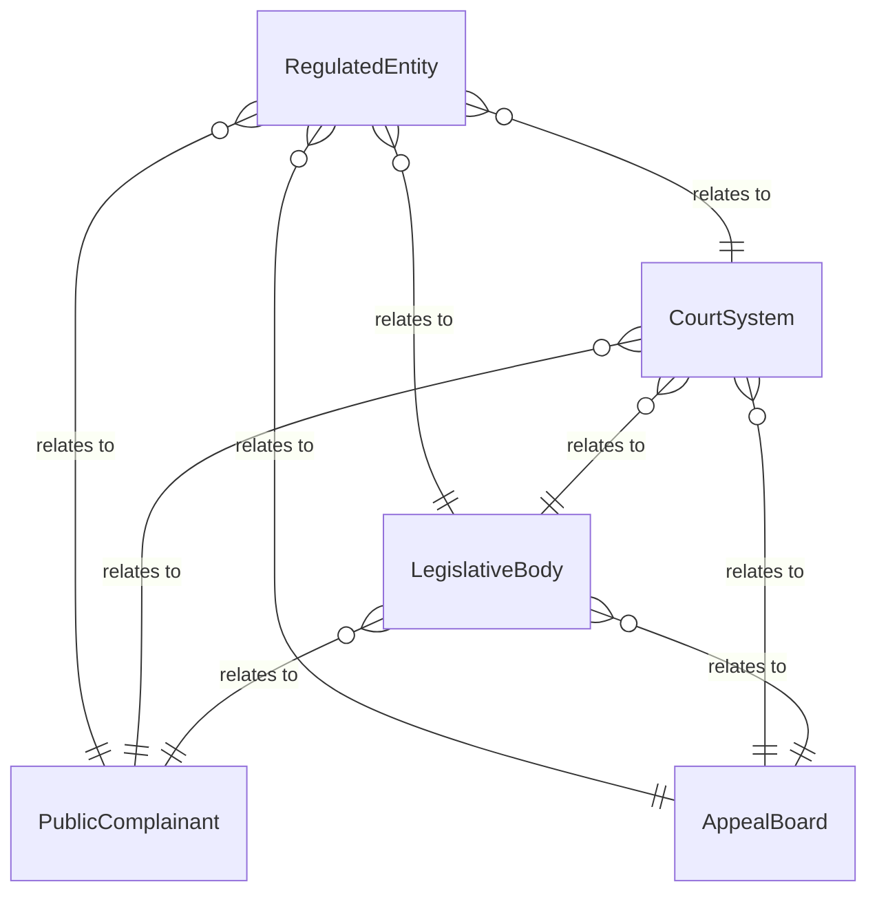
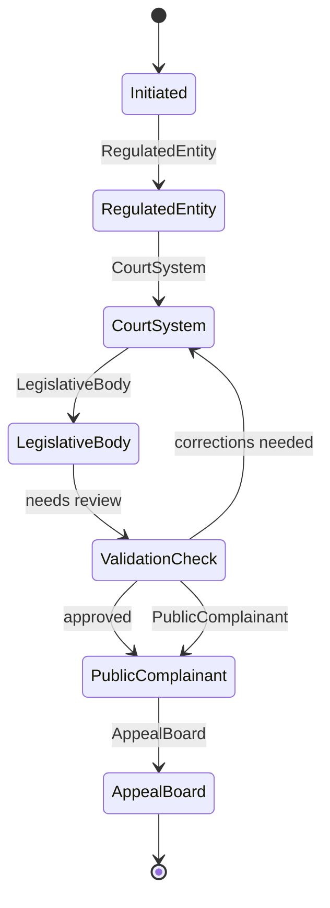
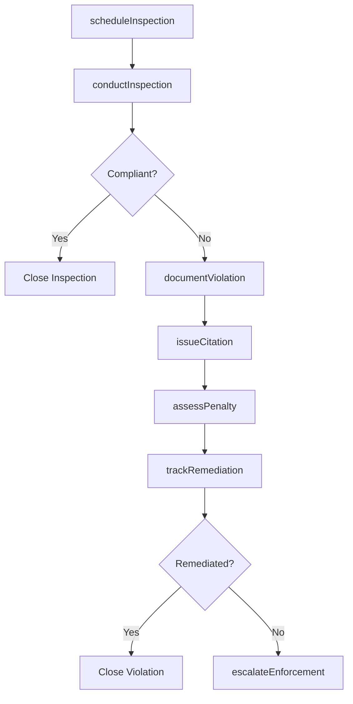
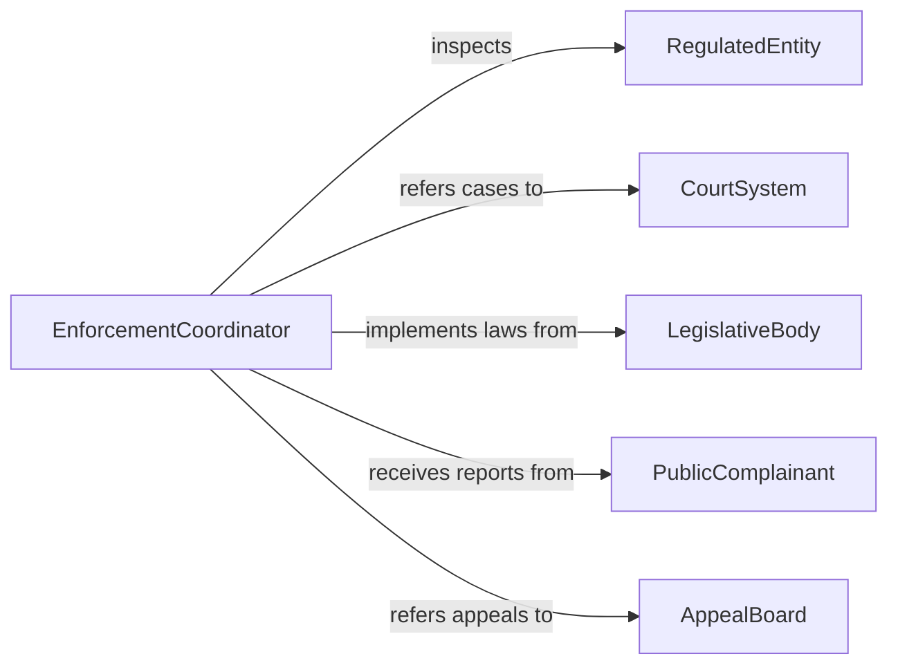

# Coordinate Enforcement Laws Regulations

> Business-as-Code definition for coordinating enforcement of laws or regulations. Models the oversight of regulatory enforcement programs including inspection scheduling, violation tracking, penalty assessment, and compliance follow-up.

## Overview

Coordinating enforcement of laws or regulations involves overseeing the systematic application of legal and regulatory requirements through inspections, audits, violation tracking, and penalty administration. This definition provides actions for scheduling enforcement activities, documenting violations, issuing citations, and tracking remediation progress. It enables automation of inspection routing, violation escalation, and compliance deadline monitoring workflows.

## Actors

| Actor | Description |
|-------|-------------|
| RegulatedEntity | Business or individual subject to enforcement of laws and regulations |
| CourtSystem | Adjudicates contested citations and enforcement actions |
| LegislativeBody | Enacts laws and regulations that enforcement programs implement |
| PublicComplainant | Individual or group reporting potential regulatory violations |
| AppealBoard | Reviews contested enforcement decisions and penalties |

## Roles

| Role | Description |
|------|-------------|
| EnforcementCoordinator | Oversees scheduling and execution of enforcement activities |
| FieldInspector | Conducts on-site evaluations for regulatory compliance |
| ViolationsAnalyst | Documents findings and determines appropriate enforcement actions |
| PenaltyAdministrator | Assesses fines and tracks penalty collection |

## Entities

| Entity | Description |
|--------|-------------|
| InspectionPlan | Scheduled enforcement activity targeting specific regulations |
| Violation | A documented instance of noncompliance with a law or regulation |
| Citation | A formal notice of violation with required corrective actions |
| Penalty | A monetary fine or sanction imposed for regulatory noncompliance |
| RemediationPlan | A documented schedule for correcting identified violations |
| EnforcementAction | A formal proceeding against a regulated entity |
| ComplianceDeadline | A mandated date for completing corrective actions |

## Actions

| Action | Description |
|--------|-------------|
| scheduleInspection | Plan enforcement visits to regulated entities |
| conductInspection | Perform on-site evaluation of regulatory compliance |
| documentViolation | Record instances of noncompliance with applicable regulations |
| issueCitation | Formally notify a regulated entity of violations and required actions |
| assessPenalty | Determine and impose fines for regulatory noncompliance |
| trackRemediation | Monitor progress of corrective actions against deadlines |
| escalateEnforcement | Advance enforcement proceedings for unresolved violations |

## Events

| Event | Description |
|-------|-------------|
| inspectionScheduled | An enforcement visit has been planned |
| inspectionCompleted | An on-site compliance evaluation has been performed |
| violationDocumented | An instance of noncompliance has been recorded |
| citationIssued | A formal violation notice has been sent to a regulated entity |
| penaltyAssessed | A fine has been imposed for regulatory noncompliance |
| remediationDeadlinePassed | A corrective action deadline has expired without resolution |
| enforcementEscalated | Proceedings have been advanced for unresolved violations |

## Searches

| Search | Description |
|--------|-------------|
| getInspectionSchedule | Retrieve planned enforcement visits by date or district |
| findViolations | List documented noncompliance by type, entity, or severity |
| getCitationStatus | Check the status of issued violation notices |
| getPenaltyCollection | Review fine payment status by entity or period |
| getRemediationProgress | Track corrective action completion against deadlines |


## Entity Relationships



## State Diagram



## Workflow



## Actor Relationships



## Usage

### Calling Actions

```typescript
import { coordinateEnforcementLawsRegulations } from '@headlessly/coordinate-enforcement-laws-regulations'

const enforcement = coordinateEnforcementLawsRegulations()

// Schedule inspections for a district
await enforcement.scheduleInspection({
  district: 'industrial-zone-north',
  regulation: 'clean-air-act',
  inspectors: ['inspector-adams', 'inspector-chen'],
  period: '2026-Q2'
})

// Issue a citation
await enforcement.issueCitation({
  entity: 'acme-manufacturing',
  violation: 'exceeding-emissions-limits',
  regulation: 'clean-air-act-section-112',
  correctiveAction: 'Install scrubber system',
  deadline: '2026-07-01'
})

// Track remediation progress
const progress = await enforcement.getRemediationProgress({
  entity: 'acme-manufacturing',
  status: 'in-progress'
})
```

### Event-Driven Automation

```typescript
// Auto-escalate missed remediation deadlines
enforcement.remediationDeadlinePassed(async ({ entity, violation, deadline }) => {
  await enforcement.escalateEnforcement({
    entity,
    violation,
    reason: `Remediation deadline ${deadline} missed`,
    action: 'refer-to-legal'
  })
})

// Auto-schedule follow-up inspections
enforcement.citationIssued(async ({ entity, deadline }) => {
  await enforcement.scheduleInspection({
    entity,
    type: 'follow-up',
    scheduledDate: deadline,
    reason: 'citation-compliance-verification'
  })
})
```
