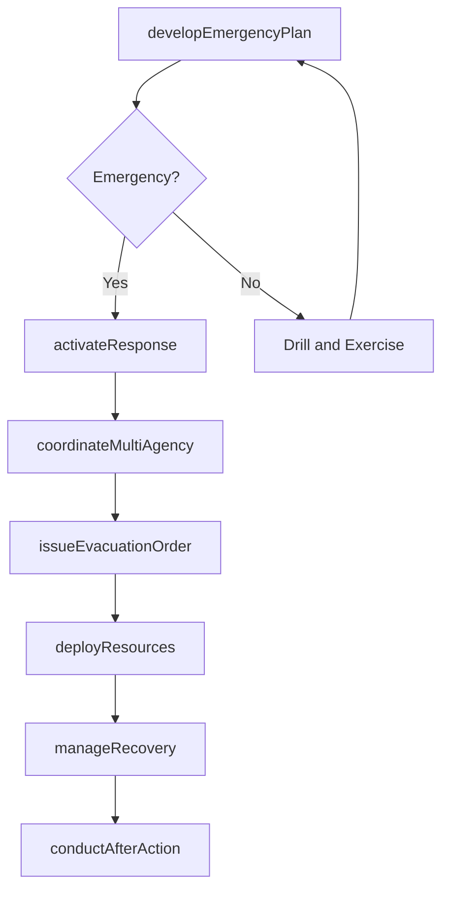
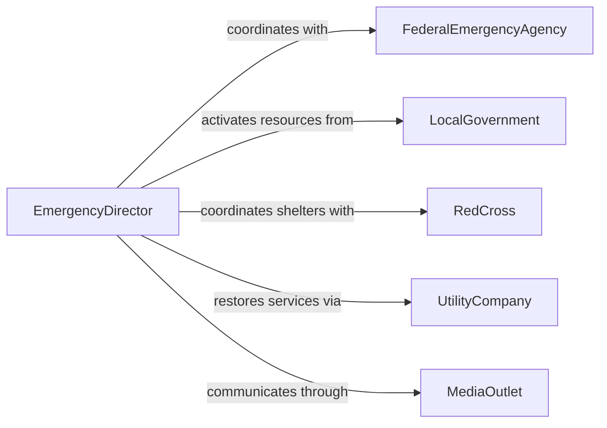

# Direct Emergency Management Activities

> Business-as-Code definition for directing emergency management activities. Models the oversight of disaster preparedness, emergency response coordination, and recovery operations across natural and man-made incidents.

## Overview

Directing emergency management activities involves overseeing the planning, coordination, and execution of responses to natural disasters, industrial accidents, public health emergencies, and other crisis events. This definition provides actions for developing emergency plans, coordinating multi-agency responses, managing evacuation procedures, and directing recovery operations. It enables automation of alert dissemination, resource deployment tracking, and after-action reporting workflows.

## Actors

| Actor | Description |
|-------|-------------|
| FederalEmergencyAgency | Provides disaster declaration, funding, and coordination support |
| LocalGovernment | Activates local emergency declarations and allocates municipal resources |
| RedCross | Provides shelter, supplies, and volunteer coordination |
| UtilityCompany | Restores power, water, and telecommunications after disruptions |
| MilitaryNationalGuard | Provides personnel and equipment for large-scale emergency response |
| MediaOutlet | Broadcasts emergency information and evacuation instructions |

## Roles

| Role | Description |
|------|-------------|
| EmergencyDirector | Oversees all emergency preparedness and response operations |
| IncidentCommander | Leads on-scene response coordination during active emergencies |
| PlanningOfficer | Develops and maintains emergency preparedness plans |
| LogisticsCoordinator | Manages resource deployment and supply distribution |
| PublicInformationOfficer | Communicates emergency status and instructions to the public |

## Entities

| Entity | Description |
|--------|-------------|
| EmergencyPlan | A documented strategy for responding to specific disaster scenarios |
| IncidentAction | A tactical directive issued during an active emergency response |
| EvacuationOrder | A directive to relocate people from a danger zone |
| ResourceDeployment | Allocation of personnel, equipment, or supplies to an incident |
| ShelterOperation | A temporary facility providing refuge for displaced individuals |
| AfterActionReport | Post-incident analysis documenting response effectiveness |
| MutualAidAgreement | Pre-arranged resource sharing pact between jurisdictions |

## Actions

| Action | Description |
|--------|-------------|
| developEmergencyPlan | Create preparedness strategies for specific disaster scenarios |
| activateResponse | Initiate emergency response protocols for an active incident |
| coordinateMultiAgency | Align response efforts across participating organizations |
| issueEvacuationOrder | Direct the relocation of people from a threatened area |
| deployResources | Allocate personnel, equipment, and supplies to an incident |
| conductAfterAction | Perform post-incident review and document lessons learned |
| manageRecovery | Oversee restoration of normal operations after an emergency |

## Events

| Event | Description |
|-------|-------------|
| emergencyPlanDeveloped | A preparedness strategy has been created or updated |
| responseActivated | Emergency response protocols have been initiated |
| multiAgencyCoordinated | Response efforts across organizations have been aligned |
| evacuationOrderIssued | A relocation directive has been communicated |
| resourcesDeployed | Personnel and equipment have been allocated to the incident |
| afterActionCompleted | Post-incident review has been documented |
| recoveryInitiated | Restoration of normal operations has begun |

## Searches

| Search | Description |
|--------|-------------|
| getEmergencyPlans | Retrieve preparedness strategies by scenario type or jurisdiction |
| getActiveIncidents | List current emergency responses by type or severity |
| getResourceDeployments | Check personnel and equipment allocations by incident |
| getEvacuationStatus | Monitor progress of active evacuation orders |
| getAfterActionReports | Retrieve post-incident analyses by event type or date |

## Workflow



## Actor Relationships



## Usage

### Calling Actions

```typescript
import { directEmergencyManagementActivities } from '@headlessly/direct-emergency-management-activities'

const emergency = directEmergencyManagementActivities()

// Activate response for a flooding event
await emergency.activateResponse({
  incident: 'river-valley-flood-2026',
  type: 'natural-disaster',
  severity: 'major',
  affectedArea: 'river-valley-district',
  estimatedPopulation: 45000
})

// Deploy resources to the incident
await emergency.deployResources({
  incident: 'river-valley-flood-2026',
  resources: [
    { type: 'swift-water-rescue-team', quantity: 3 },
    { type: 'shelter-supply-kit', quantity: 500 },
    { type: 'portable-generator', quantity: 20 }
  ]
})

// Check active incidents
const active = await emergency.getActiveIncidents({
  jurisdiction: 'county',
  severity: 'major'
})
```

### Event-Driven Automation

```typescript
// Auto-notify agencies on response activation
emergency.responseActivated(async ({ incident, severity, affectedArea }) => {
  await notify({
    to: ['federal-emergency-agency', 'red-cross', 'national-guard'],
    message: `Emergency activated: ${incident} (${severity}) in ${affectedArea}`
  })
})

// Auto-generate after-action report on recovery
emergency.recoveryInitiated(async ({ incident, duration, resourcesUsed }) => {
  await emergency.conductAfterAction({
    incident,
    responseDuration: duration,
    resourcesDeployed: resourcesUsed,
    reviewDeadline: '30-days'
  })
})
```
