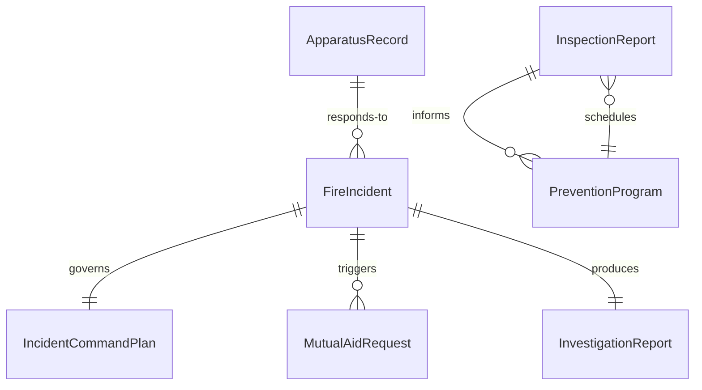
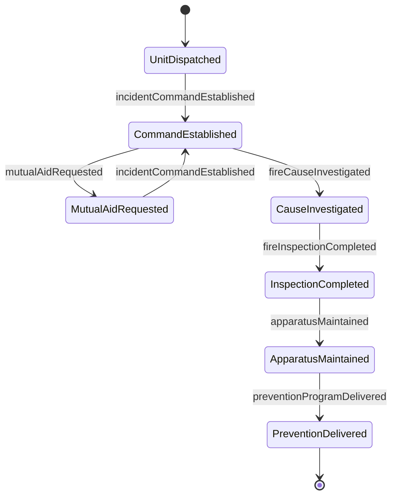
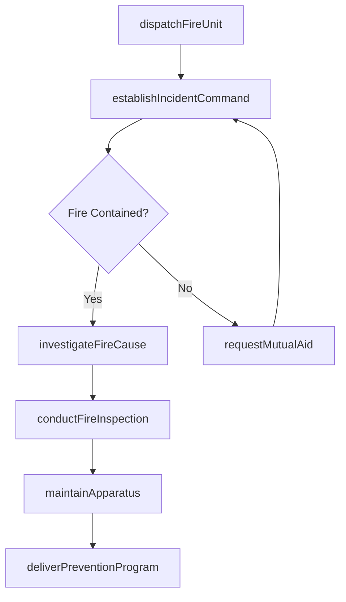
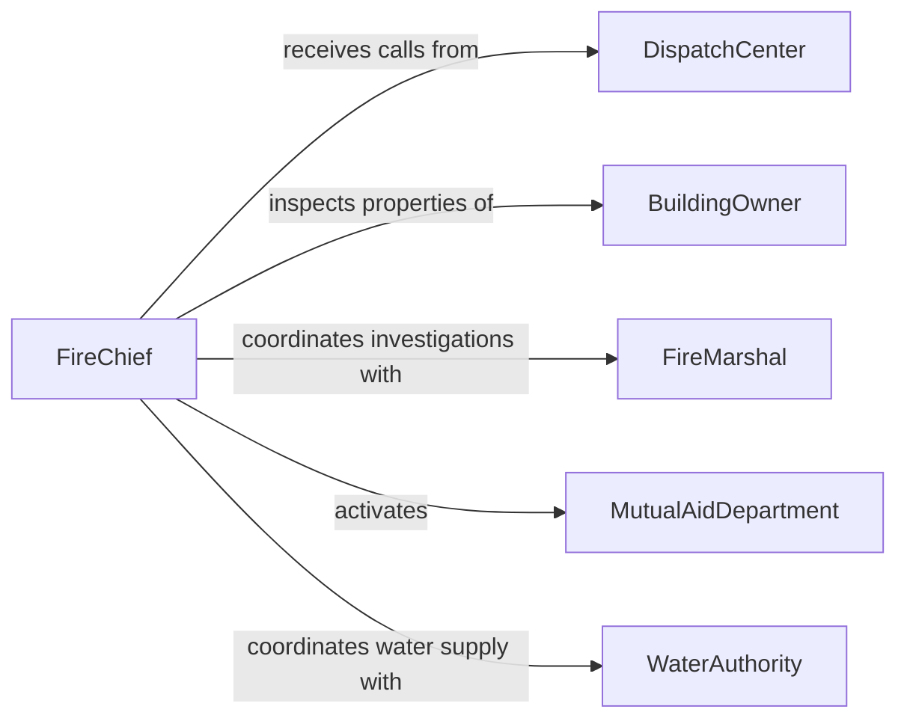

# Direct Fire Fighting Prevention Activities

> Business-as-Code definition for directing fire fighting or prevention activities. Models the oversight of fire suppression operations, fire prevention programs, building inspections, and fire department resource management.

## Overview

Directing fire fighting or prevention activities involves overseeing fire suppression operations, managing fire prevention programs, conducting building inspections, and maintaining fire department readiness. This definition provides actions for dispatching fire units, coordinating incident command, managing prevention inspections, and tracking equipment maintenance. It enables automation of dispatch coordination, inspection scheduling, and fire investigation reporting workflows.

## Actors

| Actor | Description |
|-------|-------------|
| DispatchCenter | Receives emergency calls and dispatches fire units |
| BuildingOwner | Maintains fire safety systems in commercial and residential properties |
| FireMarshal | Investigates fire causes and enforces fire safety codes |
| MutualAidDepartment | Neighboring fire department providing backup resources |
| InsuranceCarrier | Adjusts fire loss claims and sets property risk ratings |
| WaterAuthority | Provides water supply and hydrant maintenance for fire suppression |

## Roles

| Role | Description |
|------|-------------|
| FireChief | Oversees all fire fighting and prevention operations |
| BattalionChief | Manages on-scene incident command during fire responses |
| FirePreventionOfficer | Conducts building inspections and enforces fire codes |
| TrainingOfficer | Manages firefighter training programs and certification |
| ApparatusEngineer | Maintains fire engines, trucks, and suppression equipment |

## Entities

| Entity | Description |
|--------|-------------|
| FireIncident | A reported fire event requiring response and suppression |
| InspectionReport | Results of a fire safety inspection for a building or facility |
| ApparatusRecord | Maintenance and readiness status of fire fighting equipment |
| IncidentCommandPlan | Tactical strategy for managing an active fire scene |
| PreventionProgram | Community outreach and education initiative for fire safety |
| InvestigationReport | Documented findings on the cause and origin of a fire |
| MutualAidRequest | A formal request for resources from a neighboring department |

## Actions

| Action | Description |
|--------|-------------|
| dispatchFireUnit | Send fire companies and apparatus to an incident location |
| establishIncidentCommand | Set up on-scene leadership structure for fire operations |
| conductFireInspection | Perform fire safety review of a building or facility |
| investigateFireCause | Determine the origin and cause of a fire incident |
| maintainApparatus | Service and test fire fighting equipment and vehicles |
| deliverPreventionProgram | Execute community fire safety education activities |
| requestMutualAid | Activate resource sharing agreements with neighboring departments |

## Events

| Event | Description |
|-------|-------------|
| fireUnitDispatched | Fire companies have been sent to an incident |
| incidentCommandEstablished | On-scene leadership structure has been activated |
| fireInspectionCompleted | A building fire safety review has been performed |
| fireCauseInvestigated | Origin and cause of a fire have been determined |
| apparatusMaintained | Fire equipment has been serviced and tested |
| preventionProgramDelivered | Community fire safety education has been conducted |
| mutualAidRequested | Resources from a neighboring department have been activated |

## Searches

| Search | Description |
|--------|-------------|
| getActiveIncidents | List current fire responses by location or severity |
| getInspectionSchedule | Retrieve upcoming building fire safety inspections |
| getApparatusReadiness | Check equipment and vehicle operational status |
| findCodeViolations | List unresolved fire safety violations by building or type |
| getInvestigationReports | Retrieve fire cause findings by date or district |


## Entity Relationships



## State Diagram



## Workflow



## Actor Relationships



## Usage

### Calling Actions

```typescript
import { directFireFightingPreventionActivities } from '@headlessly/direct-fire-fighting-prevention-activities'

const fire = directFireFightingPreventionActivities()

// Dispatch units to a structure fire
await fire.dispatchFireUnit({
  incident: 'structure-fire-elm-street',
  location: '1234 Elm Street',
  type: 'structure-fire',
  alarmLevel: 2,
  units: ['engine-7', 'engine-12', 'ladder-3', 'battalion-chief-2']
})

// Conduct a fire inspection
const inspection = await fire.conductFireInspection({
  building: 'riverside-mall',
  inspector: 'fire-prevention-officer',
  areas: ['sprinkler-system', 'fire-exits', 'alarm-system', 'extinguishers']
})

// Check apparatus readiness
const readiness = await fire.getApparatusReadiness({
  station: 'station-7',
  equipment: ['engine', 'ladder', 'ambulance']
})
```

### Event-Driven Automation

```typescript
// Auto-request mutual aid on high-alarm fires
fire.fireUnitDispatched(async ({ incident, alarmLevel }) => {
  if (alarmLevel >= 3) {
    await fire.requestMutualAid({
      incident,
      resourcesNeeded: ['engine-company', 'ladder-company'],
      departments: ['neighboring-city-fd', 'county-fd']
    })
  }
})

// Auto-schedule follow-up inspection after violations
fire.fireInspectionCompleted(async ({ building, violations }) => {
  if (violations.length > 0) {
    await notify({
      to: 'fire-prevention-officer',
      message: `${violations.length} violations at ${building}. Follow-up inspection required within 30 days.`
    })
  }
})
```
