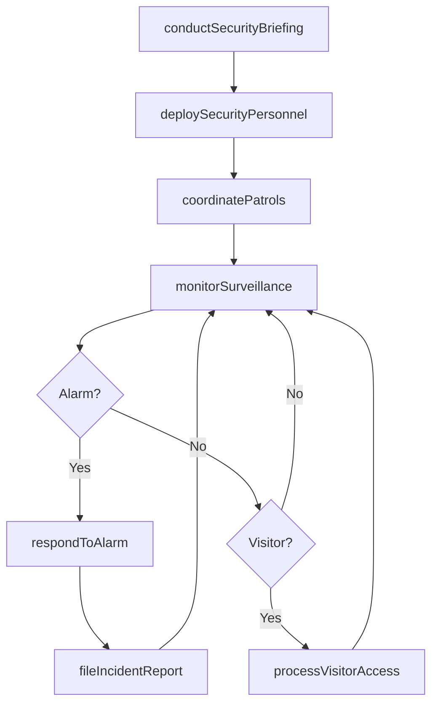
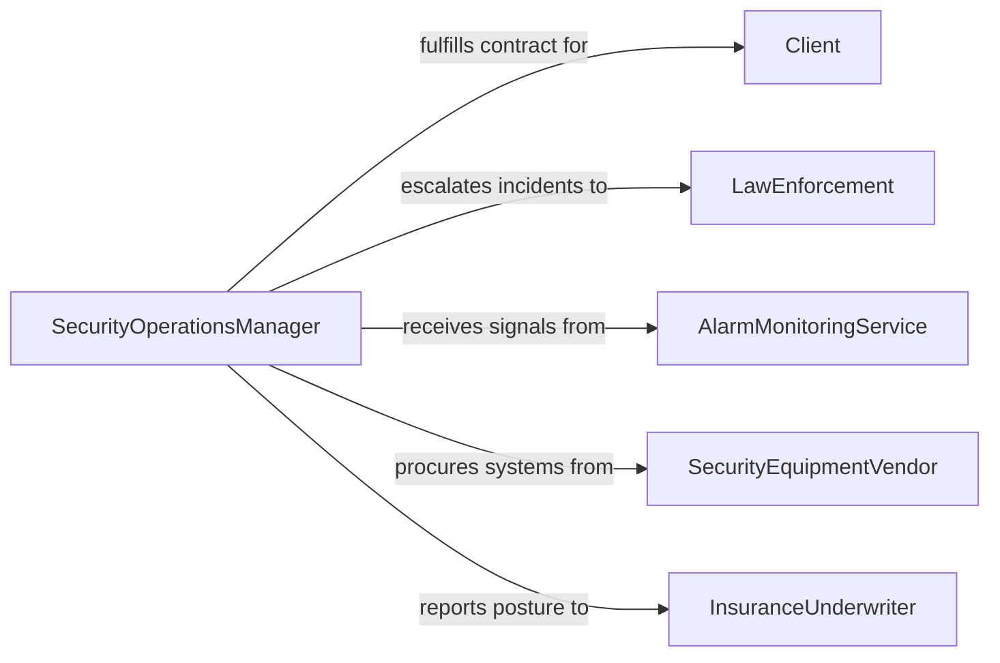

# Direct Security Operations

> Business-as-Code definition for directing security operations. Models the oversight of day-to-day protective services including guard force management, patrol coordination, surveillance monitoring, and incident response across facilities and events.

## Overview

Directing security operations involves managing the tactical execution of protective services that safeguard people, property, and assets on a daily basis. This definition provides actions for deploying security personnel, coordinating patrol routes, managing surveillance systems, processing visitor access, and directing incident responses. It enables automation of shift scheduling, patrol verification, alarm response routing, and security reporting workflows.

## Actors

| Actor | Description |
|-------|-------------|
| Client | Organization or individual contracting for security services |
| LawEnforcement | Police department responding to criminal incidents on-site |
| AlarmMonitoringService | Remote monitoring center that receives and triages alarm signals |
| SecurityEquipmentVendor | Supplier of surveillance cameras, access panels, and detection systems |
| InsuranceUnderwriter | Assesses security posture for liability and property coverage |

## Roles

| Role | Description |
|------|-------------|
| SecurityOperationsManager | Oversees all daily security activities and staffing |
| ShiftSupervisor | Leads security officers during a specific shift rotation |
| SurveillanceOperator | Monitors camera feeds and alarm systems in real time |
| PatrolOfficer | Conducts scheduled and random patrols of assigned areas |
| AccessControlSpecialist | Manages visitor processing and credentialing at entry points |

## Entities

| Entity | Description |
|--------|-------------|
| SecurityPost | A fixed or roving assignment location for security personnel |
| PatrolRoute | A defined path and checkpoint sequence for security rounds |
| IncidentReport | A documented account of a security event or observation |
| ShiftRoster | The assignment of security personnel to posts and times |
| AlarmEvent | A signal from a detection system requiring investigation |
| VisitorPass | A temporary access credential issued to non-employees |
| SecurityBriefing | A pre-shift communication of priorities and threat updates |

## Actions

| Action | Description |
|--------|-------------|
| deploySecurityPersonnel | Assign officers to posts, patrols, and special details |
| coordinatePatrols | Schedule and verify completion of security rounds |
| monitorSurveillance | Observe camera feeds and detection systems for threats |
| processVisitorAccess | Screen and credential visitors entering secured areas |
| respondToAlarm | Investigate and resolve triggered alarm events |
| conductSecurityBriefing | Communicate shift priorities and threat intelligence |
| fileIncidentReport | Document security events and corrective actions taken |

## Events

| Event | Description |
|-------|-------------|
| personnelDeployed | Security officers have been assigned to their posts |
| patrolCompleted | A security round has been verified as finished |
| alarmTriggered | A detection system has signaled a potential threat |
| alarmResolved | An alarm event has been investigated and cleared |
| visitorProcessed | A visitor has been screened and granted or denied access |
| incidentReported | A security event has been formally documented |
| briefingConducted | A pre-shift security communication has been delivered |

## Searches

| Search | Description |
|--------|-------------|
| getShiftRoster | Retrieve personnel assignments by shift, post, or date |
| getPatrolStatus | Check completion status of security rounds |
| findAlarmEvents | List alarm signals by type, location, or resolution status |
| getIncidentReports | Retrieve security event documentation by date or category |
| getVisitorLog | Review visitor access records by date, sponsor, or area |

## Workflow



## Actor Relationships



## Usage

### Calling Actions

```typescript
import { directSecurityOperations } from '@headlessly/direct-security-operations'

const security = directSecurityOperations()

// Deploy personnel for a shift
await security.deploySecurityPersonnel({
  shift: 'night-2026-04-15',
  assignments: [
    { officer: 'officer-martinez', post: 'main-lobby', hours: '22:00-06:00' },
    { officer: 'officer-patel', post: 'parking-garage', hours: '22:00-06:00' },
    { officer: 'officer-kim', post: 'roving-patrol', hours: '22:00-06:00' }
  ]
})

// Respond to an alarm event
await security.respondToAlarm({
  alarmId: 'alarm-2026-04-15-0342',
  location: 'server-room-B',
  type: 'door-forced-open',
  respondingOfficer: 'officer-kim'
})

// Check patrol completion
const patrols = await security.getPatrolStatus({
  shift: 'night-2026-04-15',
  status: 'incomplete'
})
```

### Event-Driven Automation

```typescript
// Auto-notify law enforcement on critical alarms
security.alarmTriggered(async ({ location, type, severity }) => {
  if (severity === 'critical') {
    await notify({
      to: 'law-enforcement-dispatch',
      message: `Critical alarm: ${type} at ${location}. Immediate response requested.`
    })
  }
})

// Auto-generate daily security summary
security.patrolCompleted(async ({ shift, completedRoutes, totalRoutes }) => {
  if (completedRoutes === totalRoutes) {
    await security.fileIncidentReport({
      type: 'shift-summary',
      shift,
      status: 'all-patrols-complete',
      notes: 'No incidents during patrol cycle'
    })
  }
})
```
