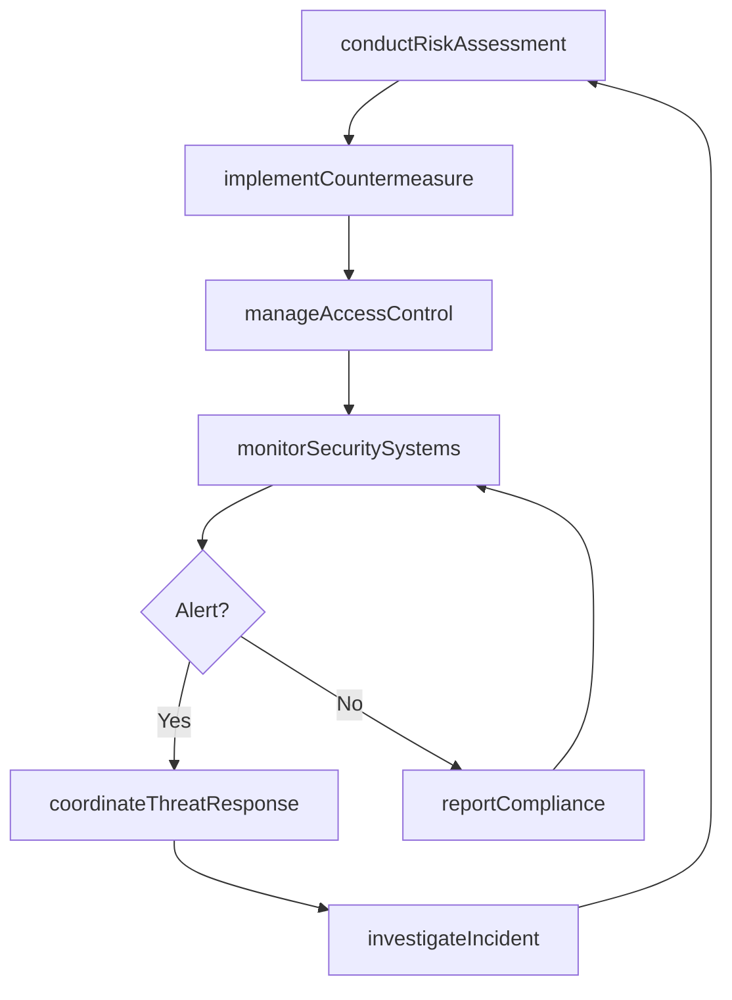
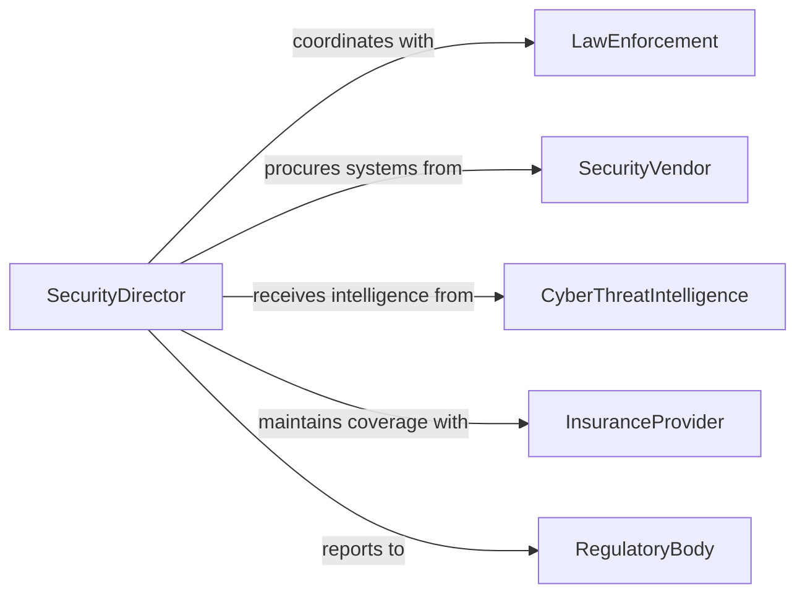

# Manage Organizational Security Activities

> Business-as-Code definition for managing organizational security activities. Models the oversight of physical security, cybersecurity, access control, and threat management programs across enterprise operations.

## Overview

Managing organizational security activities involves overseeing programs that protect people, property, information, and infrastructure from threats including unauthorized access, theft, cyber attacks, and workplace violence. This definition provides actions for conducting risk assessments, managing access control systems, monitoring security incidents, and coordinating threat response. It enables automation of access provisioning, incident alerting, and security compliance reporting workflows.

## Actors

| Actor | Description |
|-------|-------------|
| LawEnforcement | Responds to criminal incidents and provides threat intelligence |
| SecurityVendor | Provides surveillance, alarm, and access control systems |
| CyberThreatIntelligence | Supplies information on emerging digital threats |
| InsuranceProvider | Underwrites security-related liability and property coverage |
| RegulatoryBody | Enforces security standards for regulated industries |

## Roles

| Role | Description |
|------|-------------|
| SecurityDirector | Oversees all physical and cybersecurity programs |
| AccessControlManager | Manages credential issuance and physical access systems |
| CybersecurityAnalyst | Monitors digital threats and investigates security incidents |
| SecurityOfficer | Conducts patrols, monitors surveillance, and responds to incidents |
| ThreatAssessmentLead | Evaluates risks and recommends security countermeasures |

## Entities

| Entity | Description |
|--------|-------------|
| SecurityPolicy | Documented rules governing organizational security practices |
| AccessCredential | Badge, key, or digital certificate authorizing facility or system access |
| SecurityIncident | A documented breach, intrusion, or threat event |
| RiskAssessment | Evaluation of security vulnerabilities and threat likelihood |
| SurveillanceSystem | Camera, sensor, and monitoring infrastructure |
| ThreatAlert | A notification of a potential security risk requiring response |
| ComplianceReport | Documentation of adherence to security regulations and standards |

## Actions

| Action | Description |
|--------|-------------|
| conductRiskAssessment | Evaluate security vulnerabilities and threat likelihood |
| manageAccessControl | Provision, modify, and revoke access credentials |
| monitorSecuritySystems | Track surveillance feeds, alarms, and intrusion detection |
| investigateIncident | Research and document security breaches or threat events |
| implementCountermeasure | Deploy security enhancements to address identified risks |
| reportCompliance | Document adherence to security regulations and standards |
| coordinateThreatResponse | Manage the organizational response to an active security threat |

## Events

| Event | Description |
|-------|-------------|
| riskAssessmentCompleted | Security vulnerabilities have been evaluated |
| accessCredentialIssued | A new access authorization has been provisioned |
| securityAlertTriggered | A surveillance or intrusion system has detected a threat |
| incidentInvestigated | A security breach has been researched and documented |
| countermeasureImplemented | A security enhancement has been deployed |
| complianceReported | Security regulation adherence has been documented |
| threatResponseActivated | Organizational response to a security threat has been initiated |

## Searches

| Search | Description |
|--------|-------------|
| getRiskAssessments | Retrieve security evaluations by facility, date, or risk level |
| getAccessCredentials | Check active credentials by person, facility, or access level |
| findSecurityIncidents | List breaches or threat events by type, date, or severity |
| getComplianceStatus | Review security regulation adherence by standard or facility |
| getActiveAlerts | List current unresolved security alerts |

## Workflow



## Actor Relationships



## Usage

### Calling Actions

```typescript
import { manageOrganizationalSecurityActivities } from '@headlessly/manage-organizational-security-activities'

const security = manageOrganizationalSecurityActivities()

// Conduct a risk assessment
const assessment = await security.conductRiskAssessment({
  facility: 'corporate-campus',
  scope: ['physical-access', 'perimeter', 'cybersecurity', 'executive-protection'],
  assessor: 'threat-assessment-lead'
})

// Manage access control
await security.manageAccessControl({
  action: 'provision',
  person: 'new-employee-5521',
  accessLevel: 'standard-office',
  facilities: ['building-A', 'parking-garage'],
  validFrom: '2026-04-01'
})

// Check active alerts
const alerts = await security.getActiveAlerts({
  facility: 'corporate-campus',
  severity: ['high', 'critical']
})
```

### Event-Driven Automation

```typescript
// Auto-respond to security alerts
security.securityAlertTriggered(async ({ facility, alertType, severity }) => {
  if (severity === 'critical') {
    await security.coordinateThreatResponse({
      facility,
      alertType,
      notifyLawEnforcement: true
    })
  }
})

// Auto-revoke access on termination
security.accessCredentialIssued(async ({ person, status }) => {
  if (status === 'terminated') {
    await security.manageAccessControl({
      action: 'revoke',
      person,
      immediate: true
    })
  }
})
```
