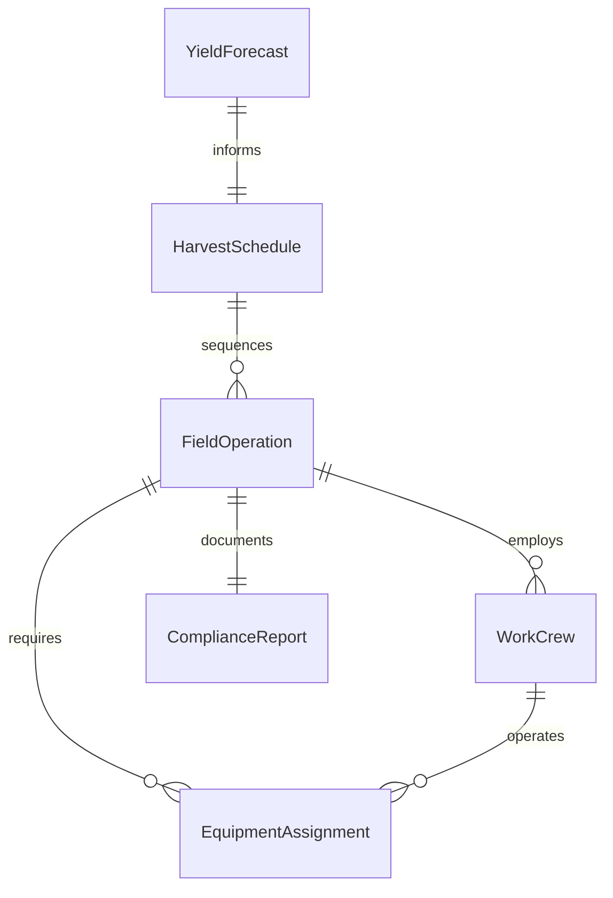
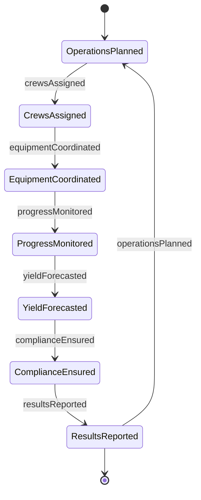
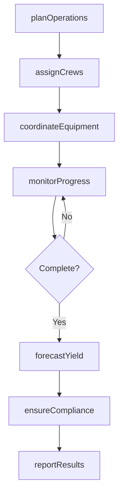
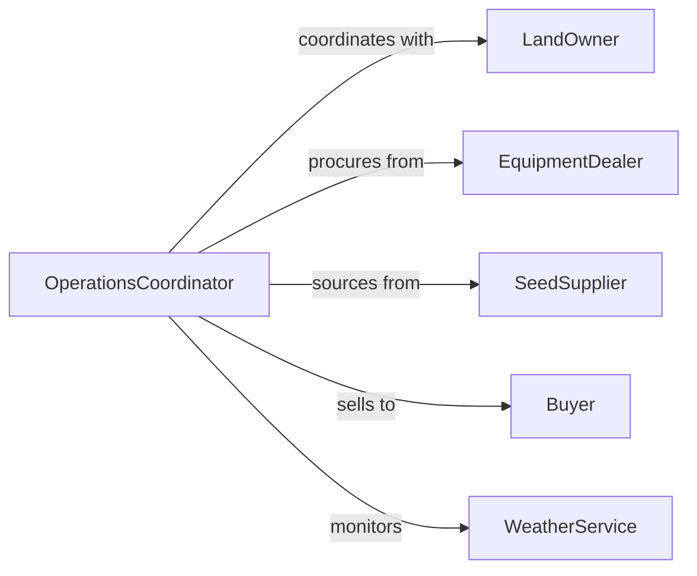

# Coordinate Forestry Agricultural Activities

> Business-as-Code definition for forestry and agricultural operations coordination. Models planning, scheduling, and synchronization of farming, harvesting, and land management activities.

## Overview

Forestry and agricultural activity coordination involves orchestrating planting, cultivation, harvesting, and land management operations across multiple sites, teams, and seasons. This definition exposes actions for operational planning, crew scheduling, equipment coordination, and compliance monitoring.

## Actors

| Actor | Description |
|-------|-------------|
| LandOwner | Individual or entity owning farmland or timberland |
| EquipmentDealer | Supplier of tractors, harvesters, and agricultural machinery |
| SeedSupplier | Vendor providing seeds, seedlings, or planting stock |
| Buyer | Purchaser of harvested crops, timber, or agricultural products |
| WeatherService | Provider of forecasts critical for planting and harvesting |
| InspectionAgency | Regulatory body ensuring agricultural compliance |

## Roles

| Role | Description |
|------|-------------|
| OperationsCoordinator | Oversees scheduling and execution of all field activities |
| CrewSupervisor | Manages day-to-day work of farm or forestry crews |
| EquipmentManager | Coordinates machinery allocation and maintenance |
| ComplianceOfficer | Ensures adherence to agricultural and environmental regulations |

## Entities

| Entity | Description |
|--------|-------------|
| FieldOperation | A specific agricultural or forestry task at a location |
| WorkCrew | Team of workers assigned to field operations |
| EquipmentAssignment | Allocation of machinery to specific operations |
| HarvestSchedule | Timeline for crop or timber harvest activities |
| ComplianceReport | Documentation of regulatory adherence |
| YieldForecast | Projected output from agricultural or forestry operations |

## Actions

| Action | Description |
|--------|-------------|
| planOperations | Schedule agricultural or forestry activities by season and location |
| assignCrews | Allocate workers to specific field operations |
| coordinateEquipment | Schedule machinery for planting, cultivation, or harvesting |
| monitorProgress | Track completion status of field operations |
| forecastYield | Estimate expected output from crops or timber |
| ensureCompliance | Verify operations meet regulatory standards |
| reportResults | Document operational outcomes and productivity |

## Events

| Event | Description |
|-------|-------------|
| operationsPlanned | Seasonal activities have been scheduled |
| crewsAssigned | Workers allocated to field operations |
| equipmentCoordinated | Machinery scheduled for operations |
| progressMonitored | Field operation status updated |
| yieldForecasted | Output projections calculated |
| complianceEnsured | Regulatory requirements verified |
| resultsReported | Operational outcomes documented |

## Searches

| Search | Description |
|--------|-------------|
| findOperations | List field operations by location, type, or status |
| getCrews | Retrieve worker assignments and availability |
| getEquipment | Find machinery by type, location, or availability |
| getForecasts | Retrieve yield projections for crops or timber |


## Entity Relationships



## State Diagram



## Workflow



## Actor Relationships



## Usage

### Calling Actions

```typescript
import { coordinateForestryAgriculturalActivities } from '@headlessly/coordinate-forestry-agricultural-activities'

const operations = coordinateForestryAgriculturalActivities()

// Plan spring planting operations
const plan = await operations.planOperations({
  season: 'Spring 2026',
  activities: [
    { type: 'Soil Preparation', location: 'North Field', acres: 120 },
    { type: 'Corn Planting', location: 'North Field', acres: 120 },
    { type: 'Tree Planting', location: 'West Woodlot', acres: 40 }
  ]
})

// Assign crews to operations
await operations.assignCrews({
  operationId: plan.activities[0].id,
  crew: {
    supervisor: 'John Martinez',
    workers: ['Worker A', 'Worker B', 'Worker C'],
    startDate: '2026-04-01'
  }
})

// Coordinate equipment for planting
await operations.coordinateEquipment({
  operationId: plan.activities[1].id,
  equipment: ['Tractor-01', 'Planter-05'],
  scheduledDate: '2026-04-15'
})
```

### Event-Driven Automation

```typescript
// Alert when weather threatens scheduled operations
operations.operationsPlanned(async ({ activities }) => {
  const forecast = await checkWeather({ location: activities[0].location })
  if (forecast.rain > 50) {
    await notify({ message: 'Postpone planting due to rain forecast' })
  }
})

// Auto-generate compliance reports after harvest
operations.resultsReported(async ({ operationId, results }) => {
  await operations.ensureCompliance({
    operationId,
    reportType: 'Harvest Documentation'
  })
})
```
