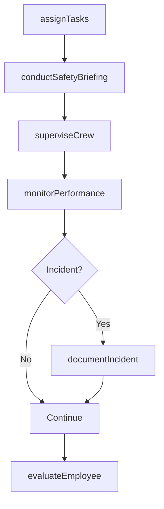
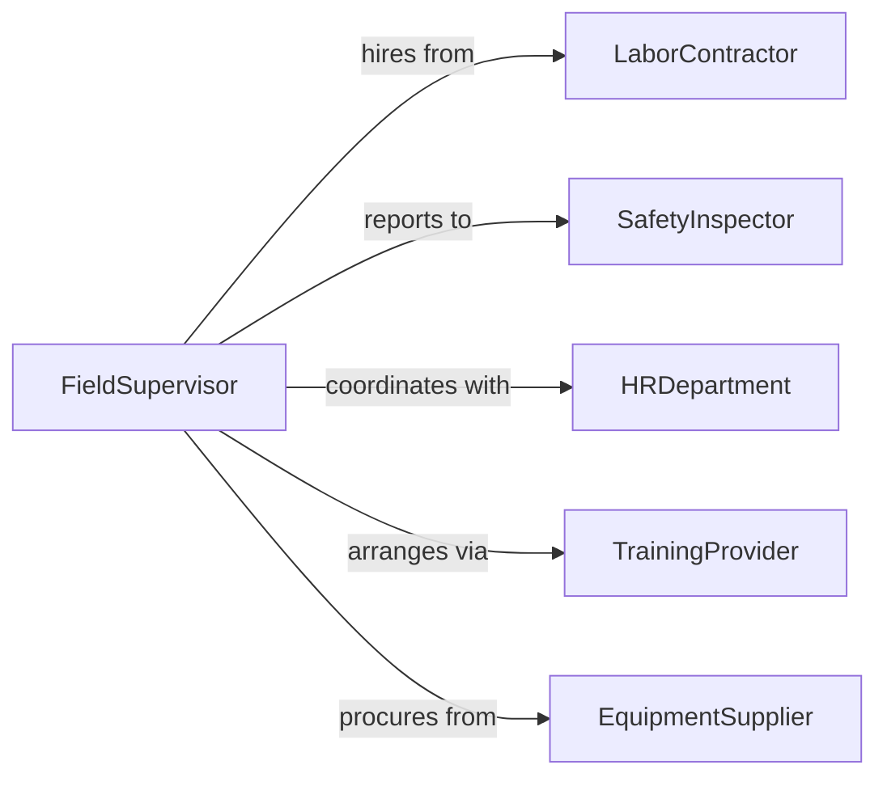

# Direct Activities Agricultural Forestry Fishery

> Business-as-Code definition for directing agricultural, forestry, and fishery workforce activities. Models supervision, task assignment, and performance management of field employees.

## Overview

Directing agricultural, forestry, and fishery employees involves supervising daily work activities, assigning tasks, ensuring safety compliance, and monitoring productivity across diverse outdoor operations. This definition provides actions for workforce planning, task delegation, safety oversight, and performance evaluation.

## Actors

| Actor | Description |
|-------|-------------|
| LaborContractor | Agency providing seasonal or temporary workers |
| SafetyInspector | Regulatory official ensuring workplace safety compliance |
| HRDepartment | Internal team managing employee records and payroll |
| TrainingProvider | Organization offering safety and skills training |
| EquipmentSupplier | Vendor providing tools and protective gear |
| HealthcareProvider | Medical services for workplace injuries |

## Roles

| Role | Description |
|------|-------------|
| FieldSupervisor | Oversees daily operations and employee performance |
| CrewLeader | Manages a specific team of field workers |
| SafetyCoordinator | Ensures compliance with safety protocols |
| TrainingManager | Coordinates worker skill development |

## Entities

| Entity | Description |
|--------|-------------|
| WorkAssignment | A specific task allocated to an employee or crew |
| Employee | Individual worker in agricultural, forestry, or fishery operations |
| SafetyIncident | Report of workplace injury or hazard |
| PerformanceReview | Evaluation of employee productivity and quality |
| TrainingRecord | Documentation of completed safety or skills training |
| WorkSchedule | Daily or weekly plan for crew activities |

## Actions

| Action | Description |
|--------|-------------|
| assignTasks | Delegate specific work to employees or crews |
| superviseCrew | Oversee daily operations and provide guidance |
| conductSafetyBriefing | Review hazards and safety protocols with workers |
| monitorPerformance | Track employee productivity and work quality |
| provideTraining | Deliver or arrange skills and safety instruction |
| documentIncident | Record and report workplace injuries or hazards |
| evaluateEmployee | Assess worker performance and provide feedback |

## Events

| Event | Description |
|-------|-------------|
| tasksAssigned | Work has been delegated to employees |
| crewSupervised | Daily operations oversight completed |
| safetyBriefingConducted | Workers instructed on safety protocols |
| performanceMonitored | Employee productivity data captured |
| trainingProvided | Skills or safety training delivered |
| incidentDocumented | Workplace injury or hazard reported |
| employeeEvaluated | Performance review completed |

## Searches

| Search | Description |
|--------|-------------|
| findAssignments | List work tasks by employee, crew, or date |
| getEmployees | Retrieve workers by skills, availability, or location |
| getIncidents | Find safety incidents by type, severity, or date |
| getPerformance | Retrieve productivity data for employees or crews |

## Workflow



## Actor Relationships



## Usage

### Calling Actions

```typescript
import { directActivitiesAgriculturalForestryFishery } from '@headlessly/direct-activities-agricultural-forestry-fishery'

const workforce = directActivitiesAgriculturalForestryFishery()

// Assign daily tasks to field crew
await workforce.assignTasks({
  date: '2026-05-15',
  crew: 'Crew-A',
  tasks: [
    { type: 'Weeding', location: 'East Field', acres: 30 },
    { type: 'Irrigation Setup', location: 'South Field', hours: 4 }
  ]
})

// Conduct safety briefing before work
await workforce.conductSafetyBriefing({
  crew: 'Crew-A',
  topics: ['Heat Safety', 'Pesticide Handling', 'Equipment Operation'],
  date: '2026-05-15'
})

// Monitor crew performance throughout the day
const performance = await workforce.monitorPerformance({
  crew: 'Crew-A',
  date: '2026-05-15'
})
```

### Event-Driven Automation

```typescript
// Alert safety coordinator immediately on incident
workforce.incidentDocumented(async ({ incident }) => {
  if (incident.severity === 'High') {
    await notify({
      to: 'safety-coordinator',
      urgency: 'immediate',
      message: `Serious incident: ${incident.description}`
    })
  }
})

// Schedule retraining when performance below threshold
workforce.employeeEvaluated(async ({ employeeId, score }) => {
  if (score < 70) {
    await workforce.provideTraining({
      employeeId,
      topics: ['Job Skills Refresher']
    })
  }
})
```
