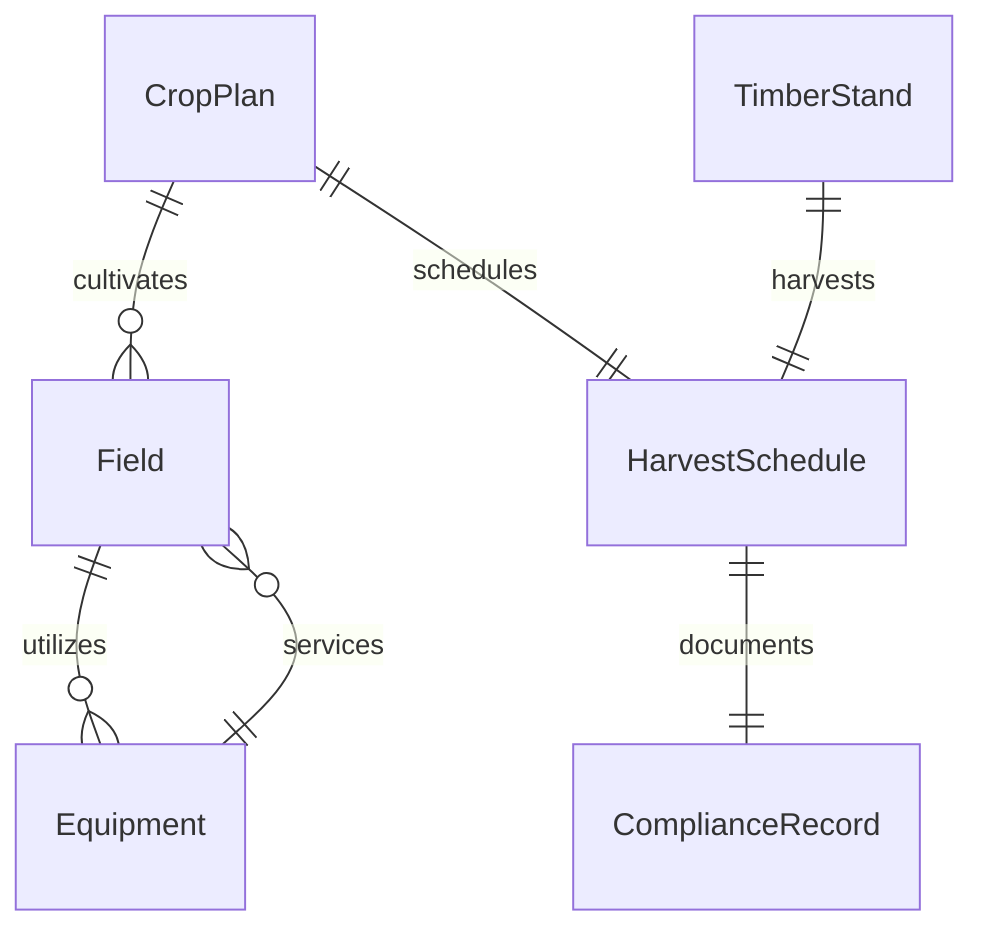
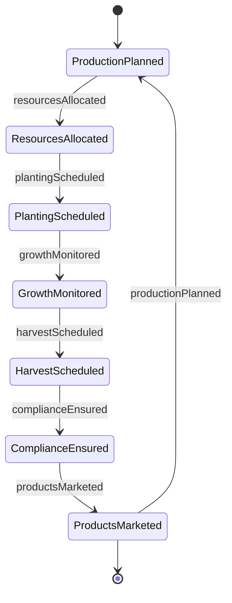
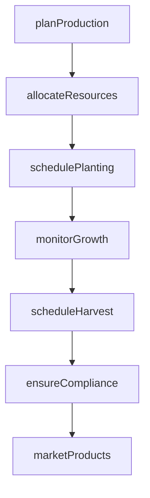
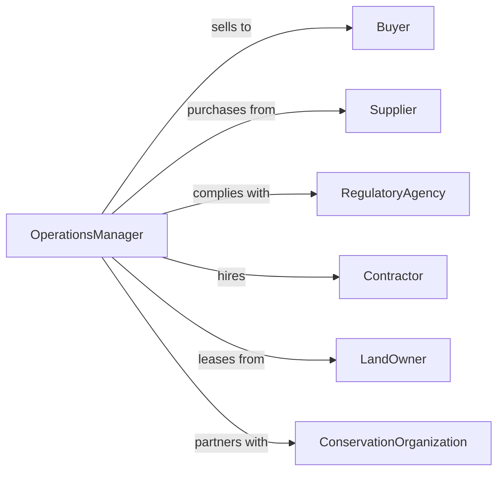

# Manage Agricultural Forestry Operations

> Business-as-Code definition for agricultural and forestry operations management. Models the oversight of crop production, livestock management, timber harvesting, and land stewardship.

## Overview

Agricultural and forestry operations management involves planning production cycles, managing labor and equipment, monitoring crop and timber health, ensuring regulatory compliance, and optimizing yields. This definition exposes actions for planting, harvesting, resource allocation, and sustainability management, along with searches for production tracking and environmental compliance.

## Actors

| Actor | Description |
|-------|-------------|
| Buyer | Wholesaler or processor purchasing crops or timber |
| Supplier | Provider of seeds, fertilizer, equipment, or livestock |
| RegulatoryAgency | Enforces environmental and agricultural standards |
| Contractor | External service for specialized operations |
| LandOwner | Individual or entity owning agricultural or forest land |
| ConservationOrganization | Promotes sustainable land management practices |

## Roles

| Role | Description |
|------|-------------|
| OperationsManager | Oversees all farm or forest activities |
| AgronomicAdvisor | Provides crop management and soil health guidance |
| ForestryTechnician | Manages timber stand health and harvesting |
| EquipmentCoordinator | Maintains and schedules machinery |
| ComplianceOfficer | Ensures adherence to environmental regulations |

## Entities

| Entity | Description |
|--------|-------------|
| Field | Agricultural land designated for crop production |
| TimberStand | Forest area managed for timber production |
| CropPlan | Seasonal plan for planting and harvesting |
| HarvestSchedule | Timeline for collecting crops or timber |
| Equipment | Tractors, harvesters, or forestry machinery |
| ComplianceRecord | Documentation of environmental and safety adherence |

## Actions

| Action | Description |
|--------|-------------|
| planProduction | Develop seasonal crop or timber management plan |
| allocateResources | Assign labor, equipment, and inputs to operations |
| schedulePlanting | Set dates and locations for seeding or seedling placement |
| monitorGrowth | Track crop or timber health and environmental conditions |
| scheduleHarvest | Plan timing and logistics for crop or timber collection |
| ensureCompliance | Verify operations meet environmental and safety standards |
| marketProducts | Arrange sale of harvested crops or timber |

## Events

| Event | Description |
|-------|-------------|
| productionPlanned | Seasonal management plan has been created |
| resourcesAllocated | Labor and equipment have been assigned |
| plantingScheduled | Seeding or planting dates have been set |
| growthMonitored | Crop or timber health assessment completed |
| harvestScheduled | Collection timeline has been established |
| complianceEnsured | Regulatory adherence has been verified |
| productsMarketed | Harvested goods have been sold or contracted |

## Searches

| Search | Description |
|--------|-------------|
| findFields | List agricultural lands by crop type or acreage |
| getTimberStands | Retrieve forest areas by species or maturity |
| getCropPlans | View production plans by season or location |
| getHarvestSchedules | Check collection timelines by crop or timber type |
| getCompliance | Find environmental and safety records by date or area |


## Entity Relationships



## State Diagram



## Workflow



## Actor Relationships



## Usage

### Calling Actions

```typescript
import { manageAgriculturalForestryOperations } from '@headlessly/manage-agricultural-forestry-operations'

const operations = manageAgriculturalForestryOperations()

// Plan corn production for spring season
const plan = await operations.planProduction({
  season: 'spring-2026',
  cropType: 'corn',
  acreage: 500,
  targetYield: 180,
  fields: ['north-40', 'east-60', 'south-100']
})

// Allocate resources
await operations.allocateResources({
  planId: plan.id,
  equipment: ['tractor-1', 'planter-2', 'combine-3'],
  labor: { workers: 12, supervisor: 'foreman-jones' },
  inputs: { seed: 5000, fertilizer: 10000, pesticide: 500 }
})

// Schedule planting
await operations.schedulePlanting({
  planId: plan.id,
  startDate: '2026-04-15',
  endDate: '2026-05-10',
  weatherWindow: 'dry-conditions-required'
})

// Monitor growth and schedule harvest
await operations.monitorGrowth({
  planId: plan.id,
  metrics: ['soilMoisture', 'plantHeight', 'pestPressure'],
  frequency: 'weekly'
})
```

### Event-Driven Automation

```typescript
// Alert when weather threatens planting schedule
operations.plantingScheduled(async ({ planId, startDate }) => {
  const forecast = await getWeatherForecast({ startDate, days: 7 })
  if (forecast.rainfall > 2) {
    await notify({
      to: 'operations-manager',
      priority: 'high',
      message: `Heavy rain forecast may delay planting for ${planId}`
    })
  }
})

// Trigger harvest when crop maturity detected
operations.growthMonitored(async ({ planId, metrics }) => {
  if (metrics.maturity >= 95) {
    await operations.scheduleHarvest({
      planId,
      window: 'next-2-weeks',
      priority: 'high'
    })
  }
})
```
