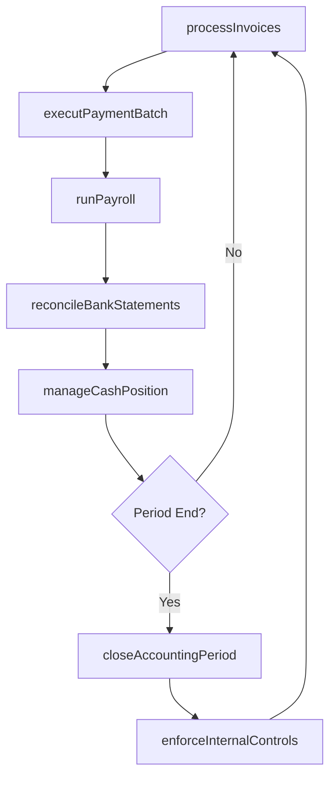
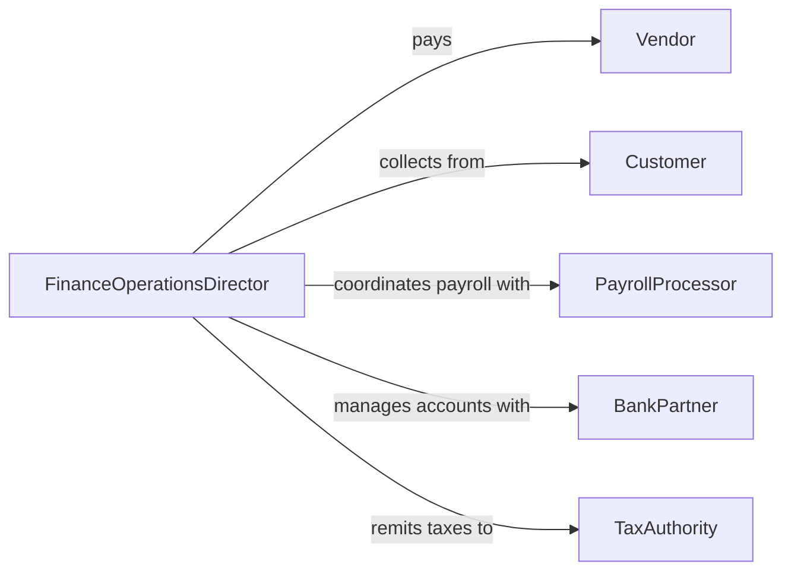

# Direct Financial Operations

> Business-as-Code definition for directing financial operations. Models the day-to-day leadership of accounting, payroll, accounts payable/receivable, and treasury functions to ensure accurate and timely financial processing.

## Overview

Directing financial operations involves the hands-on management and supervision of an organization's core financial processes including general ledger maintenance, accounts payable and receivable, payroll processing, and cash management. Operations directors establish processing workflows, enforce internal controls, manage staffing levels, and ensure that financial transactions are completed accurately and on schedule. This activity is essential for maintaining organizational liquidity, vendor relationships, and employee compensation.

## Actors

| Actor | Description |
|-------|-------------|
| Vendor | Supplier or service provider submitting invoices for payment |
| Customer | Buyer owing payment for goods or services delivered |
| PayrollProcessor | Third-party service handling payroll calculations and disbursements |
| BankPartner | Financial institution processing transactions, deposits, and wire transfers |
| TaxAuthority | Government body collecting payroll taxes, sales taxes, and withholdings |

## Roles

| Role | Description |
|------|-------------|
| FinanceOperationsDirector | Leads the financial operations team and sets processing priorities |
| AccountsPayableManager | Oversees invoice processing, payment scheduling, and vendor relations |
| AccountsReceivableManager | Manages billing, collections, and customer payment tracking |
| PayrollAdministrator | Processes employee compensation, deductions, and tax withholdings |

## Entities

| Entity | Description |
|--------|-------------|
| Invoice | A billing document from a vendor requesting payment for goods or services |
| PaymentBatch | A grouped set of outgoing payments processed together |
| PayrollRun | A scheduled processing cycle for employee compensation |
| BankReconciliation | Comparison of internal records against bank statements to verify accuracy |
| GeneralLedger | The master accounting record containing all financial transactions |
| CashPosition | Current available funds across all organizational bank accounts |

## Actions

| Action | Description |
|--------|-------------|
| processInvoices | Review, approve, and queue vendor invoices for payment |
| executPaymentBatch | Release a batch of approved payments to vendors or employees |
| runPayroll | Process employee compensation for a pay period including deductions and taxes |
| reconcileBankStatements | Match recorded transactions against bank statements to identify discrepancies |
| manageCashPosition | Monitor and optimize available cash across accounts for operational needs |
| enforceInternalControls | Apply segregation of duties and approval thresholds to financial processing |
| closeAccountingPeriod | Finalize all transactions and prepare the ledger for a new period |

## Events

| Event | Description |
|-------|-------------|
| invoicesProcessed | A batch of vendor invoices has been reviewed and approved for payment |
| paymentBatchExecuted | An outgoing payment batch has been released and confirmed |
| payrollCompleted | Employee payroll has been processed and disbursed for the period |
| bankReconciliationCompleted | Bank statement reconciliation has been finalized with all items matched |
| cashPositionUpdated | The organization's available cash summary has been refreshed |
| internalControlViolationDetected | A processing rule or approval threshold has been bypassed |
| accountingPeriodClosed | The general ledger has been finalized for the reporting period |

## Searches

| Search | Description |
|--------|-------------|
| findInvoices | Query invoices by vendor, status, amount, or due date |
| getPaymentHistory | Retrieve payment records by vendor, period, or payment method |
| getCashPosition | Check current balances and available funds across bank accounts |
| getReconciliationStatus | Review bank reconciliation progress and outstanding items |

## Workflow



## Actor Relationships



## Usage

### Calling Actions

```typescript
import { directFinancialOperations } from '@headlessly/direct-financial-operations'

const operations = directFinancialOperations()

// Process vendor invoices for the week
const processed = await operations.processInvoices({
  invoices: [
    { vendorId: 'V-2001', amount: 12500, dueDate: '2026-02-15', description: 'Office supplies Q1' },
    { vendorId: 'V-3042', amount: 87000, dueDate: '2026-02-20', description: 'IT infrastructure maintenance' }
  ],
  approver: 'finance-ops-director'
})

// Execute the approved payment batch
await operations.executPaymentBatch({
  batchId: processed.batchId,
  paymentMethod: 'ach',
  scheduledDate: '2026-02-14'
})

// Check current cash position
const cash = await operations.manageCashPosition({
  accounts: ['operating', 'payroll', 'reserve'],
  asOfDate: '2026-02-10'
})
```

### Event-Driven Automation

```typescript
// Alert on internal control violations
operations.internalControlViolationDetected(async ({ violation, transactionId }) => {
  await notify({
    to: 'compliance-team',
    message: `Internal control violation: ${violation.description} on transaction ${transactionId}`,
    severity: 'high'
  })
})

// Trigger bank reconciliation after payment batch completes
operations.paymentBatchExecuted(async ({ batchId, totalAmount }) => {
  await operations.reconcileBankStatements({
    triggerSource: batchId,
    expectedAmount: totalAmount,
    account: 'operating'
  })
})
```
