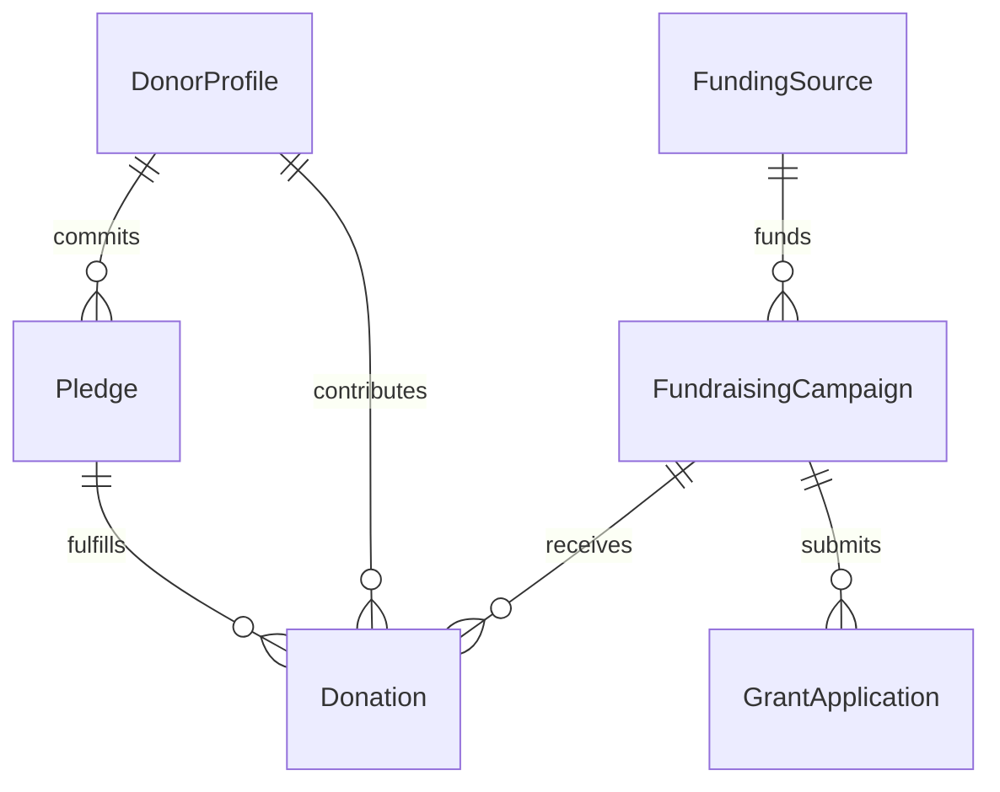
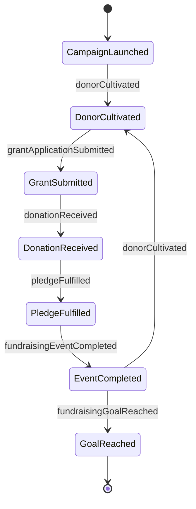
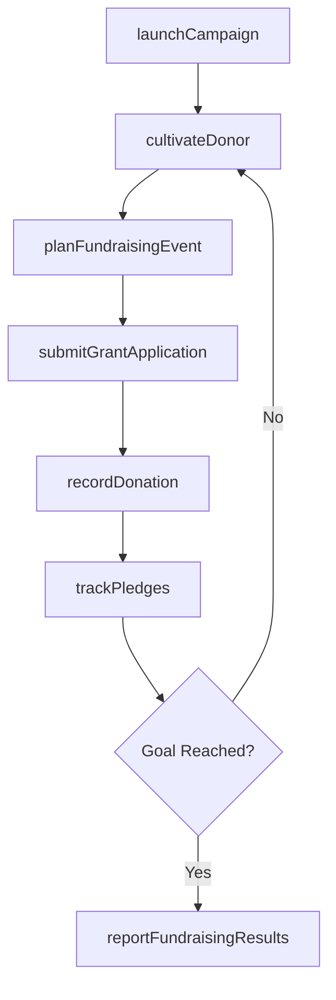
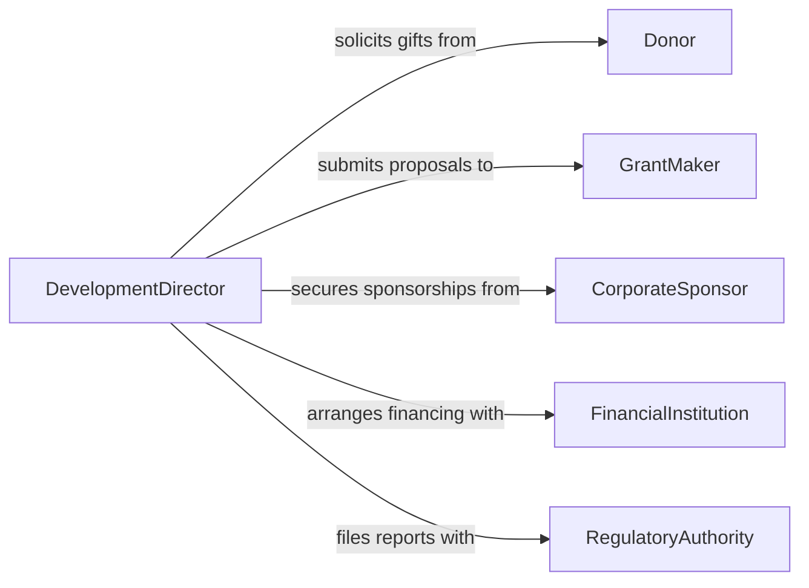

# Direct Fundraising Financing Activities

> Business-as-Code definition for directing fundraising or financing activities. Models the end-to-end process of planning campaigns, cultivating donors, securing grants, managing capital raises, and tracking contributions toward funding goals.

## Overview

Directing fundraising and financing activities involves planning, executing, and overseeing efforts to secure financial resources through donations, grants, sponsorships, capital campaigns, and debt or equity financing. Directors set fundraising targets, identify prospective donors and funding sources, coordinate campaign events, and track progress toward goals. This activity spans nonprofit development offices, political campaign finance operations, and corporate capital formation teams, requiring careful compliance with reporting regulations.

## Actors

| Actor | Description |
|-------|-------------|
| Donor | Individual or entity contributing funds through gifts, pledges, or bequests |
| GrantMaker | Foundation or government agency providing competitive grant funding |
| CorporateSponsor | Business providing financial support in exchange for visibility and association |
| FinancialInstitution | Bank or investment firm providing loans, lines of credit, or underwriting services |
| RegulatoryAuthority | Government body enforcing fundraising, securities, or campaign finance regulations |

## Roles

| Role | Description |
|------|-------------|
| DevelopmentDirector | Leads the fundraising strategy and oversees all resource mobilization efforts |
| MajorGiftsOfficer | Cultivates relationships with high-value donors and manages large contributions |
| GrantWriter | Researches and prepares competitive grant applications |
| CampaignCoordinator | Plans and executes fundraising events and annual giving campaigns |

## Entities

| Entity | Description |
|--------|-------------|
| FundraisingCampaign | A structured effort to raise a specific amount within a defined timeframe |
| Donation | A financial contribution received from a donor with associated designation |
| GrantApplication | A formal request for funding submitted to a grant-making organization |
| Pledge | A donor's commitment to contribute a specified amount over time |
| FundingSource | A categorized origin of financial resources such as individual, corporate, or government |
| DonorProfile | A record of a donor's giving history, capacity, and engagement level |

## Actions

| Action | Description |
|--------|-------------|
| launchCampaign | Initiate a new fundraising campaign with targets, timeline, and messaging |
| cultivateDonor | Develop and deepen relationships with prospective and existing donors |
| submitGrantApplication | Prepare and file a competitive grant proposal with a funding organization |
| recordDonation | Process and acknowledge a received financial contribution |
| trackPledges | Monitor outstanding pledge commitments and scheduled payment dates |
| planFundraisingEvent | Organize a gala, auction, or other event to generate donations and engagement |
| reportFundraisingResults | Compile and present campaign performance metrics to leadership |

## Events

| Event | Description |
|-------|-------------|
| campaignLaunched | A new fundraising campaign has been publicly initiated |
| donorCultivated | A donor relationship milestone has been reached through engagement activities |
| grantApplicationSubmitted | A grant proposal has been filed with a funding organization |
| donationReceived | A financial contribution has been processed and acknowledged |
| pledgeFulfilled | A donor's pledged commitment has been fully paid |
| fundraisingEventCompleted | A planned fundraising event has concluded with recorded proceeds |
| fundraisingGoalReached | The campaign has met or exceeded its stated financial target |

## Searches

| Search | Description |
|--------|-------------|
| findCampaigns | List fundraising campaigns by status, target amount, or date range |
| getDonorHistory | Retrieve a donor's giving history, pledge status, and engagement records |
| getGrantApplications | Query grant submissions by funder, status, or requested amount |
| getFundraisingProgress | Check campaign progress including total raised, pledges, and remaining gap |


## Entity Relationships



## State Diagram



## Workflow



## Actor Relationships



## Usage

### Calling Actions

```typescript
import { directFundraisingFinancingActivities } from '@headlessly/direct-fundraising-financing-activities'

const fundraising = directFundraisingFinancingActivities()

// Launch the annual capital campaign
const campaign = await fundraising.launchCampaign({
  name: '2026 Building Expansion Campaign',
  target: 5000000,
  startDate: '2026-03-01',
  endDate: '2026-12-31',
  channels: ['majorGifts', 'events', 'grants', 'onlineGiving']
})

// Record a major gift
await fundraising.recordDonation({
  campaignId: campaign.id,
  donorId: 'D-10042',
  amount: 250000,
  designation: 'building-fund',
  type: 'majorGift',
  acknowledgement: true
})

// Check campaign progress
const progress = await fundraising.reportFundraisingResults({
  campaignId: campaign.id,
  asOfDate: '2026-06-30'
})
```

### Event-Driven Automation

```typescript
// Send acknowledgement when donation is received
fundraising.donationReceived(async ({ donorId, amount, campaignId }) => {
  await sendAcknowledgement({
    to: donorId,
    amount,
    campaign: campaignId,
    taxDeductible: true
  })
})

// Celebrate when campaign goal is met
fundraising.fundraisingGoalReached(async ({ campaignId, totalRaised, target }) => {
  await notify({
    to: 'development-team',
    message: `Campaign ${campaignId} has reached its goal of $${target.toLocaleString()} with $${totalRaised.toLocaleString()} raised`
  })
})
```
