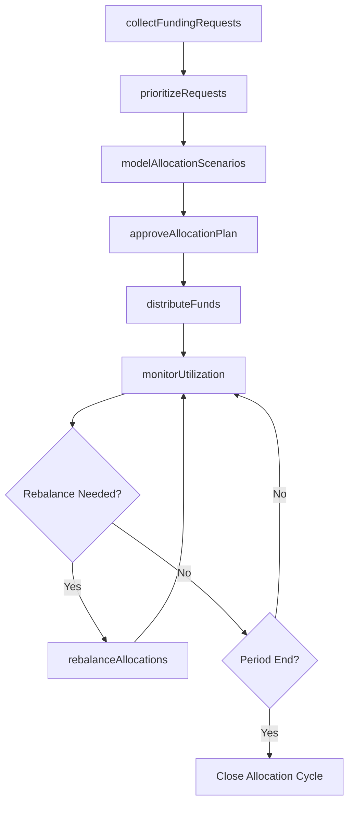
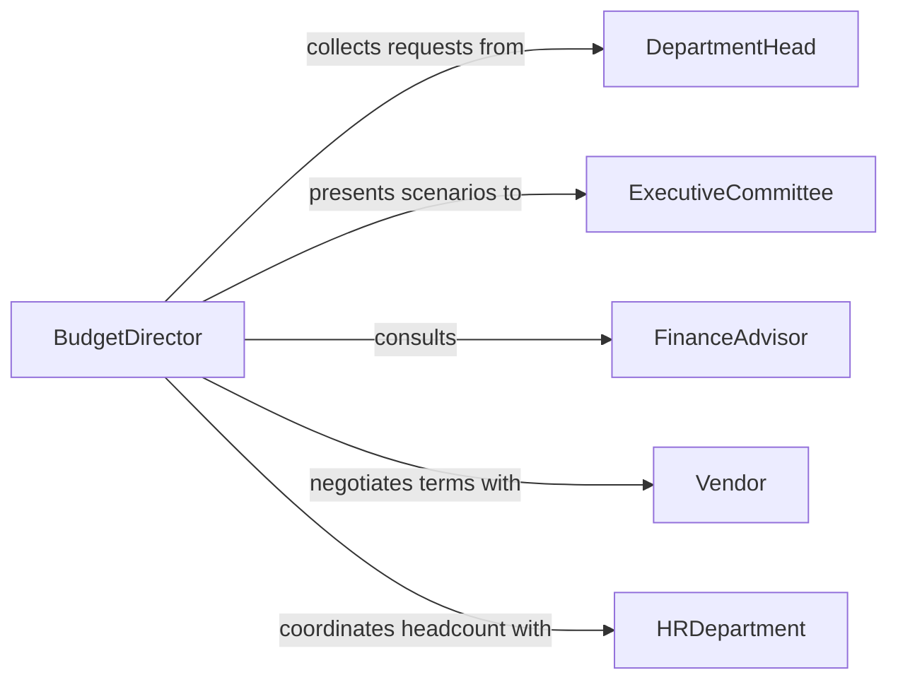

# Manage Budgets Appropriate Resource Allocation

> Business-as-Code definition for managing budgets to ensure appropriate resource allocation. Models the process of distributing financial resources across competing priorities, departments, and initiatives to maximize organizational impact.

## Overview

Managing budgets for appropriate resource allocation involves evaluating competing funding requests, assessing organizational priorities, and distributing financial resources to maximize strategic impact. Budget managers analyze departmental needs, historical spending patterns, and strategic objectives to determine optimal fund distribution. Ongoing rebalancing ensures resources shift to the highest-value activities as business conditions change throughout the fiscal period.

## Actors

| Actor | Description |
|-------|-------------|
| DepartmentHead | Leader of a business unit submitting resource requests and justifications |
| ExecutiveCommittee | Senior leadership team setting strategic priorities for resource distribution |
| FinanceAdvisor | External consultant providing guidance on financial planning best practices |
| Vendor | Supplier whose pricing and contract terms affect budget allocation decisions |
| HRDepartment | Human resources team providing headcount plans and compensation data |

## Roles

| Role | Description |
|------|-------------|
| BudgetDirector | Leads the resource allocation process and presents recommendations to leadership |
| ResourceAnalyst | Evaluates funding requests and models allocation scenarios |
| Approver | Reviews and authorizes proposed resource distributions |
| DepartmentLiaison | Represents departmental interests and communicates allocation decisions |

## Entities

| Entity | Description |
|--------|-------------|
| AllocationPlan | A detailed distribution of funds across departments, projects, and categories |
| FundingRequest | A formal submission from a department or project requesting budget resources |
| PriorityMatrix | A ranked framework for evaluating competing resource requests |
| AllocationScenario | A modeled distribution option showing trade-offs between funding choices |
| ResourcePool | A consolidated fund available for allocation across the organization |
| UtilizationReport | Analysis of how effectively allocated funds are being spent |

## Actions

| Action | Description |
|--------|-------------|
| collectFundingRequests | Gather budget requests from departments, projects, and programs |
| prioritizeRequests | Rank funding requests against strategic objectives and constraints |
| modelAllocationScenarios | Create alternative distribution plans showing trade-offs and impacts |
| approveAllocationPlan | Formally authorize the selected resource distribution |
| distributeFunds | Release allocated funds to designated departments and accounts |
| monitorUtilization | Track spending rates and effectiveness of allocated resources |
| rebalanceAllocations | Shift funds between categories based on utilization and changing priorities |

## Events

| Event | Description |
|-------|-------------|
| fundingRequestsCollected | All departmental budget requests have been received for the period |
| requestsPrioritized | Funding requests have been ranked against the priority matrix |
| allocationScenariosModeled | Alternative distribution plans have been prepared for review |
| allocationPlanApproved | The final resource distribution has been formally authorized |
| fundsDistributed | Allocated funds have been released to departmental accounts |
| utilizationReviewed | A spending effectiveness analysis has been completed |
| allocationsRebalanced | Funds have been shifted between departments or categories |

## Searches

| Search | Description |
|--------|-------------|
| findFundingRequests | List budget requests by department, amount, priority, or status |
| getAllocationPlans | Retrieve approved allocation plans by period or business unit |
| getUtilizationRates | Query spending rates and remaining balances by department or category |
| getRebalancingHistory | Review past allocation adjustments and their justifications |

## Workflow



## Actor Relationships



## Usage

### Calling Actions

```typescript
import { manageBudgetsAppropriateResourceAllocation } from '@headlessly/manage-budgets-appropriate-resource-allocation'

const allocations = manageBudgetsAppropriateResourceAllocation()

// Collect all department funding requests
const requests = await allocations.collectFundingRequests({
  fiscalYear: 2026,
  deadline: '2025-11-30',
  departments: ['Engineering', 'Marketing', 'Operations', 'Sales', 'HR']
})

// Model alternative allocation scenarios
const scenarios = await allocations.modelAllocationScenarios({
  totalPool: 12000000,
  requests: requests.items,
  strategies: ['balanced', 'growth-focused', 'cost-containment']
})

// Monitor utilization mid-year
const utilization = await allocations.monitorUtilization({
  period: 'H1-2026',
  departments: ['Engineering', 'Marketing'],
  threshold: { underUtilized: 0.6, overUtilized: 0.95 }
})
```

### Event-Driven Automation

```typescript
// Notify departments when funds are released
allocations.fundsDistributed(async ({ department, amount, accountId }) => {
  await notify({
    to: `${department.toLowerCase()}-leadership`,
    message: `$${amount.toLocaleString()} has been allocated to your department for the current period`
  })
})

// Auto-flag under-utilized allocations for rebalancing
allocations.utilizationReviewed(async ({ department, utilizationRate }) => {
  if (utilizationRate < 0.5) {
    await notify({
      to: 'budget-director',
      message: `${department} has utilized only ${(utilizationRate * 100).toFixed(0)}% of allocated funds - consider rebalancing`
    })
  }
})
```
