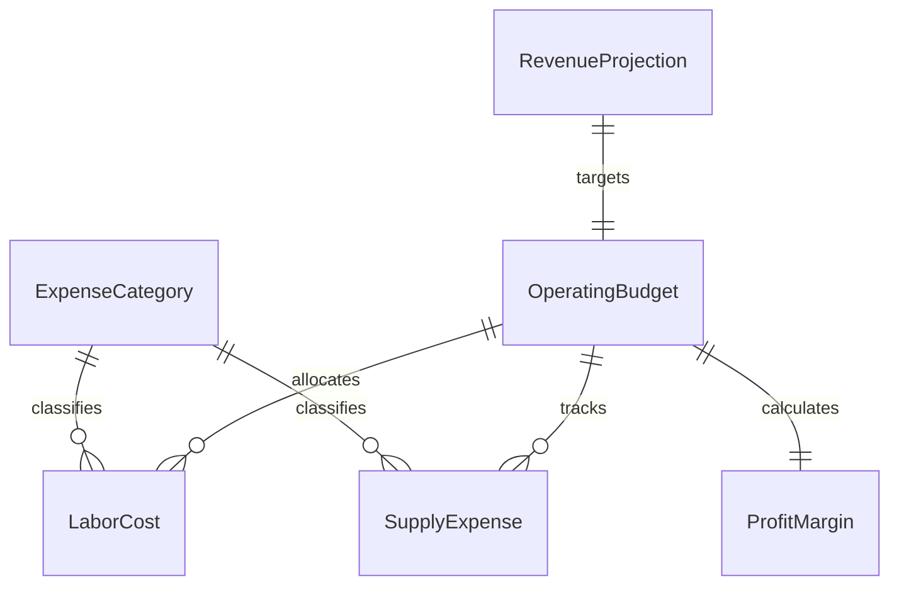
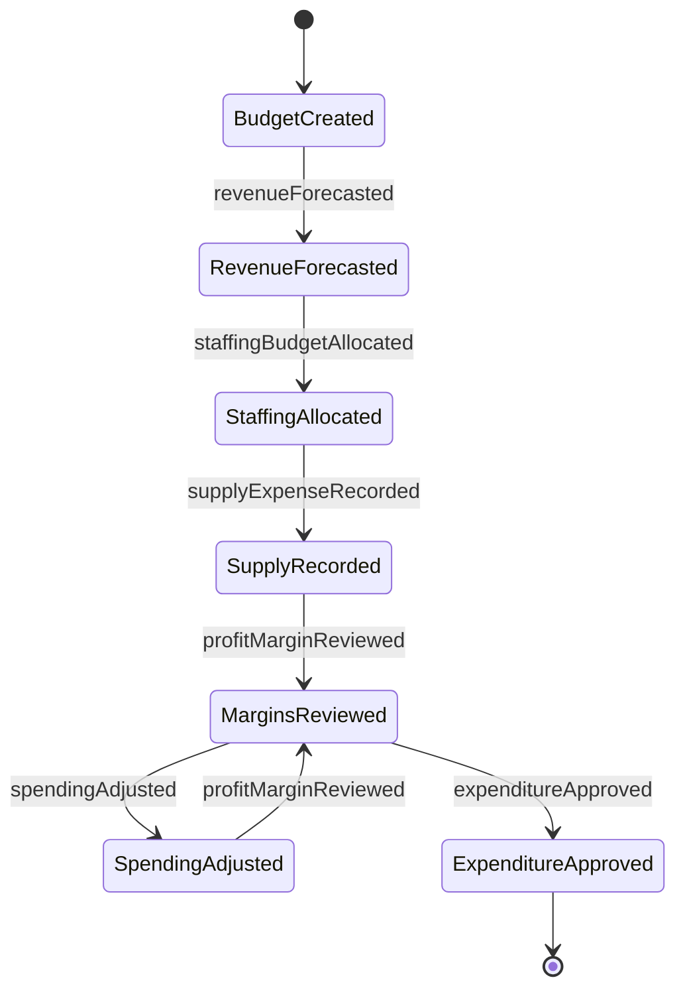
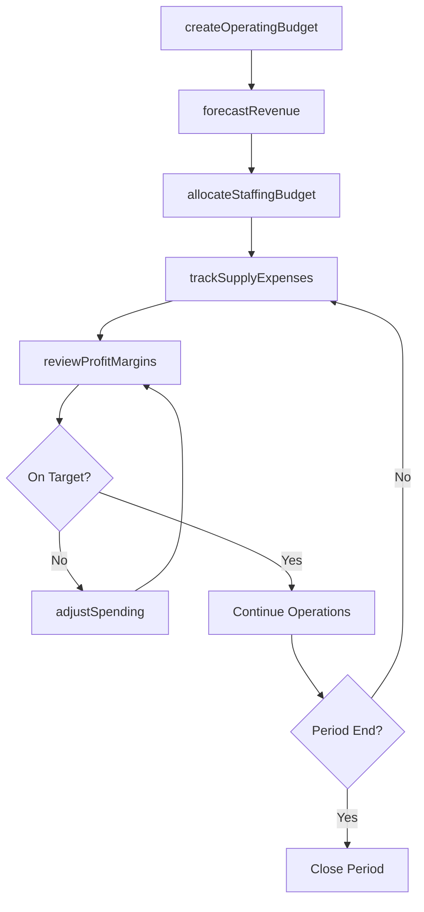
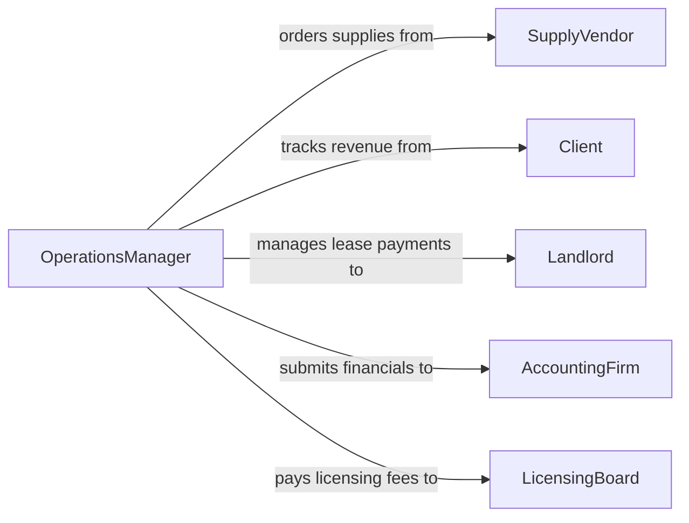

# Manage Budgets Personal Services Operations

> Business-as-Code definition for managing budgets in personal services operations. Models the financial planning, allocation, and monitoring lifecycle for service-oriented businesses such as salons, spas, fitness centers, and hospitality venues.

## Overview

Managing budgets for personal services operations involves planning and controlling financial resources across labor-intensive service delivery environments. Budget managers forecast staffing costs, consumable supplies, facility maintenance, and marketing expenses while balancing revenue projections from appointments, memberships, and retail sales. Continuous monitoring ensures profitability targets are met without compromising service quality or employee satisfaction.

## Actors

| Actor | Description |
|-------|-------------|
| SupplyVendor | Provides consumable products, equipment, and supplies for service delivery |
| Client | Customer who purchases personal services and generates revenue |
| Landlord | Property owner providing the facility lease and maintenance terms |
| AccountingFirm | External firm handling tax preparation and financial advisory services |
| LicensingBoard | Regulatory body overseeing professional licensing and compliance fees |

## Roles

| Role | Description |
|------|-------------|
| OperationsManager | Oversees day-to-day budget execution and service delivery efficiency |
| FinancialController | Monitors spending, prepares financial statements, and ensures fiscal compliance |
| ServiceDirector | Manages service staff scheduling and labor cost optimization |
| Owner | Sets overall financial targets and approves major expenditure decisions |

## Entities

| Entity | Description |
|--------|-------------|
| OperatingBudget | Financial plan covering all recurring operational expenses for a period |
| LaborCost | Wages, commissions, benefits, and payroll taxes for service staff |
| SupplyExpense | Costs for consumable products and materials used in service delivery |
| RevenueProjection | Forecasted income from services, memberships, and retail sales |
| ExpenseCategory | Classification grouping for tracking spending by type |
| ProfitMargin | Calculated difference between revenue and total operating costs |

## Actions

| Action | Description |
|--------|-------------|
| createOperatingBudget | Initialize a new budget for a service location and fiscal period |
| forecastRevenue | Project income based on appointment volume, pricing, and seasonal trends |
| allocateStaffingBudget | Distribute labor budget across service roles and shifts |
| trackSupplyExpenses | Record and categorize consumable product purchases |
| reviewProfitMargins | Analyze revenue against costs to assess operational profitability |
| adjustSpending | Modify budget allocations in response to performance or market changes |
| approveExpenditure | Authorize spending above a defined threshold for major purchases |

## Events

| Event | Description |
|-------|-------------|
| operatingBudgetCreated | A new operating budget has been established for the period |
| revenueForecasted | Income projections for the period have been completed |
| staffingBudgetAllocated | Labor funds have been distributed across service departments |
| supplyExpenseRecorded | A consumable supply purchase has been tracked and categorized |
| profitMarginReviewed | Profitability analysis for the period has been completed |
| spendingAdjusted | Budget allocations have been modified based on performance data |
| expenditureApproved | A major purchase or expense has been formally authorized |

## Searches

| Search | Description |
|--------|-------------|
| findBudgets | List operating budgets by location, period, or status |
| getLaborCosts | Retrieve staffing expenses broken down by role, department, or pay period |
| getExpensesByCategory | Query spending totals grouped by expense classification |
| getProfitMargins | Retrieve profitability metrics for a given period and location |


## Entity Relationships



## State Diagram



## Workflow



## Actor Relationships



## Usage

### Calling Actions

```typescript
import { manageBudgetsPersonalServicesOperations } from '@headlessly/manage-budgets-personal-services-operations'

const budgets = manageBudgetsPersonalServicesOperations()

// Create the quarterly operating budget
const budget = await budgets.createOperatingBudget({
  location: 'Downtown Wellness Spa',
  period: { start: '2026-04-01', end: '2026-06-30' },
  totalBudget: 185000
})

// Allocate staffing budget across roles
await budgets.allocateStaffingBudget({
  budgetId: budget.id,
  allocations: [
    { role: 'MassageTherapist', amount: 62000 },
    { role: 'Esthetician', amount: 45000 },
    { role: 'FrontDesk', amount: 28000 }
  ]
})

// Review current profit margins
const margins = await budgets.reviewProfitMargins({
  budgetId: budget.id,
  period: 'April'
})
```

### Event-Driven Automation

```typescript
// Alert when profit margins drop below threshold
budgets.profitMarginReviewed(async ({ budgetId, margin }) => {
  if (margin.percentage < 20) {
    await notify({
      to: 'operations-manager',
      message: `Profit margin for ${margin.period} is ${margin.percentage}% - below 20% target`
    })
  }
})

// Auto-reorder supplies when expense tracking shows low inventory spend
budgets.supplyExpenseRecorded(async ({ budgetId, category, amountRemaining }) => {
  if (amountRemaining < 500) {
    await notify({
      to: 'supply-manager',
      message: `Supply budget for ${category} nearly exhausted - ${amountRemaining} remaining`
    })
  }
})
```
