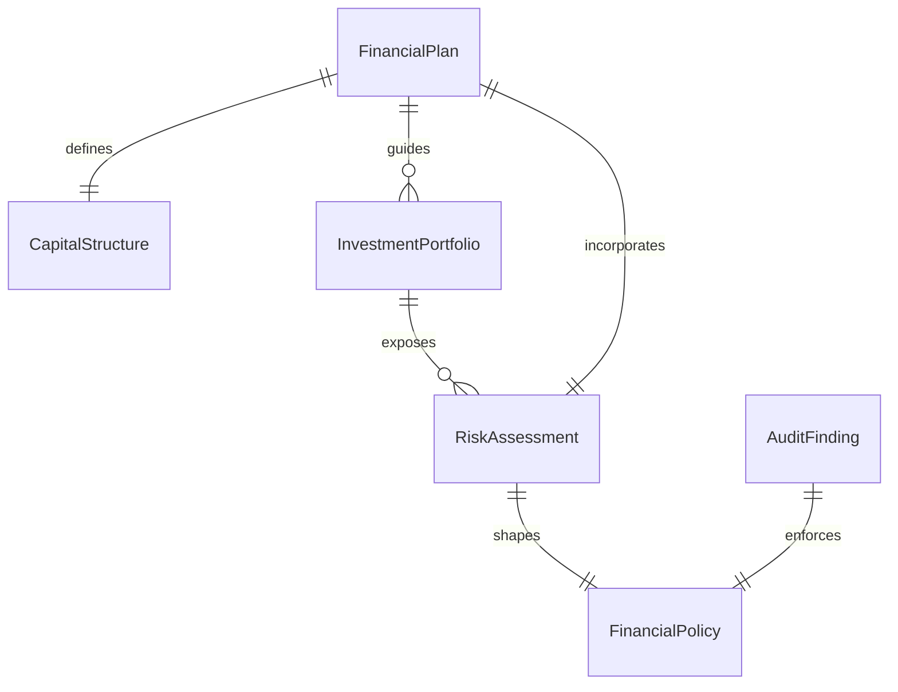
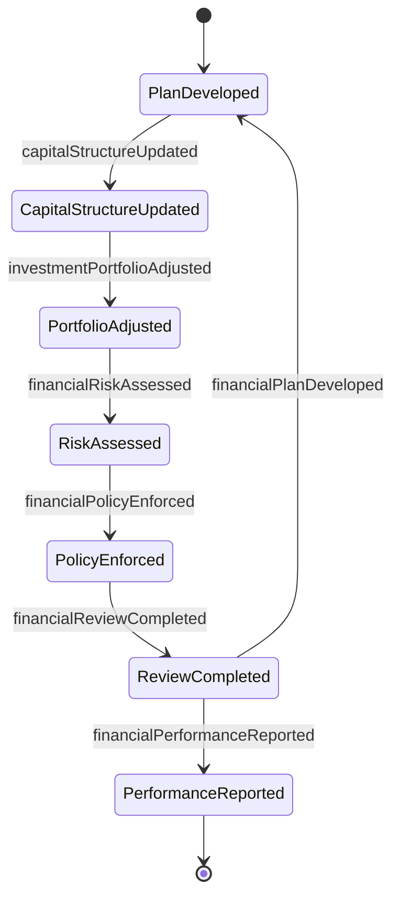
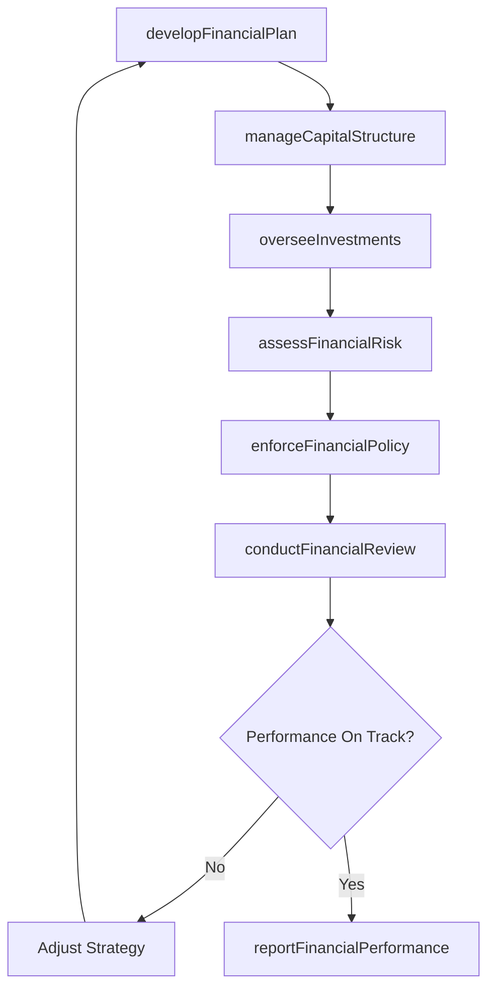
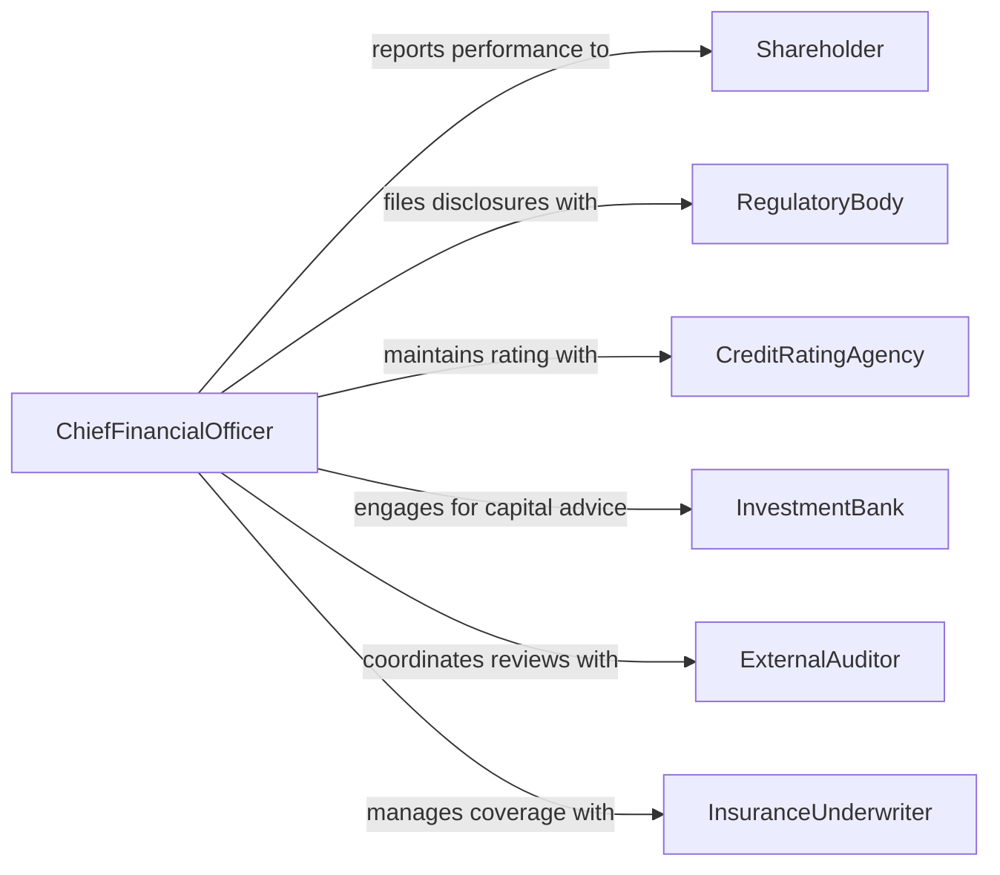

# Manage Financial Activities Organization

> Business-as-Code definition for managing the financial activities of an organization. Models the strategic oversight of all financial functions including treasury, accounting, financial planning, risk management, and capital allocation.

## Overview

Managing the financial activities of an organization encompasses the strategic direction and operational control of all monetary functions across the enterprise. This includes capital structure decisions, investment management, financial risk mitigation, accounting oversight, and regulatory compliance. The CFO or finance director ensures that financial policies align with organizational strategy and that resources are deployed to maximize stakeholder value while maintaining fiscal discipline.

## Actors

| Actor | Description |
|-------|-------------|
| Shareholder | Equity owner requiring financial performance reporting and returns |
| RegulatoryBody | Government authority enforcing financial reporting standards and compliance |
| CreditRatingAgency | Agency assessing the organization's creditworthiness and financial stability |
| InvestmentBank | Financial institution advising on capital markets, mergers, and financing |
| ExternalAuditor | Independent firm conducting annual financial statement audits |
| InsuranceUnderwriter | Provider assessing organizational risk for coverage and premium determination |

## Roles

| Role | Description |
|------|-------------|
| ChiefFinancialOfficer | Sets financial strategy and oversees all finance department operations |
| TreasuryManager | Manages cash positions, investments, and banking relationships |
| FinancialPlanningAnalyst | Develops financial models, forecasts, and variance analyses |
| InternalAuditor | Evaluates internal controls and financial process effectiveness |

## Entities

| Entity | Description |
|--------|-------------|
| FinancialPlan | Multi-year strategic plan outlining revenue, expense, and capital targets |
| CapitalStructure | The mix of debt, equity, and retained earnings funding the organization |
| InvestmentPortfolio | Collection of financial instruments held by the organization |
| RiskAssessment | Evaluation of financial risks including market, credit, and operational exposure |
| FinancialPolicy | Organizational rules governing spending authority, reserves, and investments |
| AuditFinding | Issue identified during internal or external financial review |

## Actions

| Action | Description |
|--------|-------------|
| developFinancialPlan | Create or update the organization's multi-year financial strategy |
| manageCapitalStructure | Optimize the mix of debt and equity financing |
| overseeInvestments | Monitor and adjust the organization's investment portfolio |
| assessFinancialRisk | Evaluate exposure to market, credit, liquidity, and operational risks |
| enforceFinancialPolicy | Ensure organizational units comply with established financial policies |
| conductFinancialReview | Perform periodic reviews of financial performance against targets |
| reportFinancialPerformance | Present financial results to leadership, shareholders, and regulators |

## Events

| Event | Description |
|-------|-------------|
| financialPlanDeveloped | A new or updated financial strategy has been established |
| capitalStructureUpdated | Changes to the organization's debt or equity composition have been made |
| investmentPortfolioAdjusted | The investment portfolio has been rebalanced or modified |
| financialRiskAssessed | A risk evaluation has been completed with identified exposures |
| financialPolicyEnforced | A compliance action has been taken on a financial policy violation |
| financialReviewCompleted | A periodic financial performance review has been finalized |
| financialPerformanceReported | Financial results have been published to stakeholders |

## Searches

| Search | Description |
|--------|-------------|
| findFinancialPlans | Retrieve strategic financial plans by period, status, or business unit |
| getRiskAssessments | Query risk evaluations by type, severity, or date range |
| getInvestmentPositions | List current investment holdings with valuations and returns |
| getAuditFindings | Retrieve audit issues by severity, status, or department |


## Entity Relationships



## State Diagram



## Workflow



## Actor Relationships



## Usage

### Calling Actions

```typescript
import { manageFinancialActivitiesOrganization } from '@headlessly/manage-financial-activities-organization'

const finance = manageFinancialActivitiesOrganization()

// Develop the annual financial plan
const plan = await finance.developFinancialPlan({
  fiscalYear: 2026,
  revenueTarget: 45000000,
  capitalExpenditureBudget: 8000000,
  operatingMarginTarget: 0.18
})

// Assess current financial risks
const risks = await finance.assessFinancialRisk({
  categories: ['market', 'credit', 'liquidity', 'operational'],
  asOfDate: '2026-03-31'
})

// Conduct quarterly financial review
const review = await finance.conductFinancialReview({
  planId: plan.id,
  period: 'Q1-2026',
  compareAgainst: 'budget'
})
```

### Event-Driven Automation

```typescript
// Escalate high-severity risk findings
finance.financialRiskAssessed(async ({ riskId, severity, category }) => {
  if (severity === 'high' || severity === 'critical') {
    await notify({
      to: 'executive-committee',
      message: `High-severity ${category} risk identified - immediate review required`
    })
  }
})

// Trigger regulatory filing when performance is reported
finance.financialPerformanceReported(async ({ reportId, period, reportType }) => {
  if (reportType === 'annual') {
    await scheduleTask({
      action: 'file-annual-report',
      deadline: '90 days',
      reference: reportId
    })
  }
})
```
