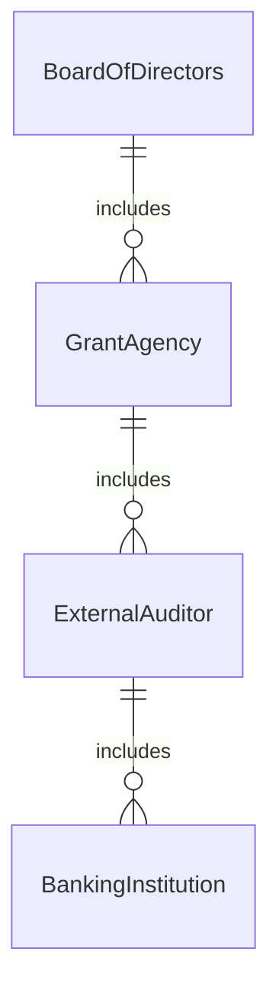
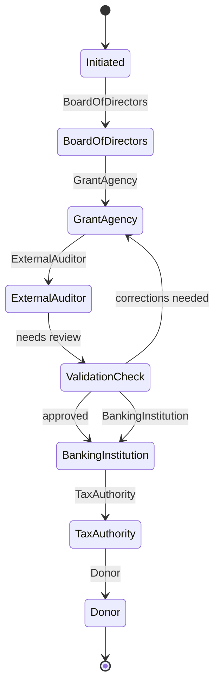
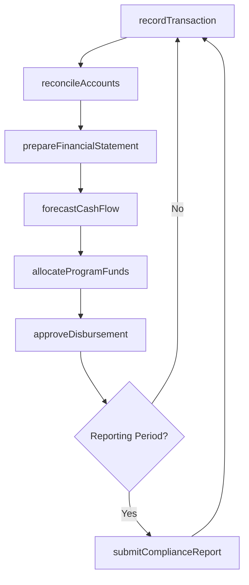
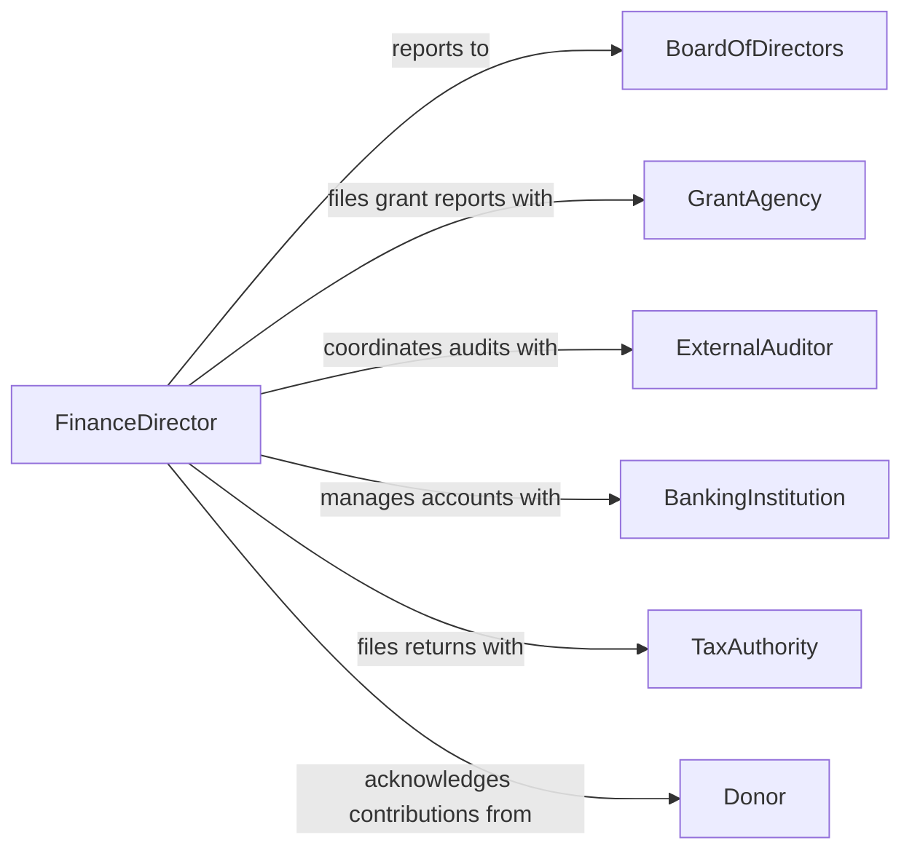

# Manage Organizational Program Finances

> Business-as-Code definition for managing organizational or program finances. Models the complete financial management lifecycle including fund administration, expenditure tracking, financial reporting, and compliance for organizations and their constituent programs.

## Overview

Managing organizational or program finances involves overseeing the financial health of an organization or a specific program within it, including revenue management, expenditure control, cash flow planning, and financial reporting. Finance managers coordinate across departments to ensure funds are properly received, disbursed, and accounted for in accordance with organizational policies and external regulations. This activity supports strategic decision-making by providing leadership with accurate financial data and forecasts.

## Actors

| Actor | Description |
|-------|-------------|
| BoardOfDirectors | Governing body requiring financial reports and approving major financial decisions |
| GrantAgency | Funding body providing grants with specific spending and reporting requirements |
| ExternalAuditor | Independent auditor verifying financial accuracy and regulatory compliance |
| BankingInstitution | Financial institution managing organizational accounts, loans, and investments |
| TaxAuthority | Government entity requiring tax filings and regulatory financial disclosures |
| Donor | Individual or organization contributing funds to programs or operations |

## Roles

| Role | Description |
|------|-------------|
| FinanceDirector | Provides strategic financial leadership and oversees all fiscal operations |
| Accountant | Maintains financial records, processes transactions, and prepares statements |
| ProgramManager | Manages program-level budgets and reports financial performance |
| Treasurer | Oversees cash management, investments, and banking relationships |

## Entities

| Entity | Description |
|--------|-------------|
| FinancialStatement | Periodic report of income, expenses, assets, and liabilities |
| FundAccount | Dedicated account for tracking restricted or unrestricted funds |
| Transaction | An individual financial event such as a payment, receipt, or transfer |
| CashFlowForecast | Projection of incoming and outgoing funds over a future period |
| ComplianceReport | Documentation demonstrating adherence to financial regulations or grant terms |
| RevenueStream | A categorized source of organizational income |

## Actions

| Action | Description |
|--------|-------------|
| recordTransaction | Log a financial transaction with proper classification and documentation |
| prepareFinancialStatement | Generate balance sheets, income statements, or cash flow reports |
| forecastCashFlow | Project future fund availability based on expected inflows and outflows |
| reconcileAccounts | Verify that recorded transactions match bank and ledger balances |
| allocateProgramFunds | Distribute available funds across programs based on approved budgets |
| submitComplianceReport | Prepare and file financial reports required by regulators or grantors |
| approveDisbursement | Authorize the release of funds for an approved expenditure |

## Events

| Event | Description |
|-------|-------------|
| transactionRecorded | A financial transaction has been logged and classified |
| financialStatementPrepared | A periodic financial report has been generated |
| cashFlowForecasted | Future fund projections have been completed |
| accountsReconciled | Bank and ledger balances have been verified and matched |
| programFundsAllocated | Funds have been distributed to program accounts |
| complianceReportSubmitted | A required financial report has been filed with the relevant authority |
| disbursementApproved | A fund release has been authorized for payment |

## Searches

| Search | Description |
|--------|-------------|
| findTransactions | Query transactions by account, date range, category, or amount |
| getFinancialStatements | Retrieve financial reports by type and reporting period |
| getFundBalances | Check current balances for organizational or program fund accounts |
| getComplianceStatus | Review compliance report submission status and deadlines |


## Entity Relationships



## State Diagram



## Workflow



## Actor Relationships



## Usage

### Calling Actions

```typescript
import { manageOrganizationalProgramFinances } from '@headlessly/manage-organizational-program-finances'

const finances = manageOrganizationalProgramFinances()

// Record a grant payment received
const transaction = await finances.recordTransaction({
  type: 'receipt',
  amount: 250000,
  account: 'youth-education-grant',
  source: 'National Education Foundation',
  category: 'grantRevenue',
  reference: 'NEF-2026-0042'
})

// Prepare quarterly financial statement
const statement = await finances.prepareFinancialStatement({
  type: 'incomeStatement',
  period: { start: '2026-01-01', end: '2026-03-31' },
  programs: ['youth-education', 'community-outreach', 'general-operations']
})

// Forecast cash flow for upcoming quarter
const forecast = await finances.forecastCashFlow({
  period: { start: '2026-04-01', end: '2026-06-30' },
  includeCommittedExpenses: true,
  includeExpectedRevenue: true
})
```

### Event-Driven Automation

```typescript
// Alert when fund balance drops below minimum threshold
finances.disbursementApproved(async ({ accountId, newBalance, minimumBalance }) => {
  if (newBalance < minimumBalance) {
    await notify({
      to: 'finance-director',
      message: `Fund account ${accountId} balance of $${newBalance} is below minimum threshold of $${minimumBalance}`
    })
  }
})

// Auto-generate compliance reports at period end
finances.financialStatementPrepared(async ({ statementId, period, type }) => {
  if (type === 'incomeStatement') {
    await finances.submitComplianceReport({
      statementId,
      reportingEntity: 'grant-agency',
      period
    })
  }
})
```
