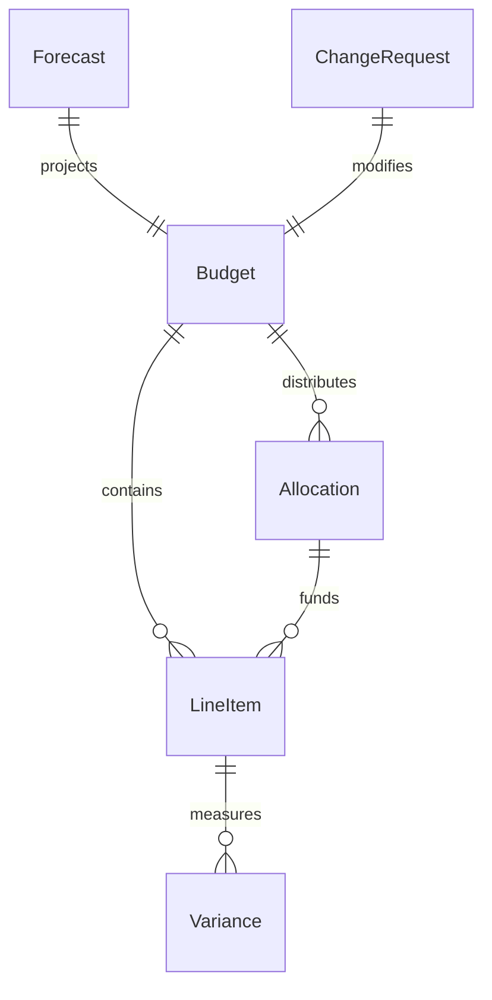
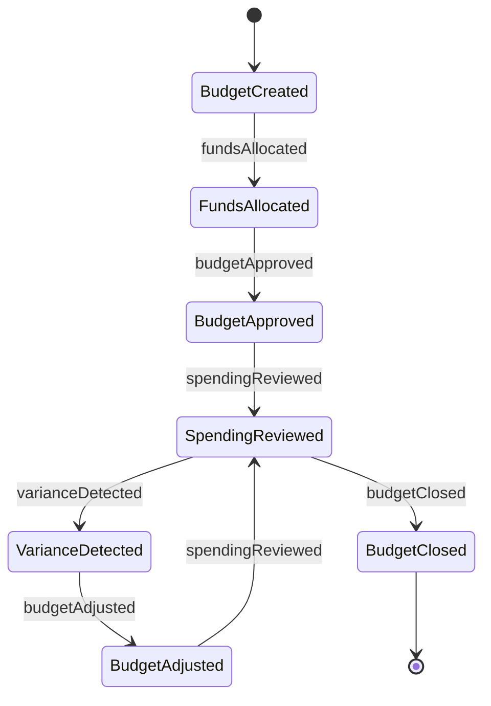
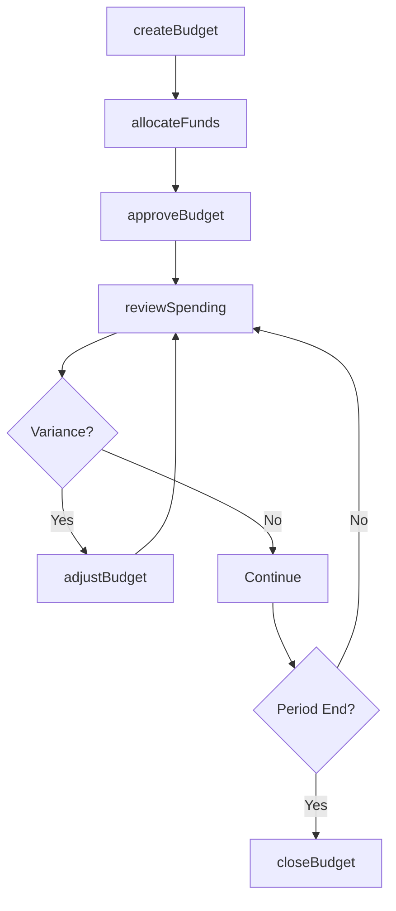
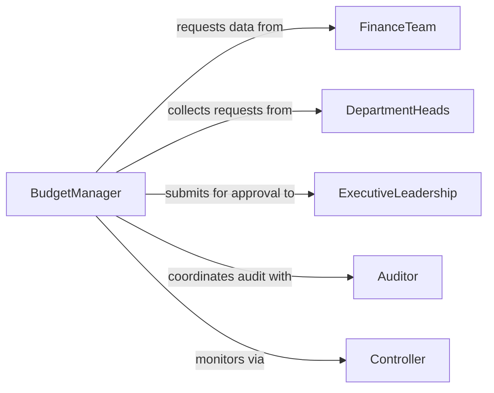

# Manage Organizational Project Budgets

> Business-as-Code definition for managing organizational or project budgets. Models the complete budget lifecycle from planning through allocation, monitoring, and close-out for both organizational operating budgets and project-specific financial plans.

## Overview

Managing organizational or project budgets involves developing, approving, executing, and controlling financial plans that govern how funds are allocated and spent across departments and projects. Budget managers establish spending authority, track actuals against approved amounts, analyze variances, and implement corrective measures to keep spending within approved limits. This activity bridges strategic financial planning with tactical execution, ensuring resources are consumed efficiently and in alignment with organizational goals.

## Actors

| Actor | Description |
|-------|-------------|
| FinanceTeam | Provides financial data, budget templates, and accounting support |
| DepartmentHeads | Submit budget requests and justify expenditures for their business units |
| ExecutiveLeadership | Approves final budget allocations and authorizes significant amendments |
| Auditor | Reviews budget compliance and spending accuracy during periodic audits |
| Controller | Monitors spending against approved budgets and enforces financial controls |
| Vendor | Provides goods and services that consume budget allocations |

## Roles

| Role | Description |
|------|-------------|
| BudgetManager | Oversees the entire budget process from planning through close-out |
| FinancialAnalyst | Analyzes spending trends, forecasts, and variance reports |
| Approver | Reviews and approves budget line items and change requests |
| ProjectLead | Manages project-specific budgets and reports financial performance |

## Entities

| Entity | Description |
|--------|-------------|
| Budget | A financial plan for a specific period, department, or project |
| LineItem | An individual expense or revenue category within a budget |
| Allocation | Funds assigned to a department, project, or cost center |
| Forecast | Projected spending based on current trends and committed obligations |
| Variance | Difference between planned and actual spending on a line item |
| ChangeRequest | A formal request to modify an approved budget allocation |

## Actions

| Action | Description |
|--------|-------------|
| createBudget | Initialize a new budget for a period, department, or project |
| allocateFunds | Assign funds to departments, projects, or line items |
| reviewSpending | Analyze actual spending against approved budget amounts |
| adjustBudget | Modify allocations based on changing needs through formal change requests |
| approveBudget | Formally approve a budget or budget amendment |
| forecastSpending | Project future spending from current trends and committed obligations |
| closeBudget | Finalize the budget period, reconcile actuals, and archive records |

## Events

| Event | Description |
|-------|-------------|
| budgetCreated | A new budget has been initialized for the period or project |
| fundsAllocated | Funds have been assigned to a department or project account |
| spendingReviewed | Spending analysis against budget has been completed |
| budgetAdjusted | Budget allocations have been modified through an approved change |
| budgetApproved | A budget or amendment has been formally authorized |
| varianceDetected | Spending deviates from plan beyond the acceptable threshold |
| budgetClosed | The budget period has been finalized and reconciled |

## Searches

| Search | Description |
|--------|-------------|
| findBudgets | List budgets by period, department, project, or status |
| getSpending | Retrieve actual spending by category, project, or period |
| getVariances | Find line items where spending deviates from the approved plan |
| getForecasts | Retrieve projected spending for upcoming periods or project phases |


## Entity Relationships



## State Diagram



## Workflow



## Actor Relationships



## Usage

### Calling Actions

```typescript
import { manageOrganizationalProjectBudgets } from '@headlessly/manage-organizational-project-budgets'

const budgets = manageOrganizationalProjectBudgets()

// Create a new project budget
const budget = await budgets.createBudget({
  name: 'ERP System Implementation',
  type: 'project',
  period: { start: '2026-03-01', end: '2027-02-28' },
  totalAmount: 2400000
})

// Allocate funds across project phases
await budgets.allocateFunds({
  budgetId: budget.id,
  allocations: [
    { category: 'Discovery and Planning', amount: 320000 },
    { category: 'Software Licensing', amount: 600000 },
    { category: 'Implementation Services', amount: 950000 },
    { category: 'Training and Change Management', amount: 280000 },
    { category: 'Contingency', amount: 250000 }
  ]
})

// Review spending at the quarterly checkpoint
const review = await budgets.reviewSpending({
  budgetId: budget.id,
  asOfDate: '2026-06-30',
  groupBy: 'category'
})
```

### Event-Driven Automation

```typescript
// Alert on significant variance
budgets.varianceDetected(async ({ budgetId, lineItem, variance }) => {
  if (Math.abs(variance.percentage) > 15) {
    await notify({
      to: 'budget-manager',
      message: `Budget variance of ${variance.percentage}% on ${lineItem} in budget ${budgetId}`
    })
  }
})

// Archive budget data when period closes
budgets.budgetClosed(async ({ budgetId, finalActuals, totalBudget }) => {
  await archive({
    budgetId,
    utilization: (finalActuals / totalBudget * 100).toFixed(1) + '%',
    closedDate: new Date().toISOString()
  })
})
```
