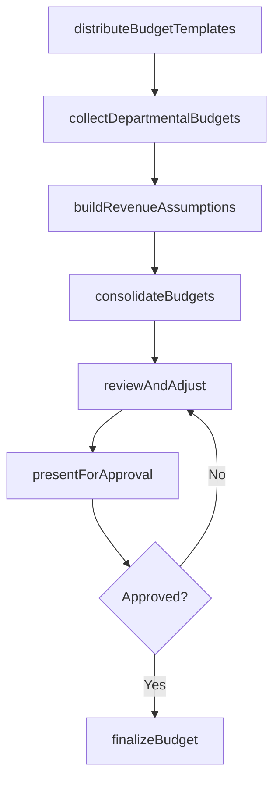
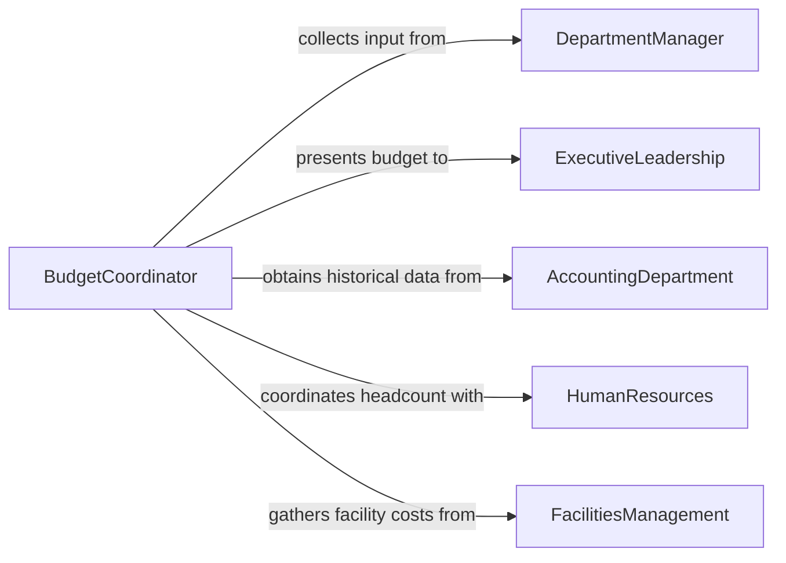

# Prepare Operational Budgets

> Business-as-Code definition for preparing operational budgets. Models the process of forecasting revenues and expenses, building departmental budgets, consolidating into an organization-wide operating plan, and gaining executive approval.

## Overview

Preparing operational budgets involves developing comprehensive financial plans that cover all recurring revenues and expenses for running day-to-day business operations. Budget preparers gather input from department managers, analyze historical spending patterns, apply growth assumptions, and consolidate individual departmental budgets into a unified organizational operating plan. The process requires multiple review cycles, management approvals, and alignment with strategic objectives before the budget is finalized for the fiscal period.

## Actors

| Actor | Description |
|-------|-------------|
| DepartmentManager | Business unit leader providing expense projections and revenue estimates |
| ExecutiveLeadership | Senior leaders who review and approve the consolidated operational budget |
| AccountingDepartment | Internal team providing historical financial data and chart of accounts |
| HumanResources | Team supplying headcount plans, compensation benchmarks, and benefits costs |
| FacilitiesManagement | Group providing occupancy costs, maintenance projections, and lease terms |

## Roles

| Role | Description |
|------|-------------|
| BudgetCoordinator | Manages the budget preparation calendar, templates, and consolidation process |
| FinancialAnalyst | Builds financial models, analyzes trends, and prepares variance projections |
| BudgetReviewer | Evaluates departmental submissions for completeness and reasonableness |
| ChiefFinancialOfficer | Provides final approval and presents the budget to the board or ownership |

## Entities

| Entity | Description |
|--------|-------------|
| OperationalBudget | The consolidated financial plan for all recurring organizational expenses and revenues |
| DepartmentalBudget | A cost and revenue plan for an individual business unit or department |
| RevenueAssumption | A documented projection of income based on volume, pricing, and market factors |
| ExpenseForecast | A projected cost for a specific category such as personnel, facilities, or technology |
| BudgetTemplate | A standardized form used to collect consistent data from each department |
| ApprovalRecord | Documentation of budget review decisions and authorization |

## Actions

| Action | Description |
|--------|-------------|
| distributeBudgetTemplates | Send standardized budget forms to department managers for completion |
| collectDepartmentalBudgets | Receive and validate budget submissions from all departments |
| buildRevenueAssumptions | Document income projections based on pricing, volume, and market analysis |
| consolidateBudgets | Merge all departmental budgets into a unified organizational operating plan |
| reviewAndAdjust | Evaluate the consolidated budget against targets and make necessary changes |
| presentForApproval | Submit the final operational budget to executive leadership for authorization |
| finalizeBudget | Lock the approved budget and distribute to department managers |

## Events

| Event | Description |
|-------|-------------|
| budgetTemplatesDistributed | Budget forms have been sent to all departments for the upcoming period |
| departmentalBudgetsCollected | All department budget submissions have been received and validated |
| revenueAssumptionsBuilt | Income projections for the period have been documented and reviewed |
| budgetsConsolidated | Departmental budgets have been merged into the organizational operating plan |
| budgetReviewedAndAdjusted | The consolidated budget has been evaluated and modified as needed |
| budgetPresentedForApproval | The final budget has been submitted to executive leadership |
| budgetFinalized | The operational budget has been approved and locked for the period |

## Searches

| Search | Description |
|--------|-------------|
| findOperationalBudgets | List operational budgets by fiscal year, department, or approval status |
| getDepartmentalSubmissions | Retrieve individual department budget submissions and their statuses |
| getRevenueAssumptions | Query documented revenue projections by product line or business unit |
| getExpenseForecasts | Review projected costs by category, department, or account code |

## Workflow



## Actor Relationships



## Usage

### Calling Actions

```typescript
import { prepareOperationalBudgets } from '@headlessly/prepare-operational-budgets'

const budgets = prepareOperationalBudgets()

// Distribute templates to all departments
const distribution = await budgets.distributeBudgetTemplates({
  fiscalYear: 2027,
  departments: ['Sales', 'Engineering', 'Marketing', 'Operations', 'HR', 'Finance'],
  deadline: '2026-10-15',
  templateVersion: 'v2027'
})

// Consolidate all departmental submissions
const consolidated = await budgets.consolidateBudgets({
  fiscalYear: 2027,
  includeRevenue: true,
  includeCapex: false,
  escalationFactor: 1.035
})

// Present the finalized budget for approval
await budgets.presentForApproval({
  budgetId: consolidated.id,
  presenter: 'cfo',
  meetingDate: '2026-11-20',
  supportingDocuments: ['revenue-assumptions', 'headcount-plan', 'variance-analysis']
})
```

### Event-Driven Automation

```typescript
// Remind departments of upcoming submission deadline
budgets.budgetTemplatesDistributed(async ({ departments, deadline }) => {
  const reminderDate = new Date(deadline)
  reminderDate.setDate(reminderDate.getDate() - 7)
  await schedule({
    date: reminderDate.toISOString(),
    action: 'send-reminder',
    to: departments,
    message: `Budget submissions due in 7 days - deadline: ${deadline}`
  })
})

// Notify departments when final budget is locked
budgets.budgetFinalized(async ({ fiscalYear, departments }) => {
  for (const dept of departments) {
    await notify({
      to: `${dept.toLowerCase()}-manager`,
      message: `FY${fiscalYear} operational budget has been finalized and is now available in the budget system`
    })
  }
})
```
