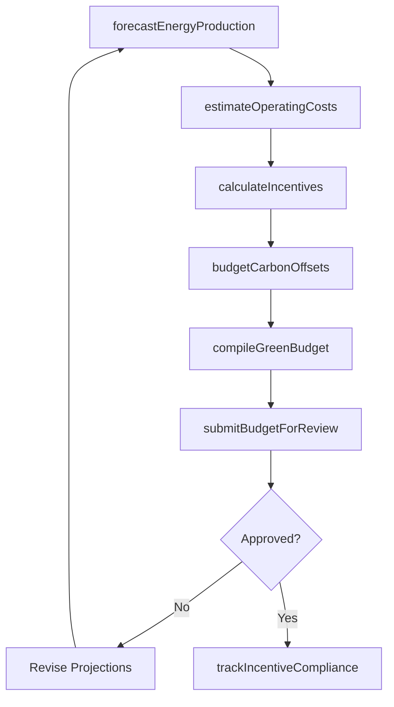
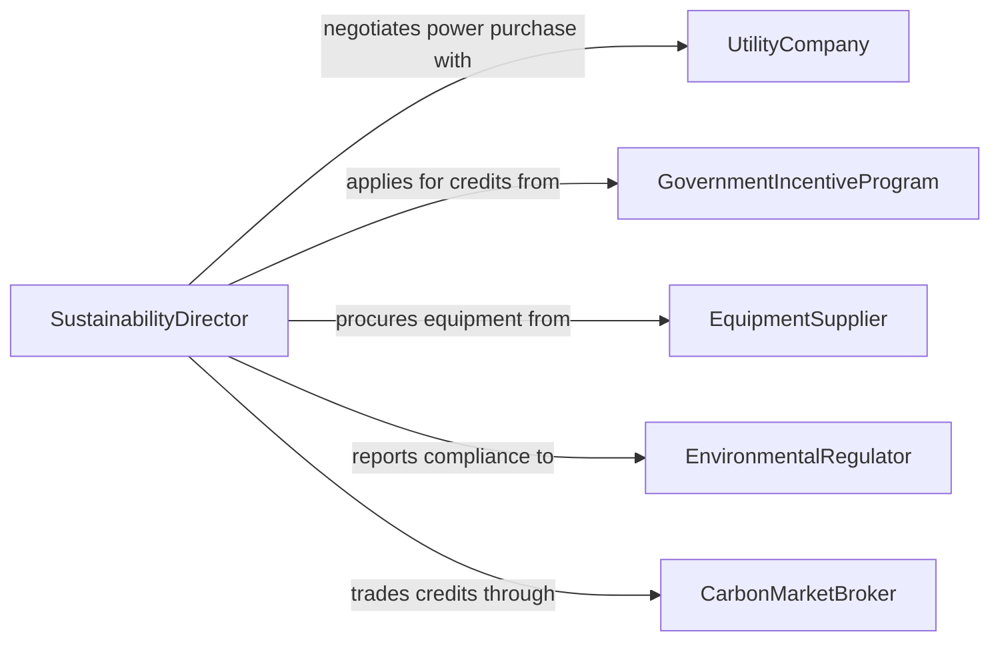

# Prepare Operational Budgets Green Energy

> Business-as-Code definition for preparing operational budgets for green energy or other green operations. Models the financial planning process for renewable energy projects, sustainability programs, and environmentally focused operational initiatives.

## Overview

Preparing operational budgets for green energy and sustainability operations involves forecasting costs for renewable energy generation, energy efficiency upgrades, carbon offset programs, and environmental compliance activities. Budget preparers must account for specialized factors such as renewable energy credit pricing, equipment degradation curves, government incentive programs, and evolving regulatory requirements. The resulting budgets guide capital deployment toward clean energy assets and sustainable operational practices while demonstrating return on investment to stakeholders.

## Actors

| Actor | Description |
|-------|-------------|
| UtilityCompany | Electric utility purchasing renewable energy or providing grid interconnection |
| GovernmentIncentiveProgram | Federal or state program offering tax credits, grants, or rebates for green investments |
| EquipmentSupplier | Manufacturer or distributor of solar panels, wind turbines, or energy storage systems |
| EnvironmentalRegulator | Agency enforcing emissions standards and environmental compliance requirements |
| CarbonMarketBroker | Intermediary facilitating carbon credit purchases and renewable energy certificate trading |

## Roles

| Role | Description |
|------|-------------|
| SustainabilityDirector | Leads the green operations strategy and oversees sustainability budget priorities |
| EnergyAnalyst | Models energy production forecasts, cost curves, and incentive calculations |
| GreenProjectManager | Manages individual renewable energy or efficiency project budgets |
| EnvironmentalComplianceOfficer | Ensures budgets account for all regulatory and reporting requirements |

## Entities

| Entity | Description |
|--------|-------------|
| GreenOperatingBudget | Financial plan covering all sustainability and renewable energy operational costs |
| RenewableEnergyProject | A specific clean energy initiative such as solar installation or wind farm operation |
| IncentiveCredit | A tax credit, rebate, or grant reducing the net cost of green investments |
| CarbonOffset | A purchased credit representing a verified reduction in greenhouse gas emissions |
| EnergyProductionForecast | Projected output from renewable energy assets over a budget period |
| MaintenanceSchedule | Planned service activities and costs for green energy equipment |

## Actions

| Action | Description |
|--------|-------------|
| forecastEnergyProduction | Project renewable energy output based on equipment capacity and environmental factors |
| estimateOperatingCosts | Calculate operational expenses including maintenance, staffing, and grid fees |
| calculateIncentives | Determine eligible tax credits, rebates, and renewable energy certificate revenue |
| budgetCarbonOffsets | Plan expenditures for carbon credit purchases to meet emissions targets |
| compileGreenBudget | Aggregate all green operations cost and revenue projections into a unified budget |
| submitBudgetForReview | Present the completed green operations budget to leadership for approval |
| trackIncentiveCompliance | Monitor spending and documentation needed to maintain incentive eligibility |

## Events

| Event | Description |
|-------|-------------|
| energyProductionForecasted | Renewable energy output projections have been completed for the period |
| operatingCostsEstimated | Green operations expense projections have been finalized |
| incentivesCalculated | Tax credits and rebate amounts have been determined and included |
| carbonOffsetssBudgeted | Carbon credit purchase plans have been incorporated into the budget |
| greenBudgetCompiled | The complete green operations budget has been assembled |
| budgetSubmittedForReview | The green budget has been presented to leadership for approval |
| incentiveComplianceVerified | Documentation confirming incentive eligibility has been validated |

## Searches

| Search | Description |
|--------|-------------|
| findGreenBudgets | List green operations budgets by project, period, or approval status |
| getEnergyForecasts | Retrieve production projections by renewable asset type or location |
| getIncentiveCredits | Query available and claimed incentives by program and project |
| getCarbonOffsetCosts | Review carbon credit pricing and purchase history |

## Workflow



## Actor Relationships



## Usage

### Calling Actions

```typescript
import { prepareOperationalBudgetsGreenEnergy } from '@headlessly/prepare-operational-budgets-green-energy'

const greenBudgets = prepareOperationalBudgetsGreenEnergy()

// Forecast energy production for the solar portfolio
const forecast = await greenBudgets.forecastEnergyProduction({
  assets: [
    { type: 'solar', name: 'Southfield Array', capacityKw: 5000, location: 'Phoenix, AZ' },
    { type: 'solar', name: 'Rooftop Portfolio', capacityKw: 1200, location: 'Denver, CO' }
  ],
  period: { start: '2026-01-01', end: '2026-12-31' },
  degradationFactor: 0.005
})

// Calculate available incentives
const incentives = await greenBudgets.calculateIncentives({
  projects: ['southfield-array', 'rooftop-portfolio'],
  programs: ['federalITC', 'stateRebate', 'renewableEnergyCertificates'],
  investmentAmount: 3200000
})

// Compile the full green operations budget
const budget = await greenBudgets.compileGreenBudget({
  fiscalYear: 2026,
  operatingCosts: 420000,
  maintenanceCosts: 185000,
  carbonOffsetBudget: 75000,
  incentiveRevenue: incentives.totalCredits,
  energyRevenue: forecast.projectedRevenue
})
```

### Event-Driven Automation

```typescript
// Alert when incentive compliance documentation is due
greenBudgets.incentiveComplianceVerified(async ({ projectId, nextDeadline }) => {
  await schedule({
    reminder: `Incentive compliance documentation for ${projectId} due`,
    date: nextDeadline,
    to: 'sustainability-team'
  })
})

// Notify leadership when green budget is ready for review
greenBudgets.greenBudgetCompiled(async ({ budgetId, totalAmount, netCostAfterIncentives }) => {
  await notify({
    to: 'executive-leadership',
    message: `Green operations budget compiled: $${totalAmount.toLocaleString()} gross, $${netCostAfterIncentives.toLocaleString()} net after incentives`
  })
})
```
