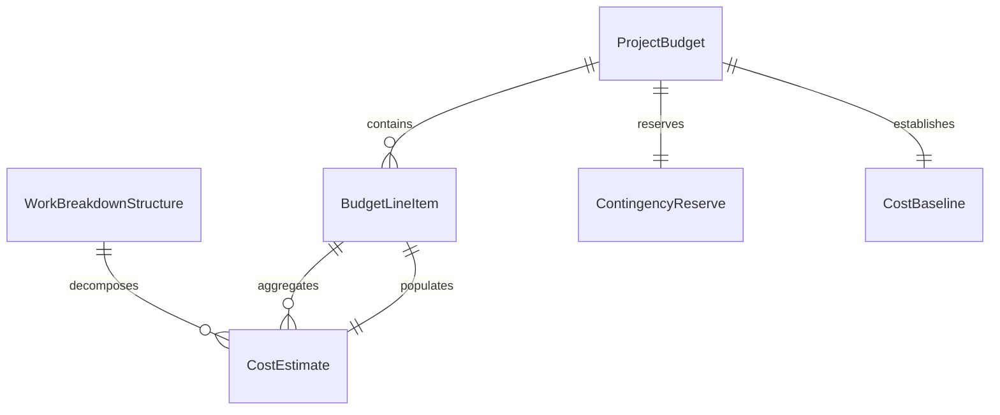
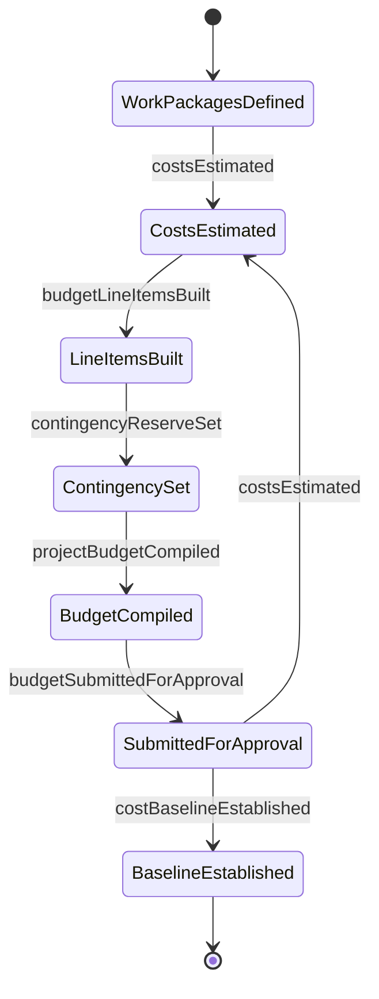
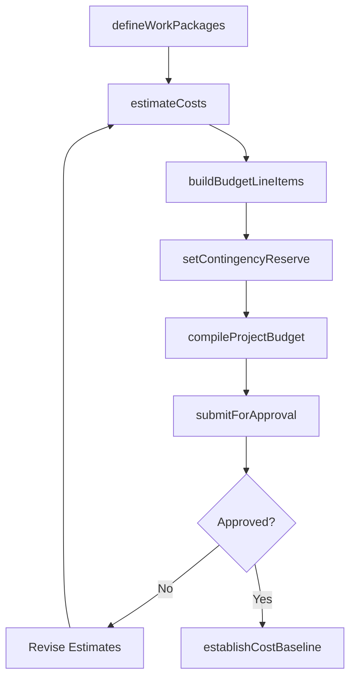
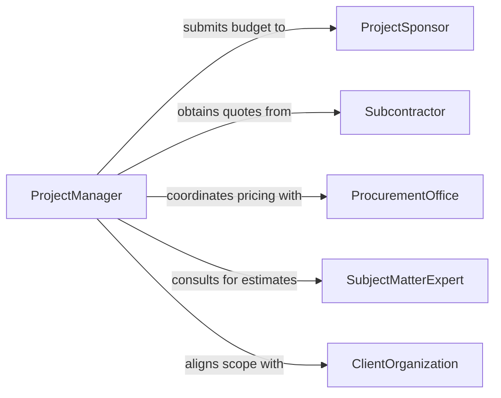

# Prepare Project Budgets

> Business-as-Code definition for preparing project budgets. Models the process of estimating costs, defining budget line items, establishing contingency reserves, and assembling a comprehensive financial plan for project execution.

## Overview

Preparing project budgets involves developing detailed cost estimates for all resources, materials, labor, and overhead required to deliver a project on time and within scope. Budget preparers work with project managers, procurement teams, and subject matter experts to quantify each work package and assemble a bottom-up cost estimate with appropriate contingency and management reserves. The resulting budget serves as the cost baseline for project performance measurement and financial control.

## Actors

| Actor | Description |
|-------|-------------|
| ProjectSponsor | Executive funding the project who approves the final budget |
| Subcontractor | External party providing labor or deliverables with quoted pricing |
| ProcurementOffice | Organizational unit managing vendor selection and contract pricing |
| SubjectMatterExpert | Technical specialist providing cost estimates for specialized work |
| ClientOrganization | External client whose requirements drive the project scope and budget |

## Roles

| Role | Description |
|------|-------------|
| ProjectManager | Leads the budget preparation and owns the project cost baseline |
| CostEstimator | Develops detailed cost estimates for labor, materials, and equipment |
| FinancialPlanner | Structures the budget format, reserves, and escalation factors |
| ProjectController | Validates estimates against historical data and organizational benchmarks |

## Entities

| Entity | Description |
|--------|-------------|
| ProjectBudget | The comprehensive financial plan for project execution |
| CostEstimate | A calculated projection of expenses for a specific work package or deliverable |
| WorkBreakdownStructure | Hierarchical decomposition of project scope into budgetable components |
| ContingencyReserve | Funds set aside for identified risks and known unknowns |
| BudgetLineItem | An individual cost element within the project budget |
| CostBaseline | The approved time-phased budget used for performance measurement |

## Actions

| Action | Description |
|--------|-------------|
| defineWorkPackages | Break down the project scope into estimable budget components |
| estimateCosts | Calculate expected expenses for labor, materials, equipment, and overhead |
| buildBudgetLineItems | Assemble individual cost elements into a structured budget format |
| setContingencyReserve | Establish risk-based contingency and management reserve amounts |
| compileProjectBudget | Aggregate all line items, reserves, and escalation into the total budget |
| submitForApproval | Present the completed budget to the project sponsor for authorization |
| establishCostBaseline | Lock the approved budget as the performance measurement baseline |

## Events

| Event | Description |
|-------|-------------|
| workPackagesDefined | Project scope has been decomposed into budgetable work packages |
| costsEstimated | Cost projections for all work packages have been completed |
| budgetLineItemsBuilt | Individual cost elements have been structured into budget format |
| contingencyReserveSet | Risk-based reserve funds have been calculated and included |
| projectBudgetCompiled | The complete project budget has been assembled |
| budgetSubmittedForApproval | The budget has been presented to the sponsor for authorization |
| costBaselineEstablished | The approved budget has been locked as the performance baseline |

## Searches

| Search | Description |
|--------|-------------|
| findProjectBudgets | List project budgets by status, sponsor, date, or total amount |
| getCostEstimates | Retrieve detailed cost estimates by work package or resource type |
| getBudgetLineItems | Query individual budget line items by category, amount, or phase |
| getHistoricalCosts | Access past project cost data for benchmarking and estimation accuracy |


## Entity Relationships



## State Diagram



## Workflow



## Actor Relationships



## Usage

### Calling Actions

```typescript
import { prepareProjectBudgets } from '@headlessly/prepare-project-budgets'

const budgets = prepareProjectBudgets()

// Define work packages from the project scope
const packages = await budgets.defineWorkPackages({
  projectId: 'PRJ-2026-0145',
  name: 'Data Center Migration',
  packages: [
    { code: 'WBS-1.1', name: 'Infrastructure Assessment', phase: 'planning' },
    { code: 'WBS-1.2', name: 'Hardware Procurement', phase: 'execution' },
    { code: 'WBS-1.3', name: 'Migration Execution', phase: 'execution' },
    { code: 'WBS-1.4', name: 'Testing and Validation', phase: 'closeout' }
  ]
})

// Estimate costs for each work package
const estimates = await budgets.estimateCosts({
  projectId: 'PRJ-2026-0145',
  estimates: [
    { workPackage: 'WBS-1.1', labor: 45000, materials: 0, equipment: 5000 },
    { workPackage: 'WBS-1.2', labor: 20000, materials: 380000, equipment: 0 },
    { workPackage: 'WBS-1.3', labor: 120000, materials: 15000, equipment: 25000 },
    { workPackage: 'WBS-1.4', labor: 60000, materials: 0, equipment: 10000 }
  ]
})

// Compile and submit the full project budget
const budget = await budgets.compileProjectBudget({
  projectId: 'PRJ-2026-0145',
  contingencyPercentage: 10,
  managementReservePercentage: 5,
  escalationFactor: 1.03
})
```

### Event-Driven Automation

```typescript
// Notify stakeholders when budget is submitted for approval
budgets.budgetSubmittedForApproval(async ({ projectId, totalAmount, sponsorId }) => {
  await notify({
    to: sponsorId,
    message: `Project budget for ${projectId} totaling $${totalAmount.toLocaleString()} is ready for your approval`
  })
})

// Lock the cost baseline once budget is approved
budgets.costBaselineEstablished(async ({ projectId, baselineAmount }) => {
  await notify({
    to: 'project-controls',
    message: `Cost baseline of $${baselineAmount.toLocaleString()} established for ${projectId} - earned value tracking enabled`
  })
})
```
