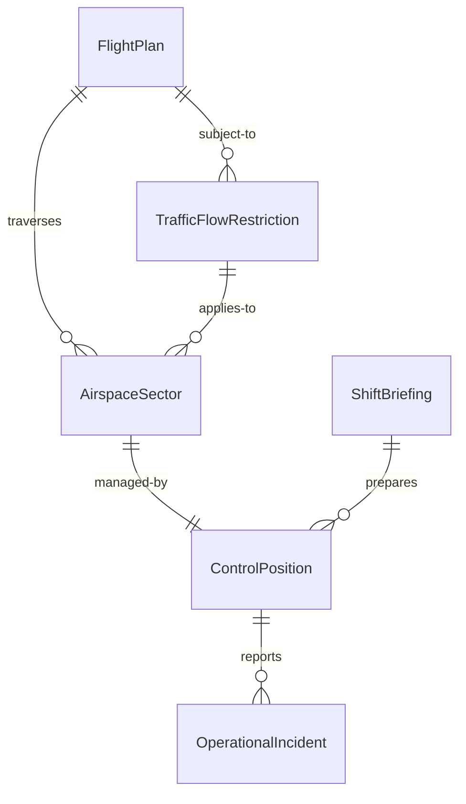
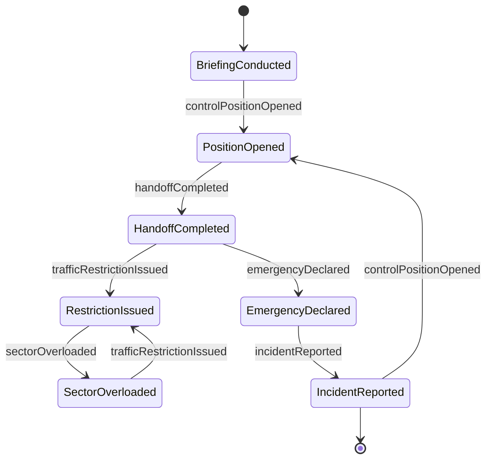
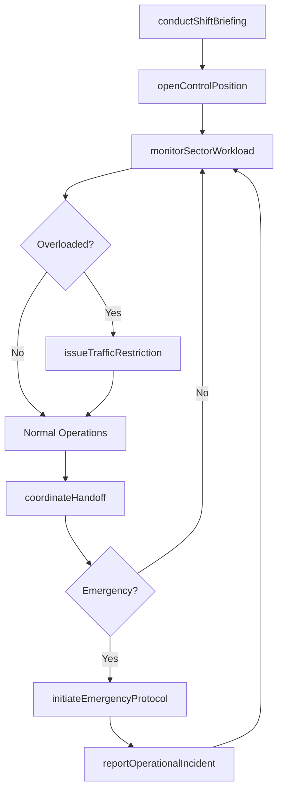
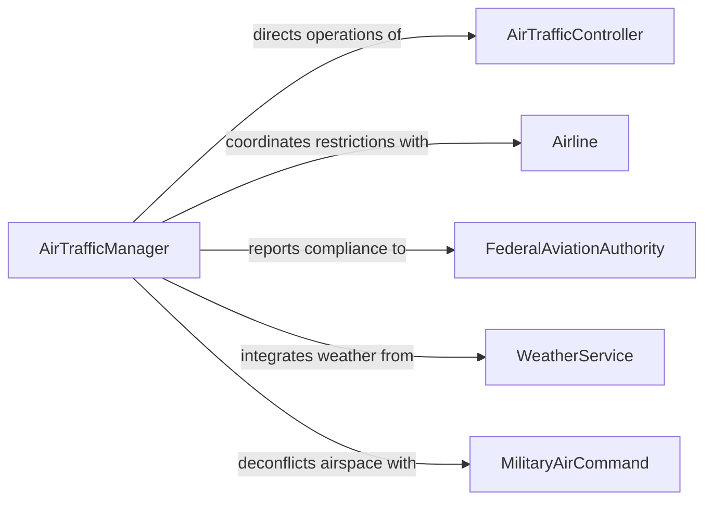

# Coordinate Flight Control Management Activities

> Business-as-Code definition for coordinating flight control and management activities. Models the oversight of air traffic control operations, flight scheduling, airspace coordination, and safety incident management across aviation facilities.

## Overview

Coordinating flight control and management activities involves directing air traffic controllers, flight dispatchers, and aviation operations staff who manage the safe and efficient movement of aircraft. This definition covers airspace sector management, flight plan coordination, weather-related rerouting, staffing of control positions, emergency response procedures, and compliance with aviation authority regulations to maintain the safety and flow of air traffic.

## Actors

| Actor | Description |
|-------|-------------|
| Airline | Carrier operating flights through managed airspace |
| FederalAviationAuthority | Government body such as FAA regulating airspace and flight operations |
| MilitaryAirCommand | Military authority coordinating restricted airspace and operations |
| WeatherService | National meteorological service providing aviation weather data |
| AirportOperations | Ground-side facility management coordinating runway and gate usage |
| PilotInCommand | Flight crew captain communicating with air traffic control |

## Roles

| Role | Description |
|------|-------------|
| AirTrafficManager | Oversees all traffic management operations for a facility or sector |
| FrontLineManager | Supervises controllers on position during active shifts |
| AirTrafficController | Provides separation and sequencing instructions to aircraft |
| FlightDataSpecialist | Processes flight plans, amendments, and coordination messages |

## Entities

| Entity | Description |
|--------|-------------|
| FlightPlan | Filed route, altitude, and timing for an aircraft operation |
| AirspaceSector | A defined volume of airspace managed by a control position |
| TrafficFlowRestriction | A ground delay, miles-in-trail, or reroute directive |
| ControlPosition | A staffed radar or tower position handling traffic |
| OperationalIncident | A reported loss of separation, deviation, or near-miss event |
| ShiftBriefing | Pre-shift communication of weather, NOTAMs, and traffic advisories |

## Actions

| Action | Description |
|--------|-------------|
| openControlPosition | Staff and activate a radar or tower control position |
| issueTrafficRestriction | Implement a ground stop, delay program, or reroute |
| coordinateHandoff | Manage transfer of aircraft control between sectors or facilities |
| conductShiftBriefing | Brief incoming controllers on weather, traffic, and active restrictions |
| initiateEmergencyProtocol | Activate emergency response procedures for an in-flight event |
| monitorSectorWorkload | Track traffic volume and complexity against controller capacity |
| reportOperationalIncident | Document and submit a safety event for investigation |

## Events

| Event | Description |
|-------|-------------|
| controlPositionOpened | A control position has been staffed and is active |
| trafficRestrictionIssued | A flow control measure has been implemented |
| handoffCompleted | Aircraft control has been transferred between positions |
| shiftBriefingConducted | Incoming shift has been briefed and is ready |
| emergencyDeclared | An aircraft emergency has been reported and response initiated |
| sectorOverloaded | Traffic volume has exceeded safe controller workload limits |
| incidentReported | A safety event has been documented for review |

## Searches

| Search | Description |
|--------|-------------|
| findActiveFlightPlans | List flight plans by route, altitude, or time window |
| getSectorStatus | Retrieve current traffic count and staffing for each sector |
| findActiveRestrictions | List traffic flow restrictions currently in effect |
| getIncidentHistory | Look up operational incidents by type, sector, or date |


## Entity Relationships



## State Diagram



## Workflow



## Actor Relationships



## Usage

### Calling Actions

```typescript
import { coordinateFlightControlManagementActivities } from '@headlessly/coordinate-flight-control-management-activities'

const flightControl = coordinateFlightControlManagementActivities()

// Open a control position for the evening shift
await flightControl.openControlPosition({
  sector: 'TRACON-East',
  position: 'Approach-2',
  controllerId: 'ATC-0412',
  shiftStart: '2026-03-15T16:00:00Z'
})

// Issue a traffic flow restriction
await flightControl.issueTrafficRestriction({
  type: 'ground-delay-program',
  airport: 'KJFK',
  reason: 'thunderstorms',
  averageDelay: 45,
  effectiveUntil: '2026-03-15T22:00:00Z'
})

// Monitor sector workload
const status = await flightControl.monitorSectorWorkload({
  sector: 'TRACON-East',
  metrics: ['aircraft-count', 'complexity-index', 'controller-utilization']
})
```

### Event-Driven Automation

```typescript
// Alert management when sector workload exceeds limits
flightControl.sectorOverloaded(async ({ sector, aircraftCount, maxCapacity }) => {
  await notify({
    to: 'air-traffic-manager',
    message: `Sector ${sector} has ${aircraftCount} aircraft (capacity: ${maxCapacity})`
  })
  await flightControl.issueTrafficRestriction({
    type: 'miles-in-trail',
    sector,
    spacing: 10,
    reason: 'volume'
  })
})

// Trigger investigation workflow on incident report
flightControl.incidentReported(async ({ incidentId, sector, severity }) => {
  if (severity === 'operational-error') {
    await escalate({
      to: 'safety-investigation-team',
      message: `Operational error ${incidentId} in sector ${sector} requires investigation`
    })
  }
})
```
