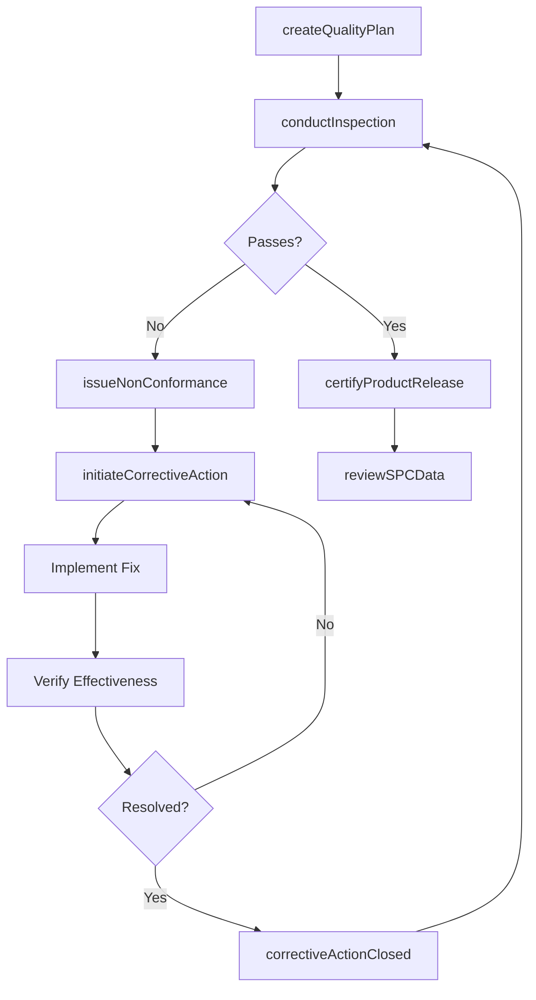
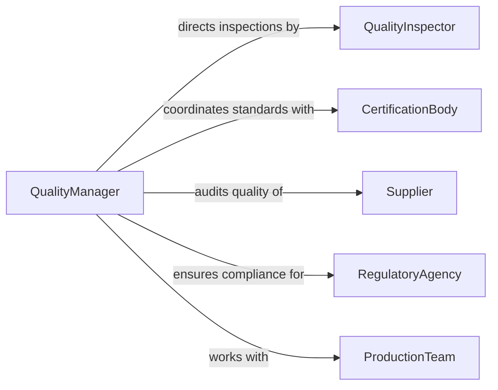

# Direct Quality Control Activities

> Business-as-Code definition for directing quality control activities. Models the oversight of inspection processes, testing programs, defect tracking, corrective actions, and quality standards enforcement across manufacturing and service operations.

## Overview

Directing quality control activities involves establishing and managing inspection programs, testing procedures, statistical process controls, and corrective action workflows that ensure products and services meet defined quality standards. This definition covers quality plan development, inspection scheduling, non-conformance management, root cause analysis, supplier quality oversight, and continuous improvement initiatives to reduce defects and maintain customer satisfaction.

## Actors

| Actor | Description |
|-------|-------------|
| Customer | End user or buyer whose requirements define quality standards |
| Supplier | Vendor providing materials or components subject to incoming inspection |
| CertificationBody | Third-party auditor certifying ISO, AS9100, or similar quality systems |
| RegulatoryAgency | Government body enforcing product safety and quality regulations |
| ProductionTeam | Manufacturing personnel whose output is subject to quality checks |
| EquipmentCalibrationService | External service maintaining measurement and test equipment accuracy |

## Roles

| Role | Description |
|------|-------------|
| QualityManager | Directs the overall quality control program and personnel |
| QualityEngineer | Designs inspection plans, analyzes data, and drives improvements |
| QualityInspector | Performs in-process and final inspections on products or services |
| MetrologyTechnician | Manages calibration and maintenance of measurement instruments |

## Entities

| Entity | Description |
|--------|-------------|
| QualityPlan | Documented plan of inspection points, methods, and acceptance criteria |
| InspectionRecord | Results of a quality inspection with pass/fail determinations |
| NonConformanceReport | Documentation of a product or process deviation from requirements |
| CorrectiveAction | Formal response to eliminate the root cause of a non-conformance |
| StatisticalProcessControl | Chart-based monitoring of process variation over time |
| CalibrationRecord | Documentation of instrument calibration status and results |

## Actions

| Action | Description |
|--------|-------------|
| createQualityPlan | Define inspection points, sampling plans, and acceptance criteria |
| conductInspection | Perform a quality inspection and record results |
| issueNonConformance | Document a deviation from quality requirements |
| initiateCorrectiveAction | Launch root cause analysis and corrective measures |
| reviewSPCData | Analyze statistical process control charts for trends |
| auditSupplierQuality | Assess a supplier's quality management system and performance |
| certifyProductRelease | Authorize product shipment after final quality verification |

## Events

| Event | Description |
|-------|-------------|
| qualityPlanCreated | A new quality plan has been established for a product or process |
| inspectionCompleted | A quality inspection has been performed and results recorded |
| nonConformanceIssued | A product or process deviation has been formally documented |
| correctiveActionInitiated | A root cause investigation and corrective plan has been started |
| correctiveActionClosed | A corrective action has been verified effective and closed |
| spcAlarmTriggered | A statistical process control chart has signaled an out-of-control condition |
| productReleased | A product lot has been certified for shipment |

## Searches

| Search | Description |
|--------|-------------|
| findOpenNonConformances | List non-conformance reports by status, product, or supplier |
| getInspectionResults | Retrieve inspection records by product, date, or inspector |
| findOverdueCorrectiveActions | Identify corrective actions past their due date |
| getSPCTrends | Retrieve process capability and trend data for a production line |

## Workflow



## Actor Relationships



## Usage

### Calling Actions

```typescript
import { directQualityControlActivities } from '@headlessly/direct-quality-control-activities'

const quality = directQualityControlActivities()

// Create a quality plan for a new product
const plan = await quality.createQualityPlan({
  productId: 'PROD-8810',
  inspectionPoints: [
    { stage: 'incoming-material', method: 'visual-and-dimensional', sampleSize: 'AQL-1.0' },
    { stage: 'in-process', method: 'go-no-go-gauge', frequency: 'every-50-units' },
    { stage: 'final', method: 'full-functional-test', sampleSize: '100-percent' }
  ]
})

// Issue a non-conformance report
const ncr = await quality.issueNonConformance({
  productId: 'PROD-8810',
  lotNumber: 'LOT-2026-0315',
  defectType: 'dimensional-out-of-tolerance',
  quantity: 12,
  disposition: 'hold-for-review'
})

// Initiate corrective action
await quality.initiateCorrectiveAction({
  nonConformanceId: ncr.id,
  rootCauseMethod: 'five-why',
  assignedTo: 'QE-007',
  dueDate: '2026-04-15'
})
```

### Event-Driven Automation

```typescript
// Alert when SPC signals an out-of-control condition
quality.spcAlarmTriggered(async ({ processId, chartType, signal }) => {
  await notify({
    to: 'quality-engineer',
    message: `SPC alarm on process ${processId}: ${chartType} chart shows ${signal}`
  })
  await quality.conductInspection({
    processId,
    type: 'unscheduled',
    reason: 'spc-alarm'
  })
})

// Escalate overdue corrective actions
quality.correctiveActionInitiated(async ({ actionId, dueDate, severity }) => {
  if (severity === 'critical') {
    await notify({
      to: 'quality-manager',
      message: `Critical corrective action ${actionId} initiated - due ${dueDate}`
    })
  }
})
```
