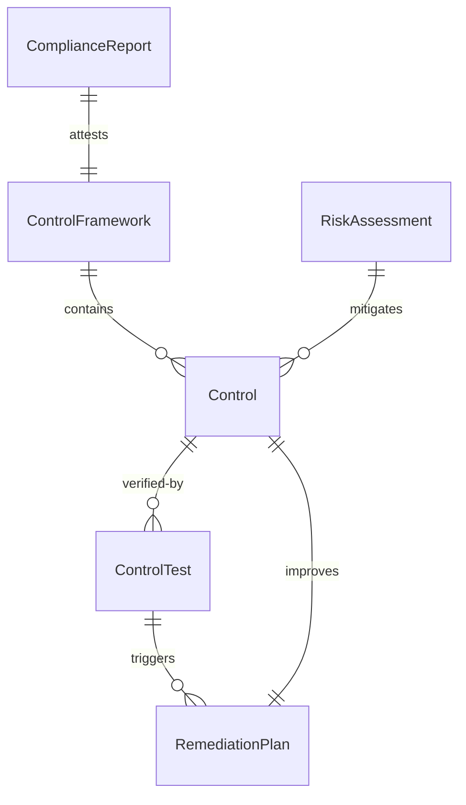
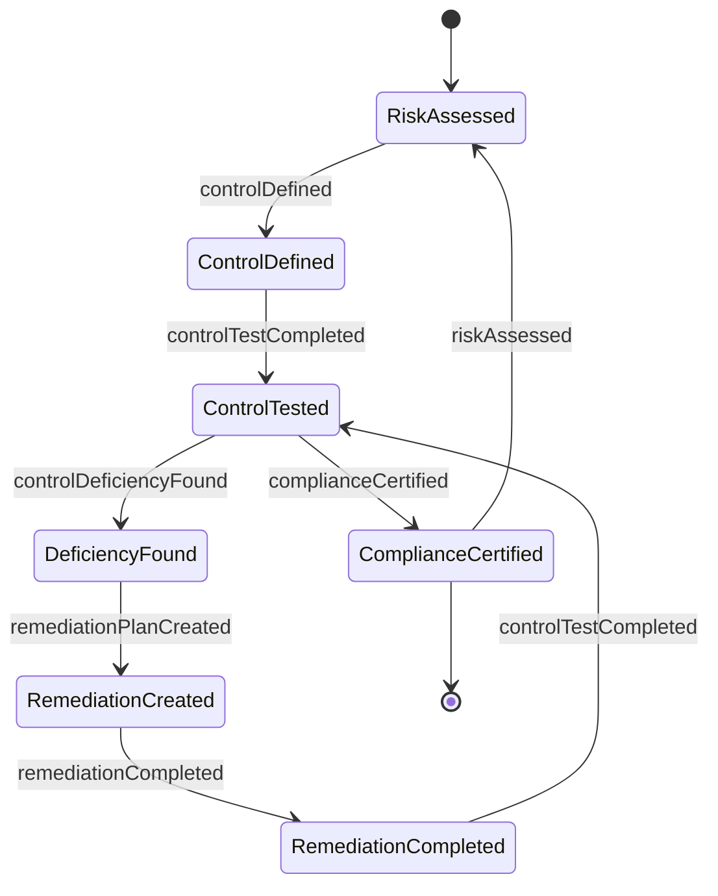
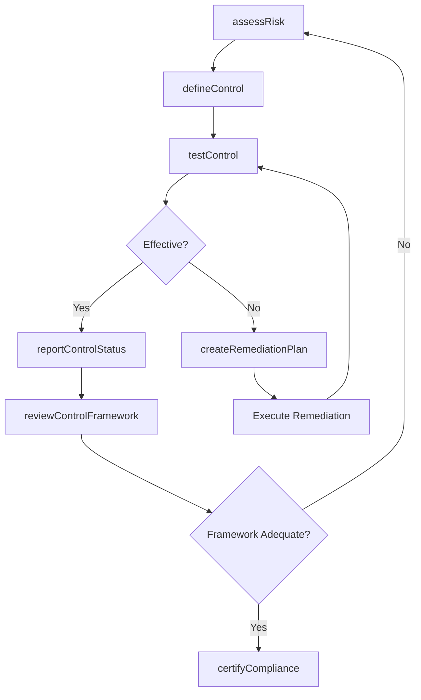
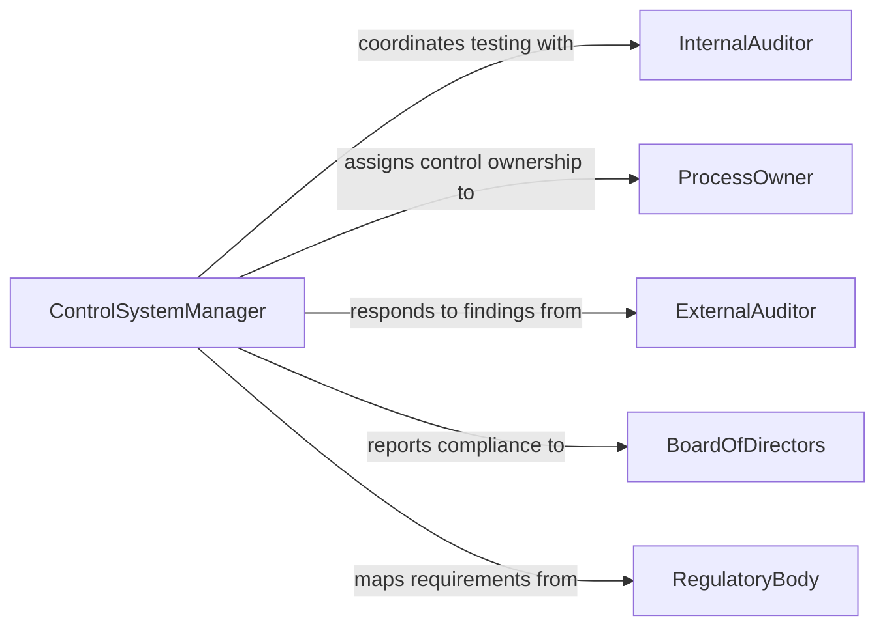

# Manage Control System Activities Organizations

> Business-as-Code definition for managing control system activities in organizations. Models the governance of internal control frameworks, process monitoring, risk mitigation, and compliance reporting across organizational functions.

## Overview

Managing control system activities in organizations involves establishing, monitoring, and improving internal controls that govern business processes, financial reporting, and operational compliance. This definition covers control framework design, risk assessment, control testing, remediation tracking, and management reporting to ensure organizational activities operate within defined risk tolerances and regulatory requirements.

## Actors

| Actor | Description |
|-------|-------------|
| ExternalAuditor | Independent auditor evaluating control effectiveness |
| RegulatoryBody | Government or industry authority mandating control requirements |
| BoardOfDirectors | Governing body overseeing organizational risk and compliance |
| InsuranceUnderwriter | Insurer assessing organizational risk exposure |
| TechnologyVendor | Provider of control automation and monitoring software |
| BusinessPartner | External entity subject to or relying on organizational controls |

## Roles

| Role | Description |
|------|-------------|
| ControlSystemManager | Oversees the design and operation of organizational controls |
| InternalAuditor | Tests and evaluates control effectiveness independently |
| ProcessOwner | Business leader accountable for controls within their function |
| ComplianceAnalyst | Monitors regulatory requirements and maps them to controls |

## Entities

| Entity | Description |
|--------|-------------|
| ControlFramework | A structured set of control objectives and related controls |
| Control | A specific policy, procedure, or mechanism mitigating a risk |
| RiskAssessment | Evaluation of threats and vulnerabilities across business processes |
| ControlTest | A documented test of whether a control is operating effectively |
| RemediationPlan | Action plan to address identified control deficiencies |
| ComplianceReport | Summary of control status for management or regulatory reporting |

## Actions

| Action | Description |
|--------|-------------|
| defineControl | Establish a new control linked to a risk and control objective |
| assessRisk | Evaluate risk levels across organizational processes |
| testControl | Execute a test to determine if a control is operating as designed |
| createRemediationPlan | Develop an action plan to fix a control deficiency |
| reportControlStatus | Generate a compliance or management report on control health |
| reviewControlFramework | Periodically evaluate the overall control framework for adequacy |
| certifyCompliance | Formally attest that controls meet regulatory requirements |

## Events

| Event | Description |
|-------|-------------|
| controlDefined | A new control has been established in the framework |
| riskAssessed | A risk assessment has been completed for a process area |
| controlTestCompleted | A control test has been executed and results documented |
| controlDeficiencyFound | A control has been found ineffective or not operating |
| remediationPlanCreated | An action plan has been developed to address a deficiency |
| remediationCompleted | A control deficiency has been successfully remediated |
| complianceCertified | Formal compliance attestation has been issued |

## Searches

| Search | Description |
|--------|-------------|
| findControlsByRisk | List controls mapped to a specific risk or risk category |
| getTestResults | Retrieve control test outcomes by period, process, or status |
| findOpenDeficiencies | Identify control deficiencies awaiting remediation |
| getComplianceStatus | Check overall compliance posture by framework or regulation |


## Entity Relationships



## State Diagram



## Workflow



## Actor Relationships



## Usage

### Calling Actions

```typescript
import { manageControlSystemActivitiesOrganizations } from '@headlessly/manage-control-system-activities-organizations'

const controls = manageControlSystemActivitiesOrganizations()

// Assess risk for a process area
const assessment = await controls.assessRisk({
  processArea: 'accounts-payable',
  riskFactors: ['fraud', 'duplicate-payment', 'unauthorized-access'],
  assessor: 'IA-015'
})

// Define a new control
const control = await controls.defineControl({
  name: 'Three-Way Invoice Match',
  objective: 'Prevent duplicate or unauthorized payments',
  riskId: assessment.risks[0].id,
  type: 'preventive',
  owner: 'PO-AP-003',
  frequency: 'per-transaction'
})

// Test the control
const test = await controls.testControl({
  controlId: control.id,
  testProcedure: 'Sample 25 invoices and verify three-way match documentation',
  sampleSize: 25,
  testerId: 'IA-015'
})
```

### Event-Driven Automation

```typescript
// Trigger remediation workflow when deficiency is found
controls.controlDeficiencyFound(async ({ controlId, processArea, severity }) => {
  await controls.createRemediationPlan({
    controlId,
    processArea,
    priority: severity === 'material-weakness' ? 'critical' : 'standard',
    dueDate: severity === 'material-weakness' ? '30-days' : '90-days'
  })
  await notify({
    to: 'control-system-manager',
    message: `Control deficiency found in ${processArea}: severity ${severity}`
  })
})

// Notify board when compliance is certified
controls.complianceCertified(async ({ framework, period, certifiedBy }) => {
  await notify({
    to: 'board-audit-committee',
    message: `${framework} compliance certified for ${period} by ${certifiedBy}`
  })
})
```
