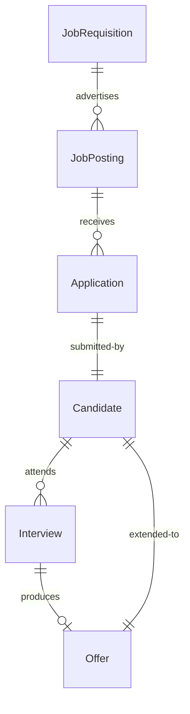
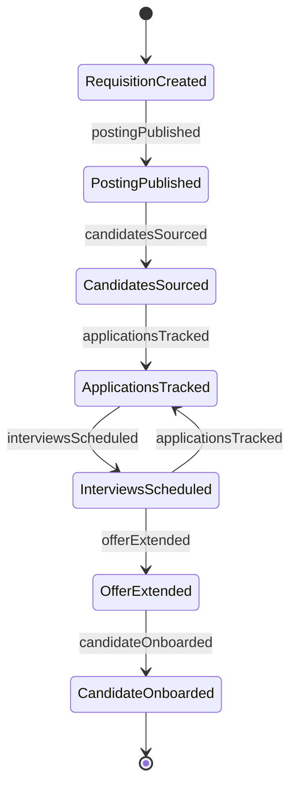
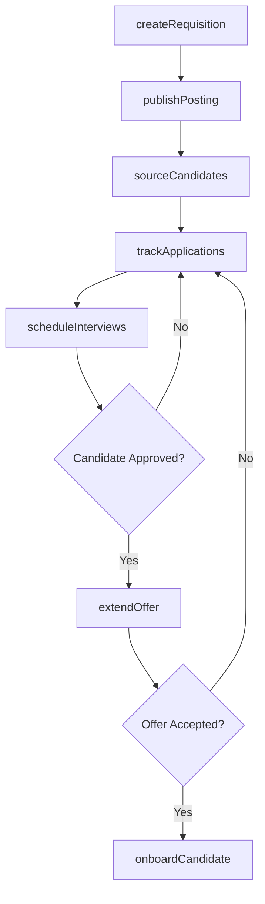
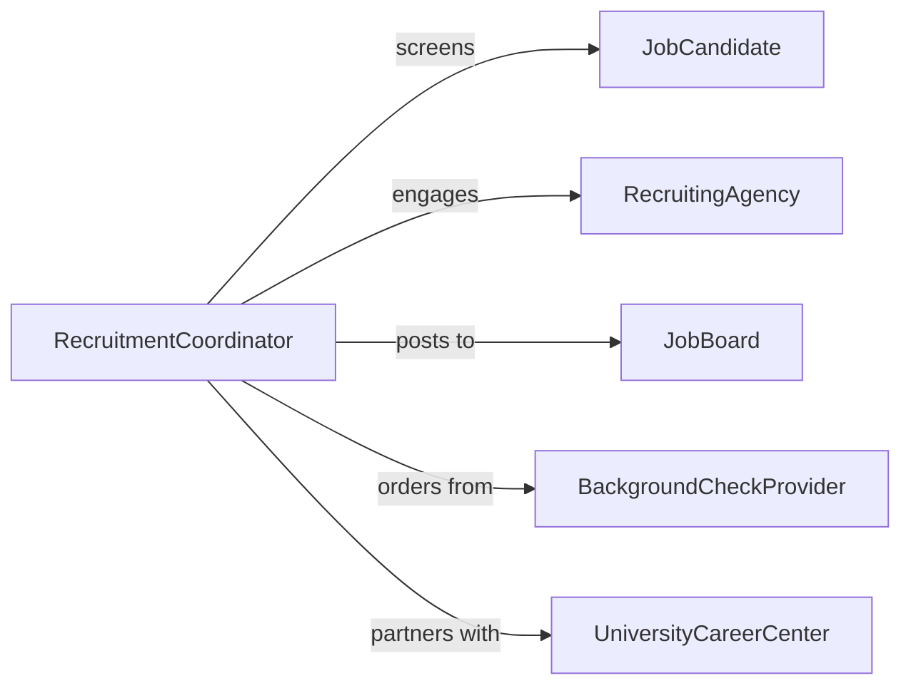

# Coordinate Personnel Recruitment Activities

> Business-as-Code definition for recruitment coordination and talent acquisition. Models the complete hiring lifecycle from requisition through offer acceptance.

## Overview

Personnel recruitment coordination involves managing job postings, candidate sourcing, interview scheduling, applicant tracking, and hiring decisions across departments and positions. This definition exposes actions for requisition management, candidate pipeline development, interview coordination, and offer processing.

## Actors

| Actor | Description |
|-------|-------------|
| JobCandidate | Individual applying for open positions |
| RecruitingAgency | External firm providing candidate sourcing services |
| JobBoard | Platform hosting job postings and applications |
| BackgroundCheckProvider | Vendor conducting employment verification and screening |
| UniversityCareerCenter | Academic institution providing campus recruiting access |
| HiringManager | Department leader requesting and evaluating candidates |

## Roles

| Role | Description |
|------|-------------|
| RecruitmentCoordinator | Oversees hiring processes and candidate flow |
| Recruiter | Sources and screens candidates for open positions |
| InterviewScheduler | Coordinates interview logistics and scheduling |
| TalentAcquisitionManager | Manages overall recruiting strategy and team |

## Entities

| Entity | Description |
|--------|-------------|
| JobRequisition | Formal request to fill an open position |
| JobPosting | Published advertisement for an open role |
| Candidate | Individual in the hiring pipeline |
| Interview | Scheduled evaluation session with a candidate |
| Application | Submitted resume and materials from a candidate |
| Offer | Formal employment proposal with compensation details |

## Actions

| Action | Description |
|--------|-------------|
| createRequisition | Initiate a request to fill an open position |
| publishPosting | Advertise job opening on boards and platforms |
| sourceCandidates | Identify and attract qualified applicants |
| scheduleInterviews | Coordinate evaluation sessions between candidates and interviewers |
| trackApplications | Monitor candidate progress through hiring stages |
| extendOffer | Present formal employment proposal to selected candidate |
| onboardCandidate | Transition accepted candidate to employee status |

## Events

| Event | Description |
|-------|-------------|
| requisitionCreated | Job opening request has been submitted |
| postingPublished | Job advertisement is live on platforms |
| candidatesSourced | Qualified applicants have been identified |
| interviewsScheduled | Evaluation sessions have been confirmed |
| applicationsTracked | Candidate pipeline status updated |
| offerExtended | Employment proposal sent to candidate |
| candidateOnboarded | New hire has accepted and started |

## Searches

| Search | Description |
|--------|-------------|
| findRequisitions | List job openings by department, status, or date |
| getCandidates | Retrieve applicants by position, stage, or skills |
| getInterviews | Find scheduled sessions by date, candidate, or interviewer |
| getOffers | Retrieve employment proposals by status or candidate |


## Entity Relationships



## State Diagram



## Workflow



## Actor Relationships



## Usage

### Calling Actions

```typescript
import { coordinatePersonnelRecruitmentActivities } from '@headlessly/coordinate-personnel-recruitment-activities'

const recruitment = coordinatePersonnelRecruitmentActivities()

// Create a job requisition
const req = await recruitment.createRequisition({
  title: 'Senior Software Engineer',
  department: 'Engineering',
  headcount: 2,
  justification: 'Team expansion for new product line',
  salaryRange: { min: 120000, max: 160000 }
})

// Publish job posting
await recruitment.publishPosting({
  requisitionId: req.id,
  platforms: ['LinkedIn', 'Indeed', 'CompanyWebsite'],
  description: 'We are seeking an experienced engineer...',
  requirements: ['5+ years experience', 'React expertise', 'Team leadership']
})

// Schedule interviews for a candidate
await recruitment.scheduleInterviews({
  candidateId: 'CAND-2026-001',
  interviews: [
    { type: 'Phone Screen', interviewer: 'recruiter@company.com', duration: 30 },
    { type: 'Technical', interviewer: 'tech-lead@company.com', duration: 90 },
    { type: 'Final', interviewer: 'vp-eng@company.com', duration: 60 }
  ]
})
```

### Event-Driven Automation

```typescript
// Automatically source candidates when posting is published
recruitment.postingPublished(async ({ requisitionId, platforms }) => {
  await recruitment.sourceCandidates({
    requisitionId,
    sources: ['RecruitingAgency', 'UniversityCareerCenter']
  })
})

// Notify hiring manager when candidate reaches final stage
recruitment.applicationsTracked(async ({ candidateId, stage }) => {
  if (stage === 'Final Interview') {
    await notify({
      to: 'hiring-manager',
      message: `Candidate ${candidateId} ready for final interview`
    })
  }
})
```
