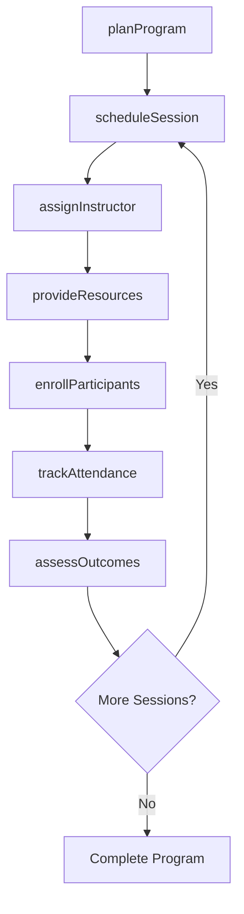
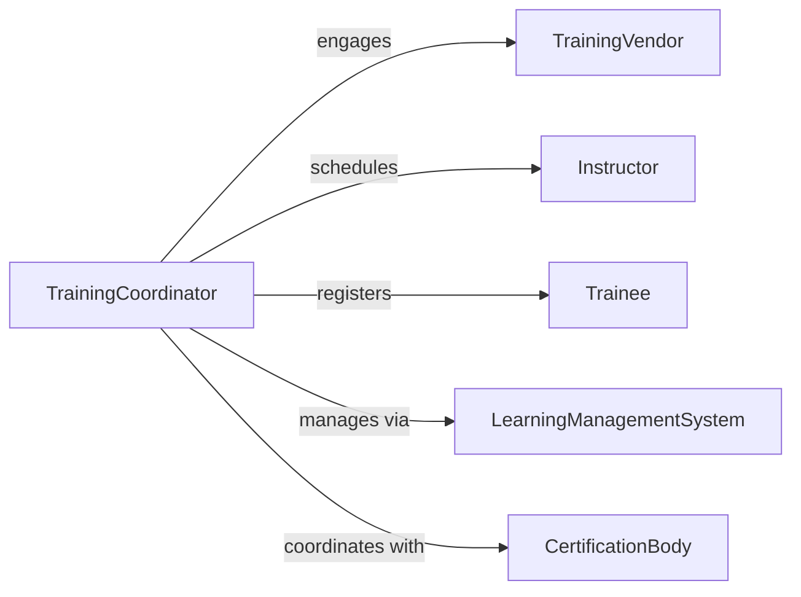

# Coordinate Training Activities

> Business-as-Code definition for employee training and development coordination. Models planning, scheduling, delivery, and tracking of organizational learning programs.

## Overview

Training activity coordination involves identifying learning needs, scheduling training sessions, managing instructors and materials, tracking attendance, and measuring training effectiveness. This definition provides actions for program planning, logistics management, delivery coordination, and outcomes assessment.

## Actors

| Actor | Description |
|-------|-------------|
| TrainingVendor | External provider of specialized courses or certifications |
| Instructor | Subject matter expert delivering training content |
| Trainee | Employee participating in learning activities |
| LearningManagementSystem | Platform hosting online courses and tracking |
| CertificationBody | Organization providing professional credentials |
| FacilityProvider | Venue hosting in-person training sessions |

## Roles

| Role | Description |
|------|-------------|
| TrainingCoordinator | Oversees scheduling and logistics for all training programs |
| InstructionalDesigner | Creates and curates training content and materials |
| FacilitationManager | Manages instructors and training delivery |
| LearningAnalyst | Tracks and analyzes training effectiveness |

## Entities

| Entity | Description |
|--------|-------------|
| TrainingProgram | Structured learning initiative with defined objectives |
| TrainingSession | Scheduled instance of course delivery |
| Curriculum | Collection of courses and materials for a learning path |
| Enrollment | Registration of an employee in a training session |
| TrainingMaterial | Content, slides, or resources for instruction |
| CompletionRecord | Documentation of training attendance and outcomes |

## Actions

| Action | Description |
|--------|-------------|
| planProgram | Design training initiative with goals and target audience |
| scheduleSession | Set date, time, and location for training delivery |
| enrollParticipants | Register employees for specific training sessions |
| assignInstructor | Allocate subject matter expert to deliver content |
| provideResources | Distribute training materials and access to learners |
| trackAttendance | Monitor participation in training sessions |
| assessOutcomes | Evaluate learning effectiveness and skill acquisition |

## Events

| Event | Description |
|-------|-------------|
| programPlanned | Training initiative has been designed |
| sessionScheduled | Training delivery has been confirmed |
| participantsEnrolled | Employees registered for training |
| instructorAssigned | Expert allocated to deliver content |
| resourcesProvided | Materials distributed to learners |
| attendanceTracked | Participation recorded |
| outcomesAssessed | Learning effectiveness measured |

## Searches

| Search | Description |
|--------|-------------|
| findPrograms | List training initiatives by topic, department, or status |
| getSessions | Retrieve scheduled training by date, instructor, or location |
| getEnrollments | Find participant registrations by employee or session |
| getCompletions | Retrieve training records by employee or program |

## Workflow



## Actor Relationships



## Usage

### Calling Actions

```typescript
import { coordinateTrainingActivities } from '@headlessly/coordinate-training-activities'

const training = coordinateTrainingActivities()

// Plan a new leadership development program
const program = await training.planProgram({
  name: 'Manager Essentials',
  objectives: ['Effective delegation', 'Performance feedback', 'Conflict resolution'],
  targetAudience: 'New managers',
  duration: '3 months'
})

// Schedule training sessions
const session = await training.scheduleSession({
  programId: program.id,
  topic: 'Giving Effective Feedback',
  date: '2026-04-15',
  time: '09:00-12:00',
  location: 'Conference Room A',
  maxParticipants: 20
})

// Enroll participants
await training.enrollParticipants({
  sessionId: session.id,
  participants: ['emp-001', 'emp-045', 'emp-087', 'emp-102']
})

// Assign instructor
await training.assignInstructor({
  sessionId: session.id,
  instructor: 'Dr. Sarah Johnson',
  credentials: 'Certified Leadership Coach'
})
```

### Event-Driven Automation

```typescript
// Send reminders when session is scheduled
training.sessionScheduled(async ({ session, participants }) => {
  await notify({
    to: participants,
    subject: `Training Scheduled: ${session.topic}`,
    message: `You are enrolled in training on ${session.date}`
  })
})

// Auto-generate certificates when outcomes meet threshold
training.outcomesAssessed(async ({ enrollmentId, score }) => {
  if (score >= 80) {
    await generateCertificate({
      enrollmentId,
      template: 'completion-certificate'
    })
  }
})
```
