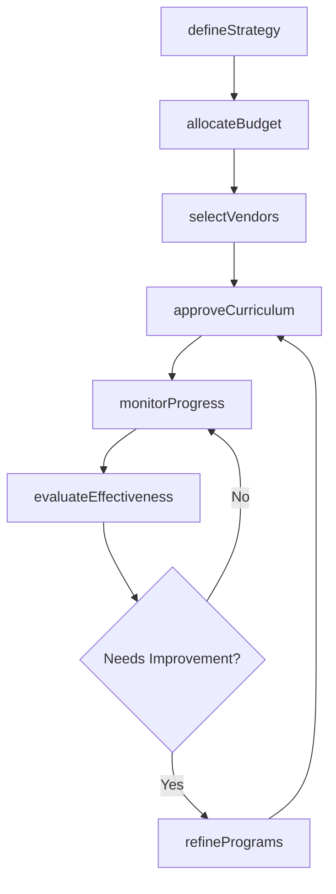
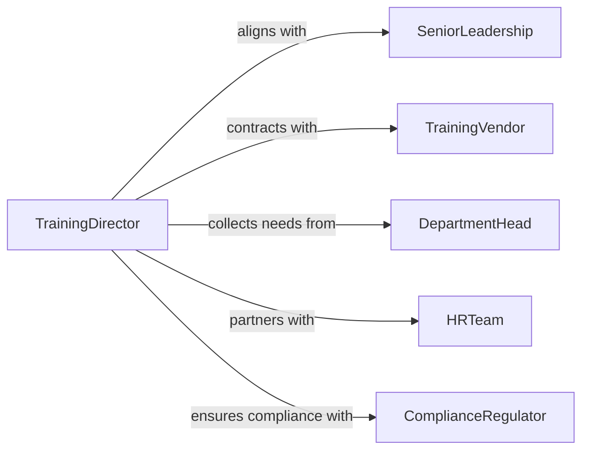

# Direct Employee Training Programs

> Business-as-Code definition for strategic direction of employee training and development programs. Models leadership, oversight, and continuous improvement of organizational learning initiatives.

## Overview

Directing employee training programs involves setting learning strategy, approving curricula, allocating training budgets, evaluating program effectiveness, and ensuring alignment with business objectives. This definition exposes actions for strategic planning, budget management, vendor selection, and program evaluation.

## Actors

| Actor | Description |
|-------|-------------|
| SeniorLeadership | Executive team defining organizational talent strategy |
| TrainingVendor | External provider offering specialized courses or platforms |
| DepartmentHead | Manager identifying skill gaps and training needs |
| HRTeam | Internal function supporting learning and development |
| ComplianceRegulator | Agency mandating required training for certifications |
| EmployeeUnion | Worker organization negotiating training benefits |

## Roles

| Role | Description |
|------|-------------|
| TrainingDirector | Senior leader overseeing all employee development programs |
| LearningStrategist | Designs training portfolio aligned with business goals |
| BudgetManager | Controls training expenditures and ROI analysis |
| VendorManager | Evaluates and manages external training providers |

## Entities

| Entity | Description |
|--------|-------------|
| TrainingStrategy | Multi-year plan for employee skill development |
| TrainingBudget | Financial allocation for learning programs and resources |
| LearningCurriculum | Comprehensive set of courses for roles or departments |
| VendorContract | Agreement with external training providers |
| EffectivenessReport | Analysis of training outcomes and business impact |
| SkillGapAnalysis | Assessment of current vs. required employee competencies |

## Actions

| Action | Description |
|--------|-------------|
| defineStrategy | Establish multi-year vision for employee learning and development |
| approveCurriculum | Review and authorize training content and learning paths |
| allocateBudget | Distribute financial resources across training programs |
| selectVendors | Evaluate and contract with external training providers |
| monitorProgress | Track training completion rates and employee engagement |
| evaluateEffectiveness | Assess training impact on performance and business outcomes |
| refinePrograms | Update curricula and methods based on evaluation results |

## Events

| Event | Description |
|-------|-------------|
| strategyDefined | Training vision and priorities established |
| curriculumApproved | Learning content has been authorized |
| budgetAllocated | Training funds distributed across programs |
| vendorsSelected | External providers contracted |
| progressMonitored | Training metrics captured and reviewed |
| effectivenessEvaluated | Program impact assessed |
| programsRefined | Curricula updated based on feedback |

## Searches

| Search | Description |
|--------|-------------|
| findStrategies | List training plans by year or business unit |
| getCurricula | Retrieve learning paths by role or department |
| getBudgets | Find training allocations by program or period |
| getReports | Retrieve effectiveness analyses by program or timeframe |

## Workflow



## Actor Relationships



## Usage

### Calling Actions

```typescript
import { directEmployeeTrainingPrograms } from '@headlessly/direct-employee-training-programs'

const trainingLeadership = directEmployeeTrainingPrograms()

// Define organizational training strategy
const strategy = await trainingLeadership.defineStrategy({
  period: '2026-2028',
  priorities: ['Technical Skills', 'Leadership Development', 'Digital Transformation'],
  targetParticipation: 95,
  budgetGrowth: 15
})

// Allocate annual training budget
await trainingLeadership.allocateBudget({
  strategyId: strategy.id,
  year: 2026,
  allocations: {
    technicalTraining: 500000,
    leadershipDevelopment: 300000,
    complianceTraining: 150000,
    vendorPlatforms: 250000
  }
})

// Select and contract training vendor
await trainingLeadership.selectVendors({
  category: 'Technical Skills',
  criteria: ['Content Quality', 'Platform Usability', 'ROI'],
  finalists: ['Vendor A', 'Vendor B'],
  selected: 'Vendor A',
  contractValue: 200000
})
```

### Event-Driven Automation

```typescript
// Alert when training completion falls below target
trainingLeadership.progressMonitored(async ({ program, completionRate }) => {
  if (completionRate < 70) {
    await notify({
      to: 'training-director',
      priority: 'high',
      message: `${program} completion at ${completionRate}%, below target`
    })
  }
})

// Automatically trigger program refinement after evaluation
trainingLeadership.effectivenessEvaluated(async ({ programId, impact }) => {
  if (impact.performanceImprovement < 10) {
    await trainingLeadership.refinePrograms({
      programId,
      reason: 'Low performance impact'
    })
  }
})
```
