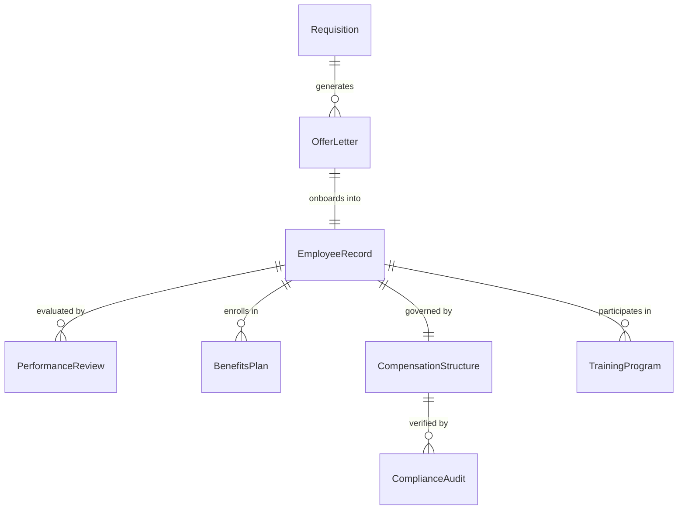
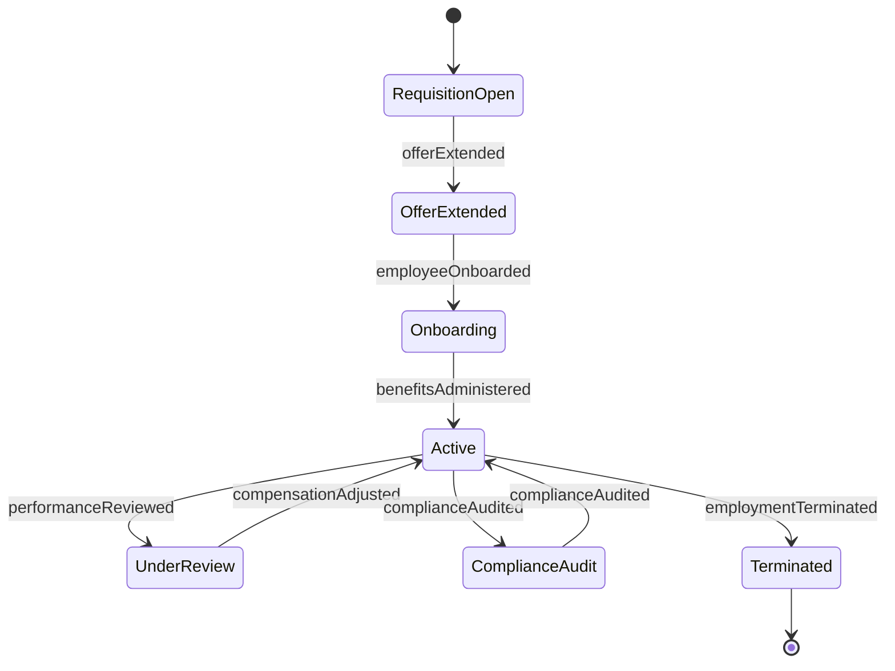
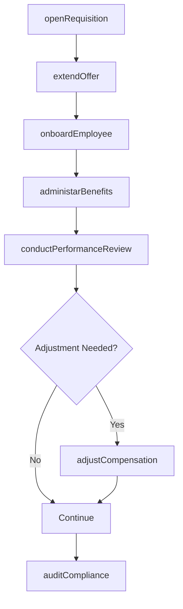
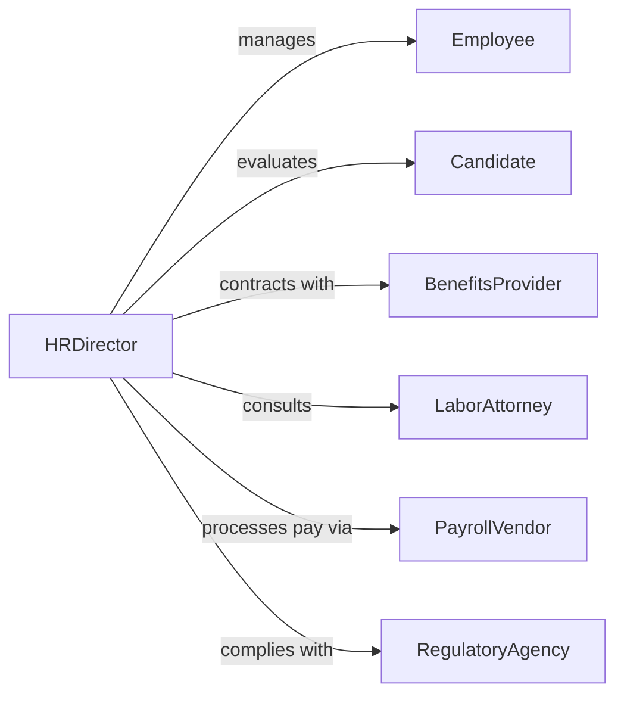

# Manage Human Resources Activities

> Business-as-Code definition for human resources management. Models the oversight of recruitment, employee relations, compensation, benefits administration, and workforce development programs.

## Overview

Human resources management involves coordinating recruitment pipelines, administering employee benefits and compensation, managing performance review cycles, ensuring labor law compliance, and developing workforce capabilities. This definition exposes actions for HR operations management, event triggers for employment lifecycle milestones, and searches for workforce analytics and compliance records.

## Actors

| Actor | Description |
|-------|-------------|
| Employee | Individual employed by the organization |
| Candidate | Applicant being considered for employment |
| BenefitsProvider | Insurance or retirement plan administrator |
| LaborAttorney | Provides guidance on employment law compliance |
| PayrollVendor | Processes employee compensation and tax withholdings |
| TrainingProvider | Delivers professional development programs |
| RegulatoryAgency | Enforces labor laws and workplace regulations |

## Roles

| Role | Description |
|------|-------------|
| HRDirector | Sets HR strategy and oversees all human resources functions |
| Recruiter | Manages candidate sourcing, screening, and hiring |
| HRBusinessPartner | Advises department leaders on people-related matters |
| CompensationAnalyst | Designs and administers pay structures and incentives |
| BenefitsAdministrator | Manages enrollment, claims, and vendor relationships |

## Entities

| Entity | Description |
|--------|-------------|
| EmployeeRecord | Comprehensive profile including employment history and status |
| Requisition | Open position request from a department |
| OfferLetter | Formal employment offer with compensation details |
| PerformanceReview | Documented evaluation of employee performance |
| BenefitsPlan | Insurance, retirement, or wellness program enrollment |
| CompensationStructure | Pay grade, salary range, and bonus framework |
| ComplianceAudit | Review of HR practices against labor regulations |
| TrainingProgram | Organized professional development initiative |

## Actions

| Action | Description |
|--------|-------------|
| openRequisition | Create a new position request for hiring |
| extendOffer | Issue a formal employment offer to a candidate |
| onboardEmployee | Execute the new hire integration process |
| conductPerformanceReview | Evaluate and document employee performance |
| administarBenefits | Manage employee benefit enrollments and changes |
| adjustCompensation | Modify salary, bonus, or incentive structures |
| auditCompliance | Review HR practices for labor law adherence |
| terminateEmployment | Process an employee separation |

## Events

| Event | Description |
|-------|-------------|
| requisitionOpened | A new position request has been created |
| offerExtended | A formal employment offer has been issued |
| employeeOnboarded | A new hire has completed the integration process |
| performanceReviewed | An employee evaluation has been documented |
| benefitsAdministered | Benefit enrollments or changes have been processed |
| compensationAdjusted | Pay or incentive structures have been modified |
| complianceAudited | HR practices have been reviewed for adherence |
| employmentTerminated | An employee separation has been processed |

## Searches

| Search | Description |
|--------|-------------|
| findEmployees | List employees by department, status, or hire date |
| getRequisitions | Retrieve open positions by department or status |
| getPerformanceReviews | Find evaluations by employee, rating, or period |
| getBenefitsEnrollment | View benefit plan participation by employee or plan |
| getComplianceStatus | Check audit results by category or date |


## Entity Relationships



## State Diagram



## Workflow



## Actor Relationships



## Usage

### Calling Actions

```typescript
import { manageHumanResourcesActivities } from '@headlessly/manage-human-resources-activities'

const hr = manageHumanResourcesActivities()

// Open a new requisition
const req = await hr.openRequisition({
  title: 'Senior Software Engineer',
  department: 'engineering',
  level: 'senior',
  compensationRange: { min: 140000, max: 180000 }
})

// Extend an offer and onboard
await hr.extendOffer({
  requisitionId: req.id,
  candidateId: 'cand-2205',
  salary: 165000,
  startDate: '2026-03-01',
  benefits: ['health', 'dental', '401k']
})

// Conduct a performance review
await hr.conductPerformanceReview({
  employeeId: 'emp-1104',
  period: 'H2-2025',
  rating: 'exceeds-expectations',
  goals: ['lead-architecture-redesign', 'mentor-junior-engineers']
})
```

### Event-Driven Automation

```typescript
// Auto-enroll new hires in benefits
hr.employeeOnboarded(async ({ employeeId, startDate }) => {
  await hr.administarBenefits({
    employeeId,
    plans: ['health-standard', 'dental', '401k-default'],
    effectiveDate: startDate
  })
})

// Alert legal on compliance audit findings
hr.complianceAudited(async ({ findings, severity }) => {
  if (severity === 'high') {
    await notify({
      to: 'labor-attorney',
      message: `High-severity compliance finding: ${findings}`
    })
  }
})
```
