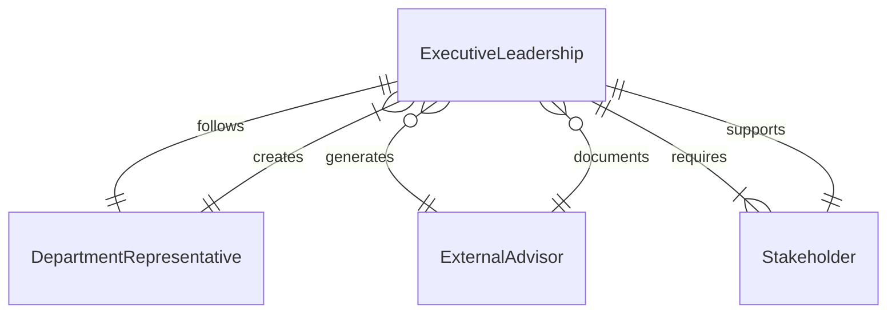
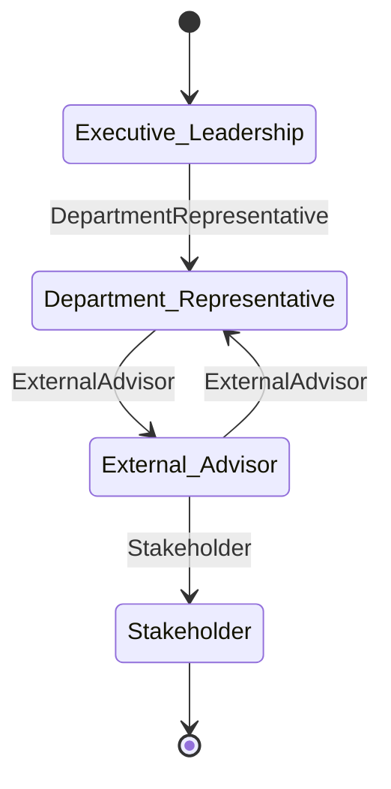
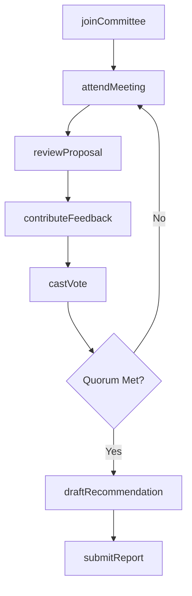
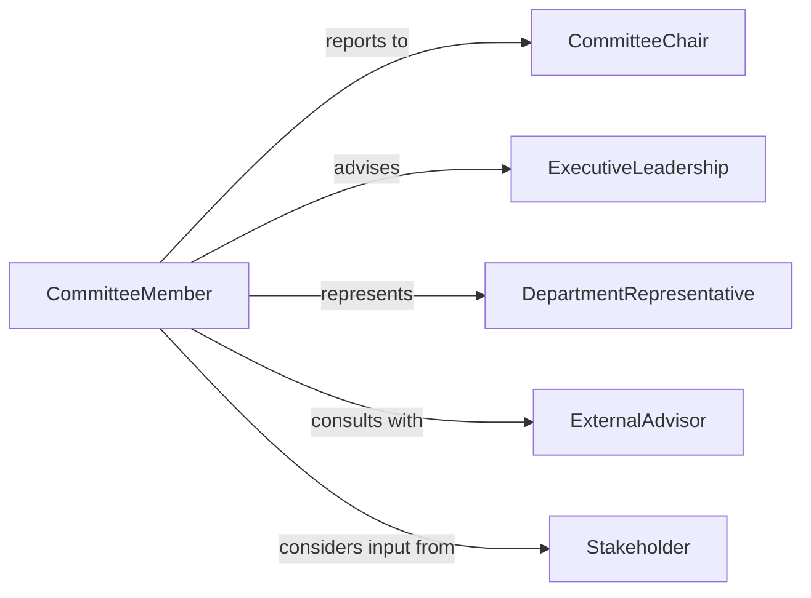

# Serve Institutional Departmental Committees

> Business-as-Code definition for organizational committee participation and governance. Models membership, meeting participation, decision-making, and committee deliverables.

## Overview

Serving on institutional or departmental committees involves participating in governance bodies, attending meetings, contributing to decisions, reviewing proposals, and producing recommendations. This definition provides actions for committee membership management, meeting coordination, voting processes, and deliverable tracking.

## Actors

| Actor | Description |
|-------|-------------|
| ExecutiveLeadership | Senior management reviewing committee recommendations |
| DepartmentRepresentative | Staff member representing functional area interests |
| ExternalAdvisor | Outside expert providing specialized input |
| Stakeholder | Individual or group affected by committee decisions |
| Compliance Officer | Internal auditor ensuring governance adherence |
| BoardOfDirectors | Highest governance body receiving committee reports |

## Roles

| Role | Description |
|------|-------------|
| CommitteeChair | Leader facilitating meetings and driving outcomes |
| CommitteeMember | Participant contributing expertise and voting |
| CommitteeSecretary | Administrator managing documentation and minutes |
| SubcommitteeLeader | Coordinator of specialized working groups |

## Entities

| Entity | Description |
|--------|-------------|
| Committee | Formal group chartered to address specific topics |
| CommitteeMeeting | Scheduled session for discussion and decision-making |
| Proposal | Recommendation or initiative brought before the committee |
| Vote | Formal decision recorded by committee members |
| MeetingMinutes | Official record of discussions and outcomes |
| Recommendation | Committee advice provided to leadership |

## Actions

| Action | Description |
|--------|-------------|
| joinCommittee | Accept appointment to a governance body |
| attendMeeting | Participate in scheduled committee session |
| reviewProposal | Analyze and provide input on submitted recommendations |
| castVote | Record formal decision on committee matters |
| contributeFeedback | Share expertise and perspective on agenda items |
| draftRecommendation | Prepare formal advice for leadership |
| submitReport | Deliver committee findings and outcomes |

## Events

| Event | Description |
|-------|-------------|
| committeeJoined | Member appointed to committee |
| meetingAttended | Committee session participated in |
| proposalReviewed | Recommendation analyzed by committee |
| voteCast | Formal decision recorded |
| feedbackContributed | Member input provided |
| recommendationDrafted | Formal advice prepared |
| reportSubmitted | Committee deliverable provided to leadership |

## Searches

| Search | Description |
|--------|-------------|
| findCommittees | List governance bodies by type, charter, or status |
| getMeetings | Retrieve scheduled sessions by committee or date |
| getProposals | Find recommendations by topic, status, or sponsor |
| getRecommendations | Retrieve committee advice by recipient or date |

## Entity Relationships




## State Diagram



## Workflow



## Actor Relationships



## Usage

### Calling Actions

```typescript
import { serveInstitutionalDepartmentalCommittees } from '@headlessly/serve-institutional-departmental-committees'

const committee = serveInstitutionalDepartmentalCommittees()

// Join a committee
await committee.joinCommittee({
  committeeName: 'Budget Oversight Committee',
  memberId: 'emp-12345',
  role: 'Member',
  term: { start: '2026-01-01', end: '2027-12-31' }
})

// Attend meeting and review proposal
await committee.attendMeeting({
  committeeId: 'CMTE-001',
  meetingDate: '2026-03-15',
  memberId: 'emp-12345'
})

const proposal = await committee.reviewProposal({
  proposalId: 'PROP-2026-042',
  reviewer: 'emp-12345',
  analysis: 'Financial impact appears sound, recommend approval'
})

// Cast vote on proposal
await committee.castVote({
  proposalId: 'PROP-2026-042',
  memberId: 'emp-12345',
  vote: 'Approve',
  comment: 'Strong business case demonstrated'
})
```

### Event-Driven Automation

```typescript
// Notify members when proposal submitted for review
committee.proposalReviewed(async ({ proposalId, committeeId }) => {
  const members = await getCommitteeMembers({ committeeId })
  await notify({
    to: members,
    subject: `New Proposal for Review: ${proposalId}`,
    message: 'Please review and provide feedback before next meeting'
  })
})

// Auto-draft recommendation when all votes cast
committee.voteCast(async ({ proposalId, votes }) => {
  if (allMembersVoted(votes)) {
    await committee.draftRecommendation({
      proposalId,
      decision: tallVotes(votes)
    })
  }
})
```
