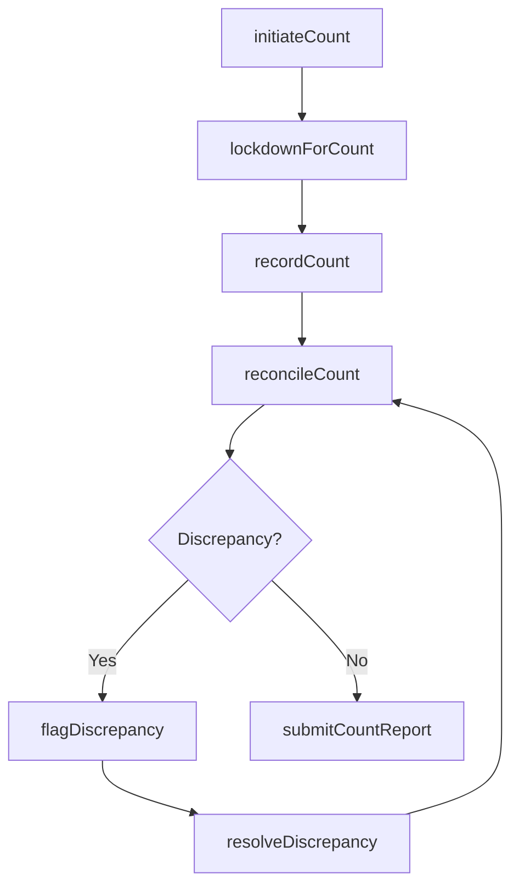
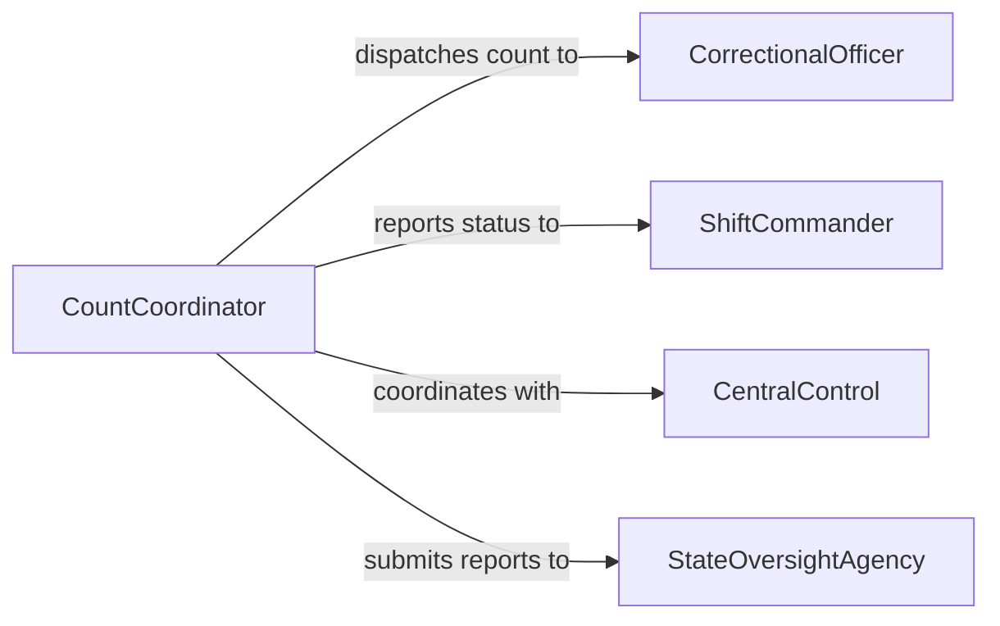

# Count Prison Inmates Personnel

> Business-as-Code definition for counting and tracking prison inmates and correctional facility personnel. Models scheduled headcounts, emergency counts, and reconciliation workflows to ensure facility accountability.

## Overview

Counting prison inmates and personnel is a critical security function in correctional facility operations. Facilities conduct multiple daily headcounts at scheduled intervals, during movement, and in response to emergencies. This definition provides actions for initiating counts, reconciling discrepancies, and generating compliance reports that meet state and federal oversight requirements.

## Actors

| Actor | Description |
|-------|-------------|
| CorrectionalOfficer | Conducts physical headcounts within assigned housing units |
| ShiftCommander | Authorizes emergency counts and receives count reports |
| CentralControl | Coordinates facility-wide count procedures and communications |
| Inmate | Subject of the headcount who must be present and accounted for |
| StateOversightAgency | Receives periodic population reports for compliance auditing |

## Roles

| Role | Description |
|------|-------------|
| CountCoordinator | Manages the count schedule and ensures all areas report |
| HousingUnitOfficer | Performs direct physical counts within a designated area |
| PopulationAnalyst | Reconciles count data and investigates discrepancies |
| ComplianceOfficer | Ensures count procedures meet regulatory standards |

## Entities

| Entity | Description |
|--------|-------------|
| Headcount | A formal tally of inmates at a specific time and location |
| CountSchedule | The recurring timetable for all daily and special counts |
| InmateRoster | The official list of inmates assigned to each housing unit |
| Discrepancy | A mismatch between expected and actual count totals |
| PersonnelLog | Record of staff on duty during each count period |
| CountReport | Summary document submitted to oversight for compliance |

## Actions

| Action | Description |
|--------|-------------|
| initiateCount | Begin a scheduled or emergency headcount across the facility |
| recordCount | Log the physical tally for a specific housing unit or area |
| reconcileCount | Compare recorded counts against the expected inmate roster |
| flagDiscrepancy | Mark a count as mismatched and trigger investigation |
| resolveDiscrepancy | Document the resolution of a count mismatch |
| submitCountReport | Generate and submit a formal count report to oversight |
| lockdownForCount | Restrict inmate movement during an active count procedure |

## Events

| Event | Description |
|-------|-------------|
| countInitiated | A headcount procedure has been started facility-wide |
| countRecorded | A housing unit has submitted its tally |
| countReconciled | All unit tallies match the expected population |
| discrepancyFlagged | A count mismatch has been identified |
| discrepancyResolved | A previously flagged mismatch has been explained and closed |
| countReportSubmitted | A formal count report has been filed with oversight |
| lockdownActivated | Facility movement has been restricted for counting |

## Searches

| Search | Description |
|--------|-------------|
| findCounts | List headcounts by date, shift, housing unit, or status |
| getDiscrepancies | Retrieve unresolved count mismatches by unit or time range |
| getPopulationTotals | Return current inmate population by housing unit or classification |
| getCountHistory | Retrieve historical count records for compliance auditing |

## Workflow



## Actor Relationships



## Usage

### Calling Actions

```typescript
import { countPrisonInmatesPersonnel } from '@headlessly/count-prison-inmates-personnel'

const counts = countPrisonInmatesPersonnel()

// Initiate a scheduled evening headcount
const count = await counts.initiateCount({
  type: 'scheduled',
  shift: 'evening',
  facility: 'State Correctional Institution - Central',
  timestamp: '2026-02-05T17:00:00Z'
})

// Record a housing unit tally
await counts.recordCount({
  countId: count.id,
  housingUnit: 'Block-C',
  expected: 48,
  actual: 48,
  officer: 'Officer Rodriguez'
})

// Reconcile all unit counts
const result = await counts.reconcileCount({
  countId: count.id
})
```

### Event-Driven Automation

```typescript
// Alert shift commander on discrepancy
counts.discrepancyFlagged(async ({ countId, housingUnit, expected, actual }) => {
  await notify({
    to: 'shift-commander',
    priority: 'critical',
    message: `Count discrepancy in ${housingUnit}: expected ${expected}, found ${actual}`
  })
})

// Auto-submit report when count clears
counts.countReconciled(async ({ countId, facility }) => {
  await counts.submitCountReport({
    countId,
    facility,
    status: 'reconciled'
  })
})
```
