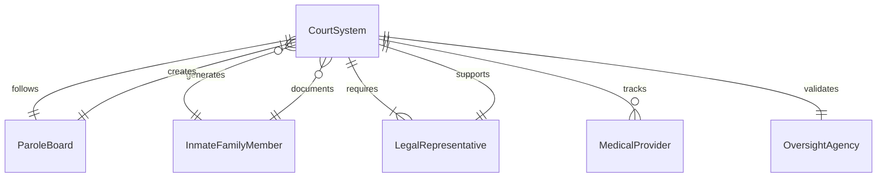
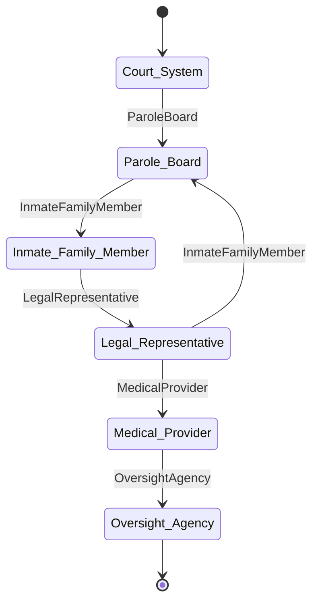
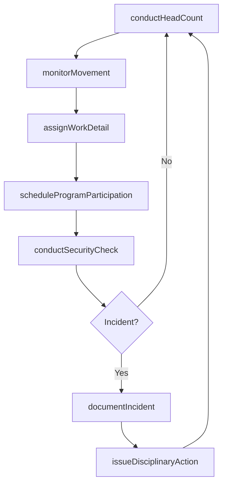
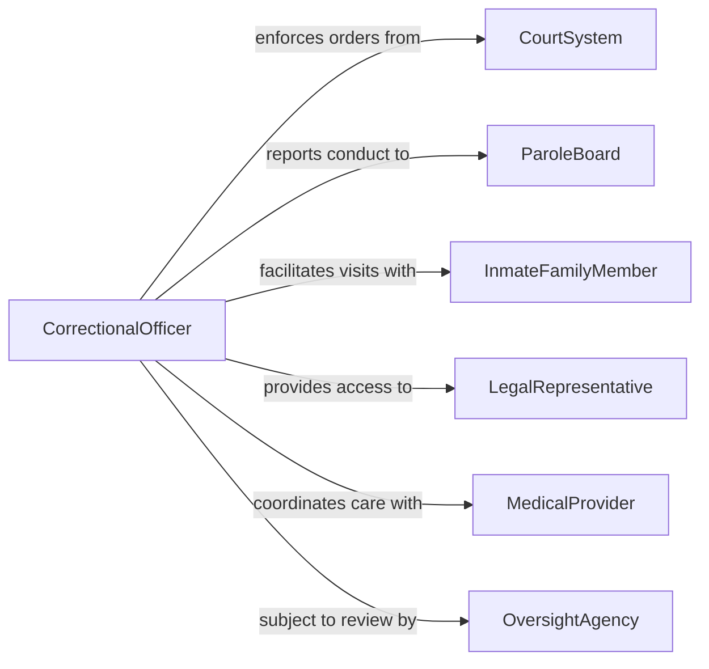

# Supervise Inmate Activities

> Business-as-Code definition for supervising inmate activities in correctional facilities. Models the monitoring, scheduling, and documentation of daily inmate programs, movement, conduct, and compliance within a detention or correctional environment.

## Overview

Supervising inmate activities involves overseeing the daily routines, movements, work assignments, recreational programs, and behavioral conduct of individuals housed in correctional facilities. Supervisors ensure that inmates follow facility rules, participate in mandated programs, and maintain orderly conduct while documenting incidents, conducting security checks, and coordinating with case management staff. This activity is critical for maintaining facility safety, supporting rehabilitation goals, and ensuring compliance with correctional standards and regulations.

## Actors

| Actor | Description |
|-------|-------------|
| CourtSystem | Judicial authority issuing custody orders and sentencing conditions |
| ParoleBoard | Agency overseeing parole eligibility reviews and release conditions |
| InmateFamilyMember | Relative or approved visitor communicating with or visiting an inmate |
| LegalRepresentative | Attorney representing an inmate's legal rights and interests |
| MedicalProvider | Healthcare professional delivering medical or mental health services to inmates |
| OversightAgency | External body auditing facility conditions and treatment of inmates |

## Roles

| Role | Description |
|------|-------------|
| CorrectionalOfficer | Directly supervises inmate conduct, movement, and daily activities |
| ShiftSupervisor | Oversees correctional officers and manages security operations for a shift |
| CaseManager | Coordinates inmate program participation, classification, and reentry planning |
| ProgramCoordinator | Manages educational, vocational, and rehabilitative programming for inmates |

## Entities

| Entity | Description |
|--------|-------------|
| InmateRecord | A comprehensive profile including custody status, classification, and activity history |
| ActivitySchedule | The daily timetable of inmate programs, meals, recreation, and work assignments |
| IncidentReport | A documented account of a rule violation, altercation, or security event |
| HeadCount | A scheduled or unscheduled verification of inmate presence and location |
| WorkAssignment | A designated job or task an inmate performs within the facility |
| DisciplinaryAction | A formal consequence imposed for a rule violation or misconduct |

## Actions

| Action | Description |
|--------|-------------|
| conductHeadCount | Perform a count to verify all inmates are present and accounted for |
| monitorMovement | Track and control inmate movement between housing units, programs, and facilities |
| assignWorkDetail | Designate inmates to work assignments based on classification and availability |
| documentIncident | Record a security event, rule violation, or behavioral observation |
| scheduleProgramParticipation | Enroll inmates in educational, vocational, or treatment programs |
| issueDisciplinaryAction | Impose consequences for documented rule violations following due process |
| conductSecurityCheck | Perform cell inspections, contraband searches, or perimeter checks |

## Events

| Event | Description |
|-------|-------------|
| headCountCompleted | An inmate count has been conducted and verified |
| movementAuthorized | Inmate movement between designated areas has been approved and logged |
| workDetailAssigned | An inmate has been assigned to a specific work duty |
| incidentDocumented | A security event or rule violation has been formally recorded |
| programParticipationScheduled | An inmate has been enrolled in a facility program |
| disciplinaryActionIssued | A formal sanction has been imposed following a hearing or review |
| securityCheckCompleted | A cell inspection or security sweep has been conducted and logged |

## Searches

| Search | Description |
|--------|-------------|
| findInmates | Query inmate records by housing unit, classification, or status |
| getIncidentHistory | Retrieve incident reports by inmate, date range, or severity |
| getActivitySchedule | Look up the daily schedule for a specific housing unit or inmate |
| getDisciplinaryActions | Query disciplinary records by inmate, violation type, or date |

## Entity Relationships




## State Diagram



## Workflow



## Actor Relationships



## Usage

### Calling Actions

```typescript
import { superviseInmateActivities } from '@headlessly/supervise-inmate-activities'

const supervision = superviseInmateActivities()

// Conduct the morning head count
const count = await supervision.conductHeadCount({
  facility: 'Central Correctional Institution',
  housingUnit: 'Block C',
  scheduledTime: '2026-02-05T06:00:00',
  type: 'scheduled'
})

// Assign work details for the day
await supervision.assignWorkDetail({
  inmateId: 'INM-44821',
  assignment: 'kitchen',
  shift: 'morning',
  startDate: '2026-02-05',
  supervisor: 'Officer Martinez'
})

// Document an incident
await supervision.documentIncident({
  facility: 'Central Correctional Institution',
  housingUnit: 'Block C',
  type: 'ruleViolation',
  severity: 'minor',
  inmatesInvolved: ['INM-44821'],
  description: 'Inmate failed to report to assigned work detail at scheduled time',
  reportingOfficer: 'Officer Johnson',
  timestamp: '2026-02-05T07:15:00'
})
```

### Event-Driven Automation

```typescript
// Alert shift supervisor on serious incidents
supervision.incidentDocumented(async ({ incidentId, severity, housingUnit }) => {
  if (severity === 'major' || severity === 'critical') {
    await notify({
      to: 'shift-supervisor',
      message: `Serious incident reported in ${housingUnit} - incident ${incidentId} requires immediate review`,
      priority: 'urgent'
    })
  }
})

// Update parole board when disciplinary actions are issued
supervision.disciplinaryActionIssued(async ({ inmateId, violation, sanction }) => {
  await updateRecord({
    system: 'parole-tracking',
    inmateId,
    event: 'disciplinaryAction',
    details: { violation: violation.type, sanction: sanction.description }
  })
})
```
