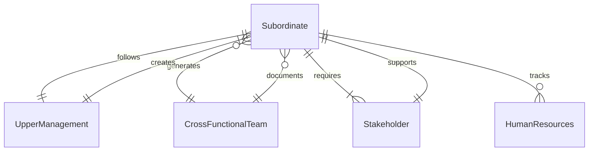
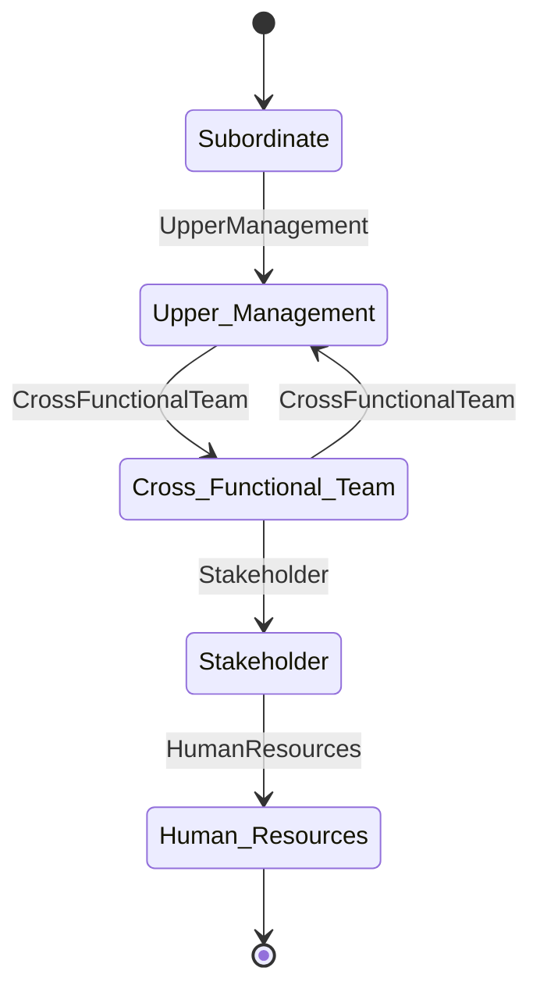
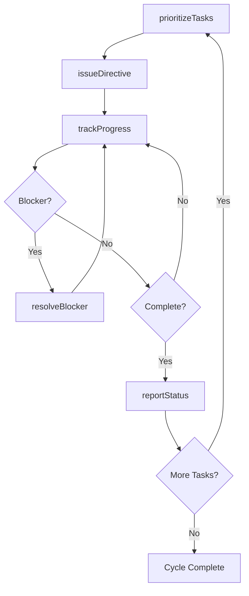
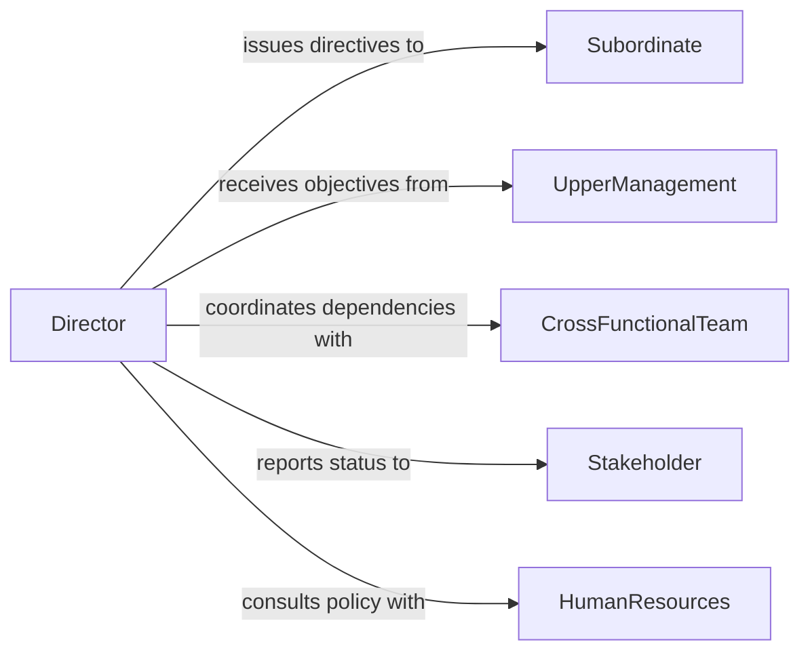

# Direct Activities Subordinates

> Business-as-Code definition for directing the day-to-day activities of subordinate staff. Models task delegation, priority setting, progress tracking, and operational coordination across teams.

## Overview

Directing subordinate activities involves providing clear instructions, setting priorities, and coordinating the execution of work across team members. Unlike general supervision, directing emphasizes real-time operational command -- issuing specific instructions, reallocating resources in response to changing conditions, and ensuring tasks are completed in the correct sequence. This definition provides actions for work direction and events for tracking task flow and completion.

## Actors

| Actor | Description |
|-------|-------------|
| Subordinate | Team member who receives and executes directed tasks |
| UpperManagement | Senior leaders who define strategic objectives and priorities |
| CrossFunctionalTeam | Adjacent team whose work dependencies affect task sequencing |
| Stakeholder | Internal or external party with interest in work outcomes |
| HumanResources | Provides workforce policy guidance for task assignment decisions |

## Roles

| Role | Description |
|------|-------------|
| Director | Issues instructions and coordinates subordinate activities |
| OperationsLead | Manages real-time workflow and resource allocation |
| TaskCoordinator | Tracks task dependencies and ensures proper sequencing |
| ReportingAnalyst | Compiles progress data and produces operational status reports |

## Entities

| Entity | Description |
|--------|-------------|
| Directive | A formal instruction or set of instructions issued to subordinates |
| TaskQueue | The prioritized list of pending work items for a team |
| ProgressReport | A summary of task completion status and milestones |
| ResourceAllocation | The assignment of personnel and materials to specific activities |
| Dependency | A relationship between tasks where one must complete before another begins |
| OperationalPlan | The documented plan defining task sequences and timelines |

## Actions

| Action | Description |
|--------|-------------|
| issueDirective | Provide specific instructions to subordinates for task execution |
| prioritizeTasks | Order pending work items by urgency and importance |
| reallocateResources | Reassign personnel or materials in response to changing needs |
| trackProgress | Monitor task completion against milestones and deadlines |
| resolveBlocker | Address obstacles preventing subordinates from completing work |
| escalateIssue | Raise unresolved problems to upper management for decision |
| reportStatus | Generate and distribute operational progress summaries |

## Events

| Event | Description |
|-------|-------------|
| directiveIssued | A specific instruction has been communicated to subordinates |
| tasksPrioritized | The work queue has been reordered based on current priorities |
| resourcesReallocated | Personnel or materials have been reassigned to different tasks |
| progressTracked | A milestone or task completion status has been recorded |
| blockerResolved | An obstacle preventing work completion has been addressed |
| issueEscalated | An unresolved problem has been raised to upper management |
| statusReported | An operational progress summary has been distributed |

## Searches

| Search | Description |
|--------|-------------|
| findDirectives | List instructions by subordinate, date, status, or priority |
| getTaskQueue | Retrieve the prioritized list of pending work for a team |
| getBlockers | Return unresolved obstacles by team, task, or severity |
| getProgressSummary | Retrieve completion metrics and milestone status for a period |

## Entity Relationships




## State Diagram



## Workflow



## Actor Relationships



## Usage

### Calling Actions

```typescript
import { directActivitiesSubordinates } from '@headlessly/direct-activities-subordinates'

const direction = directActivitiesSubordinates()

// Prioritize the team work queue
await direction.prioritizeTasks({
  teamId: 'ops-team-alpha',
  criteria: 'deadline-and-impact',
  tasks: [
    { taskId: 'task-401', priority: 1 },
    { taskId: 'task-402', priority: 2 },
    { taskId: 'task-403', priority: 3 }
  ]
})

// Issue a specific directive
const directive = await direction.issueDirective({
  subordinateId: 'emp-3001',
  instruction: 'Complete site inspection for Building B before noon',
  deadline: '2026-02-05T12:00:00Z',
  dependencies: ['task-401']
})

// Track progress and resolve blockers
const progress = await direction.trackProgress({ teamId: 'ops-team-alpha' })
if (progress.blockers.length > 0) {
  await direction.resolveBlocker({
    blockerId: progress.blockers[0].id,
    resolution: 'Reassigned equipment from Team Bravo'
  })
}
```

### Event-Driven Automation

```typescript
// Auto-escalate unresolved blockers
direction.directiveIssued(async ({ directiveId, deadline }) => {
  setTimeout(async () => {
    const status = await direction.trackProgress({ directiveId })
    if (status.blockers.length > 0) {
      await direction.escalateIssue({
        directiveId,
        reason: 'Unresolved blocker approaching deadline'
      })
    }
  }, calculateWarningTime(deadline))
})

// Notify stakeholders on status report
direction.statusReported(async ({ teamId, summary }) => {
  await notify({
    to: 'stakeholders',
    message: `Team ${teamId} status: ${summary.completedTasks}/${summary.totalTasks} tasks complete`
  })
})
```
