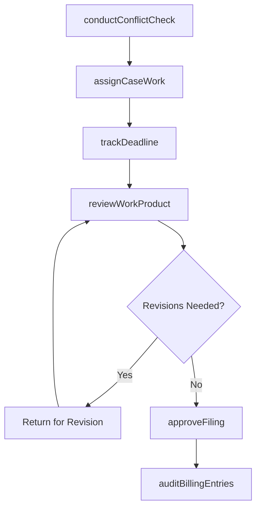
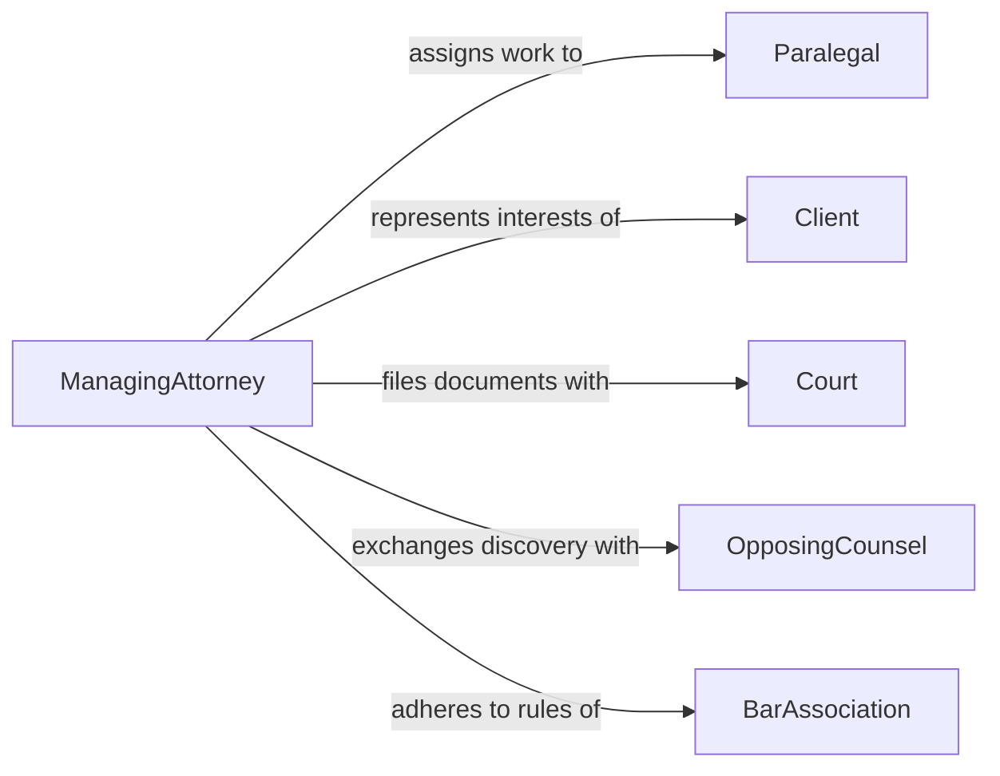

# Supervise Activities Legal Personnel

> Business-as-Code definition for supervising legal staff including paralegals, legal assistants, law clerks, and junior attorneys. Models case assignment, work product review, and compliance with legal ethics and deadlines.

## Overview

Supervising legal personnel involves overseeing the work of paralegals, legal assistants, law clerks, and junior associates who support case preparation, document drafting, and client communications. Supervisors assign case-related tasks, review work product for accuracy and compliance with court rules, track critical deadlines, and ensure adherence to professional ethics standards. This definition provides actions for legal workflow management and events for deadline and quality tracking.

## Actors

| Actor | Description |
|-------|-------------|
| Paralegal | Performs legal research, document preparation, and case management tasks |
| Client | Party represented whose interests guide case strategy and priorities |
| Court | Judicial authority that sets filing deadlines and procedural requirements |
| OpposingCounsel | Adverse party's legal representative involved in discovery and negotiation |
| BarAssociation | Professional body that enforces ethical standards and licensing |

## Roles

| Role | Description |
|------|-------------|
| ManagingAttorney | Oversees legal staff and maintains responsibility for case outcomes |
| SeniorParalegal | Coordinates paralegal assignments and mentors junior staff |
| DocketClerk | Tracks court deadlines, filing requirements, and calendar entries |
| EthicsOfficer | Ensures compliance with professional conduct rules and conflict checks |

## Entities

| Entity | Description |
|--------|-------------|
| CaseFile | The complete record of legal matter documentation and correspondence |
| Assignment | A delegated legal task such as research, drafting, or filing |
| Deadline | A court-imposed or contractual date requiring action or filing |
| WorkProduct | Legal documents, memoranda, or filings produced by staff |
| ConflictCheck | A verification that no ethical conflicts exist for a matter |
| BillingEntry | Time and expense records for client billing purposes |

## Actions

| Action | Description |
|--------|-------------|
| assignCaseWork | Delegate specific legal tasks to paralegals or junior attorneys |
| reviewWorkProduct | Evaluate drafted documents for accuracy, completeness, and compliance |
| trackDeadline | Monitor and manage court-imposed and contractual filing deadlines |
| conductConflictCheck | Verify no ethical conflicts exist before accepting or staffing a matter |
| approveFiling | Authorize submission of legal documents to courts or opposing parties |
| evaluatePerformance | Assess legal staff work quality, timeliness, and professional development |
| auditBillingEntries | Review time records and expenses for accuracy before client invoicing |

## Events

| Event | Description |
|-------|-------------|
| caseWorkAssigned | A legal task has been delegated to a staff member |
| workProductReviewed | A drafted document has been evaluated and marked for revision or approval |
| deadlineApproaching | A critical filing or action deadline is within the warning threshold |
| conflictCheckCompleted | An ethical conflict verification has been performed |
| filingApproved | A legal document has been authorized for submission |
| performanceEvaluated | A staff member's work quality assessment has been completed |
| deadlineMissed | A required filing or action date has passed without completion |

## Searches

| Search | Description |
|--------|-------------|
| findAssignments | List delegated tasks by case, staff member, status, or deadline |
| getDeadlines | Retrieve upcoming deadlines by case, court, or responsible party |
| getCaseWorkload | Return current task distribution across legal staff |
| getBillingRecords | Retrieve time entries by case, staff member, or billing period |

## Workflow



## Actor Relationships



## Usage

### Calling Actions

```typescript
import { superviseActivitiesLegalPersonnel } from '@headlessly/supervise-activities-legal-personnel'

const legal = superviseActivitiesLegalPersonnel()

// Conduct conflict check before case staffing
await legal.conductConflictCheck({
  caseId: 'case-2026-0312',
  parties: ['Acme Corp', 'Global Industries'],
  staffIds: ['para-201', 'para-205']
})

// Assign research task to a paralegal
const assignment = await legal.assignCaseWork({
  caseId: 'case-2026-0312',
  staffId: 'para-201',
  task: 'Research precedent on breach of fiduciary duty in Delaware courts',
  deadline: '2026-02-20',
  priority: 'high'
})

// Review completed work product
await legal.reviewWorkProduct({
  assignmentId: assignment.id,
  status: 'approved-with-revisions',
  comments: 'Add citations from recent Third Circuit ruling'
})
```

### Event-Driven Automation

```typescript
// Alert on approaching deadlines
legal.deadlineApproaching(async ({ caseId, deadline, daysRemaining }) => {
  if (daysRemaining <= 3) {
    await notify({
      to: 'managing-attorney',
      priority: 'urgent',
      message: `Filing deadline for ${caseId} in ${daysRemaining} days: ${deadline.description}`
    })
  }
})

// Escalate missed deadlines immediately
legal.deadlineMissed(async ({ caseId, deadline, responsibleStaff }) => {
  await notify({
    to: ['managing-attorney', 'ethics-officer'],
    priority: 'critical',
    message: `MISSED DEADLINE: ${deadline.description} for case ${caseId}`
  })
})
```
