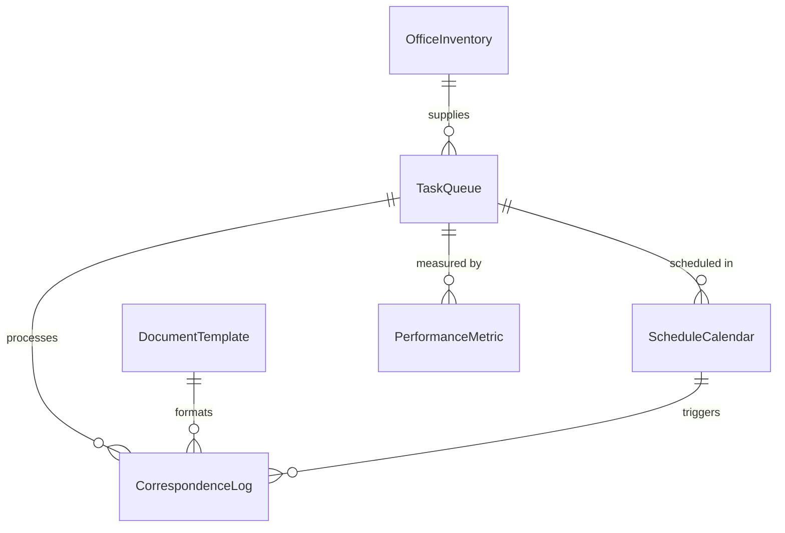
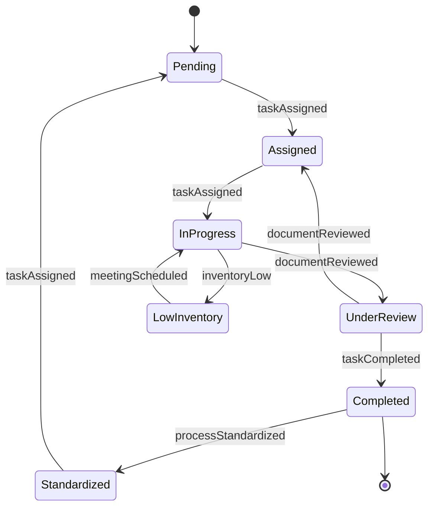
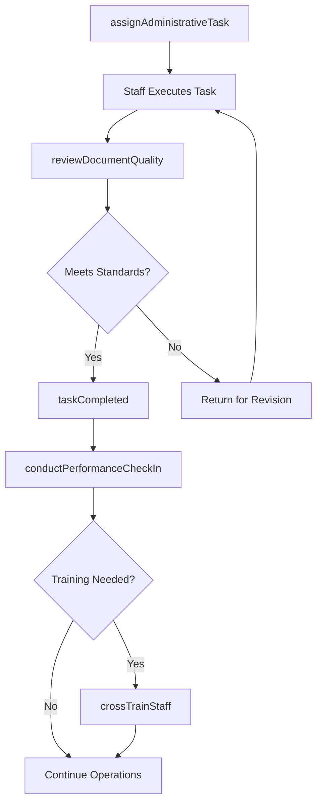
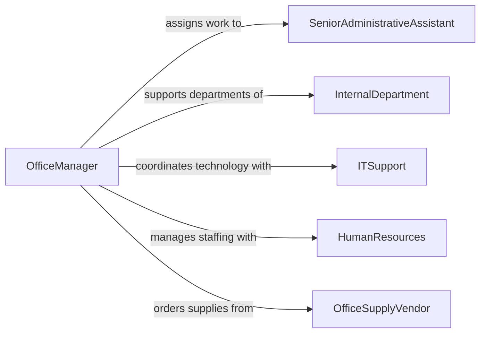

# Supervise Clerical Administrative Personnel

> Business-as-Code definition for supervising clerical and administrative personnel. Models the oversight of office staff, receptionists, and administrative assistants including workload distribution, process standardization, and performance management.

## Overview

Supervising clerical and administrative personnel involves directing receptionists, data entry clerks, file clerks, administrative assistants, and office coordinators who perform correspondence, record-keeping, scheduling, and general office operations. This definition covers task assignment, workflow standardization, quality control of administrative output, cross-training, and performance evaluation to ensure efficient and accurate office operations.

## Actors

| Actor | Description |
|-------|-------------|
| InternalDepartment | Business units relying on administrative support services |
| ExternalClient | Customer or vendor communicating through front-office channels |
| ITSupport | Technology team providing software, hardware, and systems support |
| HumanResources | HR department handling staffing, benefits, and policy matters |
| OfficeSupplyVendor | Supplier of office materials, stationery, and equipment |
| BuildingManagement | Facility services managing workspace and common areas |

## Roles

| Role | Description |
|------|-------------|
| OfficeManager | Supervises all clerical and administrative staff operations |
| SeniorAdministrativeAssistant | Experienced staff handling complex tasks and mentoring others |
| Receptionist | Manages front desk operations, visitor check-in, and call routing |
| DataEntryClerk | Enters, verifies, and maintains data in organizational systems |

## Entities

| Entity | Description |
|--------|-------------|
| TaskQueue | A prioritized list of administrative tasks awaiting completion |
| CorrespondenceLog | Record of incoming and outgoing mail, email, and communications |
| ScheduleCalendar | Shared calendar of meetings, events, and deadlines |
| DocumentTemplate | Standardized template for recurring business documents |
| PerformanceMetric | Measurable indicator of administrative output quality and speed |
| OfficeInventory | Tracked stock of office supplies and equipment |

## Actions

| Action | Description |
|--------|-------------|
| assignAdministrativeTask | Distribute a task from the queue to an available staff member |
| standardizeProcess | Define or update a standard operating procedure for office work |
| reviewDocumentQuality | Check completed documents for accuracy, formatting, and completeness |
| conductPerformanceCheckIn | Hold a regular one-on-one to discuss workload and development |
| manageOfficeInventory | Monitor supply levels and place replenishment orders |
| coordinateMeetingSchedule | Organize meeting logistics including room booking and notifications |
| crossTrainStaff | Train clerical personnel on multiple office functions |

## Events

| Event | Description |
|-------|-------------|
| taskAssigned | An administrative task has been assigned to a staff member |
| taskCompleted | A staff member has finished an assigned administrative task |
| documentReviewed | A completed document has been checked for quality |
| processStandardized | A new or updated standard operating procedure has been published |
| inventoryLow | Office supply levels have fallen below reorder thresholds |
| performanceCheckInCompleted | A supervisor check-in with a staff member has been documented |
| meetingScheduled | A meeting has been booked and participants notified |

## Searches

| Search | Description |
|--------|-------------|
| findPendingTasks | List administrative tasks by status, priority, or assignee |
| getStaffWorkload | Retrieve current task counts and capacity by staff member |
| findDocumentsByTemplate | Locate documents created from a specific template |
| getInventoryStatus | Check current stock levels for office supplies |

## Entity Relationships



## State Diagram



## Workflow



## Actor Relationships



## Usage

### Calling Actions

```typescript
import { superviseClericalAdministrativePersonnel } from '@headlessly/supervise-clerical-administrative-personnel'

const admin = superviseClericalAdministrativePersonnel()

// Assign an administrative task
const task = await admin.assignAdministrativeTask({
  description: 'Prepare quarterly board meeting packets',
  assigneeId: 'AA-012',
  priority: 'high',
  dueDate: '2026-03-20',
  template: 'board-meeting-packet'
})

// Review document quality
const review = await admin.reviewDocumentQuality({
  documentId: 'DOC-2026-0445',
  reviewerId: 'OM-003',
  criteria: ['formatting', 'accuracy', 'completeness', 'branding']
})

// Manage office inventory
await admin.manageOfficeInventory({
  action: 'reorder',
  items: [
    { sku: 'PAPER-A4', currentStock: 5, reorderQuantity: 50 },
    { sku: 'TONER-BLK', currentStock: 1, reorderQuantity: 10 }
  ]
})
```

### Event-Driven Automation

```typescript
// Auto-reorder when supplies run low
admin.inventoryLow(async ({ item, currentStock, reorderThreshold }) => {
  await admin.manageOfficeInventory({
    action: 'reorder',
    items: [{ sku: item.sku, currentStock, reorderQuantity: item.defaultOrderQuantity }]
  })
  await notify({
    to: 'office-manager',
    message: `Auto-reorder placed for ${item.name} (stock: ${currentStock})`
  })
})

// Redistribute work when task backlogs develop
admin.taskAssigned(async ({ assigneeId }) => {
  const workload = await admin.getStaffWorkload({ staffId: assigneeId })
  if (workload.pendingTasks > 15) {
    await notify({
      to: 'office-manager',
      message: `Staff ${assigneeId} has ${workload.pendingTasks} pending tasks - consider redistribution`
    })
  }
})
```
