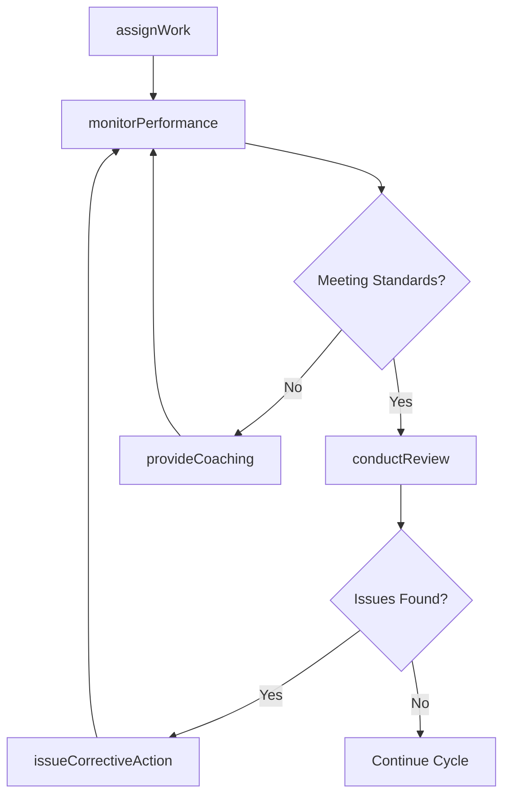
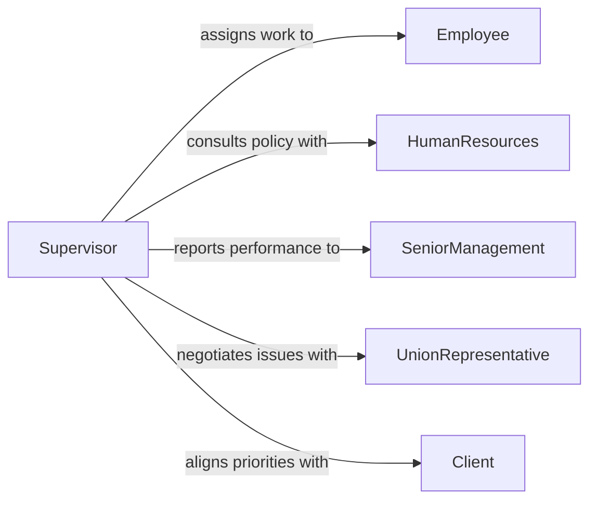

# Supervise Employees

> Business-as-Code definition for general employee supervision. Models the complete cycle of assigning work, monitoring performance, providing feedback, and managing workforce productivity.

## Overview

Employee supervision encompasses the day-to-day oversight of staff to ensure organizational objectives are met. Supervisors assign tasks, monitor progress, evaluate performance, and address workplace issues. This definition provides actions for each phase of the supervisory lifecycle, events for real-time workforce management, and searches for retrieving team and performance data.

## Actors

| Actor | Description |
|-------|-------------|
| Employee | Staff member being supervised who performs assigned work |
| HumanResources | Provides policy guidance and handles personnel actions |
| SeniorManagement | Sets organizational priorities and approves staffing decisions |
| UnionRepresentative | Advocates for employee rights under collective bargaining |
| Client | External party whose requirements shape work assignments |

## Roles

| Role | Description |
|------|-------------|
| Supervisor | Directly oversees employee activities and performance |
| TeamLead | Coordinates daily work assignments within a team |
| PerformanceReviewer | Conducts formal evaluations of employee output |
| SchedulingCoordinator | Manages shift assignments and coverage planning |

## Entities

| Entity | Description |
|--------|-------------|
| Assignment | A specific task or project delegated to an employee |
| PerformanceReview | A formal evaluation of an employee over a defined period |
| Schedule | The work timetable defining shifts and assignments |
| CorrectiveAction | A documented response to a performance or conduct issue |
| AttendanceRecord | Log of employee presence, absences, and time off |
| SupervisionNote | Informal documentation of coaching conversations |

## Actions

| Action | Description |
|--------|-------------|
| assignWork | Delegate tasks or projects to specific employees |
| monitorPerformance | Track employee progress against objectives and standards |
| conductReview | Perform a formal performance evaluation |
| provideCoaching | Deliver feedback and guidance to improve employee performance |
| approveTimeOff | Review and approve employee leave requests |
| issueCorrectiveAction | Document and deliver a formal performance or conduct warning |
| adjustSchedule | Modify work schedules to address coverage or workload needs |

## Events

| Event | Description |
|-------|-------------|
| workAssigned | A task or project has been delegated to an employee |
| performanceReviewed | A formal evaluation has been completed |
| coachingProvided | A feedback or coaching session has been documented |
| timeOffApproved | An employee leave request has been granted |
| correctiveActionIssued | A formal warning or disciplinary action has been recorded |
| scheduleAdjusted | A work schedule modification has been applied |
| performanceThresholdBreached | An employee metric has fallen below acceptable standards |

## Searches

| Search | Description |
|--------|-------------|
| findAssignments | List work assignments by employee, status, or due date |
| getPerformanceHistory | Retrieve evaluation records for an employee over time |
| getTeamSchedule | Return current schedule and coverage for a team or department |
| getAttendanceRecords | Retrieve attendance and leave data by employee or period |

## Workflow



## Actor Relationships



## Usage

### Calling Actions

```typescript
import { superviseEmployees } from '@headlessly/supervise-employees'

const supervision = superviseEmployees()

// Assign a project to a team member
const assignment = await supervision.assignWork({
  employeeId: 'emp-2847',
  task: 'Complete quarterly inventory audit',
  priority: 'high',
  dueDate: '2026-03-15'
})

// Monitor performance against objectives
const metrics = await supervision.monitorPerformance({
  employeeId: 'emp-2847',
  period: 'Q1-2026',
  objectives: ['inventory-accuracy', 'report-timeliness']
})

// Conduct a formal review
await supervision.conductReview({
  employeeId: 'emp-2847',
  period: 'Q1-2026',
  rating: 'meets-expectations',
  notes: 'Consistently meets deadlines with accurate reporting'
})
```

### Event-Driven Automation

```typescript
// Alert supervisor when performance drops
supervision.performanceThresholdBreached(async ({ employeeId, metric, value }) => {
  await notify({
    to: 'supervisor',
    message: `Employee ${employeeId} below threshold on ${metric}: ${value}`
  })
})

// Auto-schedule coaching after corrective action
supervision.correctiveActionIssued(async ({ employeeId, actionType }) => {
  await supervision.provideCoaching({
    employeeId,
    type: 'follow-up',
    scheduledDate: addDays(new Date(), 14)
  })
})
```
